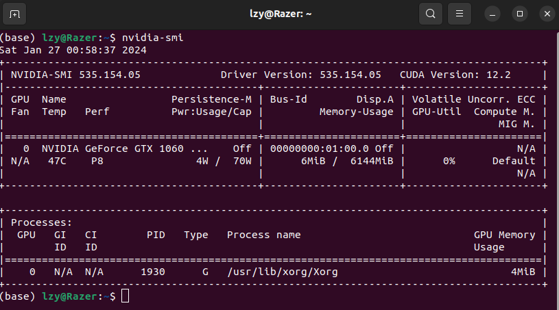

# Install Ubuntu

[toc]

# 基础安装

跟着这个视频做就好，很清楚
[Windows 和 Ubuntu 双系统的安装和卸载 --- 机器人工匠阿杰](https://www.bilibili.com/video/BV1554y1n7zv)

分区
1. 引导区
2. Swap - 内存交换区 - 通常设置的比物理内存大一点
3. 根挂载点 / - 相当于 Windows C盘
4. home挂载点 /home

500GB - 500MB+20GB+200GB+其他


# 雷蛇

## 查看BIOS模式

运行中输入msinfo32用于查看BIOS模式

结果如图所示:UEFI


## 系统配置

CPU

GPU


## secure boot 关闭

开机时按F2进入BIOS


Fn+F2

## 强行关闭 secure boot

[拯救者Y7000P 修改secure boot方法](https://blog.csdn.net/qq_50598558/article/details/119040725)

```bash
sudo apt install mokutil
sudo mokutil --disable-validation

sudo apt install mokutil
sudo mokutil --disable-validation
```

出现蓝屏，选择change secure boot state

Disable Secure Boot，选择yes

# 换源

[ubuntu换源](https://blog.csdn.net/qq_45878098/article/details/126037838)

如果出现　Hash Sum mismatch Hashes of expected file
则删除　
sudo rm -rf /var/lib/apt/lists/*
sudo apt clean

然后换源，我是从中科大换成阿里解决的


## 显卡驱动

[ubuntu无法添加PPA的解决办法](https://blog.csdn.net/leviopku/article/details/101060133)

[联想拯救者Y7000安装NVIDIA显卡驱动](https://www.freesion.com/article/58521373000/)

[cuda 和 cudnn 库的卸载与安装](https://zhuanlan.zhihu.com/p/102966512)


后续还有验证

```bash
git cline https://github.com/LittleNewton/cudnn-samples-v8.git  # 官网没找到 从 github 下一个

sudo apt-get install libfreeimage3 libfreeimage-dev  # 可能会缺少后续所需的包

cd cudnn_samples_v8/mnistCUDNN
make clean
make  # 生成 mnistCUDNN.o 文件
./mnistCUDNN
```

```text
Executing: mnistCUDNN
cudnnGetVersion() : 8900 , CUDNN_VERSION from cudnn.h : 8900 (8.9.0)
Host compiler version : GCC 11.3.0

There are 1 CUDA capable devices on your machine :
device 0 : sms 16  Capabilities 8.6, SmClock 1500.0 Mhz, MemSize (Mb) 3902, MemClock 6001.0 Mhz, Ecc=0, boardGroupID=0
Using device 0

...

Testing single precision

...

Result of classification: 1 3 5

Test passed!
```

出现 Test passed! 即安装成功

### 个人电脑操作

[NVIDIA 驱动程序下载](https://www.nvidia.cn/Download/index.aspx?lang=cn)

**最终解决方案 driver+cuda+cudnn**

[安装显卡驱动、CUDA、cuDNN及其简单介绍](https://www.bilibili.com/video/BV16Y411M7SC)
[Ubuntu安装CUDA+cuDNN](https://blog.chintsan.com/archives/561)

[cudnn 官方安装指南 ](https://docs.nvidia.com/deeplearning/cudnn/install-guide/index.html)

选用了22.04，对应的ROS2版本为Humble[ROS2官网 查看支持版本](https://www.ros.org/reps/rep-2000.html#rolling-ridley-june-2020-ongoing)

最终方法：命令行直接　sudo apt install nvidia-driver-470 (515也行)，装完后重启，nvidia-smi显示cuda为11.4 (515这里显示cuda为11.7)　　**至此driver安装完成**，电脑应该会出现一个 NVIDIA X Server Settings 的软件

由于需要装pytorch1.13，所以需要更新为11.7

如果要安装11.5使用sudo apt install nvidia-cuda-toolkit

[各个版本CUDA下载地址](https://developer.nvidia.cn/cuda-toolkit-archivehttps://developer.nvidia.cn/cuda-toolkit-archive)
[CUDA Toolkit 11.7 官方Downloads](https://developer.nvidia.com/cuda-11-7-0-download-archive)


可以选择runfile或者deb，==在wget时候记得将.com后缀改为.cn可以大大提高下载速度==(我这里快十倍多)

runfile命令较少，deb命令较多

**runfile方式**，个人感觉类似图形化安装

可能需要赋予可执行权限

```shell
# 原命令
wget https://developer.download.nvidia.com/compute/cuda/11.7.1/local_installers/cuda_11.7.1_515.65.01_linux.run
# com->cn
wget https://developer.download.nvidia.cn/compute/cuda/11.7.1/local_installers/cuda_11.7.1_515.65.01_linux.run
sudo sh cuda_11.7.1_515.65.01_linux.run
```

耐心等待一会儿，一开始会出现这个界面


如果之前安装了驱动，可以在下面的窗口取消勾选


应该是安装到了 /usr/local/cuda-11.7

重启，然后可以 cd /usr/local/cuda-11.7/bin ，随后 ./nvcc -V 即可看到相关输出

**deb方式**

按照官网下面的命令运行即可运行，安装后重启

```
wget https://developer.download.nvidia.com/compute/cuda/repos/ubuntu2204/x86_64/cuda-ubuntu2204.pin
sudo mv cuda-ubuntu2204.pin /etc/apt/preferences.d/cuda-repository-pin-600
wget https://developer.download.nvidia.com/compute/cuda/11.7.0/local_installers/cuda-repo-ubuntu2204-11-7-local_11.7.0-515.43.04-1_amd64.deb
sudo dpkg -i cuda-repo-ubuntu2204-11-7-local_11.7.0-515.43.04-1_amd64.deb
sudo cp /var/cuda-repo-ubuntu2204-11-7-local/cuda-*-keyring.gpg /usr/share/keyrings/
sudo apt-get update
sudo apt-get -y install cuda
```

打开后，nvidia-smi发现把我之前的470更新为515.65.01，看看后续能不能正常使用


然后新开一个终端，输入nvcc -V即可看到相同结果　**至此cuda安装完成**

对于cudnn安装，直接官网下载安装包，随后sudo dpkg -i xxx即可

随后根据命令行提示，可能还需安装加一个 gpg key

**pytorch**

安装pytorch直接pip3安装也行，记得添加豆瓣镜像　-i https://pypi.douban.com/simple/


**启动时**
进入启动项时，选中第一行Ubuntu，按[e]，编辑启动项参数

找到linux开头的一行，去到该行末尾(可能该行会被分为两行显示)，输入空格+nomodeset


输入ctrl+x，保存并启动，进入系统后，修改黑名单

sudo gedit /etc/modprobe.d/blacklist.conf

末尾添加
blacklist nouveau

最后命令行输入命令生效黑名单
sudo update-initramfs -u

**安装时**
如果提示没有make gcc等等，可以先安装ROS可能顺便解决，或者自己手动安装即可，然后一路yes即可

## 快捷方式

.desktop文件

记得添加可执行权限 chmod +x

[ubuntu下应用图标的更改](https://blog.csdn.net/thinszx/article/details/107590118)
.png也可以

```
(base) lzy@legion:/tmp$ sudo find /usr/share/ -name "meshlab*.desktop"
/usr/share/applications/meshlab.desktop

(base) lzy@legion:/tmp$ sudo gedit /usr/share/applications/meshlab.desktop
```

## 软件列表

### 软件包

**.deb**
dbeaver
eudic 欧陆词典  (22.04欧路词典暂时打不开，使用goldendict替换，和欧路一样支持第三方词典)
每日英语听力


Feishu


**apt install**


timeshift备份
[Timeshift 系统备份和还原](https://blog.csdn.net/zjy1175044232/article/details/124248454)
[Timeshift 官网](https://linuxmasterclub.com/timeshift/)
alien rpm->deb
qt5 : sudo apt install qtbase5-dev qtchooser qt5-qmake qtbase5-dev-tools qtcreator


xdm(idm替代)[xdm官网](https://xtremedownloadmanager.com/)[xdm插件安装教程](https://microsoftedge.microsoft.com/addons/search/xdm-browser-monitor)


## miniconda

[关于conda环境的配置，看这一篇就够了](https://www.bilibili.com/read/cv8956636)
[使用Miniconda管理隔离虚拟Python环境](https://www.bilibili.com/video/BV1Mv411x775)

输入 conda config 就会自动在用户目录下生成 .condarc 文件，添加清华源，然后conda clean -i

[Anaconda 清华镜像使用帮助](https://mirrors.tuna.tsinghua.edu.cn/help/anaconda/)

[docs.conda.io 官方文档](https://docs.conda.io/en/latest/miniconda.html#system-requirements)

[Installation instructions 官方文档](https://conda.io/projects/conda/en/stable/user-guide/install/index.html)

按 q 跳出协议

yes - yes - yes

```
# 手动激活Anaconda3环境
conda activate
# 手动退出Anaconda3环境
conda deactivate
# 配置打开终端时候默认不激活Anaconda环境：
conda config --set auto_activate_base false
# 配置打开终端时候默认激活Anaconda环境：
conda config --set auto_activate_base true
# 这是简化的命令形式
conda create -n conda-new --clone conda-old
# 然后删除原有的conda环境：
conda remove -n conda-old --all
```

安装labelImg

```
pip install PyQt5 -i https://pypi.tuna.tsinghua.edu.cn/simple/
pip install pyqt5-tools -i https://pypi.tuna.tsinghua.edu.cn/simple/
pip install lxml -i https://pypi.tuna.tsinghua.edu.cn/simple/
pip install labelImg -i https://pypi.tuna.tsinghua.edu.cn/simple/ （直接复制就可）
```


## tmux

[你必须知道的Unix终端神器 - Tmux](https://www.bilibili.com/video/BV1Mj411N7xS/)
[bryant-video/tmux-tutorial Github](https://github.com/bryant-video/tmux-tutorial)
[tmux-plugins/tpm](https://github.com/tmux-plugins/tpm)
[tmux-plugins/tmux-continuum](https://github.com/tmux-plugins/tmux-continuum)
[tmux-plugins/tmux-resurrect](https://github.com/tmux-plugins/tmux-resurrect)
[调教终端神器——tmux 知乎](https://zhuanlan.zhihu.com/p/261207028)

sudo apt install tmux 安装tmux
tmux -V 查看版本

man tmux 查看使用说明

Ctrl+b : Prefix Key 前缀键

原始快捷键(分屏)

Ctrl+b & %(Ctrl+5)
Ctrl+b & "(Ctrl+')

配置自己的快捷键(-r 表示可以连续按多次该键)

```
unbind %
bind | split-window -h -c "#{pane_current_path}"

unbind '"'
bind - split-window -v -c "#{pane_current_path}"

unbind r
bind r source-file ~/.tmux.conf

bind -r j resize-pane -D 5
bind -r k resize-pane -U 5
bind -r l resize-pane -R 5
bind -r h resize-pane -L 5
bind -r m resize-pane -Z

set -g mouse on
set -g mouse-resize-pane on
set -g mouse-select-pane on
set -g mouse-select-window on
set -g mode-keys vi

set -g @plugin 'tmux-plugins/tpm'  # tmux package manager
set -g @plugin 'tmux-plugins/tmux-sensible'
set -g @plugin 'tmux-plugins/tmux-resurrect'  # persist tmux sessions after restart computer 
set -g @plugin 'tmux-plugins/tmux-continuum'  # automatically saves sessions every 15 mins

set -g @resurrect-capture-pane-contents 'on'
set -g @continuum-restore 'on'
run '~/.tmux/plugins/tpm/tpm'
```

ctrl+b + : + source-file ~/.tmux.conf 生效刚才的配置文件(第一次 后续仅需 ctrl+b + r 即可)

ctrl+b + : + list-keys 查看所有快捷键

ctrl+b + : + set-options -g


## 添加字体

[jetbrain字体](https://www.jetbrains.com/zh-cn/lp/mono/#how-to-install)

当然也可以从 windows 中打包出来

**要查看系统中已经安装的字体，我们可以使用 fc-list 命令进行查看**，查找可以用 fc-list | grep

下载字体
解压缩存档并安装字体：
macOS
选择文件夹中的所有字体文件，然后双击 “安装字体” 按钮。

Windows
选择文件夹中的所有字体文件，右键单击其中任何一个，然后从菜单中选择 “安装”。

Linux
将字体解压缩到 ~/.local/share/fonts（或 **/usr/share/fonts**，以在系统范围内安装字体）并执行 fc-cache -f -v

重启您使用的 IDE
转到 Preferences/Settings → Editor → Font ，然后从字体下拉列表中选择JetBrains Mono。

似乎 wps 也能自动检测到

mono代表等距字符

Ubuntu Mono 中英文可以对齐

'Source Han Sans HW SC'


# XDM下载器

[XDM 下载器 github](https://github.com/subhra74/xdm/releases)

[XDM 浏览器插件](https://chrome.google.com/webstore/detail/xdm-integration-module-be/akdmdglbephckgfmdffcdebnpjgamofc/related)

自带浏览器插件位置

```
/opt/xdman/chrome-extension
```

sudo dpkg -i xdman_gtk_8.0.29_amd64.deb


# 显卡驱动安装

[NVIDIA显卡的Ubuntu驱动程序安装方法](https://www.bilibili.com/video/BV1wY411p7mU)

[NVIDIA 驱动程序下载](https://www.nvidia.cn/Download/index.aspx?lang=cn)

or

[GeForce® Drivers - Manual Driver Search](https://www.nvidia.com/en-us/geforce/drivers/)

```bash
lspci | grep -i vga
# lspci: 是一个用于显示计算机PCI总线信息的命令。
# |: 是管道符号，用于将一个命令的输出传递给另一个命令作为输入。
# grep: 是一个用于在文本中搜索指定模式的命令。
# -i: 是grep命令的一个选项，表示忽略大小写。
# vga: 是指“Video Graphics Array”（视频图形阵列）

# legion
00:02.0 VGA compatible controller: Intel Corporation TigerLake-H GT1 [UHD Graphics] (rev 01)
01:00.0 VGA compatible controller: NVIDIA Corporation GA107BM [GeForce RTX 3050 Mobile] (rev a1)

```

显卡
1. BIOS = basic input/output system，不依赖任何操作系统，不支持高分辨率，无法使用OpenGL、CUDA、DirectX等高级图形库
2. 驱动，完成显卡硬件和操作系统已经高级图形库的对接和协同


**雷蛇**
```
在下方的下拉列表中进行选择，针对您的 NVIDIA 产品确定合适的驱动
产品类型:	GeForce
产品系列:	GeForce 10 Series
产品家族:	GeForce GTX 1060
操作系统:	Linux 64-bit
下载类型:	生产分支生
语   言:	  Chinese (Simplified)

Linux X64 (AMD64/EM64T) Display Driver
版本:	535.154.05
发布日期:	2024.1.16
操作系统:	Linux 64-bit
语言:	Chinese (Simplified)
文件大小:	325.86 MB
```

需要进BIOS关闭secure boot，否则后续安装时会要求对驱动程序进行签名

[拯救者Y7000P 修改secure boot方法](https://blog.csdn.net/qq_50598558/article/details/119040725)

```bash
chmod +x NVIDIA-Linux.xxx.run
sudo bash VIDIA-Linux.xxx.run
```

如果遇到 x server 问题
```
ERROR: 
You appear to be running an X server; please exit X before installing. 
For further details, please see the section INSTALLING THE NVIDIA DRIVER in the README available on the Linux driver download page at www.nvidia.com.
```

参考 [NVIDIA显卡的Ubuntu驱动程序安装方法](https://www.bilibili.com/video/BV1wY411p7mU) 中关闭nouveau驱动的步骤，经尝试可以解决


看起来 nouveau 和 X server 有关系

安装 gcc 和 make

```bash
sudo bash VIDIA-Linux.xxx.run
```

之前在雷蛇 ubuntu22.04 上装不成功

**另一种安装方式**,在 Software&Updates 中的 Additional Drivers


重启后，即可使用 nvidia-smi



**另一种安装方式**(未测试)

```bash
# 查看是否安装NVIDIA显卡
lspci | grep -i nvidia
# 查看显卡信息
nvidia-smi
# 手动安装显卡驱动，添加源
sudo add-apt-repository ppa:graphics-drivers/ppa
sudo apt update
# 检查可安装的驱动
ubuntu-drivers devices
# 找到最适合的驱动安装
sudo apt install nvidia-driver-XXX
```

监控一下gpu状态
```bash
watch -n 1 nvidia-smi
```


# CUDA + cuDNN + Pytorch

**nvidia-smi显示的CUDA Version是当前驱动的 最高支持版本 ，因为CUDA是向下兼容的，所以最高支持版本以下的CUDA版本都是支持的**

[NVIDIA CUDA Toolkit Release Notes　官网](https://docs.nvidia.com/cuda/cuda-toolkit-release-notes/index.html)


[PyTorch 官网](https://pytorch.org/)


[nvidia developer](https://developer.nvidia.com/)

Popular SDKs
1. [CUDA Toolkit/SDK](https://developer.nvidia.com/cuda-downloads)
   1. 选择下方 Archive of Previous CUDA Releases 选择相应的版本和对应的系统
   2. 可以选择 runfile 或者 deb (完成后，会出现安装总结，警告说没有安装完全，不用管)
      1. 用deb方式安装CUDA，会附带安装显卡驱动，默认会安装
      2. 用run方式安装CUDA，会附带安装显卡驱动，可选不安装
   3. 或者直接试试看 
      ```bash
      sudo apt install cuda-toolkit-xx
      ```
2. [cuDNN](https://developer.nvidia.com/cudnn)
   1. 选择下方 Archived cuDNN Releases
   2. [NVIDIA cuDNN - Documentation](https://docs.nvidia.com/cudnn/index.html) 可以查看安装教程 [Installation Guide](https://docs.nvidia.com/deeplearning/cudnn/install-guide/index.html)
   3. 可以选择 deb ，感觉比较麻烦
   4. cudnn 安装 .tar.xz，下载 Local Installer for Linux x86_64

      ```bash
      tar -xvf cudnn-linux-x86_64-8.x.x.x_cudaX.Y-archive.tar.xz
      sudo cp cudnn-*-archive/include/cudnn*.h /usr/local/cuda/include 
      sudo cp -P cudnn-*-archive/lib/libcudnn* /usr/local/cuda/lib64 
      sudo chmod a+r /usr/local/cuda/include/cudnn*.h /usr/local/cuda/lib64/libcudnn*
      ```
   5. [NVIDIA cuDNN v8 deb方法安装和卸载教程(Linux/Ubuntu)](https://zhuanlan.zhihu.com/p/126997172)

查看cuda版本
1. nvcc -V
   进入cuda安装路径中的bin目录，执行./nvcc -V，进行查看

   如果想要在任何路径下的终端使用nvcc -V命令，则需在~/.bashrc中加入两行
   ```bash
   export PATH=/usr/local/cuda/bin:${PATH}
   export LD_LIBRARY_PATH=/usr/local/cuda/lib64:${LD_LIBRARY_PATH}
   ```
   还需要
   ```bash
   source ~/.bashrc
   ```
   即可在任何路径下的终端使用nvcc -V命令
2. 输入命令，在最上方
   ```bash
   cat /usr/local/cuda/version.json
   ```

查看 cudnn 版本
1. cat
   ```bash
   cat /usr/local/cuda/include/cudnn_version.h | grep CUDNN_MAJOR -A 2
   ```


```python
# 使用 PyTorch 查看 CUDA 和 cuDNN 版本
import torch
print(torch.__version__)
print(torch.version.cuda)
print(torch.backends.cudnn.version())
```

如果已经可以科学上网，就不用给 conda 换源，直接按照官网的指令下载PyTorch即可

```bash
(base) lzy@Razer:~ $ python3
Python 3.11.5 (main, Sep 11 2023, 13:54:46) [GCC 11.2.0] on linux
Type "help", "copyright", "credits" or "license" for more information.
>>> import torch
>>> print(torch.__version__)
2.1.2
>>> print(torch.version.cuda)
12.1
>>> print(torch.backends.cudnn.version())
8902
```

当然使用 pip3 安装也可以，可以换源或者添加代理

```bash
lzy@Razer:~ $ python3
Python 3.10.12 (main, Nov 20 2023, 15:14:05) [GCC 11.4.0] on linux
Type "help", "copyright", "credits" or "license" for more information.
>>> import torch
>>> print(torch.__version__)
2.1.2+cu121
>>> print(torch.version.cuda)
12.1
>>> print(torch.backends.cudnn.version())
8906
```

# Edge

暴力猴 + [强大的哔哩哔哩增强脚本](https://github.com/the1812/Bilibili-Evolved)

# vscode

```bash
pip3 install --upgrade jupyter ipywidgets
```

# pip3

```bash
sudo apt install python3-pip
pip3 --version
pip3 --help
```

```bash
mkdir ~/.pip
cd .pip/
gedit pip.conf
```

pip.conf 如下，已经换源+添加clash代理

```text
[global]
index-url = http://pypi.douban.com/simple/
extra-index-url = 
	https://pypi.tuna.tsinghua.edu.cn/simple
	http://mirrors.aliyun.com/pypi/simple/
	https://pypi.mirrors.ustc.edu.cn/simple/

https_proxy = https://127.0.0.1:7890
http_proxy = http://127.0.0.1:7890

[install]
trusted-host = 
	http://pypi.douban.com/simple/
	https://pypi.tuna.tsinghua.edu.cn/simple
	http://mirrors.aliyun.com/pypi/simple/
	https://pypi.mirrors.ustc.edu.cn/simple/

# 清华		https://pypi.tuna.tsinghua.edu.cn/simple
# 中科大	https://pypi.mirrors.ustc.edu.cn/simple/
# 豆瓣		http://pypi.douban.com/simple/
# 阿里云	http://mirrors.aliyun.com/pypi/simple/
```

查看 config

```bash
pip3 config list
```

# QQ

[新版QQ官网](https://im.qq.com/linuxqq/index.shtml)

# 微信(非官方版)

该微信所有功能都能正常使用

spark应用商店搜索下列链接

```text
spk://store/chat/com.qq.weixin.mejituu
```

# Motrix - 下载器

完全免费并且开源的BT下载工具

支持 HTTP，FTP，BitTorrent，Magnet 等下载方式

支持 Windows、macOS、Linux

[Motrix 官网](https://motrix.app/)

```bash
sudo snap install motrix
```

基础设置 中 可设置中文

进阶设置 中 每天自动更新trackers服务器列表


# vlc

[VLC media player](https://www.videolan.org/vlc/)

```bash
sudo apt install vlc  # 正常运行
# sudo snap install vlc  # 有时候无法运行，不知道为什么
```

# mpv (bad)

[mpv 官网](https://mpv.io/)

```bash
sudo apt install mpv
```


# flameshot(截图软件，可以添加快捷键)

```bash
sudo apt install flameshot
```

对于 wayland 需要点击一下 share

[Wayland Help - Troubleshooting Flameshot on Wayland](https://flameshot.org/docs/guide/wayland-help/)


# GIMP - GNU IMAGE MANIPULATION PROGRAM

```bash
sudo apt install gimp
```

# Scribus

```bash
sudo apt install scribus
```

# INKSCAPE

```bash
sudo apt install inkscape
```

# python3-pip

```bash
sudo snap install python3-pip
```

# 新立得包管理 

```bash
sudo apt install -y synaptic
```

# net-tools 

用于ifconfig

```bash
sudo apt net-tools 
```

# ubuntu-restricted-extras(基本的媒体编解码器)
ubuntu-restricted-extras 是一个包含各种基本软件
如 Flash 插件、unrar、gstreamer、mp4、Ubuntu 中的 Chromium 浏览器的编解码器等的软件包。
```bash
sudo apt install ubuntu-restricted-extras
```

# tree (folder structure)

```bash
sudo apt install tree
```

# gthumb(图片工具)

```bash
sudo apt install gthumb
```

# gnome-sound-recorder

```bash
sudo apt install gnome-sound-recorder
```

# Matlab

[Matlab R2021b v9.11 for Linux 中文授权激活版](https://www.jb51.net/softs/792028.html)

[百度网盘 安装包+Crack链接 免解压](https://pan.baidu.com/s/1FW9--qZeE6Pgb-UrzPe9lg?pwd=fdfz)

下载后首先点击 .iso 文件进行挂载，可以查看到如下结果


[Ubuntu: the sudo ./install does not work for Matlab](https://www.mathworks.com/matlabcentral/answers/1459909-installer-hang-when-installing-matlab-r2021b-as-root-on-ubuntu-20-04#comment_1759029)

挂载后在终端输入如下命令，对于 ubuntu 22.04 有效

```shell
xhost +SI:localuser:root
```

安装程序可以访问互联网

最好加上 sudo ，否则后续安装可能选择位置受限

```shell
lzy@legion:/media/lzy/MATHWORKS_R2021B$ sudo ./install 
```

稍微等一下会弹出窗口

在右上角的**高级选项(Advanced Options)**中选择设置模式**我有文件安装密钥(I have a File Installation Key)**


在输入框中输入

```
62551-02011-26857-57509-64399-54230-13279-37181-62117-65158-40352-64197-45508-24369-45954-39446-39538-16936-10698-58393-44718-32560-10501-40058-34454
```

选择 .lic 文件，如果不行就输入路径


如果之前没有sudo，这里就不能使用默认位置


随后的组件选择可以不用都勾选


安装完成后从文件夹中复制文件 **libmwlmgrimpl.so** 文件
到 ALREADY EXISTING FOLDER "xxx\bin\glnxa64\matlab_startup_plugins\lmgrimpl"
覆盖现有文件

可以使用 命令行 + sudo cp 来移动

```shell
sudo cp /home/lzy/Downloads/MatlabR2021bLinux/libmwlmgrimpl.so /usr/local/MATLAB/R2021b/bin/glnxa64/matlab_startup_plugins/lmgrimpl/
```

[Failed to load module &#34;canberra-gtk-module&#34;](https://blog.csdn.net/a970973835/article/details/110422343)

```shell
sudo ln -s /usr/lib/x86_64-linux-gnu/gtk-2.0/modules/libcanberra-gtk-module.so /usr/lib/libcanberra-gtk-module.so
```

创建快捷方式 matlab.desktop


**快捷方式**

icon location

```bash
/usr/share/pixmaps/matlab.png
```

desktop file location

```bash
/usr/share/applications/matlab.desktop
```

```
[Desktop Entry]
Name=Matlab
Comment=MATLAB R2021b
Type=Application
Icon=/usr/share/pixmaps/matlab.png
Exec=/usr/local/MATLAB/R2021b/bin/matlab -desktop
Terminal=false
StartupNotify=true
Categories=Application;Development;
```

# Clash 


[Youtube - Linux科学上网 Ubuntu20.04LTS 配置科学上网环境|Clash客户端](https://www.youtube.com/watch?v=pTlso8m_iRk)

应该是有一个压缩包，存在U盘里了，Clash现在Github上没了

```bash
tar -zxvf Clash.xxxxx.tar.gz
```
cfw即为应用程序入口，运行

```bash
./cfw
```

还需要设置代理

系统 Settings -> Network -> VPN -> Network Proxy 

设为 Manual

Clash 里的 Allow LAN 是允许局域网的其他设备共享联网

**快捷方式**

icon location

```bash
/usr/share/pixmaps/clash.png
```

desktop file location

```bash
/usr/share/applications/clash.desktop
```

```
[Desktop Entry]
Name = Clash
Exec = /home/lzy/Tools/clash/cfw
Icon = /usr/share/pixmaps/clash.png
Type=Application
```

# 输入法

[在Ubuntu20.04中安装中文输入法](https://zhuanlan.zhihu.com/p/529892064)

凑活用ibus也行

对于sougou，需要先安装系统fcitx，按照官网教程一步步来即可

[搜狗输入法linux 官方安装指南](https://shurufa.sogou.com/linux/guide)


没事多重启就行

Procedure
1. Install fcitx
   ```bash
   sudo apt install fcitx-bin
   sudo apt install fcitx-table
   ```
2. Settings -> Region&Language -> Manage Installed Languages -> Language Support -> Install/Remove Languages -> Chinese(simplified)
3. Reboot
4. Language Support -> Keyboard input method system : Fcitx 4 -> Apply System-Wide
5. Reboot
6. sudo dpkg -i sogou.xxxx.deb
7. Additional
   ```bash
   sudo apt install libqt5qml5 libqt5quick5 libqt5quickwidgets5 qml-module-qtquick2
   sudo apt install libgsettings-qt1
   sudo apt purge ibus
   ```

如果不行的话可以尝试在 小企鹅 fcitx 中添加（下载后）然后把其他的删了，再reboot

# beyond compare 安装和破解

下载安装包：

[官方下载地址](https://www.scootersoftware.com/download.php)

**安装软件**

执行命令安装：sudo dpkg -i xxx.deb

**破解**

执行如下两条命令：

```shell
cd /usr/lib/beyondcompare/

sudo sed -i "s/keexjEP3t4Mue23hrnuPtY4TdcsqNiJL-5174TsUdLmJSIXKfG2NGPwBL6vnRPddT7tH29qpkneX63DO9ECSPE9rzY1zhThHERg8lHM9IBFT+rVuiY823aQJuqzxCKIE1bcDqM4wgW01FH6oCBP1G4ub01xmb4BGSUG6ZrjxWHJyNLyIlGvOhoY2HAYzEtzYGwxFZn2JZ66o4RONkXjX0DF9EzsdUef3UAS+JQ+fCYReLawdjEe6tXCv88GKaaPKWxCeaUL9PejICQgRQOLGOZtZQkLgAelrOtehxz5ANOOqCaJgy2mJLQVLM5SJ9Dli909c5ybvEhVmIC0dc9dWH+/N9KmiLVlKMU7RJqnE+WXEEPI1SgglmfmLc1yVH7dqBb9ehOoKG9UE+HAE1YvH1XX2XVGeEqYUY-Tsk7YBTz0WpSpoYyPgx6Iki5KLtQ5G-aKP9eysnkuOAkrvHU8bLbGtZteGwJarev03PhfCioJL4OSqsmQGEvDbHFEbNl1qJtdwEriR+VNZts9vNNLk7UGfeNwIiqpxjk4Mn09nmSd8FhM4ifvcaIbNCRoMPGl6KU12iseSe+w+1kFsLhX+OhQM8WXcWV10cGqBzQE9OqOLUcg9n0krrR3KrohstS9smTwEx9olyLYppvC0p5i7dAx2deWvM1ZxKNs0BvcXGukR+/g" BCompare
```

打开Beyond Compare 4输入如下指令破解, 在输入Key界面输入即可

```shell
GXN1eh9FbDiX1ACdd7XKMV7hL7x0ClBJLUJ-zFfKofjaj2yxE53xauIfkqZ8FoLpcZ0Ux6McTyNmODDSvSIHLYhg1QkTxjCeSCk6ARz0ABJcnUmd3dZYJNWFyJun14rmGByRnVPL49QH+Rs0kjRGKCB-cb8IT4Gf0Ue9WMQ1A6t31MO9jmjoYUeoUmbeAQSofvuK8GN1rLRv7WXfUJ0uyvYlGLqzq1ZoJAJDyo0Kdr4ThF-IXcv2cxVyWVW1SaMq8GFosDEGThnY7C-SgNXW30jqAOgiRjKKRX9RuNeDMFqgP2cuf0NMvyMrMScnM1ZyiAaJJtzbxqN5hZOMClUTE+++
```

成功后在目录~/.config/bcompare/下会生成文件BC4Key.txt

为所有用户注册bcompare 命令，执行如下指令：

```shell
sudo cp ~/.config/bcompare/BC4Key.txt /etc/
```

**不要更新**，更新了原来的Key不能用了


# git

```bash
sudo apt install git
```

可以根据 GitInShell.md 文章进行美化可显示分支

```bash
git config --global --list

git config --global user.name leixxxx-lzy

git config --global user.email lzyxxx@gmail.com
```


# Git Credential Manager - not required

[Install instructions of Git Credential Manager](https://github.com/git-ecosystem/git-credential-manager/blob/release/docs/install.md)

```bash
sudo dpkg -i <path-to-package>
git-credential-manager configure
```

# xmind

[Xmind Download](https://xmind.app/download/)


# 飞书

[下载飞书客户端](https://www.feishu.cn/download)

# 金山PDF(wine)

Spark Store

[金山PDF(wine)](spk://store/office/com.wpspdf.spark)

可以将pdf拖拽进窗口来编辑

# clang

```bash
sudo apt install clang
```

# GitKraken

[GitKraken](spk://store/development/gitkraken)

# Discord(需翻墙)

```bash
sudo snap install discord
```

# Miniconda

[Miniconda 官网](https://docs.conda.io/projects/miniconda/en/latest/)

Quick command line install 即可

```bash
mkdir -p ~/miniconda3
wget https://repo.anaconda.com/miniconda/Miniconda3-latest-Linux-x86_64.sh -O ~/miniconda3/miniconda.sh
bash ~/miniconda3/miniconda.sh -b -u -p ~/miniconda3
rm -rf ~/miniconda3/miniconda.sh

~/miniconda3/bin/conda init bash

source ~/.bashrc
```


```bash
# 手动激活Anaconda3环境
conda activate
# 手动退出Anaconda3环境
conda deactivate
# 配置打开终端时候默认不激活Anaconda环境：
conda config --set auto_activate_base false
# 配置打开终端时候默认激活Anaconda环境：
conda config --set auto_activate_base true
# 这是简化的命令形式
conda create -n conda-new --clone conda-old
# 然后删除原有的conda环境：
conda remove -n conda-old --all
```

# neofetch

# java

安装 + 验证

```bash
# 安装
sudo apt update
sudo apt install openjdk-11-jdk

# 验证
java -version
javac -version
```

配置优先级 + 查看java位置

```bash
lzy@legion:/media/lzy/4D01-C671/Blog (main)$ which java
/usr/bin/java
lzy@legion:/media/lzy/4D01-C671/Blog (main)$ ll /usr/bin/java
lrwxrwxrwx 1 root root 22  3月  9 20:31 /usr/bin/java -> /etc/alternatives/java*
# java是由alternatives管理的，即可以在系统中设置并切换多个jdk版本


lzy@legion:/media/lzy/4D01-C671/Blog (main)$ sudo update-alternatives --config java
There is only one alternative in link group java (providing /usr/bin/java): /usr/lib/jvm/java-11-openjdk-amd64/bin/java
Nothing to configure.
```


使用apt install安装，并没有把JAVA_HOME内置到环境变量

配置环境变量 + 验证
```bash
sudo gedit /etc/environment
JAVA_HOME="/usr/lib/jvm/java-11-openjdk-amd64"
source /etc/environment
echo $JAVA_HOME
```

卸载 openjdk-8
```bash
sudo apt remove openjdk-8-*
```

# mysql

参考 DataBase 中的文章

# steam

[Github - canonical/steam-snap - FAQ](https://github.com/canonical/steam-snap/wiki/FAQ#32-bit-driver)

```bash
sudo snap install steam

sudo dpkg --add-architecture i386
sudo apt update
sudo apt install libnvidia-gl-550:i386  # 不一定有
```

# unity

[Install the Unity Hub on Linux](https://docs.unity3d.com/hub/manual/InstallHub.html#install-hub-linux)

# unreal

[
安装虚幻引擎](https://docs.unrealengine.com/5.0/zh-CN/installing-unreal-engine/)

# WPS Office

[WPS Office 2019 For Linux](https://www.wps.cn/product/wpslinux)

# LibreOffice (not recommended)

[LibreOffice 插件](https://extensions.libreoffice.org/)

下载最新版需添加一个ppa

```
sudo add-apt-repository ppa:libreoffice/ppa
sudo apt update && sudo apt install libreoffice
```

texmath 安装后 在 libreoffic-writer 中查看

[在线 Latex](https://www.latexlive.com/home##)

# CPU监控

[【干货】值得收藏的 14 个 Linux 下 CPU 监控工具](https://zhuanlan.zhihu.com/p/373328893)

```bash
sudo snap install htop
```


在界面按下F5，可以看到进程里面的线程，树形结构表示了父子关系(右侧)

# GPU监控

```bash
nvidia-smi
watch -n 1 nvidia-smi    # 每隔1s刷新一次
```

gpustat
```bash
sudo apt install gpustat
gpustat
```

# 硬件设备监控

```bash
sudo apt install psensor
# Psensor 是一个图形化工具，能显示硬件的温度信息，包括CPU和硬盘
# sudo apt install gsmartcontrol 
# 没啥用 GSmartControl 是一个图形用户界面的硬盘健康检查工具
sudo apt install hardinfo
# Hardinfo能提供一个系统信息的图形概览
```


# ROS

[鱼香ROS机器人社区](https://fishros.com/)

[小鱼的一键安装系列](https://fishros.org.cn/forum/topic/20/?lang=zh-CN)

鱼香ROS一键安装指令
```bash
wget http://fishros.com/install -O fishros && . fishros
```

# Krita


[下载 Krita](https://krita.org/zh-cn/download/)

[snap 下载 Krita](https://snapcraft.io/krita)

```bash
sudo snap install krita
```

修改 .desktop 位于

```bash
/var/lib/snapd/desktop/icons
```


# Remmina + FileZilla

```bash
sudo apt install remmina
sudo apt install filezilla
```

# Cheese相机 + Shotwell

```bash
sudo apt install cheese
sudo apt install shotwell
```

# meshlab


```bash
sudo apt install meshlab
```

# ffmpeg

```bash
sudo apt install ffmpeg
```

# kazam - 简单录屏软件

```bash
sudo apt install kazam
```

# OBS

[OBS Studio](https://obsproject.com/)

[](https://github.com/obsproject/obs-studio/wiki/install-instructions#linux)

```bash
# xserver-xorg version 1.18.4 or newer is recommended
# OpenGL 3.3 (or later) support is required to use OBS Studio on Linux
# For virtual camera support, you need the v4l2loopback kernel module installed
sudo apt install v4l2loopback-dkms

sudo add-apt-repository ppa:obsproject/obs-studio
sudo apt update
sudo apt install obs-studio
```

# Audacity(音频)

[Audacity Support](https://support.audacityteam.org/)

```bash
sudo apt install audacity
```

# Spark应用商店

[Spark应用商店](https://spark-app.store/)

# Docker

## 官方安装教程

[Install Docker Desktop on Ubuntu - Docker官方](https://docs.docker.com/desktop/install/ubuntu/)
1. Set up Docker's package repository. See step one of Install using the apt repository.[Install Docker Engine on Ubuntu - Docker官方](https://docs.docker.com/engine/install/ubuntu/#install-using-the-repository)
   1. Set up Docker's apt repository.
      ```bash
      # Add Docker's official GPG key:
      sudo apt-get update
      sudo apt-get install ca-certificates curl
      sudo install -m 0755 -d /etc/apt/keyrings
      sudo curl -fsSL https://download.docker.com/linux/ubuntu/gpg -o /etc/apt/keyrings/docker.asc
      sudo chmod a+r /etc/apt/keyrings/docker.asc

      # Add the repository to Apt sources:
      echo \
      "deb [arch=$(dpkg --print-architecture) signed-by=/etc/apt/keyrings/docker.asc] https://download.docker.com/linux/ubuntu \
      $(. /etc/os-release && echo "$VERSION_CODENAME") stable" | \
      sudo tee /etc/apt/sources.list.d/docker.list > /dev/null
      sudo apt-get update
      ```
   2. Install the Docker packages.
      ```bash
      sudo apt-get install docker-ce docker-ce-cli containerd.io docker-buildx-plugin docker-compose-plugin
      ```
   3. Verify that the Docker Engine installation is successful by running the hello-world image.
      ```bash
      sudo docker run hello-world
      ```
2. Download latest DEB package.
3. Install the package with apt as follows:
   ```bash
   sudo apt-get update
   sudo apt-get install ./docker-desktop-<version>-<arch>.deb
   ```


## 其他安装教程

```bash
sudo apt update                              # 升级 apt
sudo apt install docker.io docker-compose    # 安装docker
sudo usermod -aG docker ${USER}              # 将当前用户加入 docker组

# 测试
docker ps -a
docker run hello-world
```

## 常见问题

### docker run 命令需要 sudo，导致 vscode 中无法正常使用

```text
permission denied while trying to connect to the Docker daemon socket at unix:///var/run/docker.sock: Get "http://%2Fvar%2Frun%2Fdocker.sock/v1.24/containers/json?all=1": dial unix /var/run/docker.sock: connect: permission denied
```

解决方法

```bash
sudo chmod 666 /var/run/docker.sock
```

### vscode没有运行docker的permission

```bash
sudo groupadd docker             # 创建docker组，如果提示groupadd: group 'docker' already exists，表示这个组之前已经创建
sudo usermod -aG docker $USER    # 添加你的用户到docker组中
newgrp docker                    # 在终端中输入下面的命令更新组
```

### docker-desktop : Depends: docker-ce-cli but it is not installable

[Install using the apt repository - Docker官方](https://docs.docker.com/engine/install/ubuntu/#install-using-the-repository)

```bash
sudo apt install -y ca-certificates curl gnupg lsb-release
sudo mkdir -p /etc/apt/keyrings
curl -fsSL https://download.docker.com/linux/ubuntu/gpg | sudo gpg --dearmor -o /etc/apt/keyrings/docker.gpg
echo \
  "deb [arch=$(dpkg --print-architecture) signed-by=/etc/apt/keyrings/docker.asc] https://download.docker.com/linux/ubuntu \
  $(. /etc/os-release && echo "$VERSION_CODENAME") stable" | \
  sudo tee /etc/apt/sources.list.d/docker.list > /dev/null
sudo apt update
```

### 无法登录 docker desktop

[Sign in to Docker Desktop - Docker官方](https://docs.docker.com/desktop/get-started/#credentials-management-for-linux-users)


# Blender

```bash
sudo snap install blender --classic
```

# STM32

[Arm Keil Studio Pack 插件](https://marketplace.visualstudio.com/items?itemName=Arm.keil-studio-pack)

[Embedded IDE 插件](https://marketplace.visualstudio.com/items?itemName=CL.eide)

# QtScrcpy

[QtScrcpy github](https://github.com/barry-ran/QtScrcpy/blob/dev/README_zh.md)

[QtScrcpy Release 可以直接下载编译好的 .zip](https://github.com/barry-ran/QtScrcpy/releases)

可能会遇到缺少包的情况，解决方法如下


```bash
unzip 

sudo apt install libqt5multimedia5
# sudo apt install qtcreator
```

运行程序命令(可能需要chmod)
```bash
/home/lzy/Tools/QtScrcpy/output/x64/Release/QtScrcpy
```

手机端操作
1. 打开设置，下拉选项，找到最后一个，关于手机
2. 在关于手机选项里，找到版本号(HarmonyOS)，连点
3. 之后会提示，已处于开发者模式

adb设置
1. 设置中搜索adb
2. 打开usb调试

再做一下快捷方式

icon location


```bash
/usr/share/pixmaps/QtScrcpy.png
```

desktop file location

```bash
/usr/share/applications/QtScrcpy.desktop
```

```
[Desktop Entry]
Name=QtScrcpy
Comment=QtScrcpy-ubuntu-22.04-gcc_64
Type=Application
Icon=/usr/share/pixmaps/QtScrcpy.png
Exec=/home/lzy/Tools/QtScrcpy-ubuntu-22.04-gcc_64/output/x64/Release/QtScrcpy
Terminal=false
StartupNotify=true
Categories=Application;Development;
```

# Sunlogin 向日葵

# Leetcode

[禁止 Leetcode 跳转中文站](https://greasyfork.org/zh-CN/scripts/408371-%E7%A6%81%E6%AD%A2-leetcode-%E8%B7%B3%E8%BD%AC%E4%B8%AD%E6%96%87%E7%AB%99)

# FreeCAD

[FreeCAD 官网](https://www.freecad.org/index.php)

[Installing on Linux - FreeCAD Documentation](https://wiki.freecad.org/Installing_on_Linux)


```bash
sudo apt install freecad

# 或

sudo snap install freecad
```


# Tencent Meeting - only for gnome

[Ubuntu 22.04 Wayland 下使用腾讯会议](https://www.zhihu.com/question/538842265)

摄像头，音频都正常

缺点：就是无法共享屏幕(有时候可以，有时候不行)

```bash
sudo gedit /opt/wemeet/wemeetapp.sh 
```

```bash
# force x11 instead of Wayland
export XDG_SESSION_TYPE=x11
export EGL_PLATFORM=x11 
export QT_QPA_PLATFORM=xcb
unset WAYLAND_DISPLAY 
unset WAYLAND_DISPLAYCOPY

if [ "$XDG_SESSION_TYPE" = "wayland" ];
```

# Zoom - 视频会议

[Zoom Download Center](https://www.zoom.us/download)

# Obsidian - 笔记软件

[Obsidian](https://obsidian.md/)

```bash
sudo snap install obsidian --classic 
```

同步需要钱

# WhatsApp

[Download WhatsApp - 官网](https://www.whatsapp.com/download)

可以使用 edge 支持的 网页版 (桌面上也有快捷方式)


[WhatsApp for Linux (unofficial) - Snap Store](https://snapcraft.io/whatsapp-for-linux)

[WhatsApp for Linux (unofficial) - Github](https://github.com/eneshecan/whatsapp-for-linux)

不能发送语音

```bash
sudo snap install whatsapp-for-linux
```

# PlatformIO

[PlatformIO IDE for VSCode](https://docs.platformio.org/en/latest/integration/ide/vscode.html#ide-vscode)

[Linux: apt-get install python3-venv](https://github.com/platformio/platformio-core-installer/issues/85)

```bash
sudo apt install platformio
pip3 install -U platformio

pio upgrade
```

# nodejs

```bash
sudo apt install nodejs
```

# dotnet

```bash
sudo apt install dotnet8
```

# wine

[wine 官网](https://www.winehq.org/)

[安装 WineHQ 安装包 --- winehq](https://wiki.winehq.org/Ubuntu_zhcn)

```bash
wine --version  # 查看版本
```

[wine mono 中科大源](http://mirrors.ustc.edu.cn/wine/wine/wine-mono/)

[wine手动安装wine-mono和wine-gecko组件](https://blog.csdn.net/u010164190/article/details/106785069)

[.NET Framework --- winehq](https://appdb.winehq.org/objectManager.php?sClass=version&iId=31023)

```
winetricks --force dotnet452 corefonts
```

# Lutris - Game Platform


[Lutris - Download](https://lutris.net/downloads)

[Lutris - HeartStone](https://lutris.net/games/hearthstone/)

如果有些包下载失败可以按照网址手动去下载，并防在指定位置


# KiCAD

[Install on Linux](https://www.kicad.org/download/linux/)

[Tutorial: ngspice simulation in KiCad/Eeschema](https://ngspice.sourceforge.io/ngspice-eeschema.html)

[SPICE Simulation](https://www.kicad.org/discover/spice/)

```bash
sudo add-apt-repository ppa:kicad/kicad-8.0-releases
sudo apt update
sudo apt install kicad
```

或者 snap

```bash
sudo snap install kicad
```

# DingTalk

# Baidunetdisk

# 欧路词典 + 每日英语听力

# Pomatez - 计时器

[Pomatez](https://zidoro.github.io/pomatez/)

[Pomatez - Snap](https://snapcraft.io/pomatez)

[Pomatez - Github](https://github.com/zidoro/pomatez)

```bash
sudo snap install pomatez
```

# DOTNET

[dotnet-install 脚本 install](https://learn.microsoft.com/zh-cn/dotnet/core/install/linux-scripted-manual#scripted-install)

[设置系统范围的环境变量](https://learn.microsoft.com/zh-cn/dotnet/core/install/linux-scripted-manual#set-environment-variables-system-wide)

```bash
~/.bashrc
```

# 网易云音乐


## 官网 Linux 下载 (现在没了)

[Ubuntu 22.4网易云音乐启动失败处理方法](https://icode.best/i/15851947332762)

[Ubuntu22.04运行网易云音乐错误](https://blog.csdn.net/qq_35628698/article/details/124815037)


## 代替方案

[YesPlayMusic](https://github.com/qier222/YesPlayMusic)

release 找 amd64.deb 然后 sudo apt install xxx.deb 即可

# 小技巧

## 终端补全忽略大小写

```bash
# 在/etc/inputrc中添加使全局所有用户生效
echo 'set completion-ignore-case on' >> /etc/inputrc

# 对于个别用户，则可以在用户home目录下添加
echo 'set completion-ignore-case on' >> ~/.inputrc
```

如果显示权限不够，就直接 sudo gedit 打开文件改


## Ubunut Pro

[Ubuntu Pro - The most comprehensive subscription for open-source software security](https://ubuntu.com/pro)

30-day trial for enterprises. Always free for personal use.

[订阅](https://ubuntu.com/pro/subscribe)

## 音频管理

pavucontrol

```bash
sudo apt install pavucontrol
```

在 playback 中 进行调整


## 快捷键设置


## 系统时间同步

[系统时间同步 - 机器人工匠阿杰](https://www.bilibili.com/video/BV1554y1n7zv?p=9)

**Ubuntu 和 Windows 采用的时间机制不一样，但都可以通过互联网(NTP服务器)进行时间同步，并且修改bios时间**
1. Windows - localtime - 将bios时间当做本地时间，Windows显示时间和bios
2. Ubuntu - UTC - 将bios时间当做GMT(格林尼治时间)，本地时间会在其基础上偏移
3. Bios - bios时间是存储在电脑主板里的时间，断电后依然可以保持

因此需要将Ubuntu时间也改为localtime

```bash
sudo apt install ntpdate # 必须要sudo
sudo ntpdate time.windows.com # 进行时间同步并检查
sudo hwclock --localtime --systohc # 修改时间机制为localtime，并同步bios硬件时间
```

## 快捷方式 (.desktop)

```bash
/usr/share/pixmaps/xxx.png
```

desktop file location

```bash
/usr/share/applications/xxx.desktop
```

## 解压中文乱码

[linux下解压缩文件中文乱码问题的解决](https://www.cnblogs.com/zxhyJack/p/9818509.html)

```bash
unzip -O CP936 xxx.zip
# 用GBK、GB18030也可以
# -O CHARSET  specify a character encoding for DOS, Windows and OS/2 archives
```

## 电池查看


[查看笔记本电池损耗情况](https://blog.csdn.net/qq_37623240/article/details/82916864)


## 更换Linux源

Software & Updates -> Ubuntu Software -> Download from : http://mirrors.aliyun.com/ubuntu

## GNOME 美化 + 窗口分屏

[GNOME Extensions 商店](https://extensions.gnome.org/)

[如何使用 GNOME Shell 扩展](https://linux.cn/article-9447-1.html)

[GNOME 桌面必备扩展推荐](https://www.cnblogs.com/keatonlao/p/12686234.html)

```bash
sudo apt install gnome-tweaks
sudo apt install chrome-gnome-shell # 安装主机连接器
gnome-shell --version               # GNOME Shell 42.9

gnome-tweaks
```

[GNOME Shell 集成 浏览器 Extensions](https://chrome.google.com/webstore/detail/gnome-shell-integration/gphhapmejobijbbhgpjhcjognlahblep)

[Ubuntu桌面美化教程（GNOME Tweak Tool安装教程）](https://blog.csdn.net/qq_35395195/article/details/125266461)

推荐插件
1. [Netspeed - 显示网速](https://extensions.gnome.org/extension/4478/net-speed/)
2. [Clipboard Indicator - 显示剪贴板](https://extensions.gnome.org/extension/779/clipboard-indicator/)
3. [gTile - 分屏](https://extensions.gnome.org/extension/28/gtile/)、[gTile 分屏插件 Github](https://github.com/gTile/gTile)
4. [Extension List - 顶栏查看插件](https://extensions.gnome.org/extension/3088/extension-list/)
5. [Removable Drive Menu - 弹出U盘](https://extensions.gnome.org/extension/7/removable-drive-menu/)
6. [Sound Input & Output Device Chooser - 音频选择](https://extensions.gnome.org/extension/906/sound-output-device-chooser/)
7. [Applications menu 插件 - 快捷应用](https://extensions.gnome.org/extension/6/applications-menu/)
8. [Vitals 插件 - 温度、电压、风扇](https://extensions.gnome.org/extension/1460/vitals/)


## Snap应用商店

Snap应用程序的快捷方式和图标通常存储在

```bash
/var/lib/snapd/desktop/applications/
```

修改 .desktop 文件 的 Icon 行


## ppa 文件

[如何在 Ubuntu Linux 中移除或删除 PPA](https://cn.linux-console.net/?p=19570)

ppa 文件位置

```bash
ls /etc/apt/sources.list.d 
```

图形化操作


## checksum

### 软件

[How to Verify Checksum on Linux [Beginner Guide]](https://itsfoss.com/checksum-tools-guide-linux/)

```bash
sudo apt install gtkhash
```


### 命令行

```bash
lzy@legion:~$ sha256sum /mnt/sda1/Ubuntu/Intellij/ideaIU-2023.1.3.tar.gz 
a58954ed6732eb799502e14b250ead8b21e00c3f064e196ada34dcd6a3a3f399  /mnt/sda1/Ubuntu/Intellij/ideaIU-2023.1.3.tar.gz
```


## 卸载无用软件

```bash
sudo apt remove thunderbird*
sudo apt remove firefox*
sudo apt remove libreoffice-common
sudo apt remove libreoffice*
sudo apt remove rhythmbox*
```

卸载相关小游戏

## 垃圾清理

### 1 清除 根目录

[Linux / 清理空间的几个方法](https://zhuanlan.zhihu.com/p/347876565)

记得 sudo

### 2 清除 miniconda

```bash
du -sh *  # 进入miniconda目录，通过命令查看当下目录的所占内存

conda clean -p    # 删除没有用的包（推荐）
```

### 3 清除 snap

```bash
#!/bin/bash
# Removes old revisions of snaps
# CLOSE ALL SNAPS BEFORE RUNNING THIS
set -eu
snap list --all | awk '/disabled/{print $1, $3}' |
    while read snapname revision; do
        snap remove "$snapname" --revision="$revision"
    done
```


## apt 目录位置

```
cd /etc/apt/sources.list.d/
```

## 黑屏调出命令行

Ctrl+Alt+F2

## Disable Wayland

会无法开机

```bash
sudo gedit /etc/gdm3/custom.conf 
```

```text
[daemon]
# Uncomment the line below to force the login screen to use Xorg
WaylandEnable=false
```

```bash
sudo systemctl restart gdm3
```


## AppImage

添加可执行权限

```bash
./xxxx.appimage
```

即可


# 杂

[《完全用Linux工作》作者：王垠](https://www.cnblogs.com/skyseraph/archive/2010/10/30/1865280.html)
[谈 Linux，Windows 和 Mac 作者：王垠](http://www.yinwang.org/blog-cn/2013/03/07/linux-windows-mac)
[用 Linux 为主力系统，也能有 Windows 一样的使用体验](https://sspai.com/post/38895#!)


