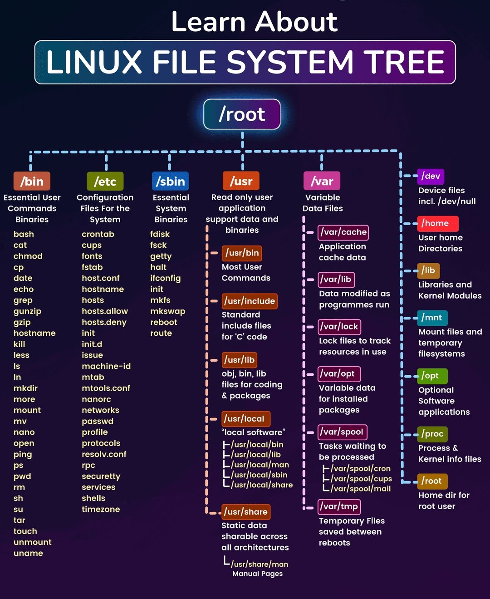
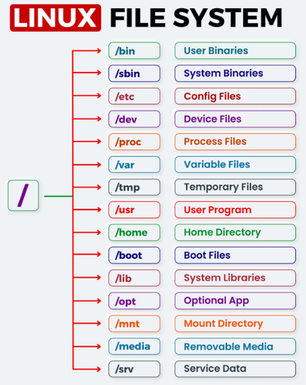
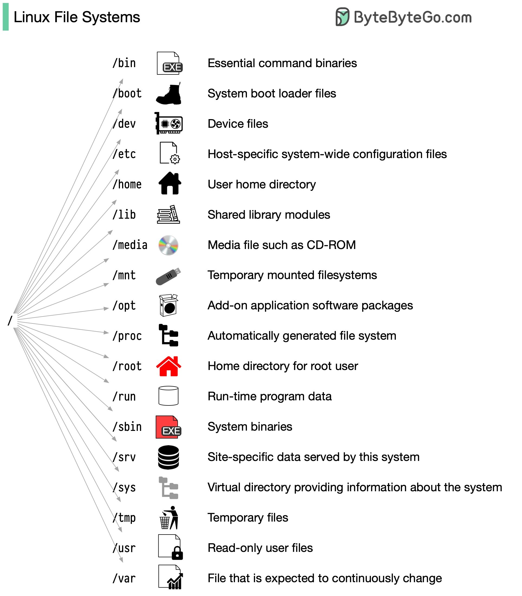
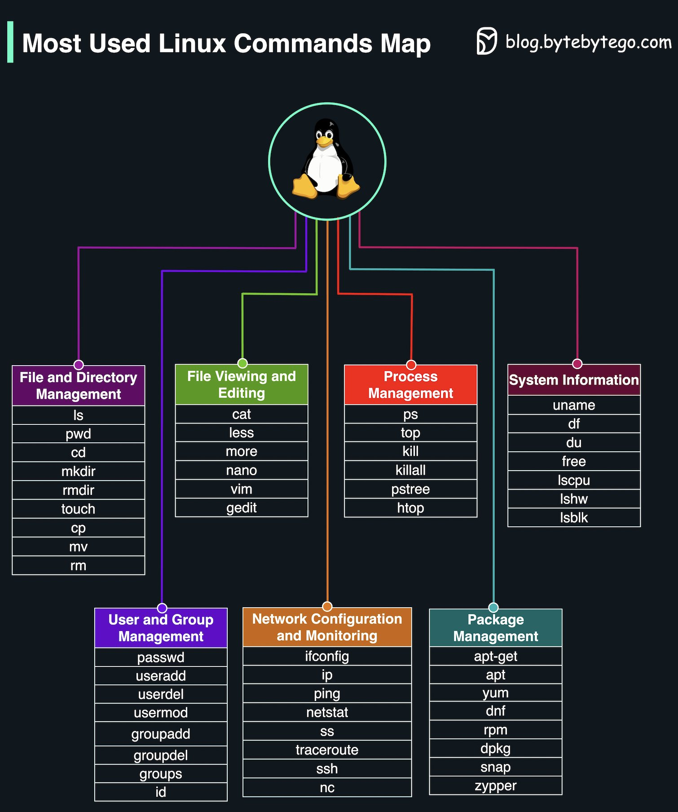
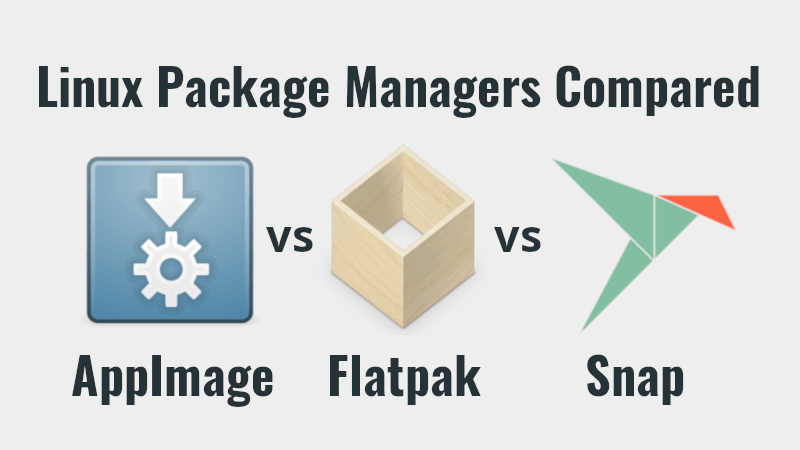
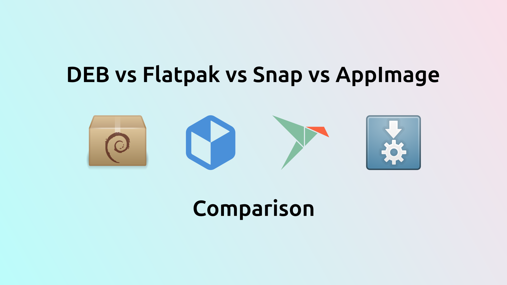
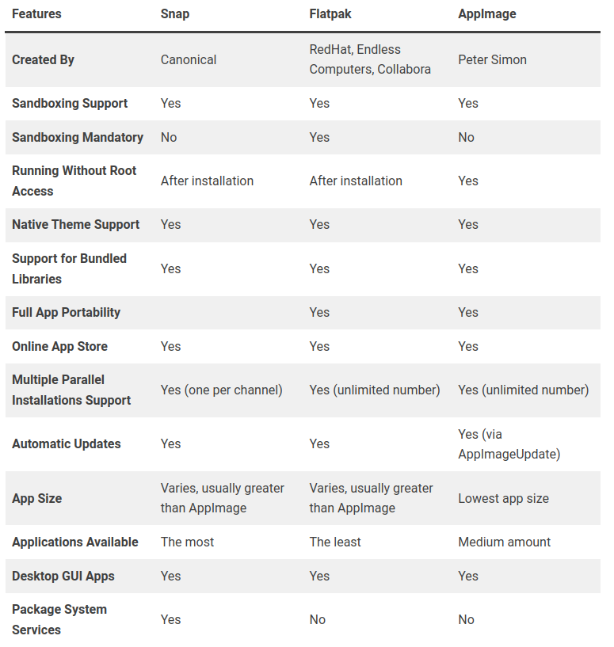
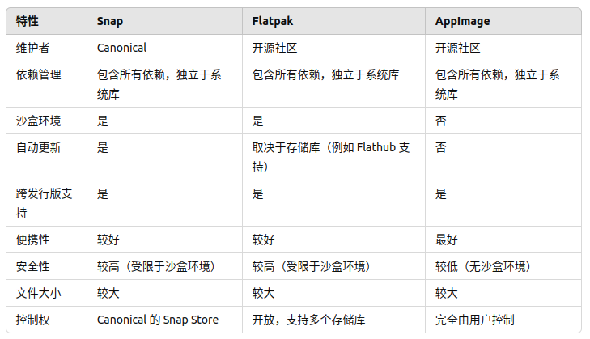

# Linux Systemic

---

## Table of Contents

- [Linux Systemic](#linux-systemic)
  - [Table of Contents](#table-of-contents)
- [鸟哥的Linux私房菜 : 基础学习篇](#鸟哥的linux私房菜--基础学习篇)
  - [第00章 计算机概览](#第00章-计算机概览)
    - [内核 \& 操作系统](#内核--操作系统)
    - [相关指令](#相关指令)
  - [第01章 Linux是什么与如何学习](#第01章-linux是什么与如何学习)
  - [第02章 主机规划与磁盘分区](#第02章-主机规划与磁盘分区)
  - [第03章 安装 CentOS7.x](#第03章-安装-centos7x)
  - [第04章 首次登陆与线上求助](#第04章-首次登陆与线上求助)
  - [第05章 Linux 的文件权限与目录配置](#第05章-linux-的文件权限与目录配置)
    - [Linux 目录配置](#linux-目录配置)
  - [第06章 Linux 文件与目录管理](#第06章-linux-文件与目录管理)
  - [第07章 Linux 磁盘与文件系统管理](#第07章-linux-磁盘与文件系统管理)
  - [第08章 文件与文件系统的压缩,打包与备份](#第08章-文件与文件系统的压缩打包与备份)
  - [第09章 vim 程序编辑器](#第09章-vim-程序编辑器)
  - [第10章 认识与学习BASH](#第10章-认识与学习bash)
  - [第11章 正则表达式与文件格式化处理](#第11章-正则表达式与文件格式化处理)
  - [第12章 学习 Shell Scripts](#第12章-学习-shell-scripts)
  - [第13章 Linux 帐号管理与 ACL 权限设置](#第13章-linux-帐号管理与-acl-权限设置)
  - [第14章 磁盘配额 Quota 与进阶文件系统管理](#第14章-磁盘配额-quota-与进阶文件系统管理)
  - [第15章 例行性工作调度 crontab](#第15章-例行性工作调度-crontab)
  - [第16章 程序管理与 SELinux 初探](#第16章-程序管理与-selinux-初探)
  - [第17章 认识系统服务 daemons](#第17章-认识系统服务-daemons)
  - [第18章 认识与分析登录文件](#第18章-认识与分析登录文件)
  - [第19章 开机流程、模块管理与 Loader](#第19章-开机流程模块管理与-loader)
  - [第20章 基础系统设置与备份策略](#第20章-基础系统设置与备份策略)
  - [第21章 软件安装：源代码与 Tarball](#第21章-软件安装源代码与-tarball)
  - [第22章 软件安装 RPM, SRPM 与 YUM](#第22章-软件安装-rpm-srpm-与-yum)
  - [第23章 X Window 设置介绍](#第23章-x-window-设置介绍)
  - [第24章 Linux 核心编译与管理](#第24章-linux-核心编译与管理)
- [黑马程序员 - 新版Linux入门到精通](#黑马程序员---新版linux入门到精通)
  - [初始 Linux](#初始-linux)
  - [Linux 基础命令](#linux-基础命令)
  - [Linux 权限管控](#linux-权限管控)
  - [Linux 实用操作](#linux-实用操作)
  - [实战软件部署](#实战软件部署)
  - [脚本 \& 自动化](#脚本--自动化)
  - [项目实战](#项目实战)
  - [云平台技术](#云平台技术)
- [补充阅读](#补充阅读)
  - [01 包管理 Snap \& Flatpak \& AppImage](#01-包管理-snap--flatpak--appimage)
    - [Snap](#snap)
    - [Flatpak](#flatpak)
    - [AppImage](#appimage)
  - [02 SSH](#02-ssh)
    - [SSH 隧道](#ssh-隧道)
    - [解决端口占用](#解决端口占用)

---

# 鸟哥的Linux私房菜 : 基础学习篇

## 第00章 计算机概览

**五大单元**

1. 输入单元
2. 输出单元
3. CPU - Central Processing Unit
   1. 控制单元(控制器) - 协调各周边元件与各单元间的工作
   2. 算数逻辑单元(运算器) - 负责程序运算与逻辑判断
4. 内存

数据会流进/流出内存则是 CPU 所发布的控制命令

**CPU**
CPU实际要处理的数据完全来自于内存，不管是程序还是一般文件数据，内存内的数据则是从输入单元所传输进来

所有的单元都是由 CPU 内部的控制单元来负责协调的

CPU 其实内部已经含有一些微指令

[指令集笔记](../ComputerScience/InstructionSet/isa.md)

**CPU架构**

1. 精简指令集 - RISC - reduced instruction set computer
   1. 微指令集较为精简，每个指令的执行时间都很短，完成的动作也很单纯，指令的执行性能较佳
   2. 但是若要做复杂的事情，就要由多个指令来完成
   3. eg : ARM
2. 复杂指令集 - CISC - complex instruction set computer
   1. 与RISC不同的，CISC在微指令集的每个小指令可以执行一些较低阶的硬件操作
   2. 指令数目多而且复杂， 每条指令的长度并不相同
   3. AMD、Intel、VIA所开发出来的x86架构 - 最早的那颗Intel发展出来的CPU代号称为8086
   4. AMD依此架构修改新 一代的CPU为64位，64位的个人电脑CPU又被统称为x86_64架构

位 - 指的是CPU一次数据读取的最大量，64位CPU代表CPU一次可以读写64bits的数据

32位的CPU所能读写的最大数据量大概就是4GB左右 (选址范围有 4Gb，每个位置存 1Byte 数据)

bit 实在太小了，所以在储存数据时每份简单的数据都会使用到 8 个 bits 的大小来记录，因此定义出 Byte

不同的x86架构的CPU微指令集不同，新的x86的CPU大多含有很先进的微指令集

**芯片组**
主板上面有个链接沟通所有设备的**芯片组**，可以将所有单元的设备链接起来，
负责控制和管理主板上的各种外围设备和总线接口，
包括 : CPU、内存、扩展卡插槽、存储设备接口（如 SATA、NVMe）、USB 接口、网卡接口等

两个主要芯片 通过高速总线(如 DMI、HyperTransport)连接起来，形成了整个系统的芯片组架构

1. 北桥 - NorthBridge
   1. 负责处理与 CPU 直接通信的高速组件，比如内存控制器、PCI Express 总线、显卡接口等。
   2. 随着技术的发展，现代处理器已经集成了内存控制器和 PCIe 控制器，因此北桥的作用逐渐减弱。
2. 南桥 - SorthBridge
   1. 负责处理与 CPU 间接通信的低速组件，如硬盘接口（SATA、IDE）、USB、网卡、音频接口等。
   2. 通常也包含了一些辅助功能，如电源管理、时钟、GPIO（通用输入输出）等。

将内存控制器整合到 CPU 后，CPU与内存之间的沟通是直接交流，速度较快之 外，也不会消耗更多的带宽

| 进位制          | Kilo | Mega  | Giga  | Tera  | Peta  | Exa   | Zetta |
| --------------- | ---- | ----- | ----- | ----- | ----- | ----- | ----- |
| 文件(B)  2进制  | 1024 | 1024K | 1024M | 1024G | 1024T | 1024P | 1024E |
| 速度(Hz) 10进制 | 1000 | 1000K | 1000M | 1000G | 1000T | 1000P | 1000E |

Mbps 是 Mbits per second，亦即是每秒多少 Mbit，转成文件大小的 Byte

例题：假设购买了500GB的硬盘一颗，但是格式化完毕后却只剩下460GB左右的容量，这是什么原因？
答：因为一般硬盘制造商会使用十进制的单位，所以 500 GByte 代表为 500×1000×1000×1000 Byte。 转成文件的容量单位时使用二进制(1024为底)，所以就成 为466GB左右的容量了。硬盘厂商并非要骗人，只是因为硬盘的最小物理量为512Bytes，最小的组成单位为扇区sector， 通常硬盘容量的计算采用 多少个sector ，所以才会使用十进制来处理的。

Linux最早在发展的时候，就是依据个人电脑的架构来发展的

原本的单核心CPU仅有一个运算单元，多核心则是在一颗CPU封装当中嵌入两个以上的运算核心，一个实体CPU外壳中，含有两个以上的CPU单元

不同的CPU型号大多具有不同的脚位，能够搭配的主板芯片组也不同


### 内核 & 操作系统

1. **操作系统** OS - 管理计算机 硬件与软件 资源的 计算机程序
   1. 用户界面
      1. GUI - Graphical User Interface - 图形化界面
      2. CLI - Command-Line Interface - 命令行
   2. 系统库
   3. 系统工具 & 应用程序
   4. 安全机制
2. **内核** Kernel - 负责管理计算机硬件资源，为应用程序提供运行时的基本服务
   1. 进程管理
   2. 内存管理
   3. 设备驱动
   4. 系统调用
   5. 文件系统管理
3. 关系
   1. 内核是操作系统的一部分，是操作系统中最接近硬件的层级
   2. 操作系统的其他组件则建立在内核之上
   3. 内核负责处理硬件交互

Ubuntu 是 **基于linux内核**的 桌面PC操作系统，术语上喜欢称Ubuntu是一个 linux **发行版**


### 相关指令

```bash
# 返回值表示系统所用的处理器类型或架构
uname -m  # x86_64 | i386 | armv8l | ppc64le
# 显示CPU和其属性的信息 包含Architecture
lscpu
# 在 Linux 系统上查看 CPU 信息的命令
# 包括 CPU 的型号、频率、缓存大小、核心数、线程数以及支持的指令集等
cat /proc/cpuinfo
```

## 第01章 Linux是什么与如何学习

Linux的核心原型是1991年由托瓦兹 Linus Torvalds 写出来的

## 第02章 主机规划与磁盘分区

## 第03章 安装 CentOS7.x

## 第04章 首次登陆与线上求助

## 第05章 Linux 的文件权限与目录配置

**权限管理**
1. rwx - 读写执行
   1. read     - r - 4
   2. write    - w - 2
   3. excute   - x - 1
2. 修改
   1. chown - 修改拥有者
   2. chgrp - 修改组
   3. chmod - 修改权限

**root & sudo / su**

**/root** 是系统根用户的根目录，通常对普通用户是不开放的，只有 root 用户或者有相应权限的用户可以访问

**su** 和 **sudo** 命令 都可以用来 **获得 root 权限**

**区别**

1. **su** (switch user 或 substitute user) - 执行 **su** 命令时，系统会要求你输入 **root 用户的密码**
2. **sudo** (superuser do) - 使用 **sudo -i** 时，系统会要求你输入 **自己的密码**，而不是 root 的密码

```bash
sudo -i  # 临时切换到 root 用户
su       # 登录为 root 用户，然后你可以自由访问 /root 目录下的文件和文件夹
```

Linux 发行版中 (特别是基于 **Ubuntu** 的系统)，**root 账户默认是禁用的**，无法使用 su 来切换到 root 用户，因为没有有效的密码可以输入

如果出于某种原因你需要使用 su，系统管理员需要先为 root 账户设置一个密码，可以通过以下命令来设置

```bash
lzy@legion:~ $ sudo passwd root
New password:
Retype new password:
passwd: password updated successfully

lzy@legion:~ $ su
Password:
root@legion:/home/lzy# exit
exit
lzy@legion:~ $ sudo -i
root@legion:~# exit
logout
lzy@legion:~ $
```

sudo(superuser do) & root
1. 执行特权命令 - 普通用户可以使用 sudo 来执行通常需要 root 权限的命令，而无需切换到 root 用户
2. 安全性 - 可以记录执行的操作，并且通常需要输入执行命令的用户的密码
3. 权限控制 - 通过 /etc/sudoers 文件精细地控制哪些用户可以使用 sudo
4. sudo 命令用来以其他身份来执行命令，预设的身份为 root
5. Linux 系统中的 超级用户 root 账号通常 用于系统的维护和管理，对操作系统的所有资源 具有所有访问权限

### Linux 目录配置

**[FHS 标准 (filesystem hierarchy standard)](https://www.pathname.com/fhs/)** - 目录配置的依据

FHS的 重点 在于规范每个特定的目录下应该要放置什么样子的数据，让使用者可以了解到已安装软件通常放置于那个目录下

```bash
ls /

bin   cdrom  etc   lib    lib64   lost+found  mnt  proc  run   snap  sys  usr
boot  dev    home  lib32  libx32  media       opt  root  sbin  srv   tmp  var
```


使用 `ls -l [path]` 查看链接关系

```bash
ls -l /lib
lrwxrwxrwx 1 root root 7 Mar  9 18:23 /lib -> usr/lib

ls -l /bin
lrwxrwxrwx 1 root root 7 Mar  9 18:23 /bin -> usr/bin

ls -l /sbin
lrwxrwxrwx 1 root root 8 Mar  9 18:23 /sbin -> usr/sbin

# 具体含义:

# lrwxrwxrwx - 文件的权限字符串
# 1. l 表示 链接文件
# 2. rwx - 可读read、可写write、可执行execute

# 1 - 硬链接数

# root root
# 1. 文件的所有者是用户 root
# 2. 文件属于 root 用户组

# 8 - 链接指向的路径字符串的长度 usr/sbin 共有 8 个字符

# Mar 9 18:23 文件的最后修改时间(链接被创建或最后修改的时间)
```




<!--  -->

<!--  -->

<!--  -->

|DIR      |USAGE              |
|---------|-------------------|
| `/bin`  | user binaries - 常用命令 ls, cat, rm |
| `/sbin` | system binaries - ifconfig, reboot |
| `/lib`  | system libraries - 支持/bin和/sbin目录中的二进制文件运行 |
| `/etc`  | config files - 系统配置文件，控制系统的各种参数和初始设置    |
| `/dev`  | device files - 硬件设备，硬盘、终端、打印机 |
| `/proc` | process files - 提供对内核和进程信息的接口，系统内存、CPU信息、正在运行的进程 |
| `/var`  | variable files - 日志文件、打印队列 |
| `/tmp`  | temporary files - 临时文件，重启时情况  |
| `/usr ` | Unix/User System Resources - 存储用户程序和数据     |
| `/home` | home directories - 为每个用户提供一个目录，用于存储个人文件、配置文件 |
| `/boot` | boot loader files - 启动Linux系统所需的文件，包括Linux内核、引导加载程序的配置文件|
| `/opt`  | optional apps - 安装 可选 的应用程序    |
| `/mnt`  | 临时挂载文件系统的位置 |
| `/media`| 自动挂载可移动存储设备的标准位置 - USB驱动器、外部硬盘等 `/media/[username]/device`|
| `/srv`  | service data - 存储本地服务器提供的数据，如网站数据、FTP文件 |
| `/run`  | runtime program data |
| `/root` | home of the root user|


**/ & /root**
1. / 根目录
   1. 整个文件系统的根目录，包含所有其他目录和文件(`/bin`、`/etc`、`/usr`、`/var`)，文件系统层次结构的起点
   2. 系统启动和运行的核心
2. /root 超级用户主目录
   1. root 用户的专用主目录，存储 root 用户的个人文件和配置，只有 root 用户有访问权限
   2. 需要`su`后，成为`root`才能进入
      ```bash
      lzy@legion:~ $ su
      Password:
      root@legion:/home/lzy# cd /root
      root@legion:~# ls
      Desktop  Downloads  snap  Templates  模板
      root@legion:~# exit
      exit
      lzy@legion:~ $ cd /root
      bash: cd: /root: Permission denied
      ```


## 第06章 Linux 文件与目录管理

## 第07章 Linux 磁盘与文件系统管理

## 第08章 文件与文件系统的压缩,打包与备份

## 第09章 vim 程序编辑器

## 第10章 认识与学习BASH

## 第11章 正则表达式与文件格式化处理

## 第12章 学习 Shell Scripts

## 第13章 Linux 帐号管理与 ACL 权限设置

## 第14章 磁盘配额 Quota 与进阶文件系统管理

## 第15章 例行性工作调度 crontab

## 第16章 程序管理与 SELinux 初探

## 第17章 认识系统服务 daemons

## 第18章 认识与分析登录文件

## 第19章 开机流程、模块管理与 Loader

## 第20章 基础系统设置与备份策略

## 第21章 软件安装：源代码与 Tarball

## 第22章 软件安装 RPM, SRPM 与 YUM

## 第23章 X Window 设置介绍

## 第24章 Linux 核心编译与管理

# 黑马程序员 - 新版Linux入门到精通

[黑马程序员 - 新版Linux入门到精通](https://www.bilibili.com/video/BV1n84y1i7td/)

## 初始 Linux

## Linux 基础命令

## Linux 权限管控

## Linux 实用操作

## 实战软件部署

## 脚本 & 自动化

## 项目实战

## 云平台技术

---

# 补充阅读

## 01 包管理 Snap & Flatpak & AppImage

<center></center>

distro-native packaging formats
1. `.deb` - Ubuntu 和其他 Debian 发行版
   1. 包管理工具
      1. `apt` (Advanced Package Tool) 更高级的功能，如自动处理依赖关系、从远程仓库下载包等
      2. `dpkg` (Debian系列的 底层包管理工具) 直接操作 `.deb` 包，不处理包的依赖关系
2. `.rpm` - Red Hat、Fedora、CentOS 和其他基于 Red Hat 的 Linux
   1. 包管理工具
      1. `yum` - CentOS 6/7 (Yellowdog Updater, Modified)
      2. `dnf` - CentOS 8 (Dandified YUM)

containerized application packaging formats
1. Snap
2. Flatpak
3. AppImage
4. 特点
   1. having the dependencies in the application package
   2. ensures no conflicts of dependencies between different applications
   3. the application size is generally larger


为了使在 Linux 系统上安装软件包的过程变得简单，开发人员构建了 Snap, AppImage, Flatpak 软件包管理器

Snap, Flatpak, AppImage 有自己的包存储库系统


<!--  -->






### Snap


[Canonical Snapcraft - The app store for Linux](https://snapcraft.io/)


Snap 是 Canonical 开发的 应用程序打包和分发系统

Snap 有一个在线应用商店 (SnapCraft) 由 canonical 维护和控制

许多流行的 Linux 发行版都采用了 Snap，包括 Ubuntu、Manjaro、Linux Mint、Debian、Kali 和 RHEL

snapd(daemon process) - manage the Snap packages
1. fetching package files from a remote repository
2. mounting, creating a sandbox, and running the application

Pros
1. 软件数量最多
2. 独立性 - Snap 包含应用程序及其所有依赖项，独立于底层操作系统的库和依赖
3. 自动更新 - snapd (daemon process)
4. 跨平台支持
5. **Sandbox Environment**


Cons
1. 性能开销 - 包含了所有依赖项，包的大小通常较大，可能会增加系统的存储和启动时间
2. 生态封闭 - Snap 由 Canonical 控制，依赖于其中央存储库 Snap Store


### Flatpak


[Flatpak—the future of application distribution](https://www.flatpak.org/)


[Flathub](https://flathub.org/)

RedHat 红帽

由开源社区开发的应用程序打包和分发系统，旨在为 Linux 提供一个独立于发行版的应用程序平台

the Flatpak packages are almost always bigger than both Snap and AppImage packages

allowing both shared and individual libraries

Pros
1. 跨平台支持 - 可以在几乎所有的 Linux 发行版上运行
2. **Sandbox Environment**
3. 开放生态 - 社区驱动的项目，没有中央控制的存储库限制，支持从多个存储库安装应用程序

Cons
1. 性能开销
2. 依赖管理
3. 无自动更新


### AppImage


[AppImage | Linux apps that run anywhere](https://appimage.org/)

[AppImageHub | AppImage 包的中央存储库](https://www.appimagehub.com/)

the AppImage package itself is the final executable program

AppImage 通常比 snap 或 flatpak 更快，且需要更少的存储空间

可以随时删除 AppImage 文件，而无需中断其他系统进程

便携式应用程序格式

类似于 .exe 文件在 Windows 中的工作方式

**无需安装**，只需为它分配正确的权限，使其可执行，然后运行它

想要 sandbox 需要 [firejail](https://github.com/netblue30/firejail)

```bash
sudo chmod +x [xxx].AppImage
```


Pros
1. 简单易用 - 只需下载并运行 AppImage 文件(无需安装)
2. 便携性 - 可在多个系统之间移动 AppImage 文件
3. 独立性 - 不会对系统造成任何修改或依赖问题(自包含)

Cons
1. 没有内置的自动更新机制
2. 无原生 Sandbox


## 02 SSH

SSH - **secure shell** - 用于安全访问远程计算机的加密传输协议(OSI七层模型中的**应用层**)
1. 安全性 - 非对称加密 和 密码认证
2. 远程登录
3. 文件传输
   1. SCP - secure copy protocol
   2. SFTP - ssh file transfer protocol
4. 端口转发 -

SSH服务的标准端口，默认为 22

服务端提供 SSH 服务，供客户端 访问 & 使用

客户端使用 SSH 远程登录系统

```bash
# 查看安装
dpkg -l | grep ssh

sudo apt install openssh-client
sudo apt install openssh-server
```

```bash
ssh -V  # 查看版本
OpenSSH_8.9p1 Ubuntu-3ubuntu0.7, OpenSSL 3.0.2 15 Mar 2022

ps -e | grep ssh
#   PID TTY          TIME CMD
   1154 ?        00:00:00 sshd
 271939 ?        00:00:00 ssh-agent
 330145 pts/3    00:00:00 ssh

netstat -tuln | grep :22  # tcp, udp, listening, numeric
Proto Recv-Q Send-Q Local Address           Foreign Address         State
tcp        0      0 0.0.0.0:22              0.0.0.0:*               LISTEN
tcp6       0      0 :::22                   :::*                    LISTEN
```

查看服务是否启动 `systemctl status sshd` (关注 **active (running)**)

```bash
systemctl start sshd    # 启动服务
systemctl status sshd   # 查看状态

● ssh.service - OpenBSD Secure Shell server
     Loaded: loaded (/lib/systemd/system/ssh.service; enabled; vendor preset: enabled)
     Active: active (running) since Wed 2024-05-29 00:56:35 CST; 10h ago
       Docs: man:sshd(8)
             man:sshd_config(5)
    Process: 1130 ExecStartPre=/usr/sbin/sshd -t (code=exited, status=0/SUCCESS)
   Main PID: 1154 (sshd)
      Tasks: 1 (limit: 38156)
     Memory: 3.4M
        CPU: 16ms
     CGroup: /system.slice/ssh.service
             └─1154 "sshd: /usr/sbin/sshd -D [listener] 0 of 10-100 startups"
```


```bash
ssh {-p [port]} [username]@[ip address]
# 如果使用默认端口 -p [port] 可省略
```


### SSH 隧道

`-L` - 在 SSH 命令中用于设置本地端口转发 (Local Port Forwarding)

```bash
ssh -L [local_port]:[remote_address]:[remote_port] [user@remote_server] -p [ssh_port]
```
1. `local_port` - 本地计算机上的 **端口号**，任何连接到这个端口的流量都会通过 SSH 隧道转发到远程服务器(双向)
2. `remote_address` - 远程服务器上的 **地址**
   1. 希望通过隧道访问的远程服务器上的地址
   2. 大多数情况下，这是 127.0.0.1，表示远程服务器的本地主机地址
3. `remote_port` - 远程服务器的 **端口号**，即你希望访问的远程应用的端口号
4. `user` - 远程服务器的 **用户名**
5. `remote_server` - 远程服务器的 **IP地址**
6. `ssh_port` - 指定 SSH 连接使用的 **端口** (默认 22)

可以同时设置多个 **端口转发规则**


```bash
ssh -L [local_port]:[remote_address]:[remote_port] -L [local_port]:[remote_address]:[remote_port] [user@remote_server] -p [ssh_port]

ssh -L 20088:127.0.0.1:80 -L 7474:127.0.0.1:80 dreamsoft@125.69.82.54 -p 20088
```

### 解决端口占用

```bash
# Linux
sudo lsof -i :80
sudo kill -9 <PID>


# Windows
netstat -ano | findstr :80
taskkill /PID <PID> /F
```

关闭占用端口的 进程 & 应用


