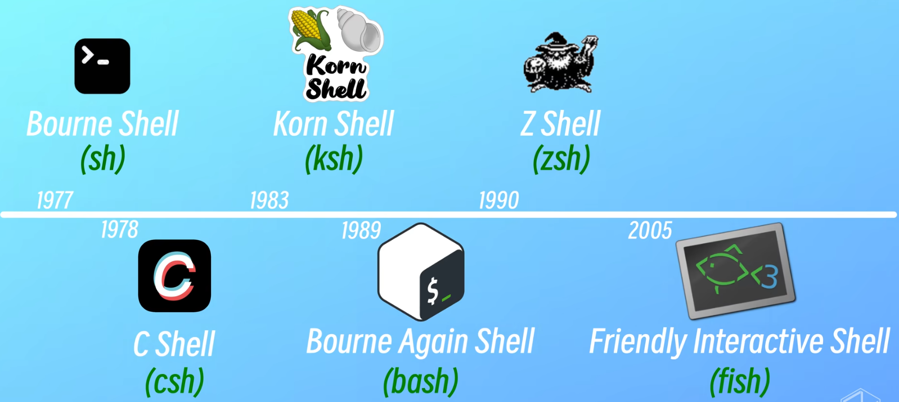

# Shell

---

## Table of Contents

- [Shell](#shell)
  - [Table of Contents](#table-of-contents)
- [30分钟Shell光速入门教程 - B站(GeekHour)](#30分钟shell光速入门教程---b站geekhour)
  - [Basic](#basic)
  - [Shell Script](#shell-script)

---

# 30分钟Shell光速入门教程 - B站(GeekHour)

[30分钟Shell光速入门教程 - B站(GeekHour)](https://www.bilibili.com/video/BV17m411U7cC/)

## Basic

shell : 命令行解释器

接收 用户输入的命令，调用 操作系统 内核 执行，并将结果 返回给 用户

各种 Shell 版本
1. 

linux 默认安装 bash

Git 自带 Git Bash

`cat /etc/shells` : 查看 系统中 所有的 Shell 版本

`echo $SHELL` : 查看 系统默认使用的 Shell 路径的 环境变量

`echo $0` : 查看 当前正在执行的 脚本的名称

## Shell Script

编写 自动化任务

一般以 `.sh` 为扩展名

可能需要 `chmod` 添加 可执行权限

第一行 `#!/bin/bash`，表示使用的解释器

`echo` / `date` / `whoami`

shell 脚本中的变量 默认是全局的

