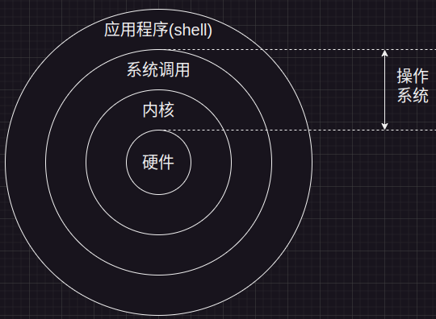

# Bash

[toc]

---

# Terminal、Bash、Shell

[Scripts(脚本语言)、Shell、Sh、Bash之间的关系](https://zhuanlan.zhihu.com/p/268407319)

## Scripts

脚本(Script)，是一种特定的描述性语言，依据一定的格式编写的可执行文件

常见的脚本语言包括 python、JavaScript、PHP、SQL、Shell 等

## Shell

一般指的是shell脚本(即shell scripts)，但shell本身指的却是命令解释器，更具体的来讲，shell就是一个用C语言编写的程序，这个程序提供了一个界面，用户可以通过这个界面访问操作系统内核的服务。就像shell的字面意思那样，shell——壳，它是一个壳，一个能让用户与操作系统内核沟通的壳，一个保护操作系统内核不被用户直接调用的保护壳



## Sh、Bash

shell是提供与内核沟通接口的命令解释器程序，但实际上shell是这种解释器的统称，Linux系统的shell种类很多

各种shell & 路径：
1. Bourne Shell （/usr/bin 或 /bin/sh）
2. Bourne Again Shell （/bin/bash）
3. C Shell （/usr/bin/csh）
4. K Shell （/usr/bin/ksh）
5. Shell for Root （/sbin/sh）

---

# Bash 101

[Bash 101: Working at the CLI](https://www.linux.com/training-tutorials/bash-101-working-cli/)

[GNU Bash manual](https://www.gnu.org/software/bash/manual/)

Bash 简介(What’s Bash?)
1. Bash is the shell for most major Linux distributions
2. Bash(**Bourne again shell**), emulates the original **Bourne shell** & adds a number of features
3. shell is a **user interface to computer**, ≠ **command line**
4. Bash is also **command language interpreter**
5. Bash 不仅能在命令行中逐个执行你输入的命令，还能将这些命令组织成**脚本文件**，然后**非交互式地**(不是每个命令立即得到反馈)批量运行它们
6. 跨平台 GNU Bash is shipped with Mac OS X


Run Commands
1. 命令行的外观 : 普通用户的提示符通常以 `$` 开头，超级用户 root 以 `#` 开头
2. there’s no **undo** in bash, use `noclobber` to prevent overwriting files(默认关闭)
    ```bash
    set -o noclobber  # 启用
    echo "fuck" > test1.txt  # bash: test1.txt: cannot overwrite existing file
    set +o noclobber  # 禁用
    echo "fuck" > test1.txt
    ```
3. 多条命令 (chain them with bash operators)
   1. `command1  ; command2` - 依次运行 command1 和 command2
   2. `command1 && command2` - 只有 command1 成功时才运行 command2
   3. `command1 || command2` - 只有 command1 失败时才运行 command2

Pipe `|`
1. 将一个命令的输出传递给另一个命令作为输入
2. eg : `<command> | grep <str>`

Navigating the Shell (快捷键)
1. `Ctrl-a` : Move to the beginning of the line (**ahead**)
2. `Ctrl-e` : Move to the end of the line (**end**)
3. `Ctrl-k` : Delete the text from the cursor to the end of the line
4. `Ctrl-w` : Delete the previous word
5. `Alt-d`  : Delete the next word
6. `Alt-f`  : Move forward a word (**forward**)
7. `Alt-b`  : Move backward a word (**end**)
8. `Ctrl-n` : Scroll down in history (**next**)
9. `Ctrl-p` : Scroll up in history (**previous**)


Multitasking & Jobs
1. 在命令后加 `&`，可以让程序在后台运行
2. `Ctrl-z` 可以暂停一个正在运行的任务
3. Bash 会自动将 `%<job_num>` 转换为对应任务编号的 PID，然后对其发送信号
4. 使用 `fg %<job_num>`(foreground) 和 `bg %<job_num>`(background) 在前台和后台之间切换任务
5. `jobs` - 查看后台任务状态
   ```bash
    [1]-  Stopped                 sudo apt update
    [2]+  Stopped                 sudo apt update
    [3]   Done                    sleep 100
   ```
   1. `+` 表示当前的默认任务 current job，在不指定任务编号的情况下使用 **fg** 或 **bg** 命令，这个加号任务会被选中
   2. `-` 表示下一个默认任务 Next Job，当前默认任务(加号任务)结束或完成，减号任务会成为新的默认任务
   3. ` ` 如果任务编号后面既没有加号也没有减号，表示这是一个非焦点任务
6. 暂停 & 恢复
   1. `kill %<job_num>` or `kill <PID>`终止任务
   2. `kill -STOP %<job_num>` 暂停任务
   3. `kill -CONT %<job_num>` 恢复任务


History
1. `history`
2. `!<command>` - 运行最后一次执行的 command
3. `!<num>` - 运行历史中编号为 n 的命令


---

# 【伯乐大典】最实用的Bash脚本知识

## Portal

[【伯乐大典】最实用的Bash脚本知识](https://www.bilibili.com/video/BV1AT411Y7bq/)

[Ryan's Tutorials -- A collection of introductory technology tutorials.](https://ryanstutorials.net/)

[Bash Scripting Tutorial](https://ryanstutorials.net/bash-scripting-tutorial/)


