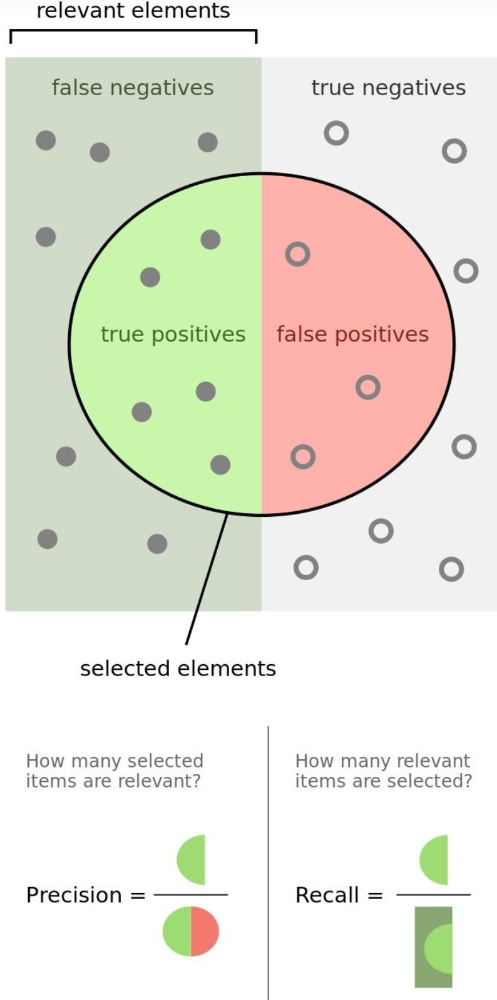
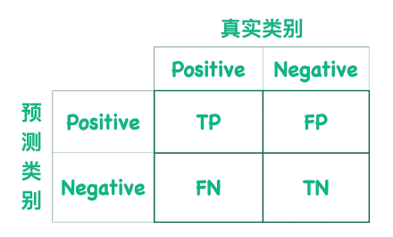
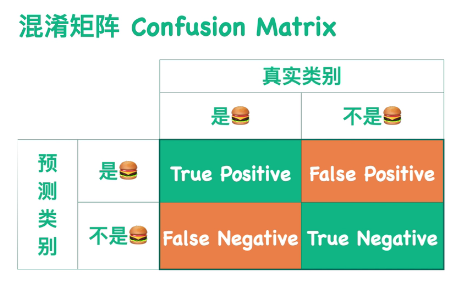
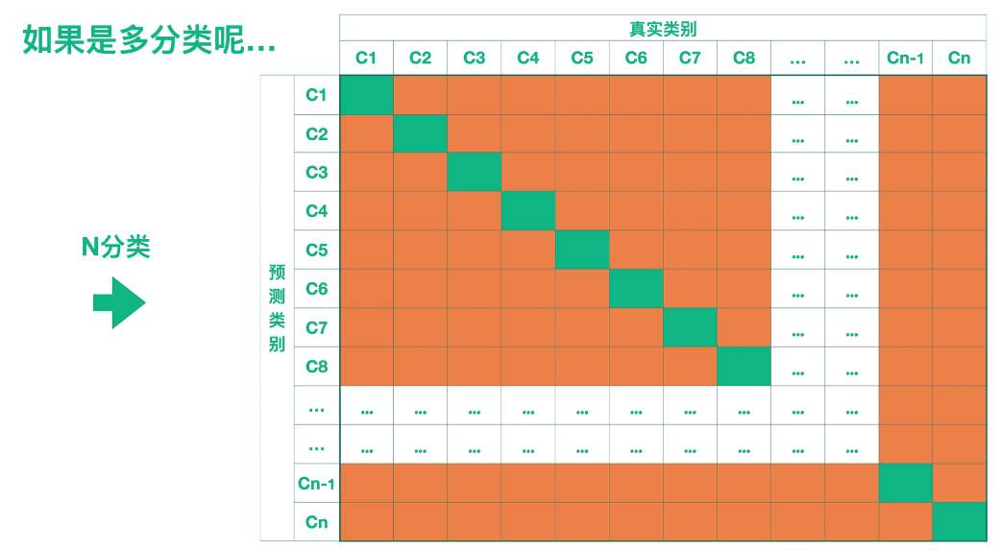
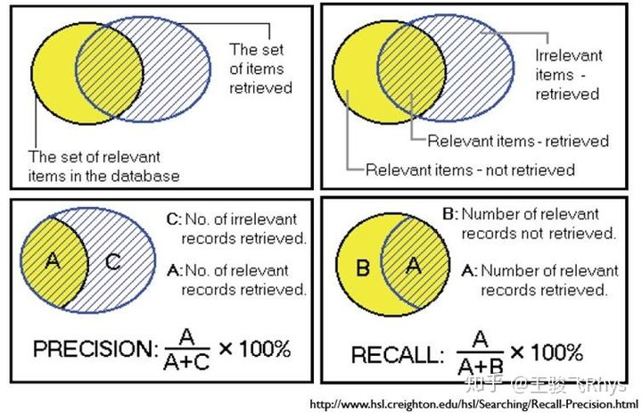
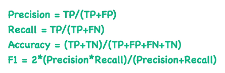
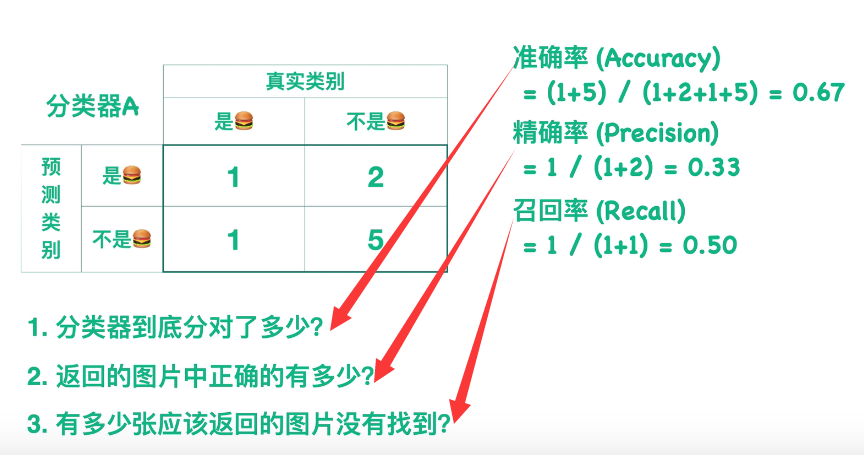
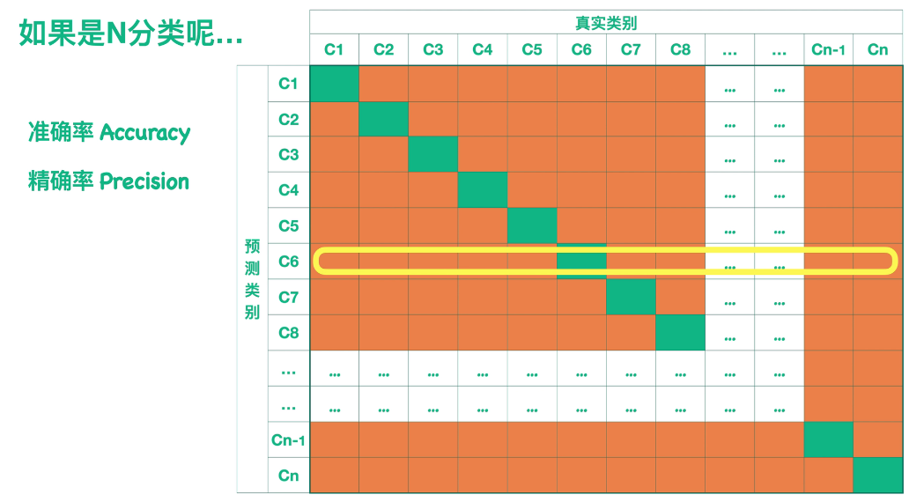
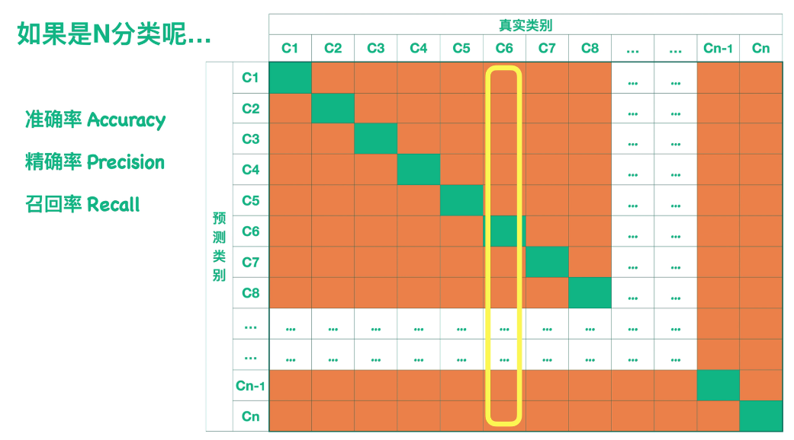
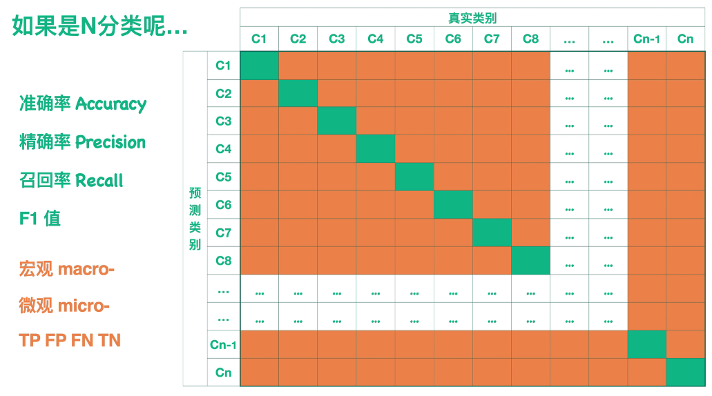

# 混淆矩阵 & F1-score

## Portals

[小萌五分钟 Confusion Matrix](https://www.bilibili.com/video/BV1oz4y1R71a)

[小萌五分钟 F1值](https://www.bilibili.com/video/BV1vt4y117Zz)

## 混淆矩阵 Confusion Matrix

`T/F` 表示的是预测的正确与否(和真实值一致)，`Positive/Negative` 表示的是分类器给出的分类

TP : true positive  预测是正确的正样本
FP : false positive 预测是错误的正样本
TN : true negative  预测是正确的负样本
FP : false positive 预测是错误的负样本

TP + FN : 数据集里真正的正样本总数

TP + FP : 模型预测的正样本总数

$$Accuracy = \frac{TP + TN}{TP + FP + FN + TN}$$

$$Precision = \frac{TP}{TP + FP}$$

$$TPR = Recall = \frac{TP}{TP + FN}$$

$$TNR = \frac{TN}{TN + FP}$$

$$FPR = 1 - TNR = \frac{FP}{TN + FP}$$

$$FNR = 1 - TPR = \frac{FN}{TP + FN}$$

希望绿色的数值大，橙色的数值小，这样模型效果好。

## F1-score

准确率Accuracy：说明分类器正确分类的比例。

精确率Precision：可以判断出有多少其他类被分到自己这一类(被我们的算法选为positive的数据中，有多少真的是positive的？)

召回率Recall：可以判断出有多少自己这一类被分到其他类(实际应该为Positive的数据中，多少被我们选为了Positive？)

$F_1=\frac{2}{\frac{1}{Precision}+\frac{1}{Recall}}$

F1_score是Precision和Recall的调和平均值

$F_\beta=(1+\beta^2)\times \frac{Precision·Recall}{\beta^2·Precision+Recall}$

Recall的重要性是Precision的$\beta$倍

F1-score越大自然说明模型质量更高。但是还要考虑模型的泛化能力，F1-score过高但不能造成过拟合，影响模型的泛化能力。

