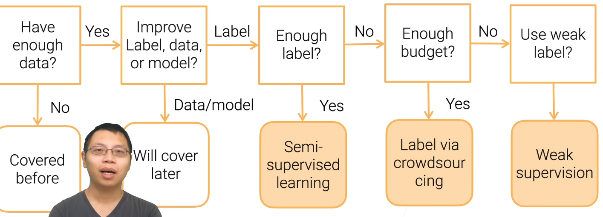
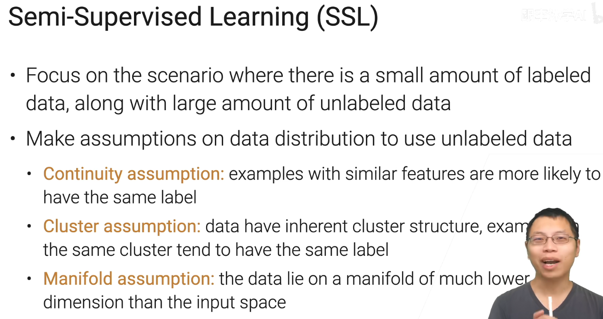
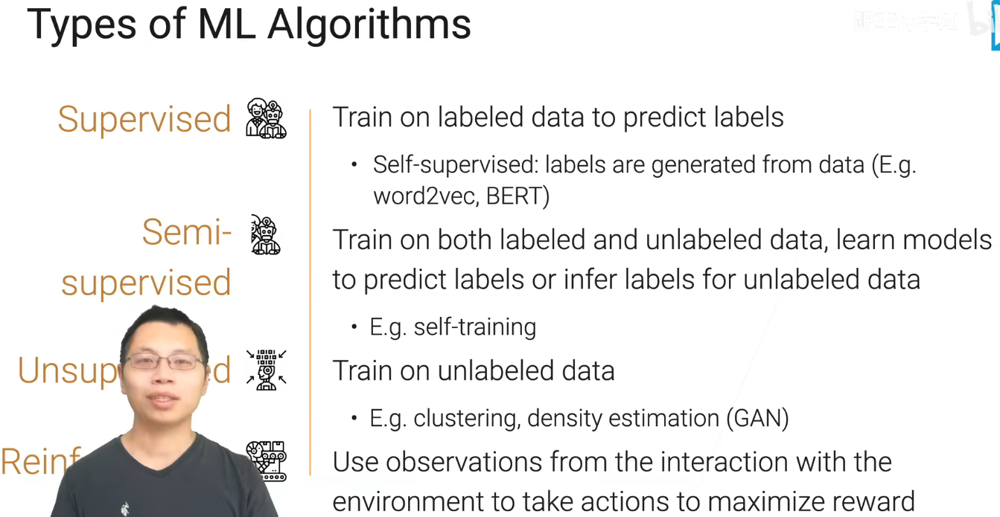
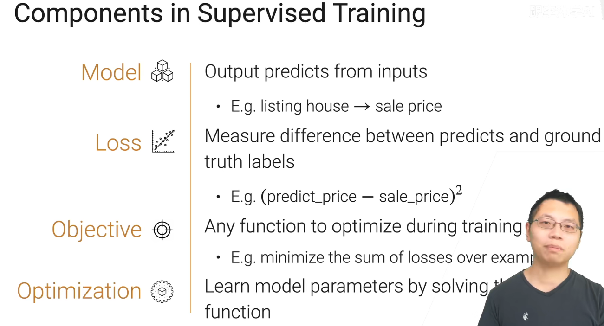
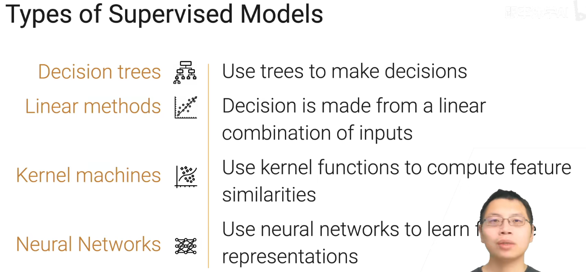
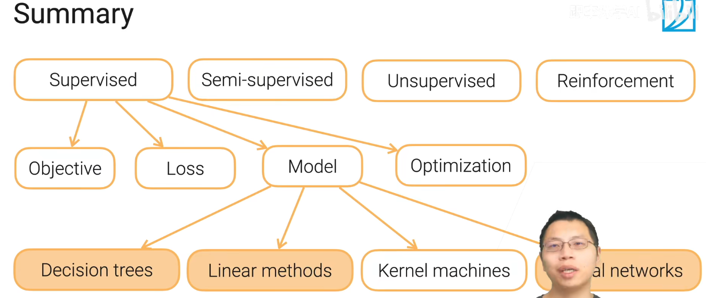
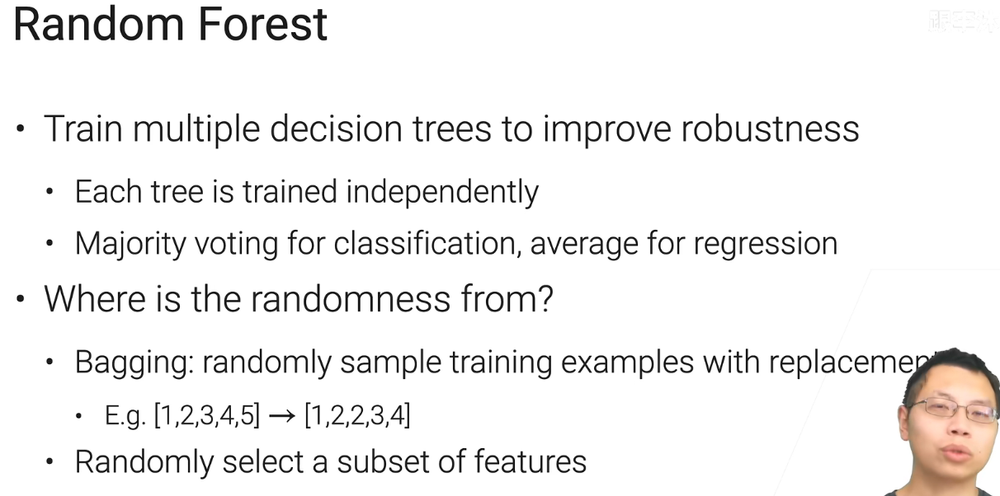
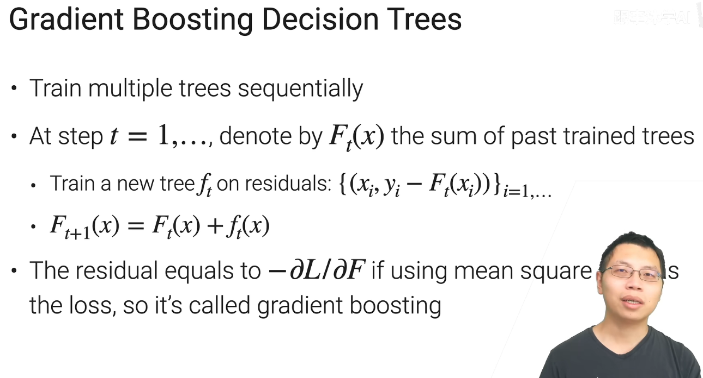

# Practical Machine Learning
## CS 329P  --  2021 fall  --  LiMu

# 目录

[toc]

# Portals

[斯坦福21秋季：实用机器学习中文版](https://www.bilibili.com/video/BV13U4y1N7Uo/)

[Practical Machine Learning 官网](https://c.d2l.ai/stanford-cs329p/)

# 1.1 课程介绍

# 1.2 数据获取

# 1.3 玩个有数据抓取

# 1.4 数据标注 Data Labeling

eg：用户的随意的点击

# 3.1 8分钟机器学习介绍

监督学习最常用

# 3.2 最简单也最常用的决策树

优点
1. 可解释性强
2. 可以处理类别特征&数值特征

缺点
1. 不稳定（数据出现一定的噪音后，树的形状可能完全不同），用集成学习解决（**随机森林**）
2. 容易过拟合，用剪枝解决
3. 不易于并行计算，性能吃亏

**随机森林**

每棵树独立训练

分类问题采用投票，回归问题采用平均值

==随机性来源==
1. 对训练样本随机采样（类似于对数据的行进行随机采样）
2. 对特征进行随机采样（类似与对数据的列进行随机采样）

**Boosting**

不是独立训练，而是顺序训练的

