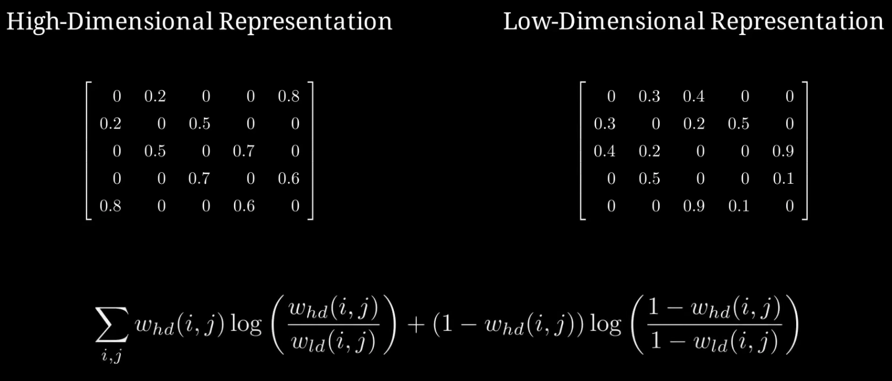

# Dimension Reduction

[Latent Space Visualisation: PCA, t-SNE, UMAP | Deep Learning Animated](https://www.youtube.com/watch?v=o_cAOa5fMhE)

## PCA (Principal Component Analysis)

步骤
1. centralize & normalize to 0~1
2. 计算 协方差矩阵 covariance matrix $\sum$
   1. 方差 : $$\sigma_x^{2} = \frac{1}{n-1}\sum_{i=1}^{n}\bigl(x_i - \bar{x}\bigr)^{2}$$
   2. 协方差 : $$\sigma(x,y) = \frac{1}{n-1}\sum_{i=1}^{n}\bigl(x_i - \bar{x}\bigr)\bigl(y_i - \bar{y}\bigr)$$
   3. 协方差矩阵
      1. 对角线是 方差，非对角线是 协方差
      2. 原矩阵 (**n×d，n个样本(列数)，每个样本d个特征(行数)**)
         1. $$ \mathbf{X}\;=\;
                  \begin{bmatrix}
                     x_{11} & x_{12} & \dots  & x_{1d} \\
                     x_{21} & x_{22} & \dots  & x_{2d} \\
                     \vdots & \vdots & \ddots & \vdots \\
                     x_{n1} & x_{n2} & \dots  & x_{nd}
                  \end{bmatrix}
               \;\in\;\mathbb{R}^{\,n\times d}$$
      3. 第(i,j)元素 是 第i列 与 第j列 协方差
         1. $$\Sigma_{ij} = \operatorname{Cov}(X_i, X_j) = \frac{1}{n-1}\sum_{k=1}^{n}(x_{ki}-\bar{x}_i)(x_{kj}-\bar{x}_j)$$
      4. **中心化** 后 计算 可以浓缩为 **一次矩阵乘法** & **一个常数因子(根据样本数量缩放)** $$\frac{1}{n-1} X_c^T X_c$$ (n-1 是 无偏估计)
3. 计算 协方差矩阵的 **特征向量 & 特征值**，在矩阵作用时方向保持不变，尺度变化为 lambda
4. 最大的特征值 为 主成分
5. 使用 Projection Matrix，将数据投影到主成分

优势
1. 仅依赖基础 线性代数，速度快
2. 时间复杂度 Complexity = $O(nd^2 + d^3)$ (n = samples, d = features)
3. 通过 eigenvalue 的大小 可以知道 重要程度
4. 可解释性

劣势
1. 对于非线性数据 效果不好 (eg : spiral 螺旋)

## t-SNE (t-Distributed Stochastic Neighbor Embedding)

t-Distributed Stochastic Neighbor Embedding，SNE 的 改进版本

作者
1. 

[论文 - SNE](https://papers.nips.cc/paper_files/paper/2002/hash/6150ccc6069bea6b5716254057a194ef-Abstract.html)

[论文 - t-SNE](https://www.jmlr.org/papers/volume9/vandermaaten08a/vandermaaten08a.pdf)

SNE
1. 思想 : 高维中接近的点，降维后也应该临近
2. 测量高维空间中一个点与其邻居的距离，确保在低维空间中保持相似
   1. 
4. 将 某点 与其邻居的距离 转为 概率分布(Gaussian)
   1. 
   2. 标准差 $\sigma$ 决定了高斯分布的宽窄
   3. 越宽，越多的点被视为邻居
5. 在 某点周围 归一化，使所有概率之和 为 1，每个点都有自己独立的概率分布
   1. $$p_{i,j} =
         \frac{\exp\!(-\frac{|| x_i - x_j ||^{2}}{2\sigma_i^{2}})}
         {\sum_{k\neq i}\exp\!(-\frac{|| x_i - x_k ||^{2}}{2\sigma_i^{2}})}$$
   2. 计算资源消耗大
6. 低维空间中，随机放置点，并同样用距离计算概率
   1. 
7. 让低维 和 高维分布更接近，使用 **KL散度**(标量，被积函数是曲线)作为 Loss，对低维embedding 求梯度，调整低维表示，更接近高维分布
   1. 
   2. 
   3. 使用 **Perplexity** **超参数**(直观理解为 **每个点希望被视为有多少个有效近邻**)，越大簇越分散，不代表效果
      1. 通过计算 每个分布的熵 得到
      2. $\mathrm{Perplexity}=2^{H(P_i)}$
      3. $H(P_i)=-\sum_{j\neq i} p_{i,j}\,\log_{2} p_{i,j}$
   4. 对 每个样本 各自独立 二分搜索 sigma(**仅在高维空间**)，直到该样本的条件概率分布的困惑度 ≈ 目标 perplexity(超参数)
8. 可以处理 nonlinear 数据
   1. 
9. 运行速度慢
10. 轻微改变 perplexity 可能导致 最终 簇效果相差很多

t-SNE
1. 改进 SNE 的速度 & 可视化
2. 高维空间使用 Gaussian 分布，低维空间使用 学生t分布
   1. 
3. todo

## UMAP (Uniform Maniflod Approximation and Projection)

[论文 - UMAP: Uniform Manifold Approximation and Projection for Dimension Reduction](https://arxiv.org/abs/1802.03426)

同样关注高维样本到neighbor的距离，并寻求一个大致匹配这些距离的低维表示

但不使用 高斯分布 和 概率分布，而是使用 图，表示高维&低维数据

对于每个样本，使用 KNN，K(近邻数量)是 UMAP 的主要 超参数

将近邻链接 转为 加权图(exponential decay)，通过 $\rho$ 保证 最近邻的权重为 1
1. 
2. **不进行归一化**，速度更快

对称化处理，使得任意两点之间只有一条边(把两条 有向边 合成一条 无向边)
1. 

对于初始的低维表示，也进行相同步骤

使用 损失函数，匹配两种 representation，使用 高维 & 低维 **邻接矩阵**，利用 交叉熵(当做二分类) & 随机梯度下降(随机选边) 以 minimize
1. 

优势
1. 速度比 t-SNE 更快
2. UMAP 的 近邻数量 可解释性&效果 优于 SNE 的 Perplexity

