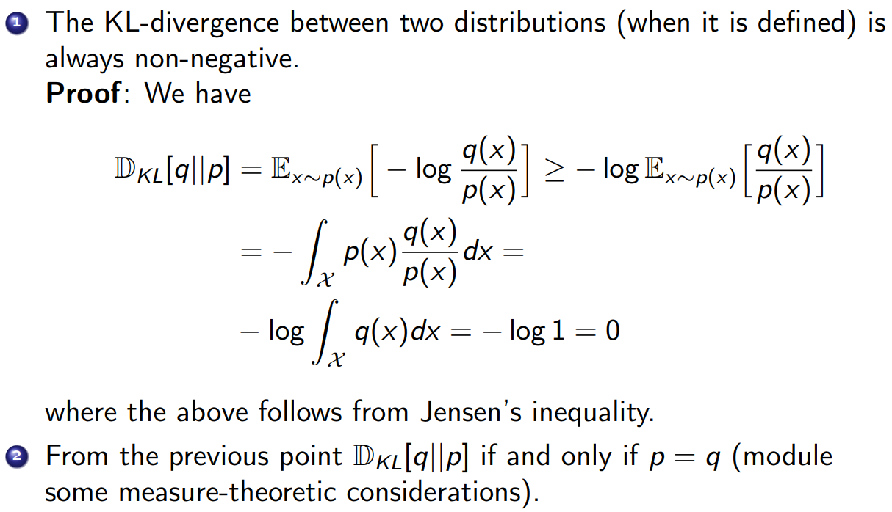
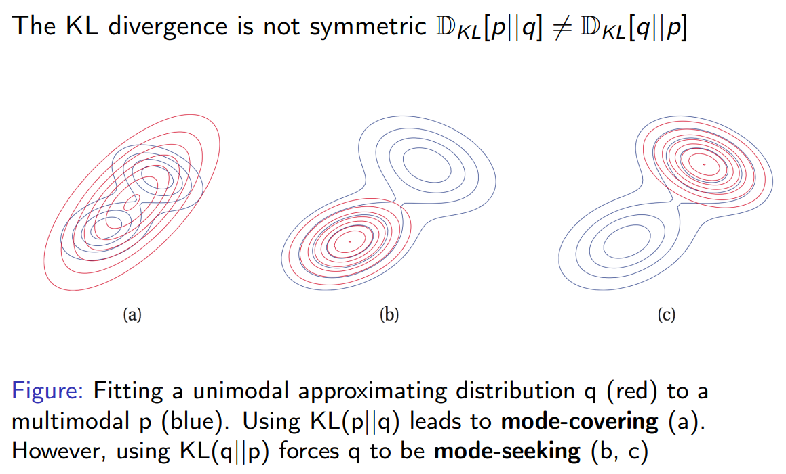
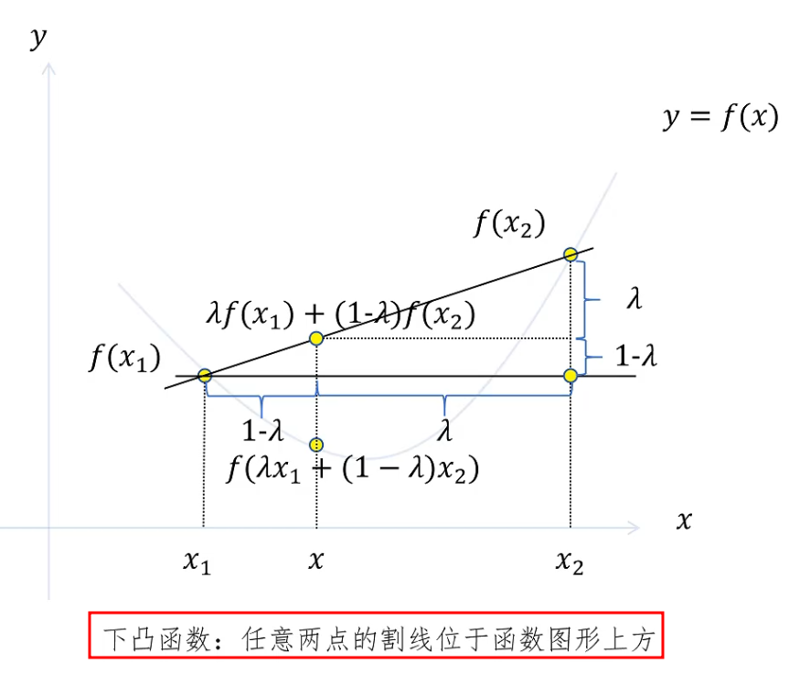
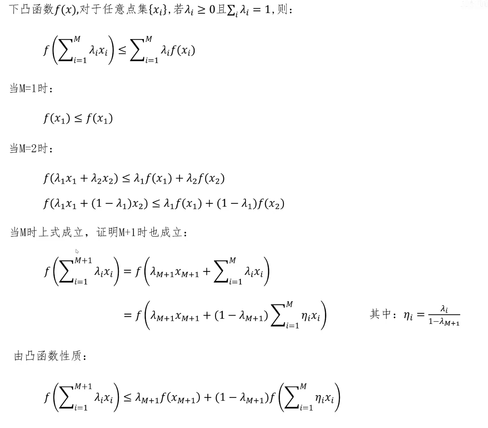
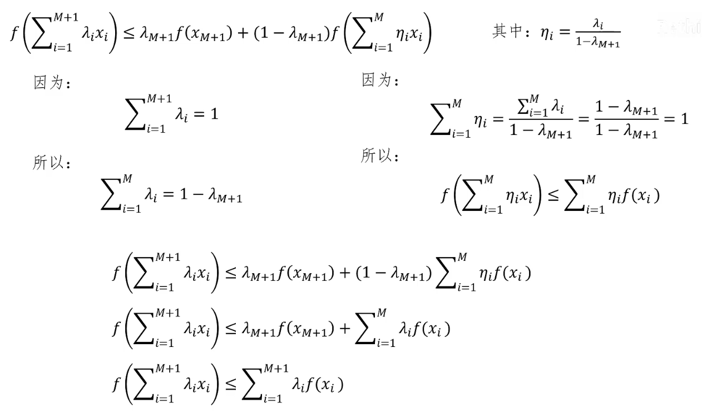

# 信息量 + 香农熵 + 交叉熵 + KL散度

**信息量 (Amount of Information)**
1. 小概率事件，信息量大 | 大概率事件，信息量小
2. 独立事件，信息量可以相加
3. $$I(x) = \log _2 (\frac{1}{p(x)}) = - \log _2 (p(x))$$

---

**香农熵 (Shannon Entropy)** - 对于单个分布
1. 概率分布的期望信息量
2. $$H(p) = \sum_i p_i \log _2(\frac{1}{p_i}) = -\sum_i p_i \log_2(p_i)$$
3. 概率密度越均匀，也就是越随机，熵越大
4. 概率密度越集中，也就是越确定，熵越小 (小概率事件 : 大信息量 × 小概率)

交叉熵 和 KL散度 都是用来测量两个概率分布

---

**交叉熵 (Cross-Entropy)** - 对于两个分布 求差异
1. p **真实分布** & q **预测/拟合分布**
2. $$H(p, q) = \sum_i p_i \log _2(\frac{1}{q_i}) = -\sum_i p_i \log_2(q_i)$$
   1. $i$ 是 **==类别 数量==**
3. 如果真实分布是 p，用 q 来描述数据时，所需的平均编码代价是多少
4. 用 q 模型去解释 p 数据时的效率和准确性
5. $H(p,q)$ ==不等于== $H(q,p)$
6. 在深度学习中，分类模型 (eg : Softmax 分类器) 输出的是预测分布 q(x)，真实标签对应一个分布 p(x) (通常是独热编码)，交叉熵损失函数用于量化预测分布 q 和真实分布 p 的差异
   1. 对于 语义分割模型，相当于是 对 每个 pixel 都求 cross-entropy (每个 pixel 都是一个 softmax 得到的 概率分布 **结合** 实际的 one-hot ground-truth) 再进行 平均
7. 交叉熵越**小**，说明 预测分布 q 越 **接近** 真实分布 p
   1. 对于 $\sum_i p_i \log _2(\frac{1}{q_i})$，显然，当 $p_i$ 大 时，需要 $q_i$ 同时也大(分布接近)，否则 $\log _2(\frac{1}{q_i})$ 将会较大，使得 大概率 × 大信息量

---

**KL 散度 (KL Divergence)** - $D_{KL}(p||q)$ - 相对熵
1. p **真实/数据 分布** & q **预测/拟合/近似 分布**，用 log 衡量 在 x处 两个分布($P(x) \ Q(x)$) 的 偏离程度
2. 用 猜测q 描述 真实情况p 时，会损失多少信息，有多么不相似
3. 特性
   1. **非负性**，当且仅当 完美猜测(P=Q)，KL散度为0
      1. **用 Jensen 不等式证明**
      2. 设随机变量 $Z(x) = \frac{q(x)}{p(x)}$，$-\log$ 为凸函数，这里 Jensen 看的是随机变量 Z 的分布，把 $\frac{q(x)}{p(x)}$ 视作一个整体
      3. 
   2. KL散度越大 ↔ 分布差别越大
   3. **对于概率分布敏感**
      1. 高概率区域 差异放大 (P 大 Q 小)
      2. 低概率区域 差异抑制 (P 小 Q 大)
   4. **可加性**，多维分布的 KL散度 计算可以分解为 各个维度的 累加
   5. **不对称性**，**$D_{KL}(p||q)$(前向散度)** ==不等于== **$D_{KL}(q||p)$(反向散度)**
4. 公式 (离散 & 连续)
   1. $$D_{KL}(p||q) = \mathbb{E}_p[\log\frac{p}{q}] = \sum p \log \frac{p}{q}$$
   2. $$D_{KL}(p||q) = \mathbb{E}_p[\log\frac{p}{q}] = \int p \log \frac{p}{q}$$
   3. 比值 + 对数 + 期望
5. 前向散度 用于 监督学习，反向散度 用于 强化学习/变分推断
   1. 
   2. **正向KL** (模式覆盖 model-covering) - **全面覆盖**
      1. 重点惩罚 **P大 Q小** 的位置，不惩罚 **Q大 P小** 的位置
      2. 鼓励 **Q 覆盖所有可能的 P 的区域**
      3. 主要用于生成式模型，得到多样化，反映 真实数据分布的 各种特征和模式
   3. **反向KL** (模式寻找 model-seeking) - **精准聚焦**
      1. 重点惩罚 **Q大 P小** 的位置，不惩罚 **P大 Q小** 的位置
      2. 鼓励 **Q 精确的匹配 P 高概率区域**，不要求覆盖全部
6. 性质
   1. KL散度 恒 非负 $D_{KL}(p||q) \geq 0$ (Gibbs Inequality 吉布斯不等式)
      1. 当且仅当，p=q 时，$D_{KL}(p||q) = 0$
   2. KL散度 不对称，不是一个严格的距离度量
7. 模型训练中，最小化 KL散度 等价于 最小化 交叉熵，因为 只有预测分布 $q_\theta$ 才与模型有关，真实分布 $p$，与模型参数无关，因此一般没有 KL散度 损失函数，直接 交叉熵 损失函数

交叉熵 & KL 散度(Kullback-Leibler Divergence) 关系
1. $$D_{KL}(p||q) = H(p, q) - H(p) = \sum_i p_i \log _2(\frac{1}{q_i}) - \sum_i p_i \log _2(\frac{1}{p_i}) = \sum_i p_i \log _2(\frac{p_i}{q_i})$$

**==Jensen's Inequality==**
1. 对于 convex function(下凸函数，开口向上，任意两点连线在函数上)
2. 
3. 平均值的函数 ≤ 函数值的平均
4. $f(\mathbb{E}[X]) \le \mathbb{E[f(X)]}$，对于 concave，不等号反向
5. 使用 **数学归纳法** 证明
   1. 
   2. 先提取出 $\frac{1}{1-\lambda_{M+1}}$，方便进行数学归纳 ($\sum \eta_i = 1$)，后面再还原回 $\lambda$
   3. 

