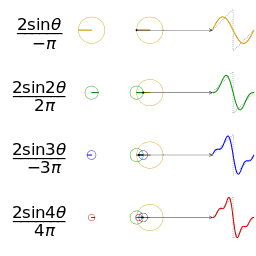

# Fourier

## Table of Contents

- [Fourier](#fourier)
  - [Table of Contents](#table-of-contents)
- [傅里叶分析之掐死教程(直观理解) - 知乎](#傅里叶分析之掐死教程直观理解---知乎)
- [Visualization of Fourier Transforms](#visualization-of-fourier-transforms)
- [3B1B - Fourier Transform? A visual introduction](#3b1b---fourier-transform-a-visual-introduction)
- [DR\_CAN - 纯干货数学推导 傅里叶级数 \& 傅里叶变换](#dr_can---纯干货数学推导-傅里叶级数--傅里叶变换)
- [FT \& DTFT \& DFT \& FFT](#ft--dtft--dft--fft)
- [Convolution 卷积](#convolution-卷积)

---

# 傅里叶分析之掐死教程(直观理解) - 知乎

[傅里叶分析之掐死教程 - 知乎](https://zhuanlan.zhihu.com/p/19763358)

**Fourier Analysis**

1. Fourier Series - **将 时域的 周期连续信号 变为 频域的非周期离散信号**
2. Fourier Transform - **将 时域的非周期连续信号 变为 频域的非周期连续信号**

类比 - 时域(音频信号，随时间变化) & 频域(乐谱，音符恒定不变)

任何周期函数，都可以看作是不同振幅(amplitude)、相位(offset/phase)、角频率$\omega$(rotation speed) 正弦波的叠加(正弦波 包含 sin & cos)

零频率 - $\cos(0t)$ -> 周期无限长的波(直线) -> 直流分量(仅控制整体 上移/下移)，不改变波的形状

 

近似 矩形波 在 时域 & 频域(频谱) 的样子

滤波 在 频域 中容易做到(去除频谱中的竖线)

**傅里叶级数**
1. 本质 - **将 时域的 周期连续信号 变为 频域的非周期离散信号**(分解成无限多 离散的 正弦波)，但是大多数信号 并不是周期的
2. 可以在展示 时域、频域 的同时 展示 相位(相位谱) - (粉色的点只标注了波峰距离频率轴的距离，并不是相位) - **时间差 != 相位差**，时间差 = 相位差除以角频率。 推导 - **$A · \sin(\omega t + \phi) = A · \sin(\omega (t + \frac{\phi}{\omega}))$**

   

**傅里叶变换**
1. 本质 - **将 时域的非周期连续信号 变为 频域的非周期连续信号**
2. 傅里叶变化 **复频域** 图像 (无限多 连续的 螺旋线 构成)

    (仅展示 正频率 螺旋线(逆时针))

   1. 投影到实数空间

      

3. 计算上 **求和$\sum$ 变成 积分$\int$**
4. [Euler's Formula 欧拉公式](https://en.wikipedia.org/wiki/Euler%27s_formula)
   1. **$e^{i \pi} + 1 = 0$**
   2. **$e^{i x} = \cos x + i \sin x$**
   3. **$e^{- i x} = \cos x - i \sin x$**
   4. **$\cos x = \frac{e^{i x} + e^{- i x}}{2}$**
   5. 沿着时间轴正方向看去，正频率 逆时针旋转，负频率 顺时针旋转

   

---

# Visualization of Fourier Transforms

[An Interactive Introduction to Fourier Transforms - Visualization](https://www.jezzamon.com/fourier/zh-cn.html)

[An Interactive Introduction to Fourier Transforms - Github](https://github.com/Jezzamonn/fourier)

**Euler's Formula**

**Epicycle - 周转圆**
1. 3D sine wave ≈ complex sinusoids ≈ spirals
2. Drawing with/without **Time dimension**

   

**Image Processing with Fourier Transform**
1. 水平 & 数值 图案

    

2. 将图像分解为 一系列 二维 正弦波 图案

    

**Fourier Transform Formula**

---

# 3B1B - Fourier Transform? A visual introduction

[3B1B - Fourier Transform? A visual introduction](https://www.3blue1brown.com/lessons/fourier-transforms)

复数域缠绕机器

复数域 $e^{-i2\pi f t}$(注意 - 号)， $f$ 大小 表现为 缠绕速度(频率) 快慢，缠绕频率决定了缠绕图像的样子，$f$ 正/负 代表 顺/逆 时针 缠绕方向

$e^{i2\pi \omega t}$ 乘以 原始信号 相当于是以不同速度(频率) 将原始信号缠绕在 复数域原点周围 。离原点远 表示 原始信号值大，离原点近 表示原始信号值小

$$\text{Center of Mass} = \frac{1}{t_2 - t_1} \int_{t_1}^{t_2} g(t) e^{-i 2 \pi f t} dt$$

求 缠绕图像的重心位置 相当于 求和再平均
1. 所以找到 重心最远的位置 就是 Fourier Transform 后，对应频率分量的 能量 最大的地方
2. 最开始的 重心大尖峰 是 直流分量(缠绕速度低，都挤在一起，相当于都×1) & 上移过的波函数(恒非负) 共同作用，当还原为正弦波函数时，尖峰消失

   

时域的 Sum 可以对应 频域的 Sum

---

# DR_CAN - 纯干货数学推导 傅里叶级数 & 傅里叶变换

[DR_CAN - 纯干货数学推导_傅里叶级数与傅里叶变换](https://space.bilibili.com/230105574/channel/collectiondetail?sid=1814755)

**三角函数正交性**
1. 三角函数系 - {0 (sin 0x), **1** (cos 0x), sin x, cos x, sin 2x, cos 2x, ..., sin nx, cos nx, ...}

2. 正交系满足性质

   $$\left\{\begin{matrix}
      \int_{-\pi}^{+\pi} f_m(x) f_n(x) dx = 0 (m \neq n) \\
      \int_{-\pi}^{+\pi} f_m(x) f_n(x) dx = \pi (m = n)
      \end{matrix}\right.$$

**Euler Formula 欧拉公式 证明**
1. 表达形式 $e^{i \theta} = \cos \theta + i \sin \theta$
2. 任何复数可表示为 $z = r · e^{i \theta} = r \cos \theta + i r \sin \theta$
3. 构造 分式 函数 (分子分母 分别为 公式左右)

   $$f(\theta) = \frac{e^{i \theta}}{\cos \theta + i \sin \theta}$$

4. 对 构造的函数 进行求导(分子可以抵消)

   $$\begin{aligned}
      f^{\prime}(\theta) & =\frac{i e^{i \theta}(\cos \theta + i \sin \theta)-e^{i \theta}(-\sin \theta + i \cos \theta)}{(\cos \theta + i \sin \theta)^{2}} \\
      & =\frac{i e^{i \theta} \cos \theta - e^{i \theta} \sin \theta + e^{i \theta} \sin \theta - i e^{i \theta} \cos \theta}{(\cos \theta + i \sin \theta)^{2}} \text{ (分子抵消了)}\\
      & = 0
      \end{aligned}$$

5. $f^{\prime}(\theta) = 0$ 说明 $f(\theta)$ 为常数。 将 $\theta = 0$ 带入 构造的函数 得 $f(\theta) == 1$，即证明成功

**Fourier Series**
1. 周期性函数 $f(t)$ 可以变换为 一系列 正(余)弦函数
2. 变换后得到 : 频率、频域幅值、相位
3. 标准正交基(与自己内积=1，与别人内积=0) : $1$, $\sin(n \omega t)$, $\cos(n \omega t)$
4. **$T = 2 \pi$** 的 周期函数 展开为 傅里叶级数，$\frac{a_0}{2}$ 是为了方便 套用相同系数计算公式
   1. $$f(x) = \frac{a_0}{2} + \sum_{n=1}^{\infty}a_n \cos(n x) + \sum_{n=1}^{\infty}b_n \sin(n x)$$
   2. $$\left\{\begin{matrix}
         a_n = \frac{1}{\pi} \int_{-\pi}^{\pi} f(x) \cos(nx) dx \\
         b_n = \frac{1}{\pi} \int_{-\pi}^{\pi} f(x) \sin(nx) dx
         \end{matrix}\right.$$

5. **$T = 2 L$** 的 周期函数 展开为 傅里叶级数，使用换元法 令 $t = \frac{L}{\pi}x, x=\frac{\pi}{L}t$
   1. $$\begin{align*}
      f(t) = f(\frac{L}{\pi}x) & = g(x)  \text{  ( 此处 g(x) 周期为 2π )}\\
      & = \frac{a_0}{2} + \sum_{n=1}^{\infty}a_n \cos(n x) + \sum_{n=1}^{\infty}b_n \sin(n x) \\
      & = \frac{a_0}{2} + \sum_{n=1}^{\infty}a_n \cos(n \frac{\pi}{L} t) + \sum_{n=1}^{\infty}b_n \sin(n \frac{\pi}{L} t)
      \end{align*}$$

   2. $$\left\{\begin{matrix}
            \begin{align*}
            a_n =& \frac{1}{\pi} \int_{-\pi}^{\pi} g(x) \cos(nx) dx \\
            =& \frac{1}{L} \int_{-L}^{L} f(t) \cos(n \frac{\pi}{L}t) dt
            \end{align*}
         \\
            \begin{align*}
            b_n =& \frac{1}{\pi} \int_{-\pi}^{\pi} g(x) \sin(nx) dx \\
            =& \frac{1}{L} \int_{-L}^{L} f(t) \sin(n \frac{\pi}{L}t) dt
            \end{align*}
         \end{matrix}\right.$$

6. 工程上 $T = 2L$, $\omega = \frac{\pi}{L} = \frac{2\pi}{T}$
   1. $$f(t) = \frac{a_0}{2} + \sum_{n=1}^{\infty}a_n \cos(n \omega t) + \sum_{n=1}^{\infty}b_n \sin(n \omega t)$$
   2. $$\left\{\begin{matrix}
         a_n = \frac{2}{T} \int_{0}^{T} f(t) \cos(n \omega t) dt \\
         b_n = \frac{2}{T} \int_{0}^{T} f(t) \sin(n \omega t) dt
         \end{matrix}\right.$$

7. 复数形式 Fourier Series
   1. 带入 **Euler Formula** 转为 **复数**形式
      $$\left\{
         \begin{align*}
         \cos \theta =& \frac{1}{2} (e^{i \theta} + e^{-i \theta}) \\
         \sin \theta =& - i \frac{1}{2} (e^{i \theta} - e^{-i \theta})
         \end{align*}
         \right.$$
   2. $$\begin{aligned}
      f(t)
      & =\frac{a_0}{2} \
         +\sum_{n=1}^{\infty} \left[
            a_n \frac{1}{2} (e^{i n \omega t} + e^{-i n \omega t})
            - b_n i \frac{1}{2}  (e^{i n \omega t} - e^{-i n \omega t})
         \right] \\
      & =\frac{a_0}{2} \
         +\sum_{n=1}^{\infty} \left[
            \frac{a_n - i b_n}{2} e^{i n \omega t}
            + \frac{a_n + i b_n}{2} e^{-i n \omega t}
         \right] \\
      & =\frac{a_0}{2} \
         +\sum_{n=1}^{\infty} \frac{a_n - i b_n}{2} e^{ i n \omega t}
         +\underbrace{\sum_{n=1}^{\infty} \frac{a_n + i b_n}{2} e^{-i n \omega t}}_{\text{令该部分 n = -n}}\\
      & =\underbrace{\sum_{n=0}^{0} \frac{a_0}{2} e^{i n \omega t}}_{n=0, e^{i n \omega t}=1}
         +\sum_{n=1}^{+\infty} \frac{a_{n}-i b_{n}}{2} e^{i n \omega t}
         +\sum_{n=-\infty}^{-1} \frac{a_{-n} + i b_{-n}}{2} e^{i n \omega t} \\
      & =\sum_{n=-\infty}^{+\infty} C_n e^{i n \omega t}
      \end{aligned}$$
   3. $$C_n=\left\{\begin{array}{ll}
         \frac{a_0}{2},        & n=0 \\
         \frac{a_n - i b_n}{2},  & n=1,2,3,4 \cdots \\
         \frac{a_{-n} + i b_{-n}}{2},    & n=-1,-2,-3,-4 \cdots
         \end{array}\right.$$
      1. 将 $a_n = \frac{2}{T} \int_{0}^{T} f(t) \cos(n \omega t) dt$ & $b_n = \frac{2}{T} \int_{0}^{T} f(t) \sin(n \omega t) dt$ 带入
      2. $$\begin{align*}
            \underset{n=0}{C_n}
               &=\frac{a_{0}}{2}\\
               &=\frac{1}{2} \frac{2}{T} \int_{0}^{T} f(t) · 1 dt\\
               &=\frac{1}{T} \int_{0}^{T} f(t) \underbrace{e^{-i n \omega t}}_{n=0, e^{-i n \omega t} = 1}dt \\
            \underset{n=+1,+2,+3, \cdots}{C_n}
               &=\frac{1}{2}\left(\frac{2}{T} \int_{0}^{T} f(t) \cos(n \omega t) dt
                  - i \frac{2}{T} \int_{0}^{T} f(t) \sin(n \omega t) dt \right) \\
               &=\frac{1}{T} \int_{0}^{T} f(t)\underbrace{(\cos(n \omega t) - i \sin(n \omega t))}_{=\cos (-n \omega t) + i \sin (- n \omega t)} dt \\
               &=\frac{1}{T} \int_{0}^{T} f(t) e^{-i n \omega t} dt \\
            \underset{n=-1,-2,-3, \cdots}{C_n}
               &=\frac{1}{2}\left(\frac{2}{T} \int_{0}^{T} f(t) \cos (-n \omega t) dt
                  + i \frac{2}{T} \int_{0}^{T} f(t) \sin (-n \omega t) dt\right)\\
               &=\frac{1}{T} \int_{0}^{T} f(t)\underbrace{(\cos(n \omega t) - i \sin(n \omega t))}_{=\cos (-n \omega t) + i \sin (- n \omega t)} dt\\
               &=\frac{1}{T} \int_{0}^{T} f(t) e^{-i n \omega t} dt
            \end{align*}$$
   4. 综上所述 可得 复数形式的 Fourier Series
      1. 复数形式的 Fourier Series (式中 $\omega = \frac{2 \pi}{T}$ 为 **基频率**)
         $$f_T(t) = f(t + T) = \sum_{n=-\infty}^{+\infty} C_n e^{i n \omega t}$$
      2. $C_n = a + i b$ 是 复数
         $$C_n=\frac{1}{T} \int_{-\frac{T}{2}}^{\frac{T}{2}} f_T(t) e^{-i n \omega t}dt$$

8. **Fourier Transform (from Fourier Series)**
   1. 对于**非周期**，可以理解为 周期无限长 $T \rightarrow +\infty$， 同时 $\lim_{x \to 0} f_T(t) = f(t)$
   2. 对于 Fourier Series，$\Delta \omega = \omega_0 = \frac{2 \pi}{T}$ 为 **基频率**，$\lim_{T \to +\infty} \Delta \omega = 0$，即 频谱之间的距离越来越小，离散 -> 连续
   3. 复数形式的 傅里叶级数 将 $C_n$ 代入 $f_T(t)$

      $$f_T(t) = \sum_{n=-\infty}^{+\infty} \frac{1}{T} \int_{-\frac{T}{2}}^{\frac{T}{2}} f_T(t) e^{-i n \omega t} dt e^{i n \omega t}$$

   4. 由 $\Delta \omega = \omega_0 = \frac{2 \pi}{T}$ 可得 $\frac{1}{T} = \frac{\Delta \omega}{2 \pi}$，代入上式

      $$f_T(t) = \sum_{n=-\infty}^{+\infty} \frac{\Delta \omega}{2 \pi} \int_{-\frac{T}{2}}^{\frac{T}{2}} f_T(t) e^{-i n \omega t} dt e^{i n \omega t}$$

   5. $T \rightarrow +\infty$ 时
      1. $\int_{-\frac{T}{2}}^{\frac{T}{2}} dt$ 转为 $\int_{-\infty}^{+\infty} dt$
      2. $n \omega_0$ = $\omega$ (频谱从离散变为连续)
      3. $\sum_{n=-\infty}^{+\infty} \Delta \omega$ 转为 $\int_{-\infty}^{+\infty} d\omega$ (积分的意义)

   5. 综上可得
      $$f(t) = \frac{1}{2 \pi} \int_{-\infty}^{+\infty} \int_{-\infty}^{+\infty} f(t)e^{-i \omega t} \ dt \ e^{i \omega t} d\omega$$
      1. **傅里叶 变换** (结果为复数 (模 = 幅值Amplitude， 角度 = 相位Phase))
         $$F(\omega) = \int_{-\infty}^{+\infty} f(t)e^{-i \omega t} \ dt$$
      2. **傅里叶 逆变换**
         $$f(t) = \frac{1}{2 \pi} \int_{-\infty}^{+\infty} F(\omega) \ e^{i \omega t} d\omega$$

---

# FT & DTFT & DFT & FFT

FT - 连续时间连续频率
1. $X(f)=\int_{-\infty}^{+\infty} x(t) · e^{-i 2 \pi f t}  dt$

DTFT - 离散时间连续频率
1. $X(f)=\sum_{n=-\infty}^{+\infty} x(n) · e^{-i 2 \pi f n}$
   1. **n** - 离散**时间**索引

DFT - 离散时间离散频率
1. $X(k)=\sum_{n=0}^{N-1} x(n) · e^{-i 2 \pi \frac{k}{N} n} (k=0,1,2, \cdots, N-1)$
   1. **n** - 离散**时间**索引
   2. **k** - 离散**频率**索引

FFT

$$\operatorname{comb}(t)=\sum_{n=-\infty}^{\infty} \delta(t-n T)$$

Discrete Fourier Transform : DFT (离散傅里叶变换)

# Convolution 卷积

[内积 到 卷积 再到 傅里叶变换](https://www.bilibili.com/video/BV1Jz421f73L/)

$h(t) = \int f(\tau) · g(t-\tau) d\tau$
1. 连续函数的内积
2. 改变 $t$ 相当于 将 $g(-\tau)$ 滑动
3. 令 $G(\tau) = g(-\tau)$, $h(t) = \int f(\tau) · G(t+\tau) d\tau$, 省去翻转操作

