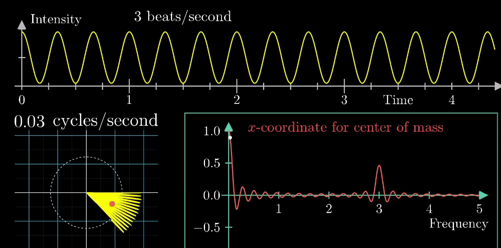

# Fourier

## Table of Contents

- [Fourier](#fourier)
  - [Table of Contents](#table-of-contents)
- [傅里叶分析之掐死教程(直观理解) - 知乎](#傅里叶分析之掐死教程直观理解---知乎)
- [Visualization of Fourier Transforms](#visualization-of-fourier-transforms)

---

# 傅里叶分析之掐死教程(直观理解) - 知乎

[傅里叶分析之掐死教程 - 知乎](https://zhuanlan.zhihu.com/p/19763358)

**Fourier Analysis**

1. Fourier Series - **将 时域的 周期连续信号 变为 频域的非周期离散信号**
2. Fourier Transform - **将 时域的非周期连续信号 变为 频域的非周期连续信号**

类比 - 时域(音频信号，随时间变化) & 频域(乐谱，音符恒定不变)

任何周期函数，都可以看作是不同振幅(amplitude)、相位(offset/phase)、角频率$\omega$(rotation speed) 正弦波的叠加(正弦波 包含 sin & cos)

零频率 - $\cos(0t)$ -> 周期无限长的波(直线) -> 直流分量(仅控制整体 上移/下移)，不改变波的形状

 

近似 矩形波 在 时域 & 频域(频谱) 的样子

滤波 在 频域 中容易做到(去除频谱中的竖线)

**傅里叶级数**
1. 本质 - **将 时域的 周期连续信号 变为 频域的非周期离散信号**(分解成无限多 离散的 正弦波)，但是大多数信号 并不是周期的
2. 可以在展示 时域、频域 的同时 展示 相位(相位谱) - (粉色的点只标注了波峰距离频率轴的距离，并不是相位) - **时间差 != 相位差**，时间差 = 相位差除以角频率。 推导 - **$A · \sin(\omega t + \phi) = A · \sin(\omega (t + \frac{\phi}{\omega}))$**

   

**傅里叶变换**
1. 本质 - **将 时域的非周期连续信号 变为 频域的非周期连续信号**
2. 傅里叶变化 **复频域** 图像 (无限多 连续的 螺旋线 构成)

    (仅展示 正频率 螺旋线(逆时针))

   1. 投影到实数空间

      

3. 计算上 **求和$\sum$ 变成 积分$\int$**
4. [Euler's Formula 欧拉公式](https://en.wikipedia.org/wiki/Euler%27s_formula)
   1. **$e^{i \pi} + 1 = 0$**
   2. **$e^{i x} = \cos x + i \sin x$**
   3. **$e^{- i x} = \cos x - i \sin x$**
   4. **$\cos x = \frac{e^{i x} + e^{- i x}}{2}$**
   5. 沿着时间轴正方向看去，正频率 逆时针旋转，负频率 顺时针旋转

   

---

# Visualization of Fourier Transforms

[3B1B - Fourier Transform? A visual introduction](https://www.3blue1brown.com/lessons/fourier-transforms)

[An Interactive Introduction to Fourier Transforms - Visualization](https://www.jezzamon.com/fourier/zh-cn.html)

[An Interactive Introduction to Fourier Transforms - Github](https://github.com/Jezzamonn/fourier)

**Euler's Formula**

**Epicycle - 周转圆**
1. 3D sine wave ≈ complex sinusoids ≈ spirals
2. Drawing with/without **Time dimension**
   

**Image Processing with Fourier Transform**
1. 水平 & 数值 图案

    

2. 将图像分解为 一系列 二维 正弦波 图案

    

**Fourier Transform Formula**

**3B1B**
1. 复数域缠绕机器

   

2. 复数域 $e^{-i2\pi f t}$(注意 - 号)， $f$ 大小 表现为 缠绕速度(频率) 快慢，缠绕频率决定了缠绕图像的样子，$f$ 正/负 代表 顺/逆 时针 缠绕方向
3. $e^{i2\pi \omega t}$ 乘以 原始信号 相当于是以不同速度(频率) 将原始信号缠绕在 复数域原点周围 。离原点远 表示 原始信号值大，离原点近 表示原始信号值小
4. 求 缠绕图像的重心位置 相当于 求和再平均
5. 所以找到 重心最远的位置 就是 Fourier Transform 后，对应频率分量的 能量 最大的地方
6. 最开始的 重心大尖峰 是 直流分量(缠绕速度低，都挤在一起，相当于都×1) & 上移过的波函数(恒非负) 共同作用，当还原为正弦波函数时，尖峰消失

   

7. 时域的 Sum 可以对应 频域的 Sum

   

8. $\text{Center of Mass} = \frac{1}{t_2 - t_1} \int_{t_1}^{t_2} g(t) e^{-i 2 \pi f t} dt$
