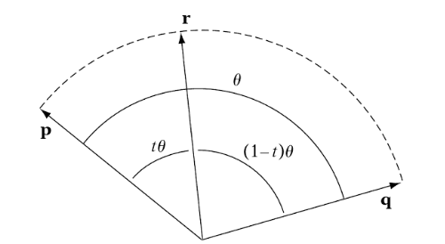
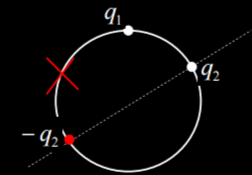

# Interpolation 插值

## Table of Contents

- [Interpolation 插值](#interpolation-插值)
  - [Table of Contents](#table-of-contents)
- [lerp (Linear Interpolation, 线性插值)](#lerp-linear-interpolation-线性插值)
- [slerp (Spherical Linear Interpolation, 球面线性插值)](#slerp-spherical-linear-interpolation-球面线性插值)
- [适用情况](#适用情况)
- [机器人中的插值](#机器人中的插值)

---

# lerp (Linear Interpolation, 线性插值)

两个点之间沿直线 进行 平滑过渡

公式 (起始值 $v_0$，结束值 $v_1$，插值参数 $t \in [0, 1]$)
1. $$t = \frac{v_t - v_0}{v_1 - v_0}$$
2. $$v_t = (1 - t)v_0 + t v_1$$
3. $$v_t = v_0 + t(v_1 - v_0)$$

如果对 rotation matrix 进行 lerp，会破坏 正交性，因此 旋转 使用 单位四元数 的 slerp

---

# slerp (Spherical Linear Interpolation, 球面线性插值)

在球面上 **沿 最短圆弧** 进行 插值，保证 插值过程中 **角速度恒定**

常用于处理 3D 旋转(eg : quaternion)

推导
1. 已知条件
   1. 
   2. **$p$** & **$q$** 是 单位四元数 / 单位向量，它们之间的夹角为 $\theta$
   3. **$r$** 是插值结果，位于 $p$ 和 $q$ 构成的平面上，**$t$** 是插值比例 ($0 \le t \le 1$)
   4. $r$ 与 $p$ 的夹角为 $t\theta$
   5. $r$ 与 $q$ 的夹角为 $(1-t)\theta$
2. $r$ 可以由 $p$ & $q$ 线性组合 表示(因为 在同一平面)，$r(t) = a(t)p + b(t)q$
3. 点积 构建方程组
   1. 等式 两边 同乘 $p$ 可得，$p \cdot r = a(p \cdot p) + b(p \cdot q) = a + bpq = a + b \cos(\theta) = \cos(t \theta)$
   2. 等式 两边 同乘 $q$ 可得，$q \cdot r = a(q \cdot p) + b(q \cdot q) = apq + b = a \cos(\theta) + b = \cos((1 - t) \theta)$
4. 联立求解可得
   1. $$a = \frac{\sin[(1-t)\theta]}{\sin\theta}$$
   2. $$b = \frac{\sin(t\theta)}{\sin\theta}$$
5. 最终
   1. $$\text{slerp}(p, q, t) = \frac{\sin[(1-t)\theta]}{\sin\theta}p + \frac{\sin(t\theta)}{\sin\theta}q$$

特殊情况
1. 小角度退化
   1. 现象 : 当 $p$ 和 $q$ 非常接近时($\theta \approx 0$)，$\sin\theta$ 会趋近于 0，做除法时 会导致数值爆炸
   2. 解决方案 : 角度很小时，球面近似于平面，直接改用 线性插值(Lerp)
2. 最短路径(Shortest Path)
   1. **四元数特性** : $q$ 和 $-q$ 代表 完全相同的 旋转姿态
   2. 现象
      1. 
   3. 解决方案 : 如果点积是负数，把其中一个向量取反(不会改变 代表的旋转姿态)

---

# 适用情况

可 线性插值
1. 笛卡尔坐标位置 (Cartesian Position)
2. **有范围限制**的关节角度 (非循环)
3. **世界坐标系** 下的 向量 (欧几里得向量，eg : 位置 & 速度 & 力，P.S. **四元数除外**)
   1. 在绝对坐标系下，力的合成和速度的合成遵循平行四边形定则
   2. 平行四边形定则 在任何坐标系下瞬间都是成立的，但 插值 涉及到 时间跨度
4. 标量 (Scalars)
   1. eg : 关节角速度(无需考虑周期性)

不可 线性插值
1. 旋转/姿态 (Quaternions / Rotation Matrices)
   1. 线性插值会破坏 **归一化**($x^2+y^2+z^2+w^2=1$)
   2. **正确做法** : slerp (Spherical Linear Interpolation)
2. **身体坐标系** 下的 向量
   1. **正确做法** : body → world，线性插值，world → body
3. **周期性角度** (Cyclic Angles)
   1. eg : 359° → 1°，线性插值 (359° + 1°) / 2 = 180°，实际期望 0°
   2. **正确做法** : 最短弧长插值(Shortest Path Interpolation)

# 机器人中的插值

机器人
1. `root_lin_vel` & `root_ang_vel` : body -> world + lerp + world -> body，使用 rotation mat / quaternion 即可，速度 是向量(没有基准点)
2. `foot_pos` : lerp，本身就在 body frame 下，不关心 全局平移 (其实也可以 `to world` + `lerp` + `to body`)
3. `foot_vel` :
   1. body -> world : 公式参考 [机器人学(林沛群) - 个人笔记](../../Robotics/KinematicsKinetics/LinPeiQun.md#05---jacobian--velocities-and-static-forces)
   2. lerp
   3. world -> body : 中间的计算 都是使用 **插值的结果** 带入，公式同 body -> world，只是 未知量 变了(移项)
4. `joint_pos` & `joint_vel` : 逐 joint 进行 lerp (非周期性 joint，pos 使用 普通 lerp 即可，vel 不受 是否周期性 影响)
5. `root_pos` : lerp，本身就在 world frame
6. `root_quat` : slerp，本身就在 world frame
7. `projected_gravity` : slerp，projected_gravity 只是一个方向，**没有 平移效应**，只需要在 同一坐标系插值即可

