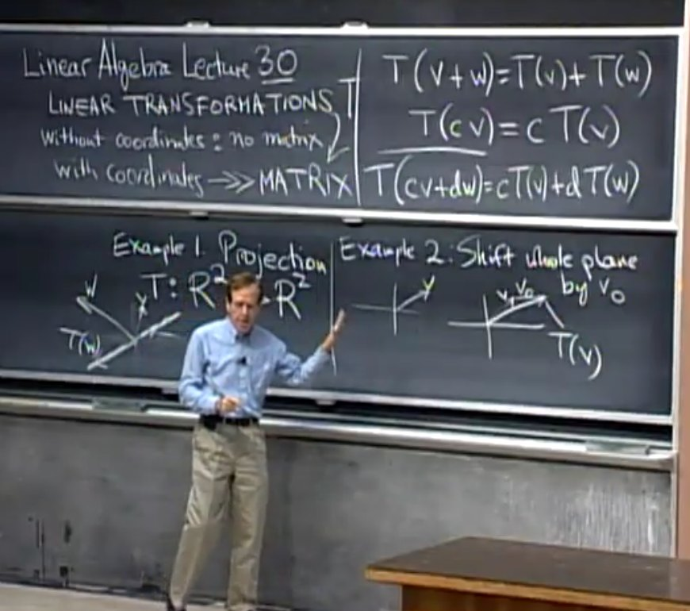

## Table of Contents

- [MIT 18.06 Linear Algebra - Gilbert Strang](#mit-1806-linear-algebra---gilbert-strang)
- [01: Introduction to Linear Algebra](#01-introduction-to-linear-algebra)
- [02: Elimination with Matrices](#02-elimination-with-matrices)
  - [03:](#03)
  - [03:](#03-1)
  - [04:](#04)
  - [05:](#05)
  - [06:](#06)
  - [07:](#07)
  - [08:](#08)
  - [09:](#09)
  - [10:](#10)
  - [11:](#11)
  - [12:](#12)
  - [13:](#13)
  - [14:](#14)
  - [15:](#15)
  - [16:](#16)
  - [17:](#17)
  - [18:](#18)
  - [19:](#19)
  - [20:](#20)
  - [21:](#21)
  - [22:](#22)
- [Latex Template](#latex-template)

---

# MIT 18.06 Linear Algebra - Gilbert Strang

[Linear Algebra - MIT OpenCourseWare](https://ocw.mit.edu/courses/18-06-linear-algebra-spring-2010/)

[18.06 Linear Algebra](https://web.mit.edu/18.06)

[Github](https://github.com/mitmath/1806)

# 01: Introduction to Linear Algebra

**Row Picture**
1. 每一**行**是一个**方程**
2. 解方程组 = 几何上找向量交点

**Col Picture**
1. 系数矩阵(Coefficient Matrix) 每一**列**当做**向量**
2. 解方程组 = 用未知数 线性组合(linear combination) 系数矩阵的列 得到 目标向量
3. 如果有列向量是多余的(没有贡献)，则会导致 All Linear Combination 无法充满整个空间

**==矩阵 & 向量 相乘==**
1. **矩阵 × 列向量 = 列向量**
   1. 矩阵各 **列** 按照向量 线性组合 - **矩阵列变换**
2. **行向量 × 矩阵 = 行向量**
   1. 矩阵各 **行** 按照向量 线性组合 - **矩阵行变换**

# 02: Elimination with Matrices

主元 Pivot - 不能为0(如果不能满足，则消元失效，矩阵不可逆)

Elimination 是消除其他行中的上方有主元的元素

回带 Back Substitution
1. 将 增广矩阵 的最后一列 做和 系数矩阵 消元时 相同的变换
2. 转回 方程形式 并 求解

消元矩阵(Elimination Matrices)
1. **左乘** 在系数矩阵/增广矩阵 上，相当于进行行变化

**矩阵拥有 结合律(Associative Law)** - 括号可以前后移动，即 $(AB)C = A(BC)$

**置换矩阵 (Permutation Matrix)**

$$
\begin{bmatrix}
0 & 1 \\
1 & 0
\end{bmatrix} \
\times \
\begin{bmatrix}
a & b \\
c & d
\end{bmatrix}\
=\
\begin{bmatrix}
c & d \\
a & b
\end{bmatrix}
$$

$$
\begin{bmatrix}
a & b \\
c & d
\end{bmatrix}\
\times\
\begin{bmatrix}
0 & 1 \\
1 & 0
\end{bmatrix}\
=\
\begin{bmatrix}
b & a \\
d & c
\end{bmatrix}
$$

## 03:

**逆矩阵 (Inverse Matrix) $A^{-1}$**

## 03:
## 04:
## 05:
## 06:
## 07:
## 08:
## 09:
## 10:
## 11:
## 12:
## 13:
## 14:
## 15:
## 16:
## 17:
## 18:
## 19:
## 20:
## 21:
## 22:

# Latex Template

**3x3 matrix**
$$
\begin{bmatrix}
1 & 2 & 3\\
4 & 5 & 6\\
7 & 8 & 9
\end{bmatrix}
$$

**1x3 matrix**
$$
\begin{bmatrix}
1 & 2 & 3
\end{bmatrix}
$$

**3x1 matrix**
$$
\begin{bmatrix}
1 \\
2 \\
3
\end{bmatrix}
$$

**3x3 determinant**
$$
\begin{vmatrix}
1 & 2 & 3\\
4 & 5 & 6\\
7 & 8 & 9
\end{vmatrix}
$$

