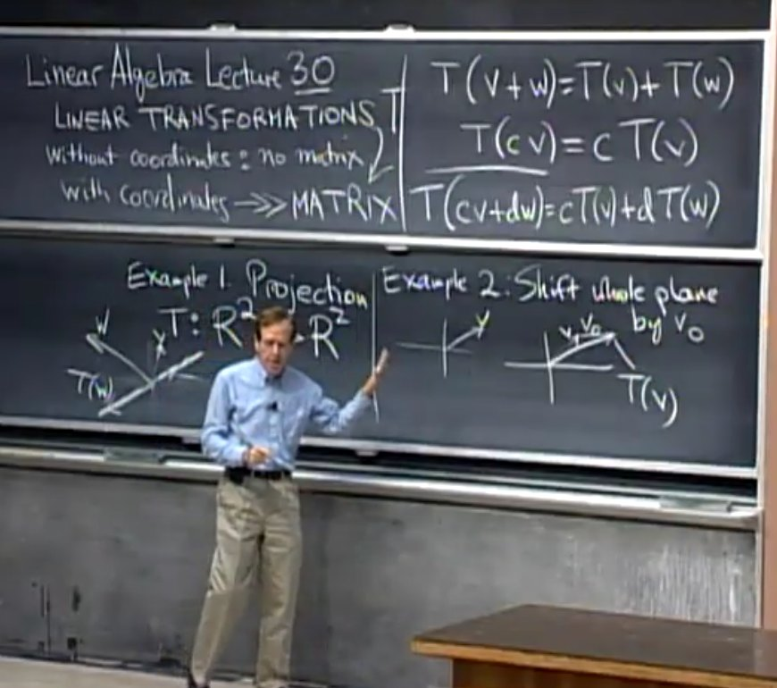

# MIT 18.06 Linear Algebra - Gilbert Strang

[18.06 Linear Algebra - Website](https://web.mit.edu/18.06)

[Linear Algebra - MIT OpenCourseWare](https://ocw.mit.edu/courses/18-06-linear-algebra-spring-2010/)

[Github](https://github.com/mitmath/1806)

[在线Latex公式编辑器](https://www.latexlive.com/)

## Table of Contents

- [MIT 18.06 Linear Algebra - Gilbert Strang](#mit-1806-linear-algebra---gilbert-strang)
  - [Table of Contents](#table-of-contents)
- [01 - Introduction to Linear Algebra](#01---introduction-to-linear-algebra)
- [02 - Elimination with Matrices](#02---elimination-with-matrices)
  - [03 - Multiplication and Inverse Matrices](#03---multiplication-and-inverse-matrices)
  - [04](#04)
  - [05](#05)
  - [06](#06)
  - [07](#07)
  - [08](#08)
  - [09](#09)
  - [10](#10)
  - [11](#11)
  - [12](#12)
  - [13](#13)
  - [14](#14)
  - [15](#15)
  - [16](#16)
  - [17](#17)
  - [18](#18)
  - [19](#19)
  - [20](#20)
  - [21](#21)
  - [22](#22)
  - [23](#23)
  - [24](#24)
  - [25](#25)
  - [26](#26)
  - [27](#27)
  - [28](#28)
  - [29](#29)
  - [30](#30)
- [Latex Template](#latex-template)

---

# 01 - Introduction to Linear Algebra

**Row Picture**

1. 每一**行**是一个**方程**
2. 解方程组 = 几何上找向量交点

**Col Picture**

1. 系数矩阵(Coefficient Matrix) 每一**列**当做**向量**
2. 解方程组 = 用未知数 线性组合(linear combination) 系数矩阵的列 得到 目标向量
3. 如果有列向量是多余的(没有贡献)，则会导致 All Linear Combination 无法充满整个空间

**==矩阵 & 向量 相乘==**

1. **矩阵 × 列向量 = 列向量**
   1. 矩阵各 **列** 按照向量 线性组合 - **矩阵列变换**
2. **行向量 × 矩阵 = 行向量**
   1. 矩阵各 **行** 按照向量 线性组合 - **矩阵行变换**

# 02 - Elimination with Matrices

**主元 Pivot** - 不能为0(如果不能满足，则消元失效，矩阵不可逆)

**Elimination** 是消除其他行中的上方有主元的元素

**回带 Back Substitution**

1. 将 增广矩阵 的最后一列 做和 系数矩阵 消元时 相同的变换
2. 转回 方程形式 并 求解

**消元矩阵(Elimination Matrices)**

1. **左乘** 在系数矩阵/增广矩阵 上，相当于进行行变化

**矩阵拥有 结合律(Associative Law)** - 括号可以前后移动，即 $(AB)C = A(BC)$

**置换矩阵 (Permutation Matrix)** 用于交换 行/列

$$
\begin{bmatrix}
0 & 1 \\
1 & 0
\end{bmatrix} \
\begin{bmatrix}
a & b \\
c & d
\end{bmatrix}\
=\
\begin{bmatrix}
c & d \\
a & b
\end{bmatrix}
$$

$$
\begin{bmatrix}
a & b \\
c & d
\end{bmatrix}\
\begin{bmatrix}
0 & 1 \\
1 & 0
\end{bmatrix}\
=\
\begin{bmatrix}
b & a \\
d & c
\end{bmatrix}
$$

## 03 - Multiplication and Inverse Matrices

**矩阵乘法** (**前矩阵列数 = 后矩阵行数** 才能相乘 ，形状 $A_{m\times n}B_{n\times p}=C_{m\times p}$)
1. **常规方法(行×列)** - 逐个元素
   1. $c_{ij} = \sum_{k=1}^{n} a_{ik}*b_{kj}$
2. **列方法**
   1. 按照 右矩阵的列 线性组合 左矩阵各列 得到 结果矩阵对应位置的列
   2. every col of C is combination of cols of A
3. **行方法**
   1. 按照 左矩阵的行 线性组合 右矩阵各行 得到 结果矩阵对应位置的行
   2. every row of C is combination of rows of B
4. **矩阵方法(列×行)**
   1. $AB = \Sigma_{k=1}^{n} A_{:,k}B_{k,:}$
5. **分块乘法**
   1. 乘法逻辑和常规方法类似(行×列)，只是 单个元素 变为 子矩阵
   2. $\begin{bmatrix}
      A_1 & A_2 \\
      A_3 & A_4
      \end{bmatrix}\
      \begin{bmatrix}
      B_1 & B_2 \\
      B_3 & B_4
      \end{bmatrix}\
      =\
      \begin{bmatrix}
      A_1 B_1 + A_2 B_3 & A_1 B_2 + A_2 B_4 \\
      A_3 B_1 + A_4 B_3 & A_3 B_2 + A_4 B_4
      \end{bmatrix}$

**逆矩阵 (Inverse Matrix) $A^{-1}$** - square matrix
1. $A^{-1}  A = I = AA^{-1}$
2. **左逆$A_{left}^{-1}$ = 右逆$A_{right}^{-1}$**(仅对于**方阵**)
   1. 证明: $A_{left}^{-1} = A_{left}^{-1} (A A_{right}^{-1}) = (A_{left}^{-1} A) A_{right}^{-1} = A_{right}^{-1}$
3. invertible 可逆的, non-singular 非奇异
4. 行列式 Determinant(不可逆矩阵) = 0
5. **可以找到 非0 列向量x，使得 Ax=0，则没有逆** 等价于 **如果对于方阵，有 列/行 没有贡献，则没有逆**
6. 求逆可以看作解方程组，因为结果矩阵是确定的，只需要将 结果矩阵 和 右矩阵 按列拆分 几个形成多个方程组
7. **Gauss-Jordan 消元法**

## 04

## 05

## 06

## 07

## 08

## 09

## 10

## 11

## 12

## 13

## 14

## 15

## 16

## 17

## 18

## 19

## 20

## 21

## 22

## 23

## 24

## 25

## 26

## 27

## 28

## 29

## 30

# Latex Template

**3x3 matrix**

$$
\begin{bmatrix}
1 & 2 & 3\\
4 & 5 & 6\\
7 & 8 & 9
\end{bmatrix}
$$

**1x3 matrix**

$$
\begin{bmatrix}
1 & 2 & 3
\end{bmatrix}
$$

**3x1 matrix**

$$
\begin{bmatrix}
1 \\
2 \\
3
\end{bmatrix}
$$

**3x3 determinant**

$$
\begin{vmatrix}
1 & 2 & 3\\
4 & 5 & 6\\
7 & 8 & 9
\end{vmatrix}
$$
