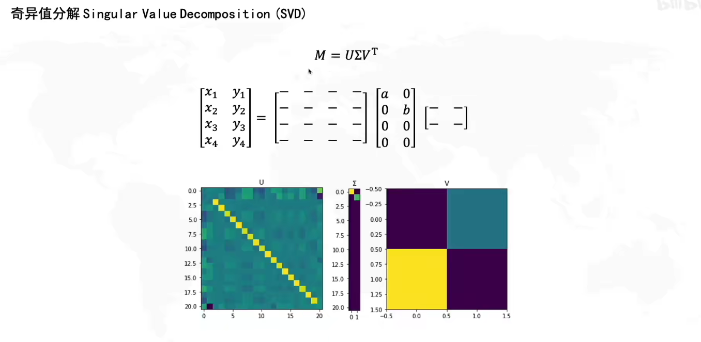
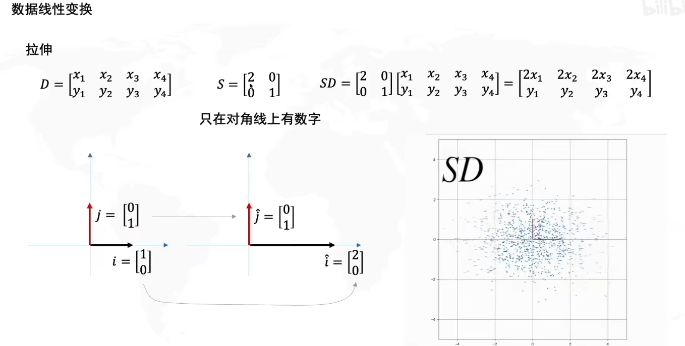
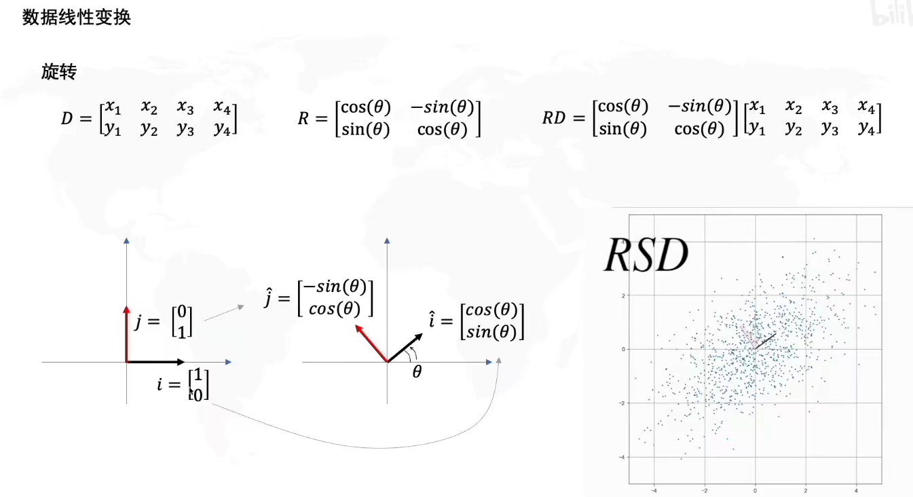
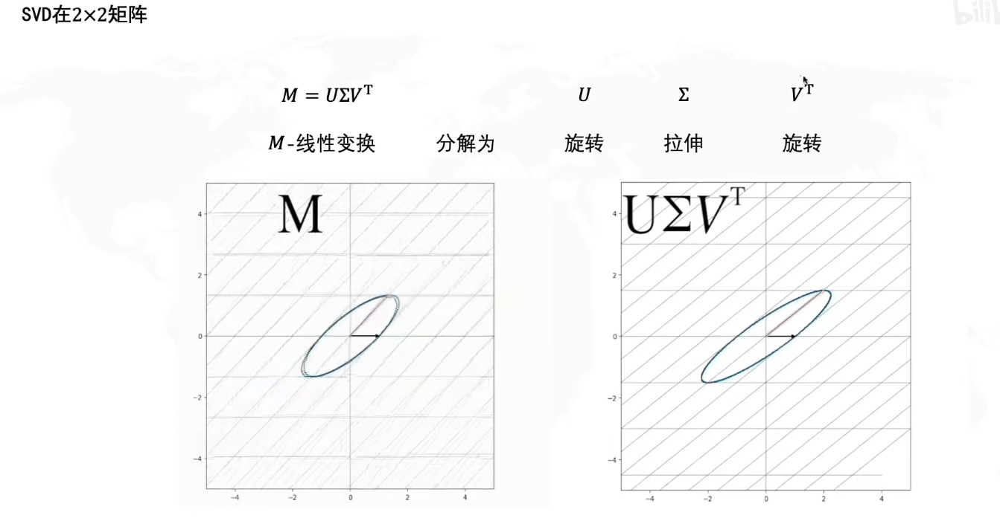
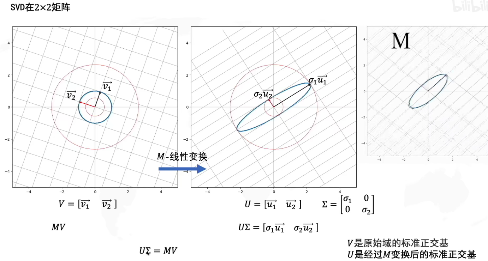
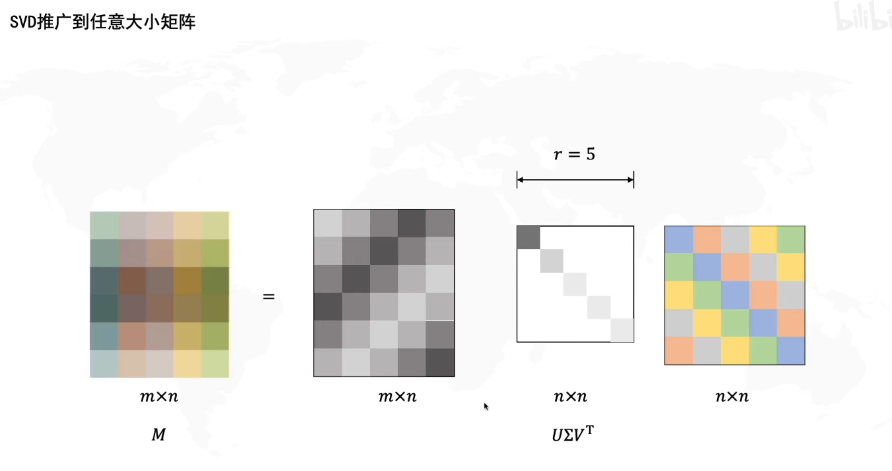
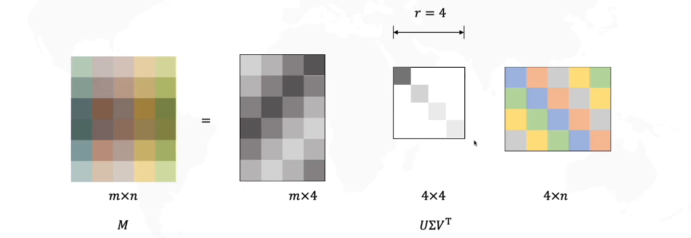
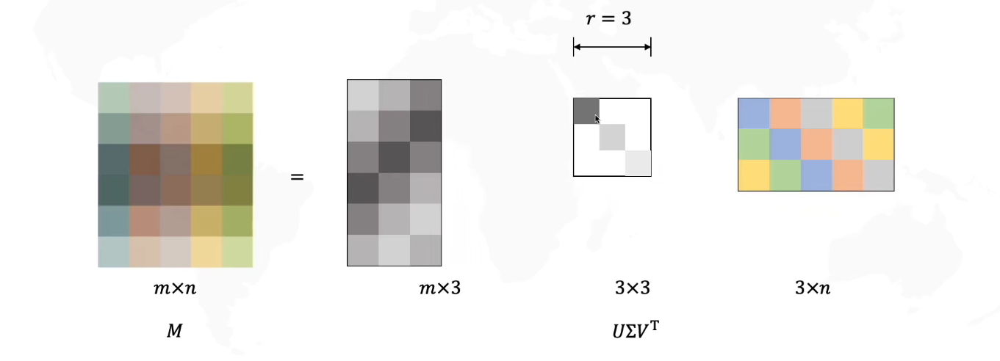
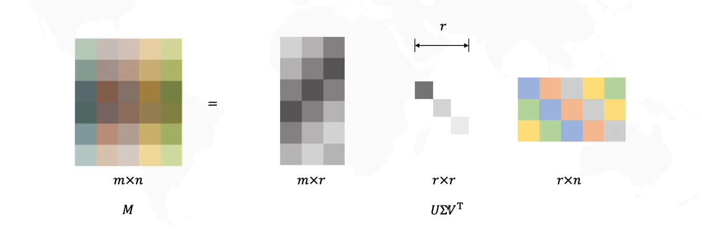

# 奇异值分解 SVD Singular Value Decomposition

[toc]

## Portal

[奇异值分解求解线性方程组](https://zhuanlan.zhihu.com/p/588365100)

[矩阵分解 (特征值/奇异值分解+SVD+解齐次/非齐次线性方程组)](https://blog.csdn.net/MyArrow/article/details/53780972)

[同济小旭学长 什么是奇异值分解SVD](https://www.bilibili.com/video/BV16A411T7zX)

## 奇异值分解求解线性方程组

$A \in \mathbb{C}^{m \times n}_r$ 

$U \in \mathbb{C}^{m \times m}$ 正交矩阵

$V \in \mathbb{C}^{n \times n}$ 正交矩阵

$ A = U
\begin{bmatrix}
   \sum_r & 0 \\
   0 & 0 
\end{bmatrix}
V^T = UDV^T $

$\sum_r = diag(\sigma_1,\cdots,\sigma_r)$ 矩阵的正奇异值

## 同济小旭学长 什么是奇异值分解SVD

①S拉伸变换(对角阵)

②R旋转变换(正交矩阵)

一组正交基进行信息变换后仍正交

