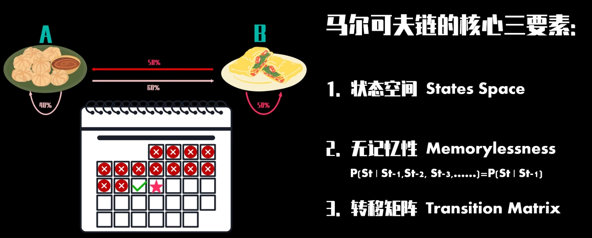
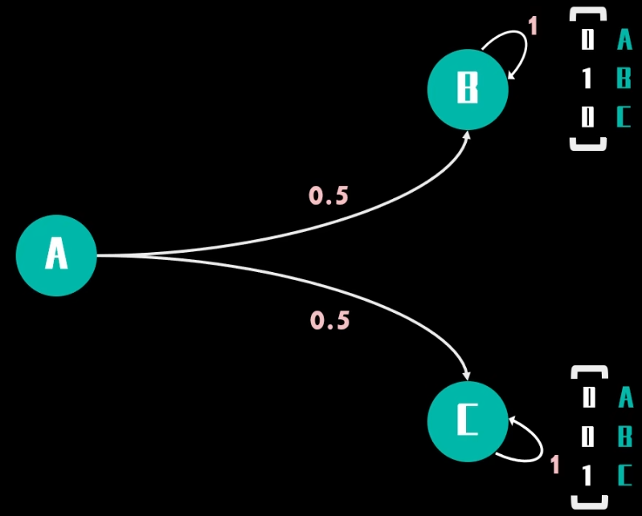
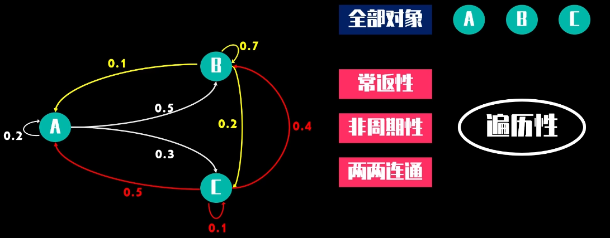

["马尔可夫链"是什么？](https://www.bilibili.com/video/BV19b4y127oZ)

[矩阵计算和规划求解的新应用](https://www.bilibili.com/video/BV1Nq4y1N7ms)

[马尔可夫链的 遍历性 & 唯一稳态](https://www.bilibili.com/video/BV1dL411G7NZ)

**马尔科夫链(Markov Chain)**
1. 描述系统在离散状态之间转移的数学模型
2. **无记忆性 Markov Property**，系统的未来状态只取决于当前状态，与之前的历史状态无关
3. 状态(State)
   1. 马尔科夫链由一组离散的状态组成
   2. 系统在每个时刻都会处于某个特定的状态
4. 转移概率(Transition Probability)
   1. 从一个状态转移到另一个状态的概率
5. 状态转移矩阵(Transition Matrix)
   1. $$\left[\begin{array}{lll}
        P(A → A) & P(A → B) & P(A → C) \\
        P(B → A) & P(B → B) & P(B → C) \\
        P(C → A) & P(C → B) & P(C → C)
        \end{array}\right]$$
   2. $$P(B → A) ≠ P(A → B)$$
   3. 性质
      1. 行/列 和为 1，每个状态，转移到所有可能状态的概率之和为 1
         1. 右随机矩阵 : $X_2 = X_1 P$ 这样的写法对应 每一**行**和为 1(对应前面的式子)
         2. 左随机矩阵 : $X_2 = P X_1$ 这样的写法对应 每一**列**和为 1
         3. 二者为转置关系
      2. 非负性 (Non-negativity)
      3. 状态转移矩阵 P 的最大特征值总是 1
      4. 若 $\pi = \pi P$，则 $\pi$ 为稳态
   4. NLP 中 利用 字符、词语 之间的 状态转移矩阵

从一个 已知状态(eg : $[1,0,0,0]^T$) 乘以 状态转移矩阵，得到 下一个状态

不断乘以状态转移矩阵 可以得到 稳态分布(steady state distribution)，说明非独立的随机过程也能收敛至稳态

并不是所有马尔科夫链都有唯一的稳态分布
1. eg : 

从 左随机矩阵 看，稳态满足 $\pi = P \pi$，移项可得 $(P-I) \pi = 0$，因此 特征值 1 对应稳态分布

如果 马尔科夫链的 全部状态节点 满足 `常返性、非周期性、两两连通`，则具有 遍历性，具有唯一的稳态分布

