# 主成分分析 - Principal Component Analysis (PCA)

## Table of Contents

- [主成分分析 - Principal Component Analysis (PCA)](#主成分分析---principal-component-analysis-pca)
  - [Table of Contents](#table-of-contents)
- [鸢尾花书 - 主成分分析](#鸢尾花书---主成分分析)
  - [Code](#code)
- [PCA - 小旭学长](#pca---小旭学长)


# 鸢尾花书 - 主成分分析

[鸢尾花书 《统计至简》 Chapter25 主成分分析 - B站 视频讲解](https://www.bilibili.com/video/BV1ru4y1S7YB/)
1. 相关内容
   1. []()
2. 致谢
   1. [生姜DrGinger(鸢尾花书 作者) - Github](https://github.com/Visualize-ML)
   2. [生姜DrGinger(鸢尾花书 作者) - B站](https://space.bilibili.com/513194466)

**重要的降维工具**

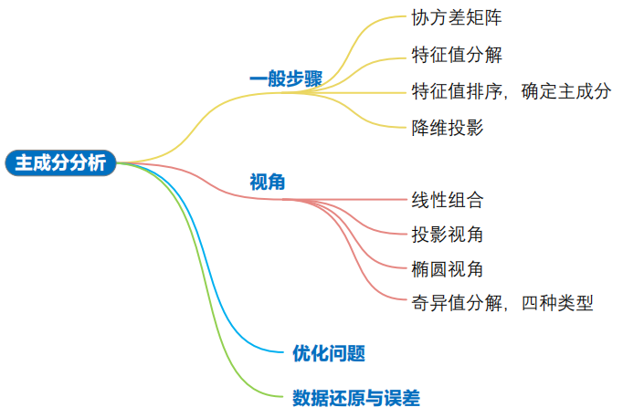

TODO


Kernel PCA ? - TODO


## Code

```python
numpy.cov()  # 计算协方差矩阵
numpy.linalg.eig()  # 特征值分解
numpy.linalg.svd()  # 奇异值分解
numpy.random.multivariate_normal()  # 产生多元正态分布随机数
seaborn.heatmap()  # 绘制热图
seaborn.jointplot()  # 绘制联合分布/散点图和边际分布
seaborn.kdeplot()  # 绘制 KDE 核概率密度估计曲线
seaborn.pairplot()  # 绘制成对分析图
sklearn.decomposition.PCA()  # 主成分分析函数
```

---


# PCA - 小旭学长

[PCA by 交通数据小旭学长 - B站视频](https://www.bilibili.com/video/BV1E5411E71z/)

[相关代码 - Gitee](https://gitee.com/ni1o1/pygeo-tutorial/blob/master/12-.ipynb)

用于 数据降维

PCA 目标 : 找到一个 新坐标系(新的基)，在减少 轴的情况下，保留尽量多的信息(**数据分布最分散(方差最大)**)

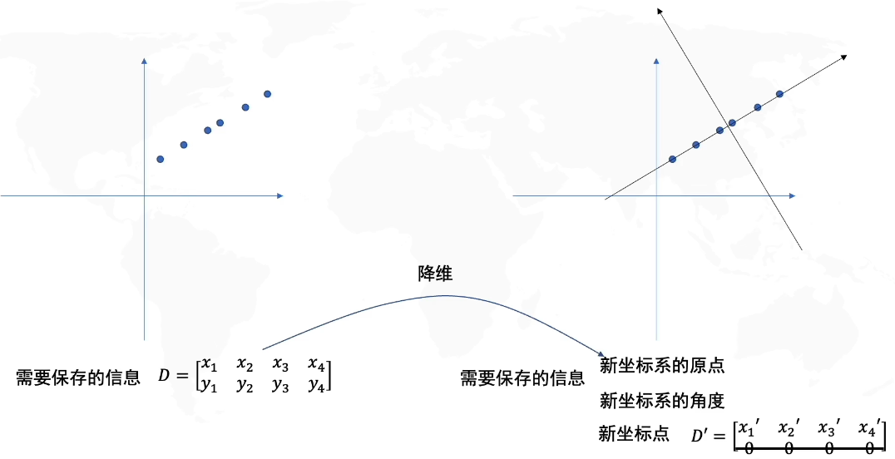

新坐标系信息
1. 原点 位于 数据中心
2. 角度，即 新坐标系方向，沿着数据分布方向 (旋转矩阵 R)

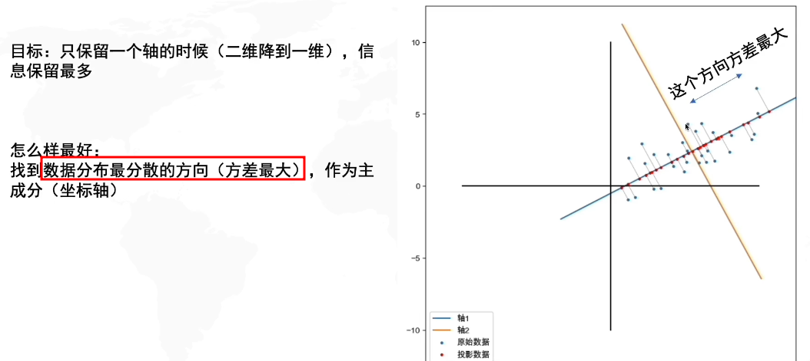

**数据预处理** : 去中心化(将坐标原点放在数据中心)，通过减去数据的均值来完成

**数据线性变换** (**旋转$R$** & **拉伸$S$**)
1. 从 白数据 变为 去中心化的现有数据 ($R$ & $S$)
   1. 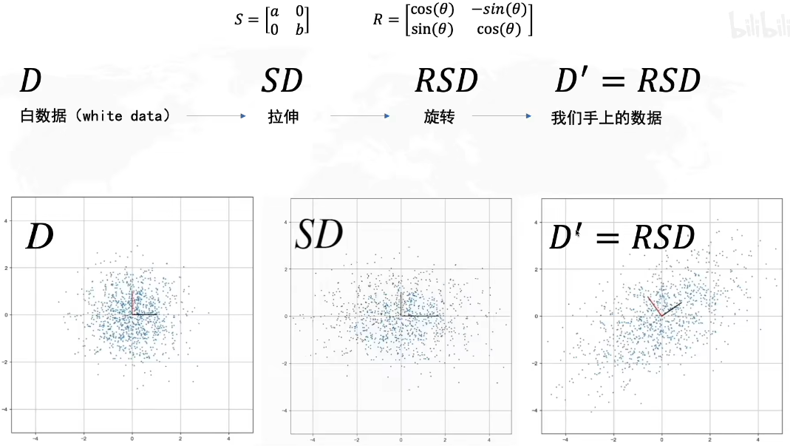
   2. 拉伸 确定了 方差最大的方向(横/纵)
   3. 旋转 确定了 方差最大的方向的角度
2. 从 去中心化的现有数据 变为 白数据 ($R^{-1}=R^T$ & $S^{-1}$)
   1. 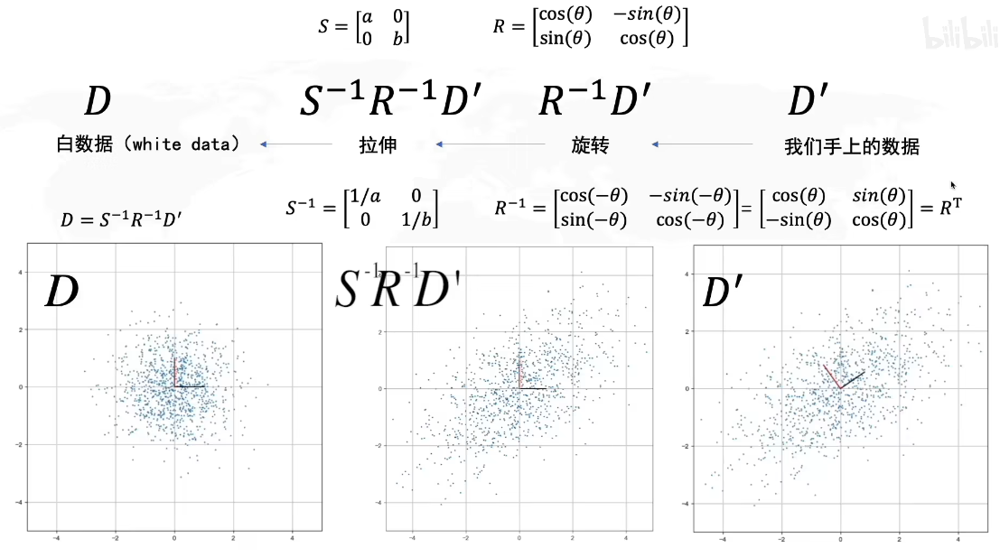


核心在于 求$R$，并且 **协方差 矩阵的特征向量 就是 $R$**
1. **协方差** (用于衡量两个随机变量 $x$ 和 $y$ 之间的线性关系或关联性)
   1. $$\operatorname{cov}(x, y)=\frac{\sum_{i=1}^{n}\left(x_{i}-\bar{x}\right)\left(y_{i}-\bar{y}\right)}{n-1}$$
   2. 此时 数据已经去中心化了 $\bar{x}=0$ & $\bar{y}=0$
   3. $\frac{1}{n-1}$ 是 对样本的 无偏估计 - TODO
   4. x 与 x 的 协方差 就是 方差
   5. 含义
      1. 协方差为 正，则说明 x和y 正相关，即当x增加时，y倾向于增加 (**变化趋势相同**)
      2. 协方差为 负，则说明 x和y 负相关，即当x增加时，y倾向于减少 (**变化趋势相反**)
      3. 协方差为 零，则说明 x和y 之间 **没有线性关系** (白数据)
2. **协方差矩阵**
   1. 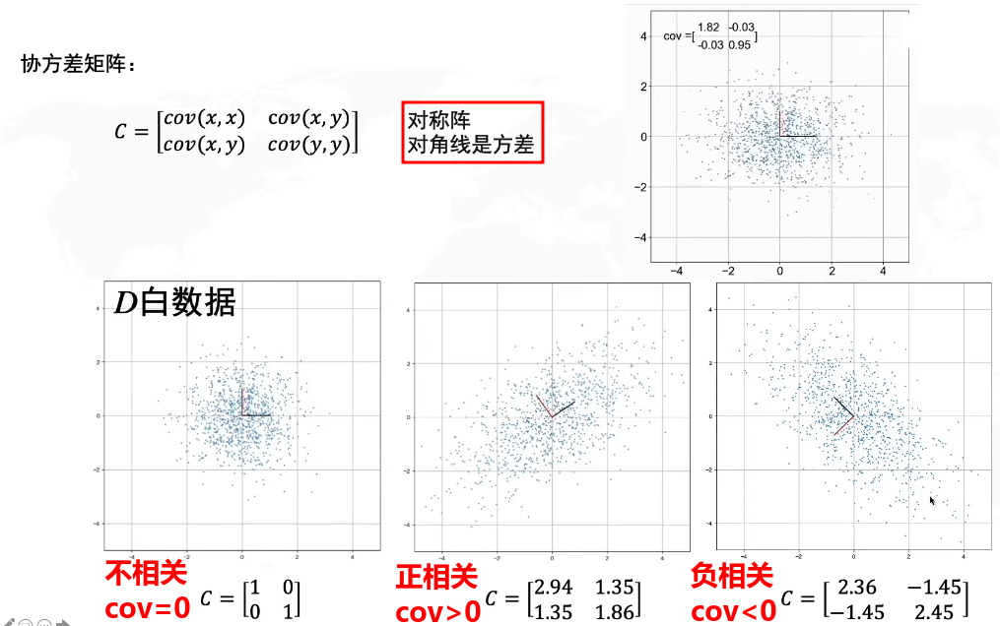
   2. 数据在 拉伸$S$(对角阵) 和 旋转$R$(正交阵) 的时候，协方差矩阵也会变化
   3. 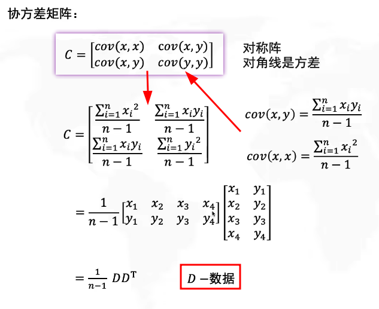
   4. 注意 因为数据已经去中心化，故可以直接相乘，无需减去均值
   5. 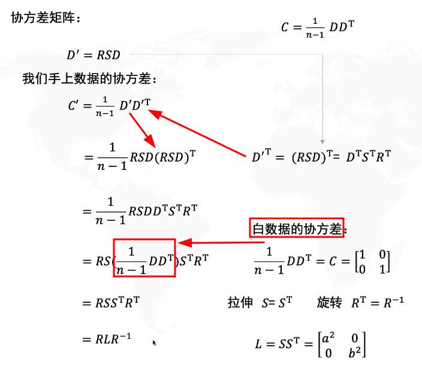
   6. 白数据的协方差矩阵为 $I$
   7. 协方差矩阵的特征向量
      1. 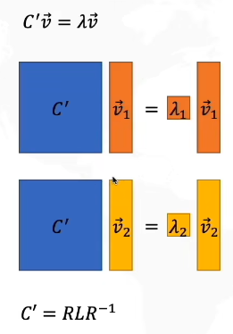 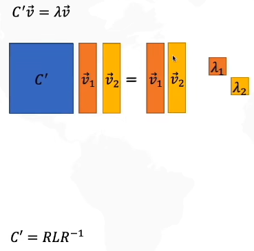 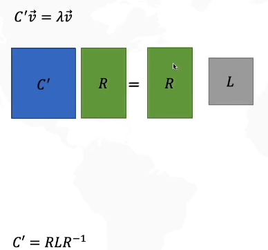
      2. 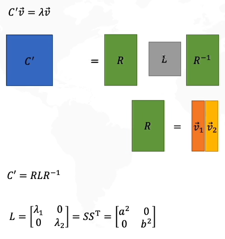
   8. 协方差矩阵的特征值
      1. 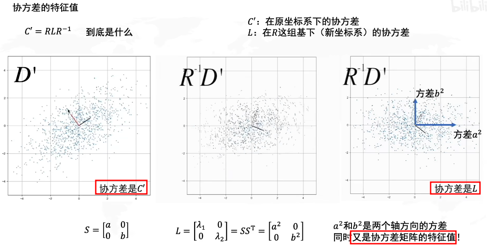
      2. $C^{\prime}$ 是 现有数据$D^{\prime}$ 的 协方差矩阵
      3. 对 现有数据 反转 回原有位置，得到 相当于 原始白数据 只有 拉伸，$L$ 即为 仅拉伸的数据的 协方差
         1. 由 $D^{\prime} = RSD$ 得 $R^{-1}D^{\prime} = SD$
         2. 方差 分别为$a^2$倍，$b^2$倍
         3. 协方差 为 0(拉伸的 白数据 不相关，旋转后才相关)
      4. 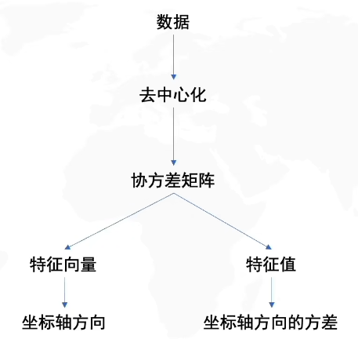

P.S.
1. 旋转矩阵$R$ 没有 实特征值 & 特征向量 (在实数空间中，旋转变换会改变全部向量的方向)
   1. 特殊情况 $\theta = 180°$，两个实数特征值 $\lambda_{1,2} = -1$，任何向量都是特征向量
2. 拉伸矩阵(non-uniform scale) & 旋转矩阵 的 组合可以有 实特征值


**PCA 缺陷**
1. 离群点(outlier) 影响大


**PCA & SVD**
1. 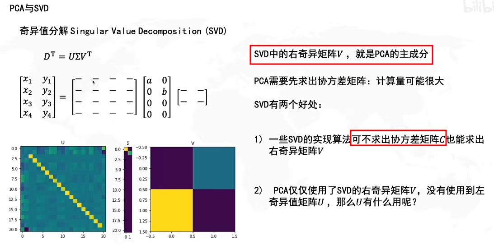


**PCA & 标准差椭圆/置信椭圆**
1. 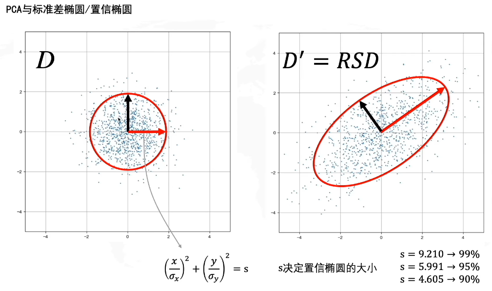


