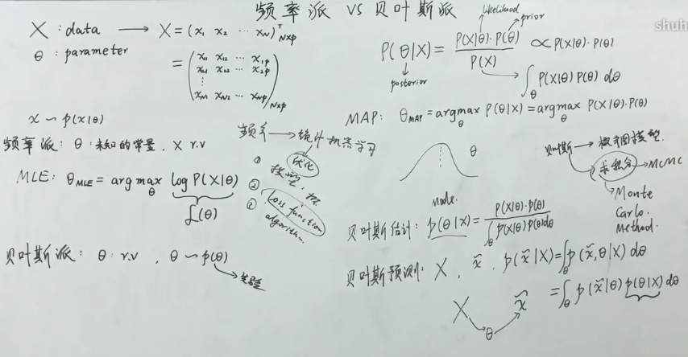

# Probability

[toc]

# 贝叶斯公式 Bayes Rule

**贝叶斯公式** : $$P(B|A) = \frac{P(A|B) \cdot P(B)}{P(A)}$$

[贝叶斯公式-深层理解 张颢](https://www.bilibili.com/video/BV19V411o7Pu/)

刻画学习过程
1. A代表数据
2. B代表认知
3. $P(A)$ 积分常量$\int\limits_{\theta} P(x|\theta) P(\theta) d\theta$
4. $P(B)$ 代表初始的认知(**先验**)
5. $P(A|B)$ 在有初始认知的情况下数据的规律(**似然**)，学习的过程是主观的、有选择性的，"戴着有色眼镜"学习
6. $P(B|A)$ 代表获取数据后的认知(**后验**)

一些假设
1. 若$P(A|B) = P(A)$，则表示用绝对客观的眼光看数据(隔岸观火，听讲座)，则学不进去，没有收获，最终得到的结果仍为$P(B)$，即仍为初始认知
2. 教师的作用也在于$P(A|B)$，让数据与初始认知尽量match和融合，我自己理解是相当于提升学生的接受度，以形成进一步的后验认识。可能有积极作用，也可能有消极作用
3. 所以 "教" 和 "学" 都依赖于似然的设计
4. 机器学习训练就是在设计似然

## 贝叶斯学习 & 贝叶斯分类器

贝叶斯分类器: 生成式模型，且使用了贝叶斯公式。(有一部分属于贝叶斯学习，也有一部分属于统计学习)

贝叶斯学习: 使用分布估计。任务认为参数本身不是一个客观存在的，是某一种分布产生的观察结果

# 频率派与贝叶斯派

[频率派与贝叶斯派 白板推导](https://www.bilibili.com/video/BV1cW411C7RS/)

[哲学角度聊聊贝叶斯派和频率派，数学角度看看极大似然估计和最大后验估计](https://www.bilibili.com/video/BV1Ea4y1J7Jq/)

下面的没看完

[最大后验估计（MAP）和贝叶斯估计（BE）](https://zhuanlan.zhihu.com/p/59707299)

[贝叶斯公式与最大后验估计(MAP) ](https://www.cnblogs.com/bingjianing/p/9182798.html)

[最大后验概率估计详解](https://blog.csdn.net/fq_wallow/article/details/104383057)

## 频率派 (点估计)

**频率统计**认为事件服从特定的分布，分布的参数$\theta$是**未知的常量**(古典概率)，通过极大似然估计得到参数的值。

如果进行大量独立重复实验，那么事件发生的概率一定会趋向事件的真实概率。比如抛硬币实验，如果重复无数次的话，出面证明的概率会非常接近0.5. 换句话说，频率统计以大数据为基础。

## 贝叶斯派 (分布估计)

贝叶斯统计认为事件的发生不是随机的，会受到知识的影响(带入了经验)。贝叶斯统计概率来描述知识。参数服从某一分布。

## 例子

例如在抛硬币实验中，只进行了三次实验，而这三次实验都是正面。如果根据频率统计的观点，那么正面出现的概率应该是1。但是事实上，如果硬币没有问题的话，正面出现的概率应该是0.5。所以说此时（实验次数少）的情况下，频率统计的结果并不合理。贝叶斯统计解决这种基于已知的知识。比如说，我们可以假设正面出现的概率位于$[0.4,0.6]$的区间内。然后基于这个假设，去估计正面出现的概率。

# 极大似然估计方法 MLE(maximum likelihood estimate)

频率派，统计学问题，目的是参数估计。容易收到样本不足的影响。

是求估计的方法之一。用数学方法来解释直觉，计算出使得观测到的事件发生可能性最大的系数。

先写出似然函数(利用乘法原理)，随后取对数，再求导。求出导数为0的点。如果未知参数有多个，则需要用取对数的似然函数对每个参数进行求偏导，使得所有偏导均为0的值，即为该函数的极值点，一般也是其最大似然估计值。

$$f(\theta) = P(x_1,\ldots,x_n|\theta) = \prod_{i=1}^{n} P(x_i|\theta)$$

$$
\begin{aligned}
& \underset{\theta}{\arg\max} f(\theta)\\
= & \underset{\theta}{\arg\max} P(x_1, \ldots, x_n | \theta)  \\
\Leftrightarrow & \underset{\theta}{\arg\max} \ln f(\theta) \\
\Leftrightarrow  & \underset{\theta}{\arg\max} \ln P(x_1, \ldots, x_n | \theta)
\end{aligned}
$$

$$\frac{d\ln f(\theta)}{d\theta} = 0$$

机器学习频率派，容易出现统计学习方法中的过拟合。通过正则化，在不增加样本的情况下，解决过拟合。

# 最大后验概率估计 MAP(maximum A Posteriori)

最大后验概率估计就是在已知一系列结果的情况下，求参数可能的最大的那一个

可以理解为 $x$ 是已知的测量值，$\theta$ 是需要估计的状态值

$\theta$不是固定的值，而是一个分布。要在已有数据下使得后验概率最大(借助贝叶斯公式)

$$\underset{\theta}{\argmax} P(\theta | x_1,\ldots,x_n)$$

该式一般不能通过蛮力法直接求解，需要利用贝叶斯公式，经过一系列变换求解

$$P(\theta | x_1,...,x_n) = \frac{P(x_1,...,x_n | \theta) \cdot P(\theta)}{P(x_1,...,x_n)}$$

先对函数取对数，然后再求导数为0的极值点，即为最大后验估计的概率(分母是常数，可以先略去)

$$
\begin{aligned}
& \underset{\theta}{\argmax} \ln [P(x_1, \ldots, x_n | \theta) \cdot P(\theta)] \\
= & \underset{\theta}{\argmax} [\ln P (x_1, \ldots, x_n | \theta)+\ln P(\theta)]
\end{aligned}
$$

求它的极值点，即导数为0的点。

不难看出，其前半部分包含了极大似然估计，后半部分是对于参数的默认分布假设(先验)。只要这个先验不为1，则式子的估计结果会有所不同。

最大后验估计可以利用经验数据，获得对未观测量的估计。它与极大似然估计方法相近，不同的是它**扩充了优化的目标函数**，其中**融合了预估计量的先验分布信息**，所以**最大后验估计可以看作是正则化（regularized）的极大大似然估计**

