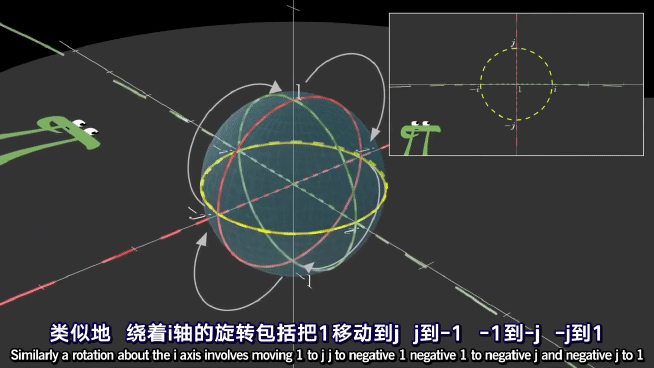
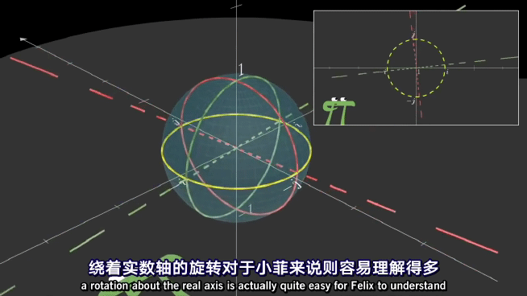
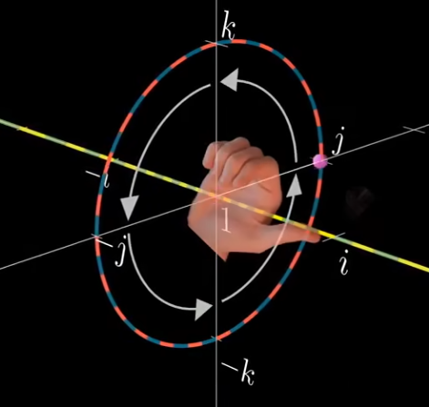
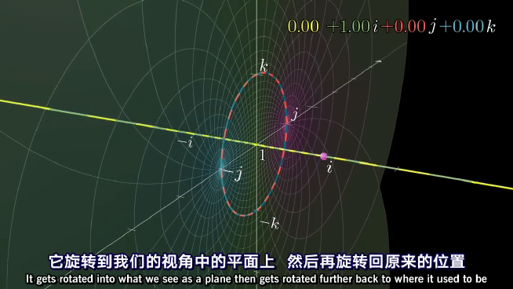
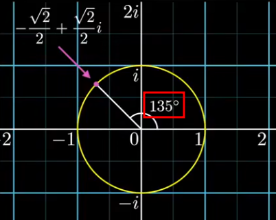
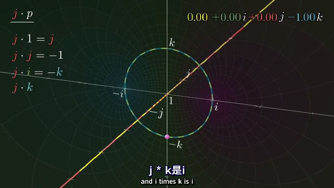
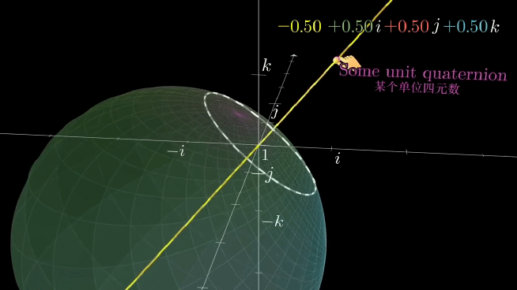
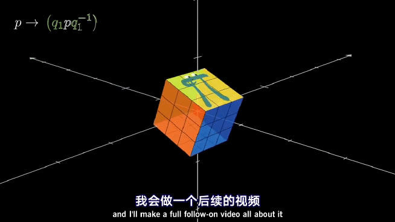
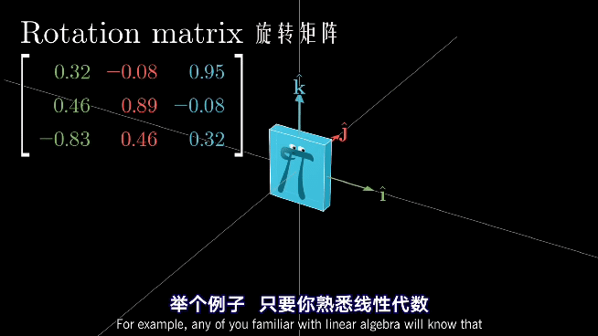

# 四元数 Quaternion

## Portals

[四元数を用いた三次元回転計算の幾何学的意味](https://qiita.com/HMMNRST/items/0a4ab86ed053c770ff6a)

[四元数的可视化 - B站视频(3Blue1Brown)](https://www.bilibili.com/video/BV1SW411y7W1)

[四元数和三维转动 - 可互动的探索式视频](https://www.bilibili.com/video/BV1Lt411U7og)

[3Blue1Brown Visualizing quaternions --- An explorable video series](https://eater.net/quaternions)

[Quaternion(Krasjet) - Github](https://github.com/Krasjet/quaternion)

[利用四元数计算三维旋转的几何意义 - Qiita(日文 blog)](https://qiita.com/HMMNRST/items/0a4ab86ed053c770ff6a)

---

## Table of Contents
- [四元数 Quaternion](#四元数-quaternion)
  - [Portals](#portals)
  - [Table of Contents](#table-of-contents)
- [四元数的可视化 - 3Blue1Brown](#四元数的可视化---3blue1brown)
  - [Chapter 1 - Linus the 1D-lander](#chapter-1---linus-the-1d-lander)
  - [Chapter 2 - Felix the 2D-lander](#chapter-2---felix-the-2d-lander)
  - [Chapter 3 - You the 3D-lander](#chapter-3---you-the-3d-lander)
  - [描述三维旋转的方式](#描述三维旋转的方式)
- [四元数和三维转动 - 3Blue1Brown \& Ben Eater](#四元数和三维转动---3blue1brown--ben-eater)

---

# 四元数的可视化 - 3Blue1Brown

复数 是 实数的 二维延伸，四元数 是 复数的 四维延伸

描述 三维旋转、量子力学(quantum mechanics)

爱尔兰 数学家 **William Rowan Hamilton**，四维复数

用 3个 虚维度 描述空间，实数是 第4个 维度，垂直于 全部 3个 虚数轴
1. 
2. 

四元数 描述 & 计算 三维旋转，更加高效 & 避免其他方法所产生的数值误差(numerical error)

## Chapter 1 - Linus the 1D-lander

Linus 只能理解 一维几何 & 实数，解释 复数

可以用 数值计算 定义复数运算，但是 没有几何意义

二维中的 复数乘法 (对于整个空间的作用)
1. 可以 理解为 : 将 $(0, 0)$ 固定，将 **==$(1, i0)$==** 点拉动至 被乘数所在的位置 (将左边的数视为 函数，对空间 & 右边的数 进行变换)
   1. 
2. 也可以 理解为 : 进行 幅值缩放 & 相角旋转
3. 显然 $(0,i0)$ 是固定的，而 $(1,i0)$ 会被拉到 左侧数 的位置
4. ==这里考虑是函数 左乘 ，后续讨论的变换也都是 左乘 的作用==，当然也可以对右乘进行讨论，这里暂不说明

对于 Linus 来说理解拉伸很容易，和实数相同，但是旋转不容易理解
1. 

复数乘法 有2个自由度(幅值、相角)，如果只关心 单位圆上的点(幅值 为1)，就将复数乘法化为 只有1个自由度的 纯旋转，没有放缩

引入 **球极投影(stereographic projection)**
1. 
2. 圆 映射到 直线，球 映射到 平面，四维超球 映射到 三维空间

圆 映射到 直线
1. 从-1向其他位置发射线，与虚轴相交，交点即为投影点
2. 越靠近 $(-1，i0)$ 就投影的越远，(-1，i0)的投影点可以认为是无穷远
3. $(0,i1)$ & $(0,-i1)$ 是投影后仅有的不变的两个点(圆周线与投影轴相交的部分)
4.  

需要注意的是，Linus 只能够看到 模 = 1 的 复数的 投影(单位圆 上的)，其他的都看不到

以 复数$i$ 举例，其 旋转效果 表现如图
1. 
2. 从 Linus 视角看，就是 1 的投影点 被 拽到 $i$ 的投影点

4 次 $i$的作用（左乘）的作用是将一个点绕原点转一圈，回到原来的位置。
1. 

## Chapter 2 - Felix the 2D-lander

Felix 只能理解 二维几何，需要 解释 三维球体 旋转

将复数轴进行延申，添加了 $j$轴，与之前的轴 垂直 **perpendicular** (为了类比四元数，将实数轴树立起来)
1. 

**只是为了 理解过渡，三元数 没有很好的 乘法规则**

和对 Linus 的方法类似，对 Felix 只解释 **单位球**上的向量 所引起的 三维旋转

使用 球极投影，将 单位球 的每一点 投影到 $i$ & $j$ 轴 组成的 平面上的 唯一点
1.  
2. 球壳 & 投影平面 的交点 集合 投影不动点，是 **单位圆环**
3. 沿着实数轴进行投影，不动点的 实数部分 都是0
4. $(-1,i0,j0)$ 被投影到了无穷远 (可以沿任意方向 投影到无穷远，类似于 从北极出发 往任何方向一直走 都能走到南极)

从Felix的视角 查看球体旋转
1. 捏着的 粉色点 是 北极 $(1,i0,j0)$ 的投影点，而 赤道 的 投影 为 黄色环
2. 

通过 $1,i,-1,-i$ 的圆环 被投影到 $ij$ 平面中的横轴
1. 

通过 $1,j,-1,-j$ 的圆环 被投影到 $ij$ 平面中的纵轴
1. 

Felix 看到的 直线 都是由通过 南极 $(-1,i0,j0)$ 的圆环投影所得
1. 可以理解为圆环所在平面和投影平面的相交线
2. 

绕 $j$轴 转动90°
1. 
2. 红环黄环互换位置，红环 原来对应 纵轴，黄环 原来对应 单位圆不动点
3. $(0,i0,j1)$ & $(0,i0,-j1)$ 是不动点

绕 $i$轴 转动90°
1. 
2. $(0,i1,j0)$ & $(0,-i1,-j0)$ 是不动点

绕 实数轴 转动90°
1. 
2. 原点(1 的投影) & 无穷远点(-1 的投影) 是 不动点

## Chapter 3 - You the 3D-lander

逐步推广 到 四元数
1. 
2. 四元数 有 3个虚部 & 1个实部，**3个虚轴 互相垂直 & 都垂直于实轴**
3. 
4. 四元数 可以由 4个实数表示，存在于 四维空间

一般将 四元数的 实数部分 称为 标量部分(scalar)，ijk 称为 虚数部分(imaginary) 或者 祖师爷 命名为的 向量部分(vector part)
1. 

四元数 **运算规则**，满足 **==分配律==**
1. 相对于 矩阵乘法(机器人学课程中的位姿变换)，四元数 更加 简洁
2. 
3. 利用 点积(dot product) & 叉积(cross product) 描述四元数乘法更加优雅
4. 

四元数取模 也是 平方和 & 开根号，乘 四元数 相当于(四维) 旋转 & 放缩
1. 

旋转 是由 单位超球面上的 四元数组成的
1. 单位超球上的 四元数 乘法是 pure rotation，根据 单位超球的投影 理解 高维旋转
2. 由于只能理解三维空间，所以将实轴简单表示一下，将 三维空间的 3个轴 以右手系的方式 设定为 $ijk$ 轴
3. 

==单位球面 的 实部为 0，整个空间都是 单位四元数==

整个三维空间 由 模长=1 的 全部 **单位四元数** 球极投影 所得
1. $(1,i0,j0,k0)$ 投影到 三维空间中的 **原点**
2. $(-1,i0,j0,k0)$ 投影到 三维空间中的 **无穷远点**
3. **球极投影 不变点 集合** : ==实数部分=0== & 模长=1 的 **单位超球面**
   1. 
   2. 球上的 四元数向量 祖师爷将他们称为 **单位向量**(实部为 0，模长为 1)
   3. 
4. 实数部分 $ 0 \sim 1$ 之间的 被投影到 单位球内部
   1. 
5. 实数部分 $-1 \sim 0$ 之间的 被投影到 单位球外部
   1. 
6. $(-1,i0,j0,k0)$ 被投影到 无穷远，沿任意方向 走无限远 都能到
7. 零点 在 三维空间中 找不到，因为 整个三维空间 只能表示 单位四元数

看到的 三维空间中的 一个个平面，都是由 单位四元数超球 中 通过点 $(-1,i0,j0,k0)$ 的球壳，投影所得
1. (类比二维情况 : Felix 看到的 直线 是 由单位球面上通过 $(-1,i0,j0)$ 的 圆周线，投影所得)
2. 

在四维空间中，四元数相乘(作用数 左乘 被作用数) 的作用
1. 
2. 可以理解为，两个 相互垂直 & 独立 & 同时发生 的旋转(四维生物 很好理解，三维生物 难以想象，只能近似理解)
3. 沿着黄线看，$i$ 的作用 和 Linus 所看到的一样 $1 \to i  \to -1 \to -i$ 周期性变换
4. 沿着红线看，$i$ 的作用 让红圈以 **右手法则** 方向进行转动，$j \to k \to -j \to -k$ 周期性变换 (对应 公式 $ij=k$，$ik = -ki = -j$)
   1. 
   2. 大拇指方向 从 $1$ 指向 $i$
5. ==注意 2个变换是同时发生的，这两个旋转唯一确定一个四维超球的刚体运动==，个人认为 2个旋转的角度 时刻保持一致
6. 从线性代数的话来说，$1, i, j, k$ 是四维空间的 **基(base)**，知道它们的变换，就知道了整个空间的变换
7. 

$i$ 的作用
1. 一个 $i$ 的作用 : 投影球面一边沿着 $i$ 轴 正方向扩展，一边绕着 $i$ 轴 以**右手螺旋** 旋转90°
   1. 
2. 再 一个 $i$ 的变换 : 球面 **==内外颠倒==**，还需要额外的 2个 $i$ 才能回到原来状态
   1. 
3. 考虑一个四元数 $q=-\frac{\sqrt{2}}{2}+i\frac{\sqrt{2}}{2}$
   1. 在 三维生物的视角中，**将 $(1,i0,j0,k0)$ 拉到 $q$ 的 投影点的 位置**(类比 Linus & Felix 视角)
      1. $q$ 的 实数部分为负，其在 三维空间中的投影 在单位球外
   2. $jk$ 圆 旋转角度 就是 作用四元数 的相位
      1. 
   3. 

$j$ 的作用，和 $i$ 类似 (对 $ik$的处理要当心)
1. 
2. 

想要 形象理解 一个 **单位四元数** $q$ 的作用 的 步骤
1. 画出通过 $1，q，-1$的 单位圆 (在我们的三维空间中是一条过原点的直线(黄线))
2. 画 垂直于 该直线的单位圆
3. 将 $(1,i0,j0,k0)$ 拉到 $q$ 的位置，同时 将整个球 按照右手定则 旋转相应的角度(同步进行)
4. 
5. 

**==P.S.==** : **==四元数乘法==** 顺序是不能变的，即 **==不满足交换律==**(not commutable)
1. 
2. $i$ 左乘 $j$ 相当于 $j$ 绕 $i$ 轴 右手螺旋 转到 $k$
3. $j$ 左乘 $i$ 相当于 $i$ 绕 $j$ 轴 右手螺旋 转到 $-k$

**可交换性** 是 十分特殊的性质，空间中的大多数变换都不具有该性质
1. 机器人学中，平移具有可交换性，但是 绕 $X Y Z$ 轴 旋转矩阵 顺序不能调换，这与四元数不谋而合
2. 现实生活中，魔方旋转就没有可交换性，下图中魔方进行了两步操作，两个步骤顺序不同结果不同
   1. 绕前面 顺时针转90° & 绕右侧 逆时针转90°
      1. 
   2. 绕 $z$ 轴 & 绕 $x$ 轴
      1.  

另外，之前讨论的都是 将左边的四元数 作为 操作数 左乘，也可以 将右边的四元数 作为 操作数右乘
1. 为了得到相同的结果($ij=k$)，当用**右乘**理解时，我们需要使用 **==左手定则==**
2. 
3. 

**==左乘 对应 右手定则，右乘 对应 左手定则==**

理解 左乘右乘，对于 理解 用单位四元数 描述 三维旋转有帮助，另外还会涉及到 共轭(Conjugation)
1. 
2. 

## 描述三维旋转的方式

旋转矩阵 Rotation Matrix
1. 
2. 每一列 代表 : 新的基 在 旧 frame 下的 表示

欧拉角 Euler Angle
1. 
2. 欧拉角会由于万向锁的存在导致自由度的减少，而四元数不会
   1. 

共轭 四元数
1. 
2. 四元数可以提供平滑插值的方法
   1. 
   2. 显然可以看出 lerp 速度不均匀

四元数旋转
1. 和 复数 进行旋转类似，即 乘以 $cos(\theta)+isin(\theta)$
   1. 
2. 先用一个以 $i,j,k$ 为分量的 **单位向量** 定义一个轴，(单位球面 的 实部为 0，整个空间都是 单位四元数)
   1. 
3. 然后 四元数 实部 cos，虚部 整体 乘以 sin
   1. 

要真实的算出 旋转后的坐标 需要
1. 使用 : 左乘 & 右乘 & 逆 等
2. 构造 四元数的 角度 等于 需要 旋转角度的 **一半**
3. 取一个 三维点，用 $ijk$ 表示，计算 绕轴旋转后的 坐标
4. 

---

# 四元数和三维转动 - 3Blue1Brown & Ben Eater

只考虑 单位四元数，因为 单位四元数 可以 在三维空间中 表示

共轭 单位 四元数
1. 和复数的共轭类似，四元数的共轭也是 **实部相同，$ijk$ 3个虚数系数 变为相反数**，乘积为 $w^2 + x^2 + y^2 + z^2$(可以用 分配率验证， 都抵消了)
2. 
3. 单位 四元数 的 共轭(conjugate) 等于 逆(inverse)，乘积 就是 模长平方 = 1
4. 验证方式
   1. 利用 分配率 全部展开，可以相互抵消
   2. 利用 平方差公式 $(a+b)(a-b) = a^2 - b^2$，虚部看为一个整体 (虚部展开，$ijk$ 顺序很重要，也可以抵消)

Axis-Angle 表示方式
1. 让四元数 **虚部总体 归一化(平方和=1)**，分别在 **虚部总体** & 实部 前面添加 **三角函数系数**(不改变 模长)
   1. 实部 是 $\cos \theta$，虚部 乘以 $\sin \theta$
   2. 满足 单位四元数的 模=1
   3. 共轭 单位四元数 只是 角度$\theta$ 不同(相反数)，cos为偶函数，sin为奇函数，满足共轭的定义
2. 

这里的 $\cos$ & $\cos$ 后面跟的 $\theta$ 就是将 $(1,i0,j0,k0)$，拉动至 $cos(\theta)+sin(\theta)(ia+jb+kc)$ 时 (其中$a^2+b^2+c^2=1$，以保证单位四元数)，沿着 三维空间中向量 $(ia,jb,kc)$ 和 垂直于该向量的 两个方向的 转动角度（在上一章中我们将四元数的作用拆解为两个相互垂直的圆的旋转

三维空间的 3个轴 用右手系的 方式表示 $ijk$ 三个轴，实数部分无法表示，显然，共轭的单位四元数在我们的三维空间是以原点为中心，中心对称

一对 共轭四元数 分别 **左乘 & 右乘** 作用效果 (整体当作一个函数的作用)
1. ==$f(p)=q·p·q^{-1}$==
2. **左乘一个单位四元数使空间转动的方式按照右手螺旋**，**右乘一个单位四元数使空间转动的方式按照左手螺旋**
3. 需要用到的两个手

个人理解 (==左乘 右手定则，右乘 左手定则==)
1. 方式 1 : 原始表示
   1. 左右手 掌心相对 半握拳，同轴摆放，大拇指 分别指向 四元数及其共轭(在 三维空间中的 向量)
   2. 由于 共轭四元数投影中心对称，所以 大拇指 方向相反，都 沿着红色轴 并且 反向，左右手的 四指绕着红色轴 沿着相同方向转动
   3. 
2. 方式 2 : 轴角表示
   1. $\cos(\theta) + \sin(\theta) * \vec{v}$
   2. 也是 两个手，只是 变成 大拇指 指向 同一方向，但是 右乘的 左手定则 旋转角度是 负数，也就相当于 右手定则 旋转 正数
3. 分别将 $(1,i0,j0,k0)$(在三维空间中的投影为原点) 拉动到 $q$ & $q^{-1}$，两个作用 使得 三维空间的单位球在 沿着轴的拉动 相互抵消，而 旋转方向 则是 单个四元数所带来的转动的 2倍
4. 想要用 共轭单位四元数 描述一个三维旋转时
   1. 算出 和旋转轴平行的 单位向量，方向要和转动方向成右手螺旋关系
   2. 将旋转角度变为一半，按照 Axis-Angle 方式，结合三角函数，得到这对共轭单位四元数

四元数 & 相反数
1. 相反数 : 保持旋转轴不变，利用 $\sin$ & $\cos$ 奇偶性 & 周期性，角度变为 负的补角($\theta - 180°$)
   1. 补角 让 $\cos$ 变为 相反数，$\sin$ 不变
   2. 负号 让 $\sin$ 变为 相反数，$\cos$ 不变
2. 结合 两倍 看，绕一个轴 旋转 $2 \theta$ 与 绕同一个轴 旋转 $2 (\theta - 180°) = 2 \theta - 360°$ 等价
3. example : 整体效果 绕 z 转 270° 等价于 绕 z 转 -90°
   1. 
   2. 
4. 呼应了 slerp 插值的时候，需要 先检查 点积(dot product)
   1. [slerp - 个人笔记](../Interpolation/interpolation.md#slerp-spherical-linear-interpolation球面线性插值)

