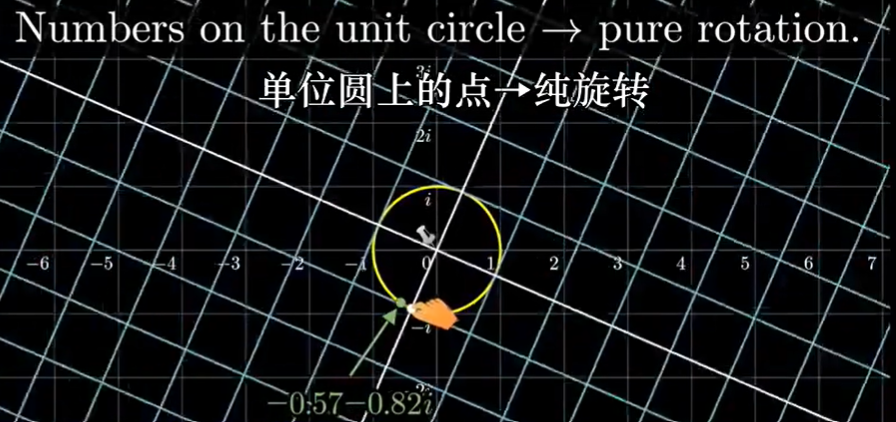
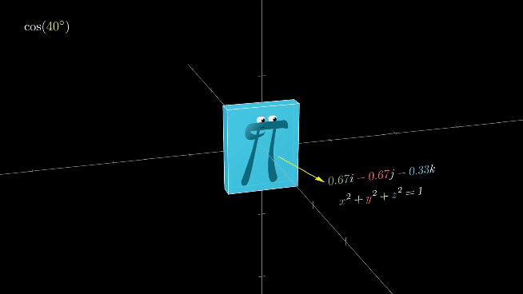

# 四元数 Quaternion

[toc]

## Portals

[3Blue1Brown 四元数的可视化](https://www.bilibili.com/video/BV1SW411y7W1)

[四元数和三维转动，可互动的探索式视频](https://www.bilibili.com/video/BV1Lt411U7og)

[3Blue1Brown Visualizing quaternions --- An explorable video series](https://eater.net/quaternions)

[四元数を用いた三次元回転計算の幾何学的意味](https://qiita.com/HMMNRST/items/0a4ab86ed053c770ff6a)

# 四元数的可视化 3Blue1Brown

描述三维旋转、量子力学

爱尔兰数学家William Rowan Hamilton，四维复数

用三个虚维度描述空间，实数是第四个维度。

四元数可以优雅的描述并计算三维旋转，计算更加高效的同时可以避免其他方法所产生的数值误差。

## Chapter 1 --- Linus the 1D-lander

只能理解一维几何与实数，要向他解释复数。

可以用数值计算来定义复数运算，但是没有几何意义。

在二维中的复数乘法（对于整个空间的作用）可以形象的理解为：将坐标轴的(1,i0)点拉动至被乘数所在的位置（将被乘数理解为一个函数，对空间进行该变换），读取乘数新的位置在原坐标轴中的坐标即为结果。当然也可以理解为进行了幅值缩放和相角旋转。（==这里考虑是函数左乘，后续讨论的变换也都是左乘的作用==，当然也可以对右乘进行讨论，这里暂不说明。）

显然(0,i0)点是固定的，而(1,i0)点会被拉到被乘数的位置。

值得注意的是（也很显而易见），对于每个变换都是独一味二的（复平面的点各不相同）

对于Linus来说理解拉伸很容易，和实数相同，但是旋转不容易理解。

本来复数乘法应该有2个自由度（幅值比、相角差），但是如果我们只关系单位圆上的点（幅值比为1），那么我们就将复数乘法化为一个只有1个自由度的纯旋转，没有放缩。

引入球极投影(stereographic projection)

从-1向其他位置发射线，与虚轴相交。交点即为投影点。越靠近(-1，i0)就投影的越远，(-1，i0)的投影点可以认为是无穷远。显而易见，(0,i1)和(0,-i1)是投影后仅有的不变的两个点（圆周线与投影轴相交的部分）
  

需要注意的是，Linus能够看到的只是模值等于1的复数的投影，其他的点都看不到。

以复数i举例，其旋转效果在投影矩阵的表现如图所示。

显而易见，四次i的作用（左乘）的作用是将一个点绕原点转一圈，回到原来的位置。

## Chapter 2 --- Felix the 2D-lander

Felix只能理解二维几何，需要向其解释三维球体旋转。

将复数轴进行延申，添加了j轴，与之前的轴垂直perpendicular。（为了类比四元数，将实数轴树立起来）

只是为了过渡，“三元数没有很好的乘法规则。

和对Linus的方法类似，对Felix，我们同样只对她解释单位球上的向量所引起的3维旋转运动。同样使用球极投影。同样的只有球壳与投影平面的交点为Felix能看到的真实部分（投影不动点），是一个单位圆环。由于是沿着实数轴进行投影，所以不动点的实数部分都是0（总的来说，Felix能看到的整个平面是由全部模为1的三元数投影所得，而能看到的不动点是模为1且实数部分为0的三元数，这对于四元数投影适用）。

同样的(-1,i0,j0)被投影到了无穷远（可以沿任意方向投影到无穷远。类似于从北极出发往任何方向一直走都能走到南极）。

从Felix的视角查看球体旋转。我们捏着的点是北极(1,i0,j0)（粉色点），而赤道及其的投影为黄色环。

通过了1,i,-1,-i的圆环被投影到了平面中的横轴，通过了1,j,-1,-j的圆环被投影到了平面中的横轴。要注意Felix看不到大部分的三元数，除了单位球上的三元数。

可以理解，Felix能够看到的直线都是由通过南极(-1,i0,j0)的圆环投影所得，可以理解为圆环所在平面和投影屏幕的相交线（可以是直的也可以是斜的）。

绕j轴转动90°，红环黄环互换位置，红环原来对应纵轴，黄环原来对应单位圆。(0,i0,j1)和(0,i0,-j1)是不动点。

绕i轴转动90°，情况类似不再说明。

绕实数轴转动则更为简单。

## Chapter 3 --- You the 3D-lander

三个虚轴互相垂直且都垂直于实轴。

一般将四元数的实数部分称为标量部分，ijk称为虚数部分。对于没有实数部分的四元数，祖师爷将后面部分命名为向量部分(vector part)。

四元数运算规则，满足分配律（计算机运算方法）。相对于矩阵乘法（机器人学课程中的位姿变换），四元数更加简介。

利用点积(dot product)、叉积(cross product)描述四元数乘法更加优雅，暂时还没有研究。

和复数取模类似，四元数取模也是平方和开根号。而乘以一个四元数相当于（四维）旋转和放缩。

此时的旋转是由单位超球面上的四元数组成的。另外，由于我么只能理解三维空间，所以将实轴简单表示一下，将三维空间的3个轴以右手系的方式设定为ijk轴。

同样的整个三维空间是由模长为1的全部四元数投影所得（也就是相对于四元数，少了一个维度）。**我们所看到的一个个平面是由四元数中通过点(-1,i0,j0,k0)的球壳投影所得**，而这一系列平面组成了我么的三维空间。

同样的(1,i0,j0,k0)投影到了三维空间中的原点。三维空间中的单位球是我们能够看到的真实的四元数（投影不变的四元数），它们的**实数部分为0**，**模长为1**（我们能的三维空间只能表示模长为1的四元数），祖师爷将他们称为单位**向量**。我们能看到的球壳类似于Felix能够看到的圆周线，都是投影之后位置不变的点。

实数部分在0到1之间的被投影到了球的内部，相反，实数部分为-1到0之间的被投影到了球的外部。（讨论的都是单位长度的四元数，即时他们的三维投影距离原点右远近之分）。同样的(-1,i0,j0,k0)被投影到无穷远，沿任意方向走无限远都能走到。

同样的，对于平面上的一个轴，是一个四维超球中的三维球投影所得的平面中的一部分。（这里有点晕，但核心思想就是之前提到的这里的平面是由超球的某个球投影得到的）（可以从二维情况类比，Felix看到的直线是由单位球面上通过-1的圆周线投影所得，我么看到的平面是由单位四元数的超球面中的通过-1的球面投影所得）。

在四维空间中，四元数相乘（作用数左乘被作用数）的作用可以被理解为，两个相互垂直且同时发送的旋转（四维生物可能很好理解，但我们难以想象，只能近似理解）。沿着黄线看，i的作用和Linus所看到的一样1、i、-1、-i周期性变换。沿着红线看，i让红圈以右手法则的方向进行转动，j、k、-j、-k周期性变换。==注意两个变换是同时发生的，这两个旋转唯一确定一个四维超球的刚体运动==，个人认为两个旋转的角度时钟保持一致。从线性代数的话来说，1、i、j、k是四维空间的基，所以知道它们的变换，就知道了整个空间的变换。

i的作用，可以看到投影球面一边沿着i轴正方向扩展，一边绕着i轴以右手螺旋的方式进行旋转90°。

再进行一个i的变换（球面的内外颠倒了，还需要额外的两个i才能回到原来的样子）。

考虑一个四元数$q=-\frac{\sqrt{2}}{2}+i\frac{\sqrt{2}}{2}$，在四维空间中将其从(1,i0,j0,k0)拉到q的位置，由于q的实数部分为负，显然其在三维空间中的投影应该在单位球外。

观察j的作用和i类似但是对ik的处理要当心。

当我们想要形象理解一个单位四元数q的作用时，使用如下步骤：
1. 首先画出通过1、q、-1的单位圆（在我们的三维空间中是一条过原点的直线）
2. 画一个垂直于它的单位圆，将(1,i0,j0,k0)拉到q的位置（过程其实是一个旋转，但是我们此时由于少一个轴，只能像Linus一样理解），同时将整个球按照右手定则旋转相应的角度（同步进行）。

值得注意的是，乘法的旋转顺序是不能变的，即**不满足交换律**(not commutable)。i左乘j相当于j1绕着i右手螺旋转到k，j左乘i相当于，i1绕j轴右手螺旋旋转到-k。

可交换性是一种十分特殊的性质，空间中的大多数变换都不具有该性质（机器人学中，平移具有可交换性，但是绕XYZ旋转矩阵则顺序不能调换，这与四元数不谋而合）。现实生活中，魔方旋转就没有可交换性，下图中魔方进行了两步操作，绕着前面顺时针转90°，绕着右侧逆时针转90°。两个步骤顺序不同结果不同。

另外，我们之前讨论的都是将左边的四元数作为操作数左乘，当然也可以理解为将右边的四元数作为操作数右乘。为了得到相同的结果（i*j都要等于k），当用**右乘**理解时，我们需要使用**左手定则**。

理解左乘右乘，对于理解用单位四元数描述三维旋转十分有帮助，另外还会涉及到共轭(Conjugation)过程。

## 描述三维旋转的方式

共轭四元数

旋转矩阵

欧拉角

但欧拉角会由于万向锁的存在导致自由度的减少，而四元数不会。

另外四元数可以提供平滑插值的方法，沿着超球面的切面。

和单位复数进行旋转类似（乘以$cos(\theta)+isin(\theta)$），四元数旋转也是先用一个以ijk为分量的单位向量定义一个轴（使用想要旋转的角度的余弦值作为实部，加上该角度的正弦乘以整个虚部）。然后给四元数实部乘以cos，虚部整体乘以sin（当然这并不完全正确，只是一个初步想法，因为四元数乘法是同时有两个维度的旋转）。

想要真实的算出旋转后的坐标需要使用左乘右乘、逆等内容，同时构造四元数的角度等于需要旋转角度的一半。

具体细节在下一章说明。

**感谢 Grant Sanderson。**

# 四元数和三维转动 3Blue1Brown & Ben Eater

## 自己的初步理解
首先我们只考虑单位四元数，单位四元数可以在三维空间中进行表示。

然后来看共轭单位四元数。和复数的共轭类似，四元数的共轭也是实数部分相同，ijk三个虚数部分系数分别变为相反数。

同时有一种更巧妙的理解方式：让四元数的**虚数部分的平方和为1**，再分别在**虚数部分总体**和实数部分前面添加三角函数系数（同一个角度的sin和cos，实数部分乘以cos$\theta$，虚数部分乘以sin$\theta$），这样满足了单位四元数的模值为1。这样更加奇妙的事情发生了，一对共轭单位四元数的区别只是角度的不同（cos为偶函数，sin为奇函数，满足共轭的定义）。

这里的cos和sin后面跟的$\theta$就是将(1,i0,j0,k0)，拉动至$cos(\theta)+sin(\theta)(ia+jb+kc)$时（其中$a^2+b^2+c^2=1$，以保证单位四元数），沿着三维空间中向量(ia,jb,kc)和垂直于该向量的两个方向的转动的角度（在上一章中我们将四元数的作用拆解为两个相互垂直的圆的旋转，其中沿着该向量的旋转我们不得不以Linus的视角来理解（沿着直线的伸缩））。在Linus的视角中，我们乘以cos(\theta)+sin(\theta)(i1)时，其实是进行了$\theta$角度的旋转，映射到低维是将投影点沿着i轴（$sin(\theta)$后的部分）进行了移动。那么对应我们乘以四元数时，$sin(\theta)$后的部分$(ia+jb+kc)$任然是作为一个轴，我们沿着这个轴进行拉伸（高维旋转$\theta$的低维理解），唯一不同的是四元数的作用除了将沿着轴的方向进行拉伸，另外也将垂直于轴的方向进行相同角度的旋转（两个相互垂直同时发生的旋转）。

结合之前的四元数的可视化所学内容。我们的三维空间的三个轴用右手系的方式表示了i、j、k三个轴，实数部分我们无法表示。所以很显然，共轭的单位四元数在我们的三维空间是以原点为中心，中心对称。

然后开始考虑一对共轭四元数分别左乘、右乘的作用效果（同样可以当作一个函数的作用），==$f(p)=q·p·q^{-1}$==。上节课Grant提到过**左乘一个单位四元数使空间转动的方式按照右手螺旋**，**右乘一个单位四元数使空间转动的方式按照左手螺旋**。所以我们需要用到我们的两个手。

可以这样考虑，两个手掌心相对半握拳，同轴摆放，如下图，我们的两个大拇指分别指向四元数及其共轭。另外，由于共轭四元数投影中心对称，所以大拇指指的方向相反沿着红色轴并且反向，而两个手的两组四指绕着红色轴沿着相同方向转动（人的手真神奇）。

随后，分别将四元数(1,i0,j0,k0)（在三维空间中的投影为原点）拉动到$q$和$q^{-1}$。可以预见，两个作用使得三维空间的单位球在沿着轴的拉动相互拮抗，抵消了。而旋转方向则是单个四元数所带来的转动的两倍。

这样在我们之后想要用共轭单位四元数描述一个三维旋转时，只需使用右手。先算出和旋转轴平行的单位向量，方向要和转动方向成右手螺旋关系。然后只需要将旋转角度变为一半。按照之前的更加巧妙的方式，结合三角函数，得到这对共轭单位四元数。

## Ben Eater 网页教程

首先是按照巧妙的带有三角函数的表达方式，ijk及其相应系数指明了一个旋转轴。

很显然，下面两组共轭四元数对空间做的旋转变换是相同的，只不过一个是正转一个是反转。但是它们对应的四元数互为相反数。

因为基本够用了所以网页后面有一些内容没有继续深入了解。

**感谢 Ben Eater**
