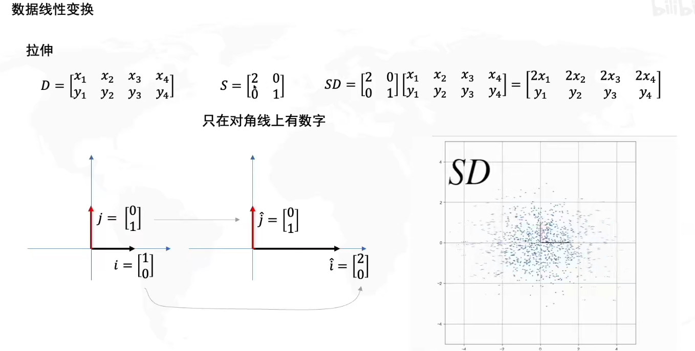
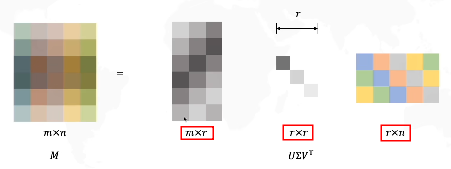

# 奇异值分解 & 特征值分解

## Table of Contents

- [奇异值分解 \& 特征值分解](#奇异值分解--特征值分解)
  - [Table of Contents](#table-of-contents)
- [特征值分解 - EigenValue Decomposition (EVD)](#特征值分解---eigenvalue-decomposition-evd)
- [奇异值分解 - Singular Value Decomposition (SVD)](#奇异值分解---singular-value-decomposition-svd)
  - [奇异值分解 求解 线性方程组](#奇异值分解-求解-线性方程组)
  - [奇异值分解求解线性方程组](#奇异值分解求解线性方程组)
  - [同济小旭学长 什么是奇异值分解SVD](#同济小旭学长-什么是奇异值分解svd)
  - [鸢尾花书 - 奇异值分解 SVD](#鸢尾花书---奇异值分解-svd)

---

# 特征值分解 - EigenValue Decomposition (EVD)

---

# 奇异值分解 - Singular Value Decomposition (SVD)

## 奇异值分解 求解 线性方程组

[奇异值分解求解线性方程组](https://zhuanlan.zhihu.com/p/588365100)

[矩阵分解 (特征值/奇异值分解+SVD+解齐次/非齐次线性方程组)](https://blog.csdn.net/MyArrow/article/details/53780972)

How do we solve homogeneous linear system(齐次线性方程组)? - **SVD**
1. Objective
   1. Given a matrix $A$ with **at least as many rows as columns**(行数不少于列数 - 超定)
   2. Find $x$ that minimizes $Ax$ subject to $x= 1$
2. Solution
   1. $x$ is the **last column** of $V$, where $A = UDV^T$ is the **SVD** of $A$

$A_{m×n}$ : m行(样本数) n列(变量数)
1. $m ≥ n$ : 方阵 or 超定系统(Over-Determined) - 常见的最小二乘问题的场景
2. $m < n$ : 欠定系统(Under-Determined) - A 的 null-space 会有多个解，可以通过 SVD 求解，但需要添加正则化 约束解的唯一性

**解释**
1. 考虑问题 : $\min_x ||A x||^2$, $\text{s.t.} : ||x||=1$
2. 进行 SVD 分解 : (注意 $U$ & $V$ 均为 正交旋转矩阵，不改变长度)
   1. $\min_x ||Ax||^2=\min_x ||U D V^T x||^2=\min_x ||D V^T x||^2$
   2. 其中 $||x|| = ||V^T x||$
3. 令 $y = V^T x$，问题转化为 $\min_y ||D y||^2 = \min_y (\sigma_1^2 y_1^2+\sigma_2^2 y_2^2+\cdots+\sigma_r^2 y_r^2)$, $\text{s.t.} : ||y||=1$
   1. 其中 $r \le n$
4. $D$ 为 **对角矩阵**，对角元素按**降序排列**，因此最优解在 $y=(0,0,\cdots, 1)^T$ 处取得
5. 又 $y = V^T x$ 得，$x = Vy$ = **$V$的最后一列** = **$V^T$的最后一行** (正交旋转矩阵，逆等于转置)

## 奇异值分解求解线性方程组

$A \in \mathbb{C}^{m \times n}_r$

$U \in \mathbb{C}^{m \times m}$ 正交矩阵

$V \in \mathbb{C}^{n \times n}$ 正交矩阵

$ A = U
\begin{bmatrix}
   \sum_r & 0 \\
   0 & 0
\end{bmatrix}
V^T = UDV^T $

$\sum_r = diag(\sigma_1,\cdots,\sigma_r)$ 矩阵的正奇异值

## 同济小旭学长 什么是奇异值分解SVD

[同济小旭学长 - 什么是奇异值分解SVD](https://www.bilibili.com/video/BV16A411T7zX)

$M = U \Sigma V^T$
1. $M$ 形状任意，无需为方阵，分解为三个矩阵相乘
2. $U$ & $V$ 均为方阵
3. $\Sigma$ 主对角线元素为 奇异值(**==非负==**)，其他位置为0

**线性变换** (从 基变换 的角度考虑)
1. $S$(对角阵) **拉伸变换**
   1. 
2. $R$(正交阵) **旋转变换**
   1. 

将 $M$ 理解为 **线性变换**，将其分解为 : 旋转$V^T$ + 拉伸$\Sigma$ + 旋转$U$
1. 

找到 一组正交基，进行线性变换$M$后 仍正交
1. 
2. $MV = U\Sigma$ 可以理解为，经过 $M$ 变换的 $V$(原始域的 **标准正交基**)，等价于 被 $\Sigma$ 拉伸的 $U$(变换后域的 **标准正交基**)($\Sigma$在后，对于$U$进行列变换(线性组合))

推广 至 **任意大小矩阵**
1. $\Sigma$ 尺寸 $M$ 尺寸一致
   1. 
2. 由于 $\Sigma$ 全0行 导致 $U$ 最有一列没有效果，故舍去，矩阵形状变化
   1. 
3. $\Sigma$ 中的奇异值 沿着 对角线，从大到小排列(对应不同的基)
4. 为 **数据压缩**，将大奇异值保留，将小奇异值舍去(对原始矩阵影响小)
   1. 
   2. 
5. 最终形式
   1. 

可以使用 **Gilbert Strang** 线性代数 中矩阵乘法的 **列×行**方式 理解
1. $\Sigma$(只有对角线有值) 可以理解为是 给 $U$ 的列进行放缩 或是 给 $V$ 的行进行放缩
2. 同时 可以 将 矩阵乘法 拆分为 **列×行 矩阵 总和**
   1. 
3. 因此不难发现，删除小的奇异值对于最终 $M$ 的影响不大

实际意义
1. 
2. 可以理解为不同模式的叠加
   1. 

求 SVD 分解
1. 
2. 可得
   1. $V$ 是 $M^T M$ 的特征向量
   2. $U$ 是 $M M^T$ 的特征向量
   3. $L$ 是 对角矩阵 $\Sigma \Sigma$
3. 求解流程
   1. 
   2. P.S. 特征值都为非负

PCA & SVD 关系
1. 

TODO EVD - P.S. 此处更类似于 EVD(EigenValue Decomposition)

TODO 非负矩阵分解 - 无法判断模式占比 (缺少对角阵)

## 鸢尾花书 - 奇异值分解 SVD

[Book4_Ch15_奇异值分解_矩阵力量.pdf - Github](https://github.com/Visualize-ML/Book4_Power-of-Matrix/blob/8346d7b0f5080813b057ab098f9be5d8070a1dfb/Book4_Ch15_%E5%A5%87%E5%BC%82%E5%80%BC%E5%88%86%E8%A7%A3__%E7%9F%A9%E9%98%B5%E5%8A%9B%E9%87%8F__%E4%BB%8E%E5%8A%A0%E5%87%8F%E4%B9%98%E9%99%A4%E5%88%B0%E6%9C%BA%E5%99%A8%E5%AD%A6%E4%B9%A0.pdf)

[Book4_Ch16_深入奇异值分解_矩阵力量.pdf - Github](https://github.com/Visualize-ML/Book4_Power-of-Matrix/blob/8346d7b0f5080813b057ab098f9be5d8070a1dfb/Book4_Ch16_%E6%B7%B1%E5%85%A5%E5%A5%87%E5%BC%82%E5%80%BC%E5%88%86%E8%A7%A3__%E7%9F%A9%E9%98%B5%E5%8A%9B%E9%87%8F__%E4%BB%8E%E5%8A%A0%E5%87%8F%E4%B9%98%E9%99%A4%E5%88%B0%E6%9C%BA%E5%99%A8%E5%AD%A6%E4%B9%A0.pdf)

