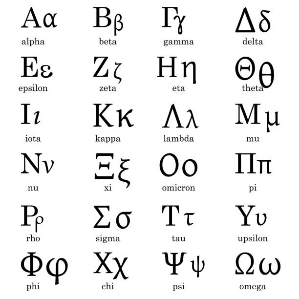

# 希腊字母

1. $\alpha$ - alpha - α
2. $\beta$ - beta - β
3. $\gamma$ - gamma - γ
4. $\delta$ - delta - δ
5. $\epsilon$ - epsilon - ϵ
6. $\zeta$ - zeta - ζ
7. $\eta$ - eta - η
8. $\theta$ - theta - θ
9. $\iota$ - iota - ι
10. $\kappa$ - kappa - κ
11. $\lambda$ - lambda - λ
12. $\mu$ - mu - μ
13. $\nu$ - nu - ν
14. $\xi$ - xi - ξ
15. $\omicron$ - omicron - ο
16. $\pi$ - pi - π
17. $\rho$ - rho - ρ
18. $\sigma$ - sigma - σ
19. $\tau$ - tau - τ
20. $\upsilon$ - upsilon - υ
21. $\phi$ - phi - ϕ
22. $\chi$ - chi - χ
23. $\psi$ - psi - ψ
24. $\omega$ - omega - ω

