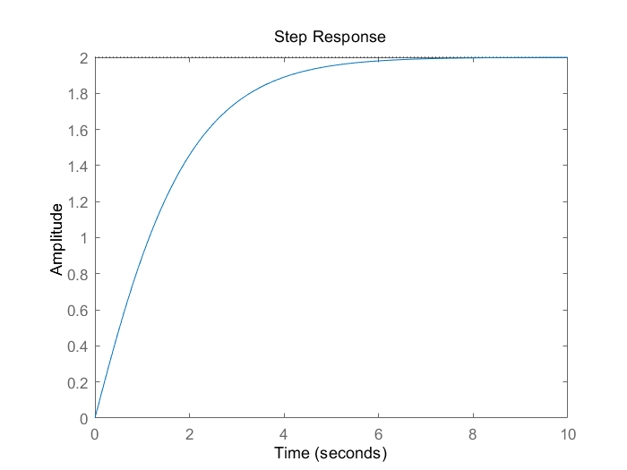
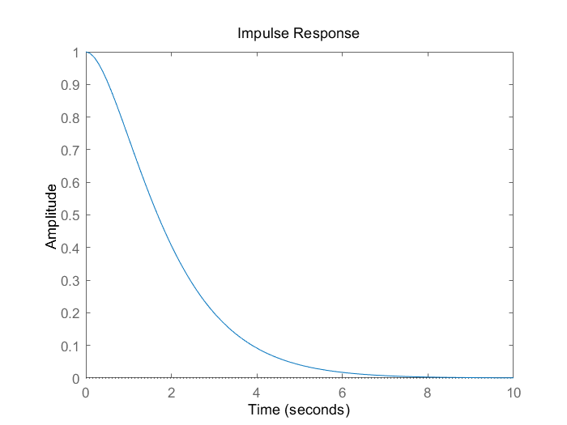
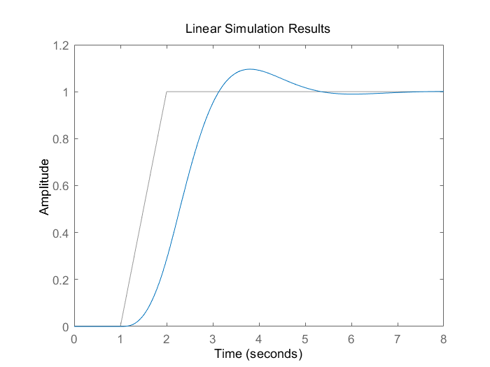
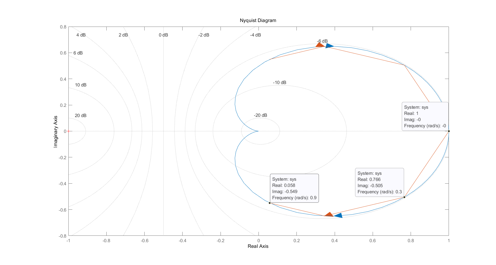
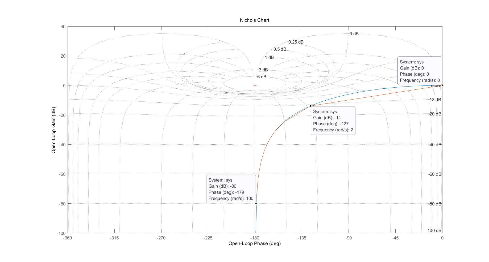
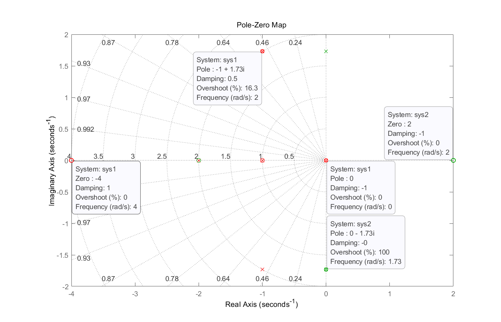
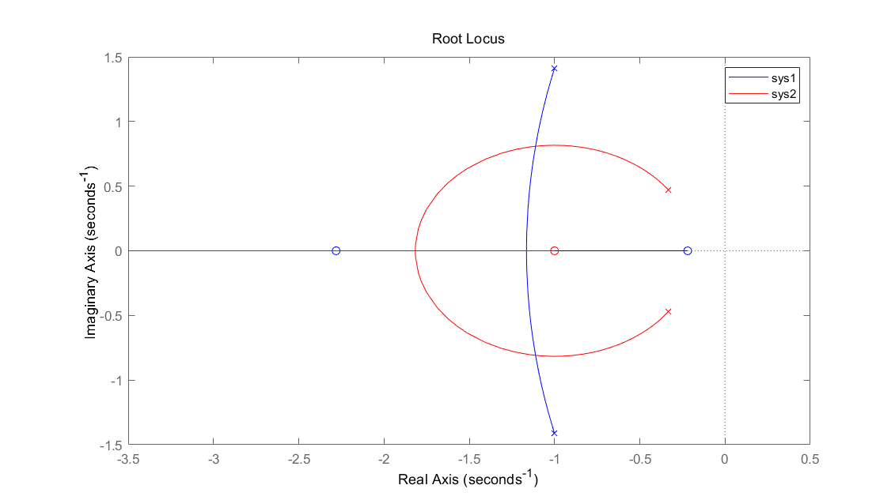
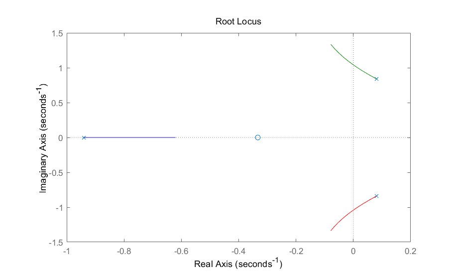
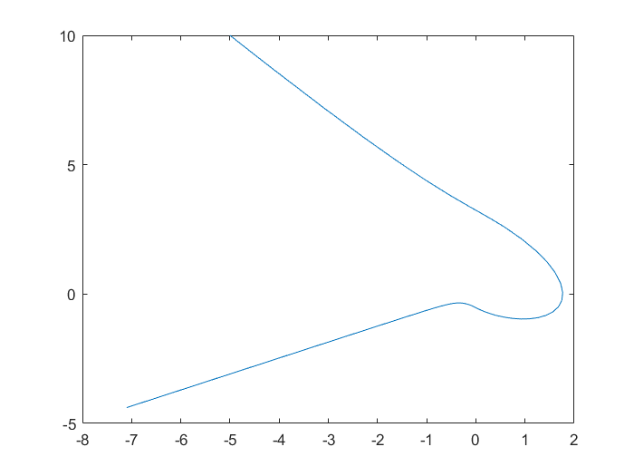
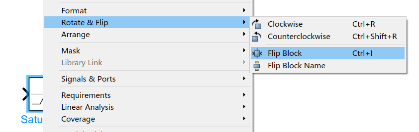

# 控制原理中常用的Matlab函数

[toc]

## Portals

英文帮助看不懂可以去这个网站
[MathWorks Support](https://ww2.mathworks.cn/help/)


# 自动控制

**传递函数**
1. sys=tf(numerator,denominator) 连续时间
2. sys=tf(numerator,denominator,ts) 离散时间，ts=-1
3. s=tf('s') 定义一个可以用于创建连续时间的有理式中的特殊变量s
4. z=tf('z',ts) 定义一个可以用于创建离散时间的有理式中的特殊变量z，ts=-1

```matlab
% input
numerator=[1,2];
denominator=[1,2,1];
sys=tf(numerator,denominator)

% output
sys =
      s + 2
  -------------
  s^2 + 2 s + 1
Continuous-time transfer function.
```

```matlab
% input
% 函数实参里's'、'z'是固定的，定义的变量名是可以替换的
% 创建系统时使用到参数要和之前定义的变量名一致
s=tf('s');
sys1=(s+1)/(s^2+2*s+1)
z=tf('z',-1);
sys2=(z+1)/(z^2+2*z+1)
% 上下一样
% q=tf('s');
% sys1=(q+1)/(q^2+2*q+1)
% p=tf('z',-1);
% sys2=(p+1)/(p^2+2*p+1)

% output
sys1 =
      s + 1
  -------------
  s^2 + 2 s + 1
Continuous-time transfer function.

sys2 =
      z + 1
  -------------
  z^2 + 2 z + 1
Sample time: unspecified
Discrete-time transfer function.
```

**阶跃响应**
step(sys,time)

time是以second为单位




**脉冲响应**
impulse(sys,time)

time是以second为单位



**任意输入响应**
1. lsim(sys,u,t)
2. lsim(sys,u,t,x0)

x0是初值

```matlab
numerator=[3];
denominator=[1,2,3];
sys=tf(numerator,denominator);
t = 0:0.04:8; 
u = max(0,min(t-1,1));
lsim(sys,u,t)
```



**串联、并联、反馈**
==串联==
1. sys=series(sys1,sys2)
2. sys=series(sys1,sys2,outputs1,inputs2) 用于多输入多输出

```matlab
outputs1 = [2 4];
inputs2 = [1 2];
sys = series(sys1,sys2,outputs1,inputs2)
% Connect the two systems in series by connecting outputs 2 and 4 of sys1 with inputs 1 and 2 of sys2.
```

==并联==
1. sys = parallel(sys1,sys2)
2. sys = parallel(sys1,sys2,inp1,inp2,out1,out2)


==反馈==
1. sys=feedback(sys1,sys2)  负反馈，sys2为反馈通路
2. sys=feedback(sys1,sys2,sign)  sign为+1/-1对应正反馈和负反馈
```matlab
% input
sys1=tf([1,2],[1,2,1]);
sys2=tf([1,2],[2,4,2]);
fsys1=feedback(sys1,sys2)
fsys2=feedback(sys1,sys2,-1)  % 前两个一样
fsys3=feedback(sys1,sys2,+1)

% output
fsys1 =
      2 s^3 + 8 s^2 + 10 s + 4
  ---------------------------------
  2 s^4 + 8 s^3 + 13 s^2 + 12 s + 6

fsys2 =
      2 s^3 + 8 s^2 + 10 s + 4
  ---------------------------------
  2 s^4 + 8 s^3 + 13 s^2 + 12 s + 6

fsys3 =
      2 s^3 + 8 s^2 + 10 s + 4
  --------------------------------
  2 s^4 + 8 s^3 + 11 s^2 + 4 s - 2
```

**频率响应**
1. [Gm,Pm,wcg,wcp]=margin(num,den)
2. [m,p]=bode(num,den,w)

==频响奈奎斯图==
nyquist(sys)
nyquist(sys,w)  可以用行向量指定几个离散的$\omega$值进行绘制

```matlab
sys=tf(1,[1,2,1])
hold on
nyquist(sys)
nyquist(sys,[0:0.3:1])
grid on
```



==频响尼科尔斯图==
1. nichols(sys)
2. nichols(sys,w)  可以用行向量指定几个离散的$\omega$值进行绘制

```matlab
sys=tf(1,[1,2,1])
hold on
nichols(sys)
nichols(sys,[0:0.3:1])
grid on
```


==计算频率响应==
计算对应$\omega$的频率响应结果

[H,wout] = freqresp(sys) 自动确定频率值
H = freqresp(sys,w) w可以是一个值也可以是一维数组

```matlab
% input
sys=tf([1,2],[1,2,1])
H=freqresp(sys,1)
H=freqresp(sys,[0:0.5:1])

% output
H =
   0.5000 - 1.0000i

H(:,:,1) =
   2.0000 + 0.0000i
H(:,:,2) =
   1.2800 - 1.0400i
H(:,:,3) =
   0.5000 - 1.0000i
```


==零极点图==
1. pzmap(sys) 可以指定颜色，并且同时画多个系统pzmap (sys1,'r',sys2,'g',sys3,'b')
2. [p,z] = pzmap(sys) 只求解，不画图

```matlab
% input
s=tf('s');
sys1=(s^2+5*s+4)/(5*s*((s^2+3*s+2)*(s^2+2*s+4)))
sys2=(s^2-4)/(s^2+3)
pzmap(sys1,'r',sys2,'g')
grid on
[p,z]=pzmap(sys1);
p,z

% output
sys1 =
               s^2 + 5 s + 4
  ---------------------------------------
  5 s^5 + 25 s^4 + 60 s^3 + 80 s^2 + 40 s
Continuous-time transfer function.

sys2 =
  s^2 - 4
  -------
  s^2 + 3
Continuous-time transfer function.

p =
   0.0000 + 0.0000i
  -1.0000 + 1.7321i
  -1.0000 - 1.7321i
  -2.0000 + 0.0000i
  -1.0000 + 0.0000i
z =
    -4
    -1
```


**根轨迹**
1. rlocus(sys)
2. rlocus(sys1,sys2,...)  可以同时指定颜色
3. rlocus(sys,k)
4. [r,k]=rlocus(sys) 只求值不画图
5. r=rlocus(sys,k) 只求值不画图

```matlab
% input
sys1=tf([2 5 1],[1 2 3])
sys2=tf([1,1],[3,2,1])
rlocus(sys1,'b',sys2,'r')
legend('sys1','sys2')
hold on
```



```matlab
sys = tf([3 1],[9 7 5 6]);
k=[0:0.5:4];
rlocus(sys,k)
```



# 现代控制

ss
https://ww2.mathworks.cn/help/control/ref/ss.html?s_tid=doc_ta

Matrix Computations
https://ww2.mathworks.cn/help/control/linear-algebra-for-control-design.html?s_tid=CRUX_lftnav

# 非线性控制


## 相平面法

### ode45

[ode45 Matlab官网](https://ww2.mathworks.cn/help/releases/R2020b/matlab/ref/ode45.html)

ode45 是一个通用型 ODE 求解器，是您解算大多数问题时的首选。但是，对于刚性问题或需要较高准确性的问题，其他 ODE 求解器可能更适合。


```matlab
[t,y] = ode45(odefun,tspan,y0)

% odefun是要求解的函数
% tspan 表示时间的跨度，tspan = [t0 tf]
% y0则便是要求解y的初值
```

```matlab
% Test.m文件
function sys = Test(t,x)
print('fuck')
sys = [x(2);-x(2)-abs(x(1))];

% 命令行
>> [t,x]=ode45('Test',[0,10],[-5;10]);
>> plot(x(:,1),x(:,2))
```




### Simulink


## 描述函数法


```matlab
% input

% output

```

D:\Project\Blog\Matlab\PrincipleOfControl\Pics


# Simulink小技巧

## 反转原件

