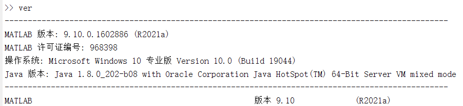
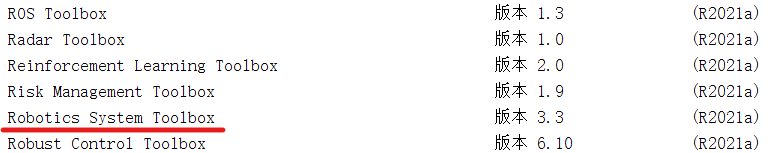
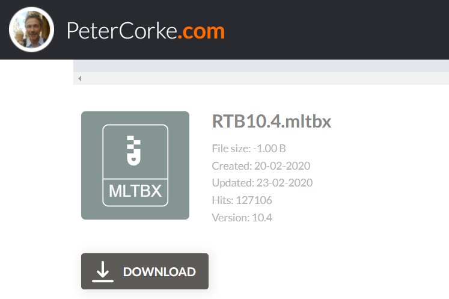
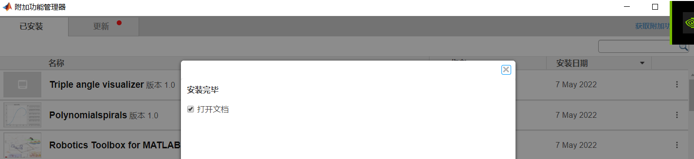
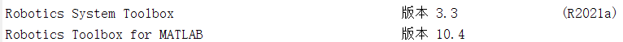
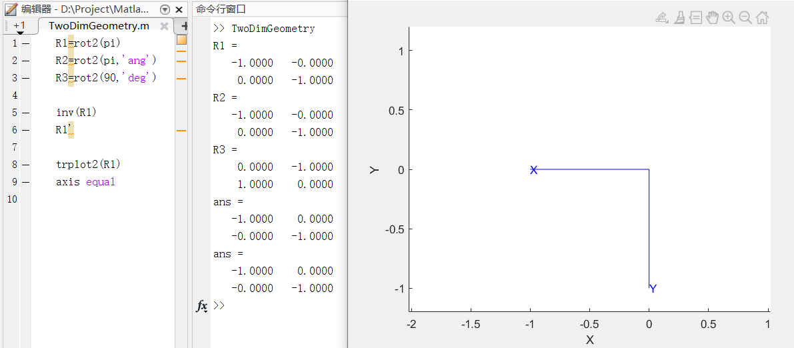
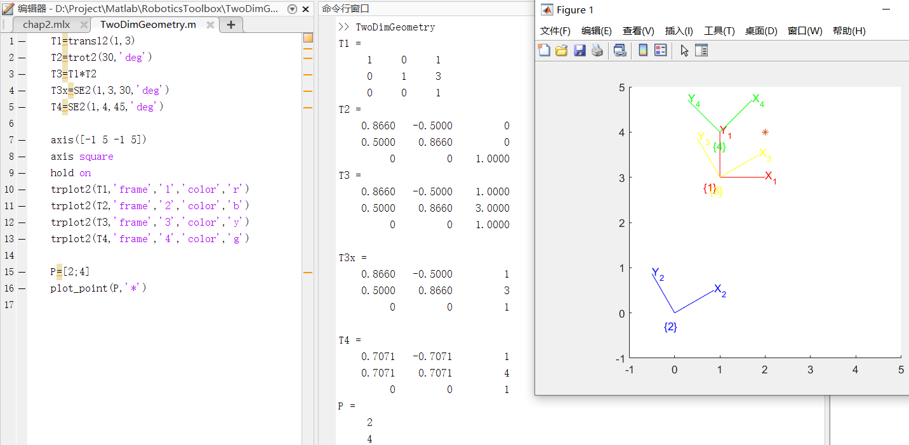
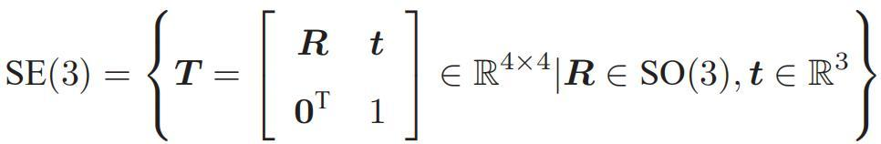
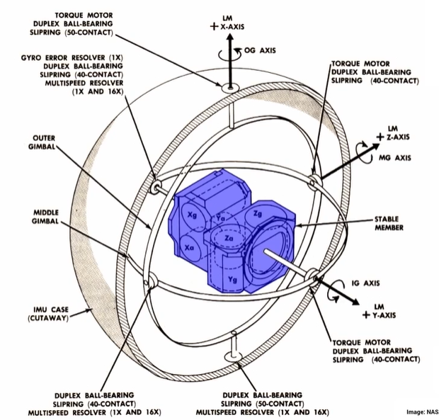
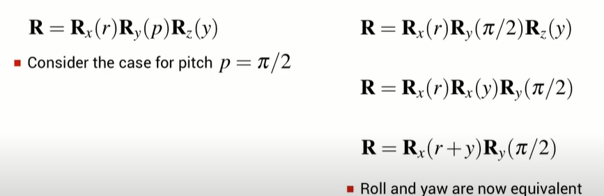

# Matlab Robotics Toolbox

[toc]

## Portals

[ROBOTICS TOOLBOX 官网](https://petercorke.com/toolboxes/robotics-toolbox/)

[机器视觉与控制 MATLAB算法基础 配套资源](https://petercorke.com/rvc/home/code-examples/)

[ROBOT ACADEMY 昆士兰科技大学](https://robotacademy.net.au/)

# 安装机器人工具箱
在命令行窗口输入ver

可以看到有Matlab自带的工具箱


去ROBOTICS TOOLBOX官网下载 RTB.mltbx


移动到目标位置，在Matlab中双击打开

安装提示

再次输入ver进行确认，安装成功



# ROBOT ACADEMY 昆士兰科技大学

## 2D Geometry

**2D Rotation**
```matlab
% 二维旋转矩阵
R=rot2(num) % 默认弧度制
R=rot2(num,'ang') % 弧度制
R=rot2(num,'deg') % 角度制

% 对于选择矩阵，转置等于逆
inv(R) % 求逆
R' % 求转置

% 可视化
trplot2(R) % transform plot
axis=equal % 让坐标轴标度相同
```




**2D Rotation and Translation**
```matlab
transl2(x,y) % 仅平移，输出3*3，旋转2*2部分为单位阵
trot2(xxx,"deg/ang") % 内容和rot2相同，输出3*3，平移部分为0
% 平移+旋转
transl2(x,y)*trot2(xxx,"deg/ang") % 这两个相乘相当于直接写，都是对于原坐标轴（fixed axis），所以线进行旋转再进行平移，所以旋转在后，平移在前
SE2(x,y,angle,"deg/ang")

% 可视化
axis([a b c d]) % 坐标轴范围
axis square
hold on
trplot2(T,'frame','num','color','c') % 'frame'后面跟'num'，该frame自身和坐标轴上会有该num。'color'后面跟一个字符表示的颜色。

plot_point(P,'*') % P是一个二维列向量，*是标记样式
```



可以看出T3和T3x是一样的，主要SE2的se要大写

SE应该是special euclidean的意思special euclidean group




## 3D Geometry

**3D 旋转**
```matlab
% 绕单个转轴，似乎只能用角度制
R=rotx(num)
R=roty(num)
R=rotz(num)

det(R)
inv(R)
R'

trplot(R) % 有很多option，可以添加label，设置颜色，添加箭头
```

**旋转操作不可交换性**
```matlab
Rx=rotx(30);
Ry=roty(45);

% 显而易见，这里考虑的是Euler-Angle，不是绕着固定轴，所以先进行的写在前面，后进行的在后面
disp("先x，后y")
Rxy=Rx*Ry
disp("先y，后x")
Ryx=Ry*Rx

result:
先x，后y
Rxy =
    0.7071         0    0.7071
    0.3536    0.8660   -0.3536
   -0.6124    0.5000    0.6124
先y，后x
Ryx =
    0.7071    0.3536    0.6124
         0    0.8660   -0.5000
   -0.7071    0.3536    0.6124
```

**旋转矩阵序列**
```matlab
eul2r(theta1,theta2,theta3) % ZYZ 默认角度制

eul2r(0,0,45)

ans =
    0.7071   -0.7071         0
    0.7071    0.7071         0
         0         0    1.0000
```

```matlab
% tr2eul 默认弧度制
R=[     0.7071   -0.7071   0;
        0.7071    0.7071   0;
        0         0        1.0000]
tr2eul(R,'deg')
tr2eul(R)

ans =
     0     0    45
ans =
         0         0    0.7854

```

有时候用eul2r的结果，反向通过tr2eul求出的eul和输入eul2r的结果不同，差2pi。但是这些eul对应的旋转矩阵都是相同的。

RPY（可以理解为一个飞机，飞机头指向X正方向）
1. Roll(X) 滚转角
2. Pitch(Y) 俯仰角
3. Yaw(Z) 偏航角

```matlab
R=rpy2r(a,b,c) % XYZ 默认角度制
tr2rpy(R,'deg') % 默认弧度制

R=rpy2r(0.1,0.2,0.3)
tr2rpy(R,'deg')

R=rpy2r(45,0,0)
rotx(45)

result:
R =
    1.0000   -0.0052    0.0035
    0.0052    1.0000   -0.0017
   -0.0035    0.0017    1.0000
ans =
    0.1000    0.2000    0.3000
R =
    1.0000         0         0
         0    0.7071   -0.7071
         0    0.7071    0.7071
ans =
    1.0000         0         0
         0    0.7071   -0.7071
         0    0.7071    0.7071
```

注意顺序
```matlab
% 还是euler方式，不是fixed frame，所以先进行的变换写在前面
R=rpy2r(45,90,30) % 默认zyx

R=rpy2r(45,90,30,'xyz')
rotx(45)*roty(90)*rotz(30)

R=rpy2r(45,90,30,'zyx')
rotz(30)*roty(90)*rotx(45)

% result
R =
         0    0.2588    0.9659
         0    0.9659   -0.2588
   -1.0000         0         0
R =
         0         0    1.0000
    0.9659    0.2588         0
   -0.2588    0.9659         0
ans =
         0         0    1.0000
    0.9659    0.2588         0
   -0.2588    0.9659         0
R =
         0    0.2588    0.9659
         0    0.9659   -0.2588
   -1.0000         0         0
ans =
         0    0.2588    0.9659
         0    0.9659   -0.2588
   -1.0000         0         0
```

**奇点Singularity&万向节锁Gimbal Lock**
[万向节锁定](https://www.bilibili.com/video/BV1e3411y7RX/)

万向节用于航天器导航，中间蓝色部分姿态保持恒定（相当于和fixed frame只有一个平移关系）。通过航天器和中间部分的角度偏差可以推算航天器姿态。


当绕中间的轴旋转90°时，z轴被转到之前的x轴。此时旋转动作可以进行等效。通过对绕转轴顺序的调整（连接件顺序），可以避免万向节锁，如上图所示（xzy）。对于上图，如果不考虑连接件运动顺序限制，当y逆时针旋转90°时，z轴和x轴重合，原先z轴的旋转自由度丢失。


如果有一个轴经常会在90度运动，则它不应该作为中间的轴。

同时对于动画制作，对旋转运动进行插值的时候也会带来问题（可以用四元数解决）。


https://robotacademy.net.au/masterclass/3d-geometry/?lesson=98


# 机器视觉与控制 MATLAB算法基础


