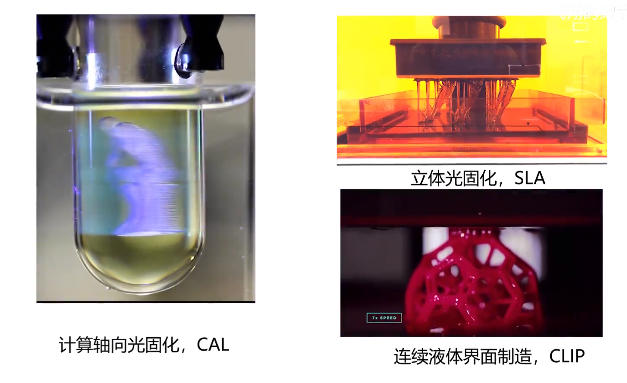
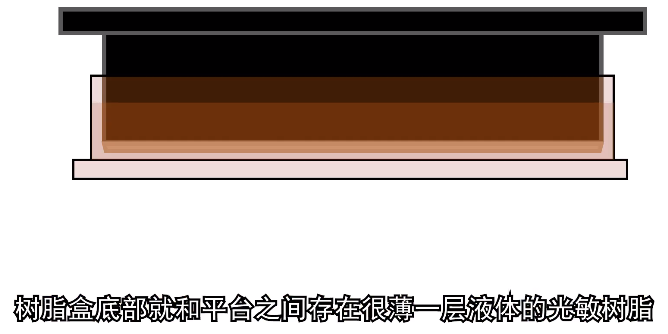
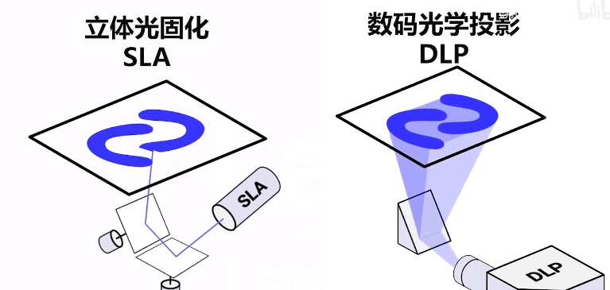
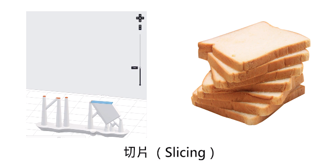
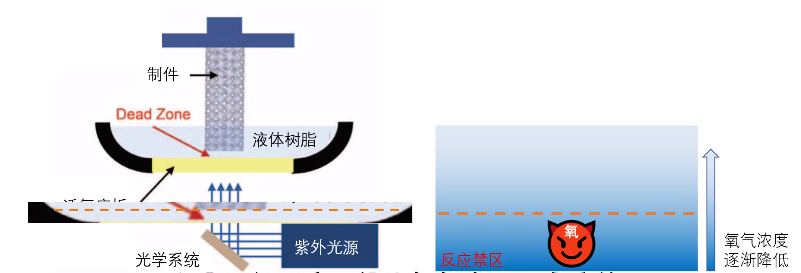
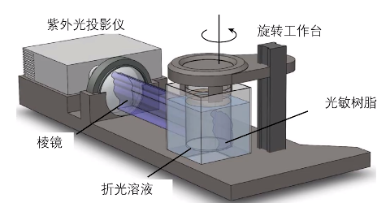
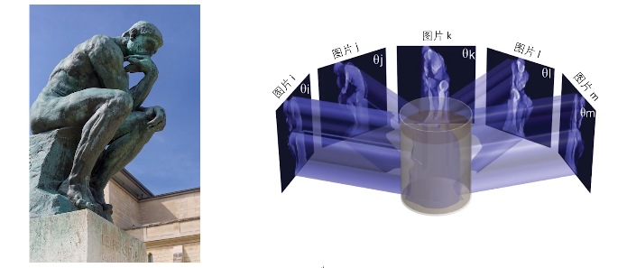
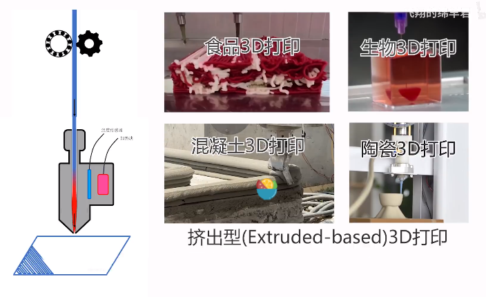

# 3D 打印

# 光固化3D打印

[光固化3D打印的前世今生 --- B站视频](https://www.bilibili.com/video/BV1Lb4y1d7tu/)

[3D打印技术之父：Charles W. Hull --- 知乎](https://zhuanlan.zhihu.com/p/26339467)

3D打印 = 增材制造

数控机床(切割、打磨、抛光) = 减材制造

1981年， 小玉秀男 发表文章

1986年，美国科学家 Charles Hull 开发了第一台商业3D印刷机

stereolithography apparatus (SLA) 立体光固化装置

原理:
1. 组成
   1. 光学和控制系统
   2. 树脂容器(底部可通过紫外光)
   3. 打印平台(可拆卸的)
   4. 外罩
   5. 光敏树脂
2. 工作过程
   1. 倒入光敏树脂
   2. 平台下移，与树脂盒之间存在薄光敏树脂
   
   3. 紫外光在光敏树脂上扫描或投影固化(类似于做指甲)
   4. 扫描方式
   
      1. 光点逐行扫描(传统SLA)
      2. 整片投影(数码光学投影)
   5. 打印会形成支撑材料，避免悬空
3. 软件会将模型进行切片(Z轴)
   
4. 切片厚度 = 层厚(Layer Thickness) = 每打印一层后平台上升的距离 = 平台最初于树脂盒底部的距离
5. 光固化打印机分辨率 = 层厚，层厚越小，模型越精确
6. 缺点
   1. 贵(光敏树脂)
   2. 慢(需要不断提升平台引入新树脂，提升平台时无法扫描)
   3. 材料选择面窄，唯二两种常用光敏树脂
      1. 丙烯酸类
      2. 环氧类
7. CLIP (Continuous Liquid Interface Production) (慢的解决方案)
   1. 氧气不利于树脂被紫外光固化
   2. 使用透氧玻璃底板
   3. 树脂盒底部始终存在一层无法固化的树脂
   
   4. 相当于形成一个液体树脂不断流入的通道
   5. 可以做到一边扫描一边提升平台
8. CAL (Computed Axial Lithography)
   
   

# 金属3D打印

[金属3D打印是怎么被想到的？ --- B站视频](https://www.bilibili.com/video/BV15h4y1g7Bt/)

[17种金属3D打印技术 --- ](https://zhuanlan.zhihu.com/p/397964282)

把小金属粉末铺在平面上，将想要连接的地方局部加热，使其融化，冷却后就固化了

使用激光在平面上扫描，使得局部产生高温，融化粉末

本质上是固态和液态的转化

系统组成
1. 激光系统(扫描需要的形状)
2. 铺粉系统(带有长条形狭缝的漏斗)

选择性激光烧结 Selective Laser Sintering(SLS) (烧结是指激光功率不够熔融，只是使得金属表面粘接)

选择性激光熔融 Selective Laser Melting(SLM) (使用功率更高的激光器，使得被照射部分粉末全部熔融)

电子束选择性熔融 Electron Beam Selective Melting(EBSM) (使用能量更高的电子束)

激光近净成型 Laser Engineered Net Shaping(LENS) (粉枪喷出金属粉末，并在喷出部分局部施加激光) 几乎没有材料损耗，要多少材料，喷多少粉末 = 直接能量沉积 Direct Energy Deposition (DED)

把DED中，金属粉末->金属丝，激光->电子束 Electron Beam Freeform Fabrication 电子束自由成型制造

问题
1. 孔隙
   1. 激光功率过大导致材料气化留下小孔
   2. 激光功率不足导致材料熔融不完全留下孔隙
2. 分层
   1. 残余应力导致冷却过程中的翘曲和分层
   2. 打印过程中的热应力导致的分层开裂
3. 球化问题 balling effect，激光熔融过程中出现的一种微观上球形结构，影响打印物体表面粗糙度和力学性能
4. 上述问题都随原始材料的组分，加工环境及激光参数而变化，导致打印物性能不确定
5. 激光设备的购入成本、维护成本、安全问题

# 熔融沉积成形 FDM

[一只塑料小青蛙是怎么让3D打印风靡全球的？ --- B站视频](https://www.bilibili.com/video/BV1C94y147Hy/)

Scott Crump

组成
1. 机械部分(自动化挤出热熔胶)
2. 计算机部分(设计三维模型，软件切片，控制器完成打印过程)

工业 -> 民用

挤出过程 : 利用材料的流动性塑性，利用材料冷却过程固定形态 (牙膏、裱花 非牛顿流体)

不用加热就可打印 : Direct Ink Writing 墨水直写成型

食物3D打印

生物3D打印

混凝土3D打印 (非牛顿流体塑性，硬化过程中增加强度)

陶瓷3D打印 (非牛顿流体糊状物打印初始形状，放入陶瓷炉烧制，帮助产生非牛顿流体特性的材料在烧制过程中分解)

冷读直写成型 Direct Cryo Writing (DCW) (用冷冻的方法更好的将流体固定住)

