# Blender

**目录**
[toc]

# Blender 官网

[Blender 官网](https://www.blender.org/)

[Blender 官网 参考手册](https://docs.blender.org/manual/zh-hans/3.6/index.html)

[BlenderProject](https://projects.blender.org/)


[Chat Companion](https://blendermarket.com/products/chat-companion)

# 八个案例教程带你从0到1入门blender【已完结】

[八个案例教程带你从0到1入门blender【已完结】](https://www.bilibili.com/video/BV1Bt4y1E7qn)

## 01 初识 Blender

Edit -> Preferences

Interface 改 中文 和 分辨率

System 可以看 渲染设备 改 撤销次数

开启自动保存设置

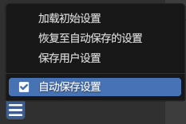

修改键位映射

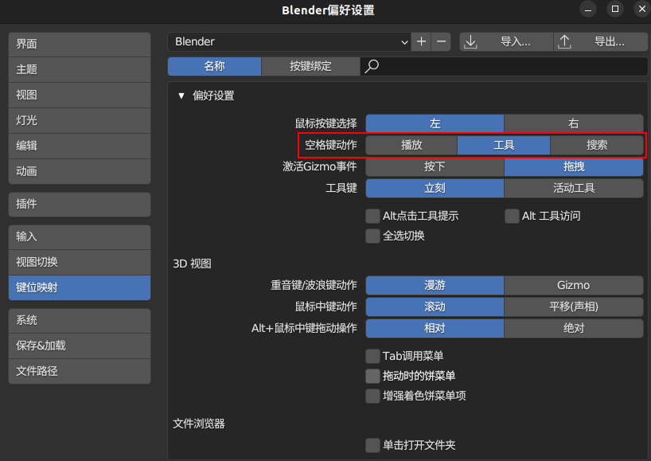

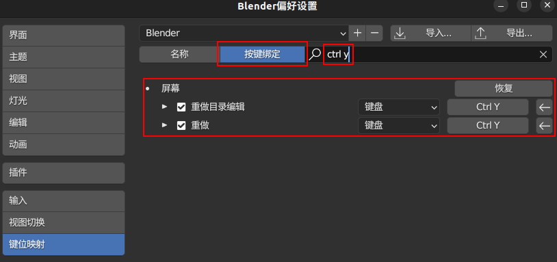

修改拾色器

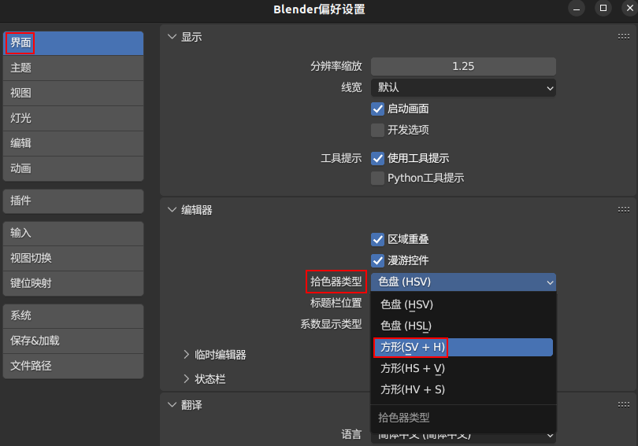


游标在哪，物体就添加在哪

**注意英文输入法问题**

切换视图
1. ~`键(1的左侧)
2. 右上角的坐标系圆圈

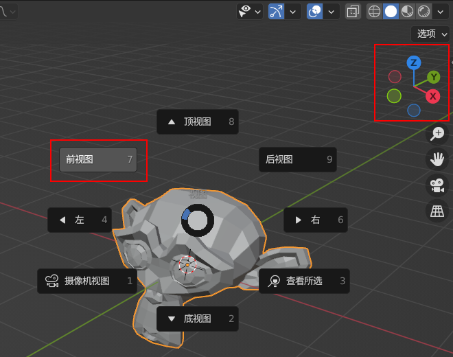

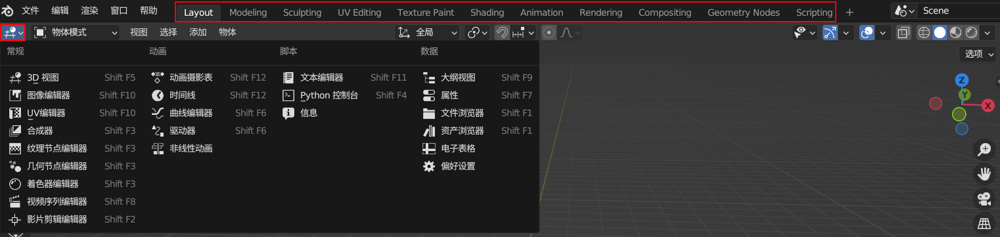

点击物体出现常用功能

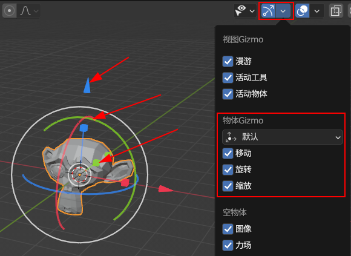

边缘线轮廓显式更清晰

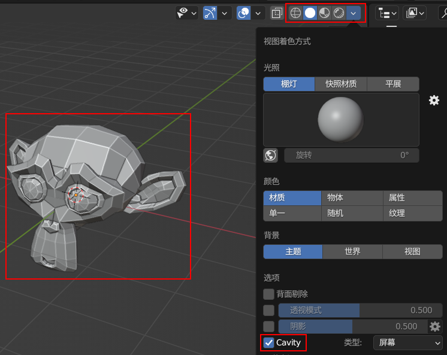


## 02 案例01 萌三兄弟

**应用**变换值实质上是重置物体的位置、旋转或缩放值，视觉上物体仍位于原本位置。物体原点被移动到全局原点，清空旋转，缩放值重置为1。

案例说明，左侧倒角由于之前经过拉伸操作发生了形变，因此需要将**缩放操作**进行一个**应用**

个人相当于将原有物体固定下来，成为新物体，切断和原图形的联系

Ctrl + A

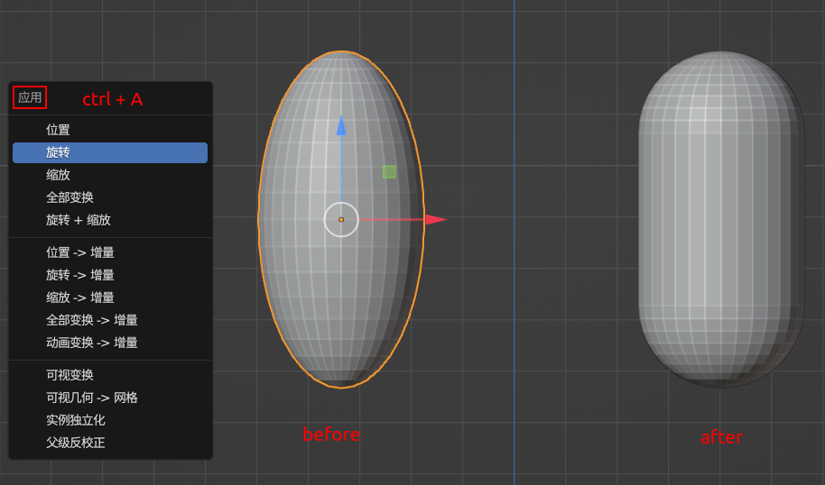

添加修改器 (倒角修改器)

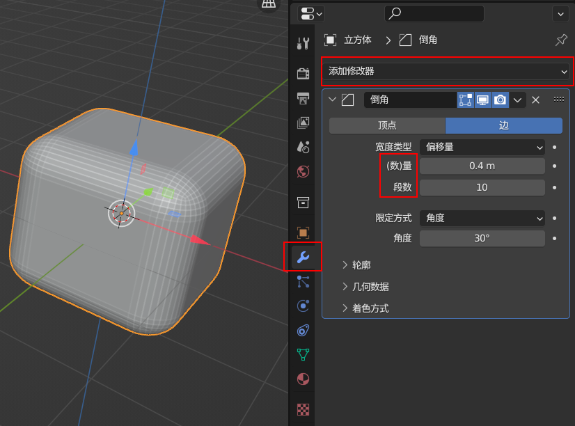

连续按2次 R 为自由旋转，如果同时旋转多个物体，可以选择 **各自的原点** 进行同步旋转

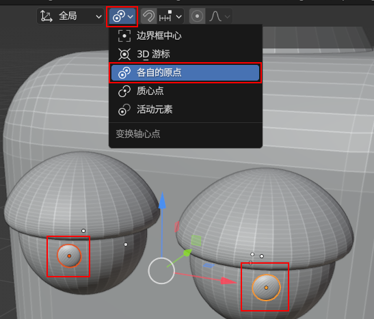

分类打组

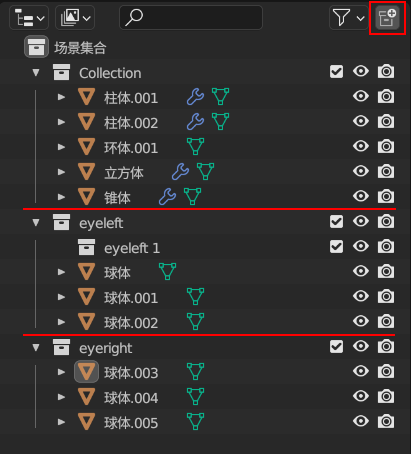


最终结果 (颜色调的有点屎，没有审美可言)


# Linux 安装 & 卸载

## snap 方式

```bash
snap install blender --classic
```

使用该方法进行安装的好处是可以自动安装Blender的更新。与单个程序包管理器相比，Snap的Blender应该具有更一致的发布。

## tar.xz 方式

直接删除解压的目录 和 .desktop
