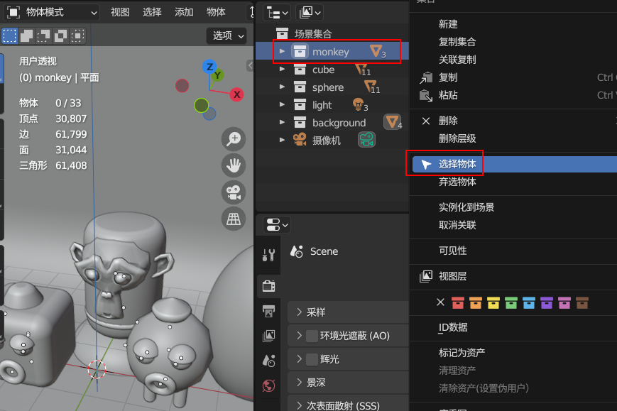

# Blender

**目录**
[toc]

# Blender 官网

[Blender 官网](https://www.blender.org/)

[Blender 官网 参考手册](https://docs.blender.org/manual/zh-hans/3.6/index.html)

[BlenderProject](https://projects.blender.org/)

[Chat Companion](https://blendermarket.com/products/chat-companion)

[Blender 键盘快捷键](https://wangchujiang.com/reference/docs/blender.html#:~:text=Blender%20%E4%B8%AD,187%20%E4%B8%AA%E9%94%AE%E7%9B%98%E5%BF%AB%E6%8D%B7%E9%94%AE%E7%9A%84%E8%A7%86%E8%A7%89%E5%A4%87%E5%BF%98%E5%8D%95)

# Blender 建模入门教程 -- 阿发你好

[Blender 建模入门教程 -- 阿发你好](https://www.bilibili.com/video/BV1fb4y1e7PD/)


# 八个案例教程带你从0到1入门blender【已完结】

[八个案例教程带你从0到1入门blender【已完结】](https://www.bilibili.com/video/BV1Bt4y1E7qn)

## 01 初识 Blender

Edit -> Preferences

Interface 改 中文 和 分辨率

System 可以看 渲染设备 改 撤销次数

开启自动保存设置


修改键位映射


修改拾色器


游标在哪，物体就添加在哪

**注意英文输入法问题**

切换视图
1. ~`键(1的左侧)
2. 右上角的坐标系圆圈


点击物体出现常用功能


边缘线轮廓显式更清晰


## 02 案例 : 萌三兄弟

**应用**变换值实质上是重置物体的位置、旋转或缩放值，视觉上物体仍位于原本位置。物体原点被移动到全局原点，清空旋转，缩放值重置为1。

案例说明，左侧倒角由于之前经过拉伸操作发生了形变，因此需要将**缩放操作**进行一个**应用**

个人相当于将原有物体固定下来，成为新物体，切断和原图形的联系

Ctrl + A


添加修改器 (倒角修改器(平面拐角也可以倒角))


连续按2次 R 为自由旋转，如果同时旋转多个物体，可以选择 **各自的原点** 进行同步旋转


平直着色 (线条分明)


平滑着色 (平滑过渡)


调整摄像机视图(按`/~键后按1进入视图)，先勾选锁定摄像机到视图方位进行角度调整，再取消勾选


分屏操作，在右侧边线处右键，选择分割方式


开关网格线


分类打组


分类打组可以便于选择整个物体




设置渲染结果分辨率


查看渲染效果 (进入渲染模式)


设置渲染引擎
1. Eevee 快
2. Cycles 慢 渐进式


材质设置


世界环境设置 (亮度也会影响场景)


光源设置 (修改能量)


渲染图像


最终结果 (颜色调的有点屎，没有审美可言)


## 03 动画基础

动画 —— 记录 不同时间的 **属性变换**

动画离不开 时间、变量、属性 ，缺一不可

小圆点表示动画属性


点击小圆点后，数值变为黄色，第一帧处打上了关键帧


设置新关键帧位置，并使物体移动，红色表示当前位置未设置关键帧


点击小方块后记录关键帧


选择物体，使用快捷键 i 插入关键帧


## 03 案例 : 积木组合

线框 + 透显 模式


Alt + Z	透显模式

Shift + Z	线框模式

可以先在隔离模式(/)下利用线框模式选点，再退出隔离模式进行调整

吸附需要在编辑模式中使用


添加文本


修改文本需要再编辑模式中

设置中心位置


或


给文字添加实体化修改器


偏移量 (+1表示正偏，-1表示反偏，0表示两边对称)

桥接循环边 (alt + 鼠标 --> 选中循环边)


Shift + D 关联复制 (牵一发而动全身)


自定义倒角类型


阵列修改器


添加曲线


Tab 进入曲线修改模式


细分曲线


给曲线添加厚度


材料自发光

面光用于体现轮廓

阴影有问题的解决方法


最终结果


# Linux 安装 & 卸载

## snap 方式

```bash
snap install blender --classic
```

使用该方法进行安装的好处是可以自动安装Blender的更新。与单个程序包管理器相比，Snap的Blender应该具有更一致的发布。

## tar.xz 方式

直接删除解压的目录 和 .desktop
