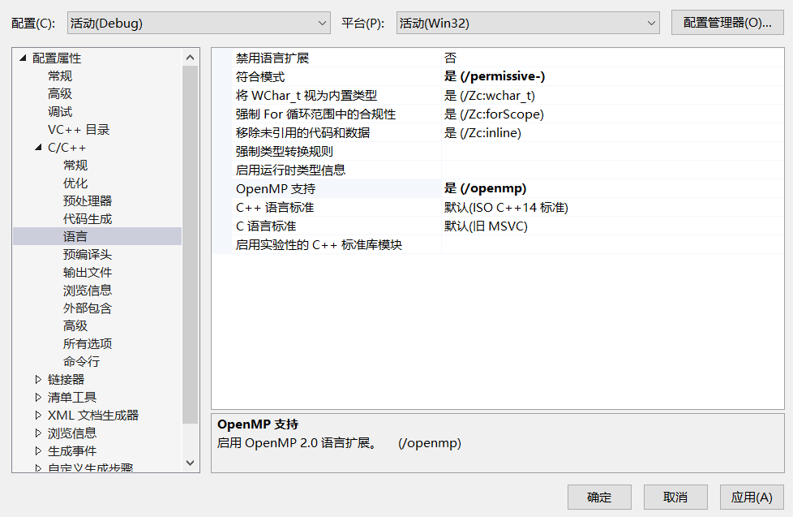
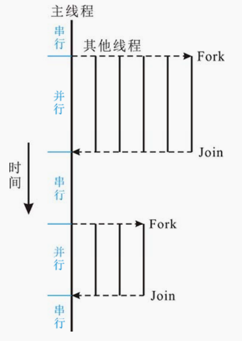
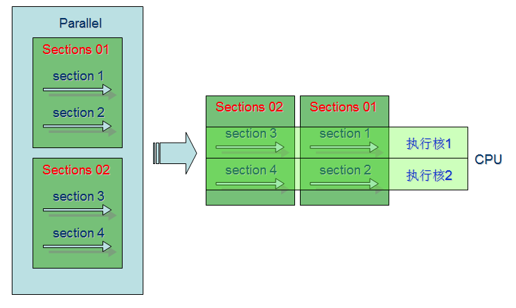
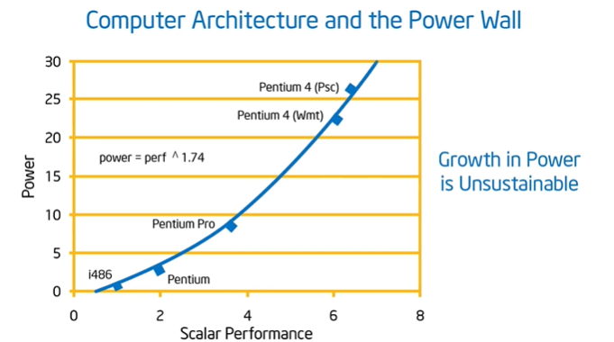
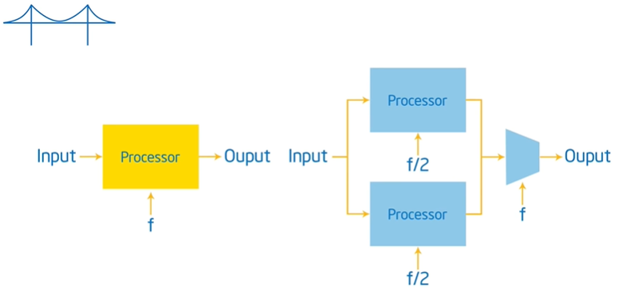
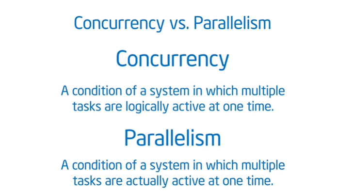
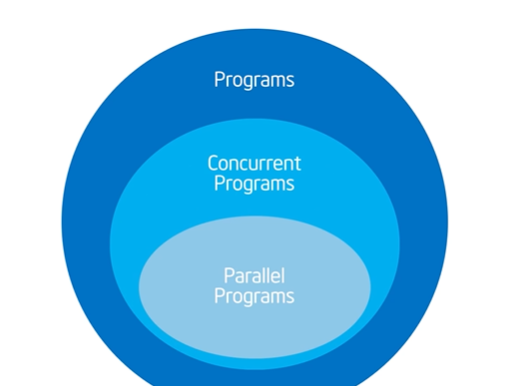
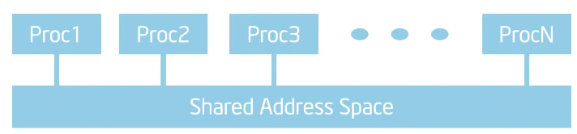
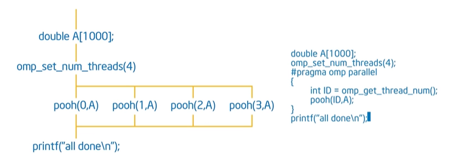

# OpenMP共享内存并行编程

## 00.传送门

https://www.freesion.com/article/66801183997/

[OpenMP共享内存并行编程详解](https://www.cnblogs.com/liangliangh/p/3565234.html)

[OpenMP编程总结表](https://www.cnblogs.com/liangliangh/p/3565136.html)

## 01.介绍

并行计算机可以简单分为共享内存和分布式内存
1. 共享内存就是多个核心共享一个内存，目前的PC就是这类（不管是只有一个多核CPU还是可以插多个CPU，它们都有多个核心和一个内存）
2. 一般的大型计算机结合分布式内存和共享内存结构，即每个计算节点内是共享内存，节点间是分布式内存。
 
想要在这些并行计算机上获得较好的性能，进行并行编程是必要条件。

目前流行的并行程序设计方法是，分布式内存结构上使用MPI，共享内存结构上使用Pthreads或OpenMP。

和Pthreads相比，OpenMP更简单，对于关注算法、只要求对线程之间关系进行最基本控制（同步，互斥等）的我们来说，OpenMP再适合不过了。

<br>
<br>

## 02.创建OpenMP程序



在visual studio中打开对OpenMP的支持

如果是空项目则需要先创建一个源文件，否则没有C/C++选项

```cpp
#include <omp.h> 
#include <iostream> 

int main()
{
	std::cout << "parallel begin:\n";
#pragma omp parallel |编译指导语句|并行块开始
	{
		std::cout << omp_get_thread_num() << " ";
		|调用库函数，返回当前执行代码的线程的编号
	}|并行块结束
	std::cout << "\nparallel end.\n";
	std::cin.get();
	return 0;
}
```

可以看到，我的电脑是12线程的

主线程应该是0

<br>
<br>

## 03.并行原理

OpenMP由**Compiler Directives（编译指导语句）**、**Run-time Library Functions（库函数）**组成，另外还有一些和OpenMP有关的**Environment Variables（环境变量）、Data Types（数据类型）以及_OPENMP宏定义**。之所以说OpenMP非常简单，是因为，所有这些总共只有50个左右，OpenMP2.0 Specification仅有100余页。

共享内存计算机上并行程序的基本思路就是使用多线程，从而将可并行负载分配到多个物理计算核心，从而缩短执行时间（同时提高CPU利用率）。在共享内存的并行程序中，标准的并行模式为fork/join式并行，这个基本模型如下图示：



其中，主线程执行算法的顺序部分，当遇到需要进行并行计算式，主线程派生出（创建或者唤醒）一些附加线程。在并行区域内，主线程和这些派生线程协同工作，在并行代码结束时，派生的线程退出或者挂起，同时控制流回到单独的主线程中，称为汇合。

简单来说，OpenMP程序就是在一般程序代码中加入Compiler Directives，这些Compiler Directives指示编译器其后的代码应该如何处理（是多线程执行还是同步什么的）。所以说OpenMP需要编译器的支持。

和Pthreads不同，OpenMP下程序员**只需要设计高层并行结构，创建及调度线程均由编译器自动生成代码完成**。

<br>
<br>

## 04.Compiler Directives

### 一般格式

```cpp
#pragma omp directive-name [clause[ [,] clause]...]
```


其中“[]”表示可选，每个Compiler Directive作用于其后的语句（C++中“{}”括起来部分是一个复合语句）。

directive-name可以为（共11个，只有前4个有可选的clause）：
|directive name|功能|
|---|---|
|parallel |定义一个parallel region，该parallel region将被多个线程并行执行|
|for |将C++ for循环的多次迭代划分给多个线程（C++ for需符合一定限制），块末尾隐含一个barrier|
|sections |定义包含多个section块的代码区，这些section块将被多个线程并行执行，section块用section定义，块末尾隐含一个barrier|
|single |代码将仅被一个线程执行，具体是哪个线程不确定，块末尾隐含一个barrier|
|atomic |变量将被原子的更新，expression-stmt需是 a++, a--, ++a, --a, a?=expr 之一，其中 ? 可以为 +, *, -, /, &, ^, \|, <<, >>|
|barrier |定义一个同步，所有线程都执行到该行后，所有线程才继续执行后面的代码|
|critical |定义一个临界区，保证同一时刻只有一个线程访问临界区|
|flush |所有线程对所有共享对象具有相同的内存视图（view of memory），例如，确保将变量的新值写回内存或从内存读取，而不是使用以前读到寄存器或缓存中的值|
|master |代码将仅被主线程执行，块末尾没有隐含的barrier|
|ordered |使用在有ordered clause的for directive（或parallel for）中，代码将被按迭代次序执行（像串行程序一样）|
|threadprivate |将全局或静态变量声明为线程私有的|

clause（子句）相当于是Directive的修饰，定义一些Directive的参数什么的。clause可以为（共13个）：
|clause|功能|可用于的directive list|
|---|---|---|
|copyin(variabl-list) |让threadprivate声明的变量的值和主线程的值相同|parallel|
|copyprivate(variable-list) |不同线程中的私有变量的值在所有线程中共享|single|
|default(shared \| none) |参数shared同于将所有变量用share clause定义，参数none指示对没有用private, shared, reduction, firstprivate, lastprivate clause定义的变量报错|parallel|
|firstprivate(variable-list) |private基础上，拷贝共享变量值初始化线程私有副本|parallel, for, sections, single|
|if(expression) |条件地进行并行化||
|lastprivate(variable-list) |private基础上，将执行最后一次迭代（for）或最后一个section块（sections）的线程的私有副本拷贝到共享变量|for, sections|
|nowait ||
|num_threads(num) |覆盖默认线程数||
|ordered ||
|private(variable-list) |每个线程有一个变量的私有副本，调用默认构造函数初始化|parallel, for, sections, single|
|reduction(operation: variable-list) |定义对变量进行归约操作|parallel, for, sections|
|schedule(type[,size]) ||
|shared(variable-list) |声明变量为线程间共享，相对于private|parallel|

### 详细解释

#### parallel

parallel表示其后语句将被多个线程并行执行

```cpp
#pragma omp parallel//后面的语句（或者，语句块）被称为parallel region
```

#### if

可以用if clause条件地进行并行化

判断是否要并行

#### num_thread

用num_threads clause覆盖默认线程数：

```cpp
int a = 0;
#pragma omp parallel if(a) num_threads(6)
{
    std::cout << omp_get_thread_num();
}

int a=7;
#pragma omp parallel if(a) num_threads(6)
{
    std::cout << omp_get_thread_num();
}
```

多个线程的执行顺序是不能保证的。

#### for

我们一般并不是要对相同代码在多个线程并行执行，而是**对一个计算量庞大的任务，对其进行划分，让多个线程分别执行计算任务的每一部分，从而达到缩短计算时间的目的**。

这里的关键是，每个线程执行的计算互不相同（操作的数据不同或者计算任务本身不同），多个线程协作完成所有计算。

OpenMP **for指示将C++ for循环的多次迭代划分给多个线程**（划分指，每个线程执行的迭代互不重复，所有线程的迭代并起来正好是C++ for循环的所有迭代）。

这里C++ for循环需要一些限制从而能在执行C++ for之前确定循环次数，例如C++ **for中不应含有break**等。

OpenMP for作用于其后的第一层C++ for循环。

```cpp
const int size = 1000;
int data[size];
#pragma omp parallel
{
    #pragma omp for// schedule...
    for(int i=0; i<size; ++i)
        data[i] = 123;
}
```

默认情况下，上面的代码中，程序执行到“#pragma omp parallel”处会派生出x个线程，加上主线程x+1个线程.C++ for的1000次迭代会被分成连续的x+1段

具体C++ **for的各次迭代在线程间如何分配可以由schedule(type[,size])指示**，后面会具体说。

正确使用for directive有两个条件：
1. C++ for**符合特定限制，否则编译器将报告错误**
2. C++ for的**各次迭代的执行顺序不影响结果正确性**，这是一个逻辑条件

#### schedule

schedule(type[,size])设置C++ for的多次迭代如何在多个线程间划分
1. schedule(static, size)将所有迭代按每连续size个为一组，然后将这些组轮转分给各个线程。
2. schedule(dynamic, size)同样分组，然后依次将每组分给目前空闲的线程（故叫动态）
3. schedule(guided, size) 把迭代分组，分配给目前空闲的线程，最初组大小为迭代数除以线程数，然后逐渐按指数方式（依次除以2）下降到size
4. schedule(runtime)的划分方式由环境变量OMP_SCHEDULE定义

#### sections

除了循环结构可以进行并行之外，还可以进行**分段并行**（parallel section）

```cpp
int main()
{
#pragma omp parallel num_threads(4)
	{
#pragma omp sections //第1个sections
		{
#pragma omp section //sections1的section1
			cout << "section 1 线程ID：" << omp_get_thread_num() << "\n";
#pragma omp section //sections1的section2
			cout << "section 2 线程ID：" << omp_get_thread_num() << "\n";
		}
#pragma omp sections //第2个sections
		{
#pragma omp section //sections2的section1
			cout << "section 3 线程ID：" << omp_get_thread_num() << "\n";
#pragma omp section //sections2的section2
			cout << "section 4 线程ID：" << omp_get_thread_num() << "\n";
		}
	}
	return 0;
}
```



第一个sections与第二个sections在程序中处于串行，而第一个sections中的section1和section2它们处于并行，第二个sections中的section3和section4也处于并行。如果要使sections之间并行，只需要在sections后加上nowait指令即可

#### single

指示代码将仅被一个线程执行，具体是哪个线程不确定

```cpp
int main()
{
#pragma omp parallel num_threads(4) 
	{
#pragma omp single
		{
			cout << "sad" << omp_get_thread_num() << endl;
		}
		cout << "happy" << omp_get_thread_num() << endl;
	}
	return 0;
}
```

#### master

指示代码将仅被主线程执行，功能类似于single directive，但single directive时具体是哪个线程不确定（有可能是当时闲的那个）。

```cpp
int main()
{
#pragma omp parallel num_threads(4) 
	{
#pragma omp master
		{
			cout << "sad" << omp_get_thread_num() << endl;
			cout << "happy" << omp_get_thread_num() << endl;
		}
	}
	return 0;
}
```

#### critical

定义一个临界区，保证同一时刻只有一个线程访问临界区。

对于代码块需要用大括号括起来，否则没有效果。

```cpp
int main()
{
	cout << "with interruption" << endl;
#pragma omp parallel num_threads(4) 
	{
#pragma omp critical
		cout << "thread ID: " << omp_get_thread_num() << endl;
		Sleep(5);
		cout << "thread ID: " << omp_get_thread_num() << endl;
	}

	cout << endl << endl;

	cout << "without interruption" << endl;
#pragma omp parallel num_threads(4) 
	{
#pragma omp critical
		{
			cout << "thread ID: " << omp_get_thread_num() << endl;
			Sleep(5);
			cout << "thread ID: " << omp_get_thread_num() << endl;
		}
	}
	return 0;
}
```

注意：**critical语句不允许互相嵌套**

某些地方未使用critical时可能存在问题，当块内共同操作了共享的资源时，不对其做互斥保护就可能会在运行时出问题。

因为**只能保证一次汇编级的指令是原子的，甚至不能保证一条C语言语句在并发执行过程中不会发生线程的切换**，在并行的情况下就更加危险了：

#### barrier

barrier分为显式的（explicit）和隐式的（implicit）

先说显式的

定义一个同步，所有线程都执行到该行后，所有线程才继续执行后面的代码

```cpp
	cout << "without barrier" << endl;
#pragma omp parallel num_threads(4) 
	{
#pragma omp critical
		cout << "thread ID: " << omp_get_thread_num() << endl;
#pragma omp critical
		cout << "thread ID: " << omp_get_thread_num()+10 << endl;
	}

	cout << endl << endl;

	cout << "with barrier" << endl;
#pragma omp parallel num_threads(4) 
	{
		cout << "thread ID: " << omp_get_thread_num() << endl;
#pragma omp barrier //所有的线程统一执行到这里
		cout << "thread ID: " << omp_get_thread_num() + 10 << endl;
	}
	return 0;
```

然后还有隐式的

for, sections, single directives都隐含barrier

隐式的barrier可以通过nowait来disable

#### atomic

atomic directive保证变量被原子的更新，即同一时刻只有一个线程在更新该变量

和critical directive很像

```cpp
int main()
{
	int m = 0;
#pragma omp parallel num_threads(4)
	{
		for (int i = 0; i < 1000000; i++)
		{
			++m;
		}
	}
	cout << "without atomic m's value : " << m << endl;

	m = 0;

#pragma omp parallel num_threads(4)
	{
		for (int i = 0; i < 1000000; i++)
		{
#pragma omp atomic
			++m;
		}
	}
	cout << "with atomic m's value : " << m << endl;

	return 0;
}
```

第一个代码块的m实际值比预期要小，因为"++m"的汇编代码不止一条指令，假设三条：load, inc, mov（读RAM到寄存器、加1，写回RAM），有可能线程A执行到inc时，线程B执行了load（线程A inc后的值还没写回），接着线程A mov，线程B inc后再mov，原本应该加2就变成了加1。使用atomic directive后可以得到正确结果

当然使用critical directive也可以，但是执行效率会变慢

没有atomic或critical时运行时间短了很多，可见正确性是用性能置换而来的

#### flush

指示所有线程对所有共享对象具有相同的内存视图（view of memory），该directive指示将对变量的更新直接写回内存（有时候给变量赋值可能只改变了寄存器，后来才才写回内存，这是编译器优化的结果）

#### ordered

使用在有ordered clause的for directive（或parallel for）中，确保代码将被按迭代次序执行（像串行程序一样）

值得强调的是for directive的ordered clause只是配合ordered directive使用，而不是让迭代有序执行的意思，后者的代码是这样的：

#### threadprivate

#### copyin

#### copyprivate

## 05.加速比

<br>
<br>
<br>

# Introduction to OpenMP - Intel - Tim Mattson

## Portal

[Introduction to OpenMP -- Intel](https://www.bilibili.com/video/BV1SW411s7ST)


Moore's law




程序员不考虑性能，而是将其留给硬件工程师。这导致了处理器的功耗大大增加。



多核降低功耗。

没有编译器能够将串行代码修改为并行，我们需要自己写并行的代码。



**Concurrency:Things may not happening at the same time, but you have multiply things active and able to make progress at the same time.**

**Parallelism is a subset of Concurrency, taking some of the concurrency and executing at the same time.**


**Need to expose the concurrency in a problem and map it onto processing units so that they execute at the same time.**




omp_get_thread_num() --- identifier for each thread(0 --- num of threads -1)



Shared Memory Computer:any computer composed of multiple processing elements that shared an address space.
1. SMP(Symmetric Memory Processor)
2. NUMA(Non Uniform Address Space Multiprocessor)

things will interleave

<br>

Fork-Join Parallelism


master thread's ID: 0

sequential parts of the program and parallel regions

nest threads is valid


```cpp
omp_set_num_threads(number);
number=omp_get_thread_num();
```



