# 面向对象程序设计
# (Object Oriented Programming , OOP)


# 侯捷 C++面向对象编程

## 01.编程简介

培养正规大气的编程习惯

以良好的方式编写C++ Class

1. Object Based（基于对象）
   1. class without pointer members(Complex)
   2. class with pointer members(String)
2. Object Oriented（面向对象）
   1. 继承(inheritance)
   2. 复合(composition)
   3. 委托(delegation)

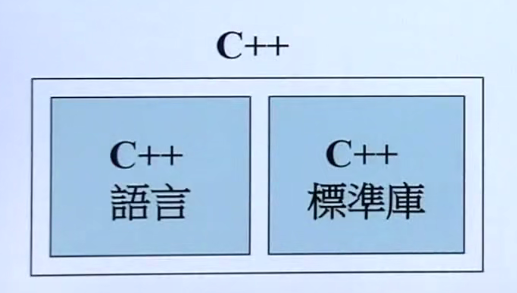


## 02.头文件与类的声明

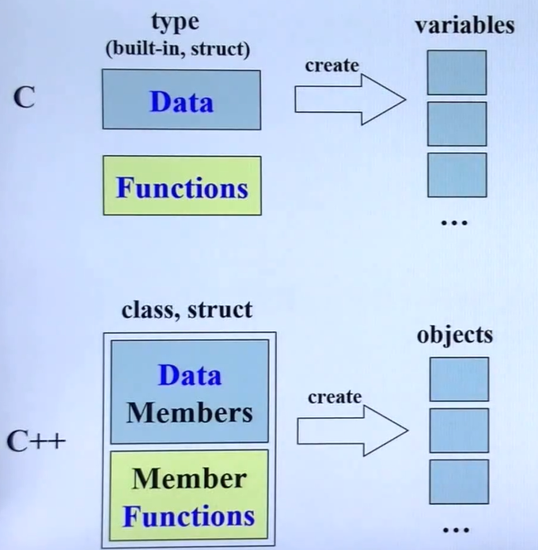

将数据和处理数据的函数包在一起。

<br>


数据有很多份，函数只有一份。

<br>

1. Object Based 面对的是单一class的设计
2. Object Oriented 面对的是多重classes的设计，classes之间的关系

<br>

### C++代码的基本形式


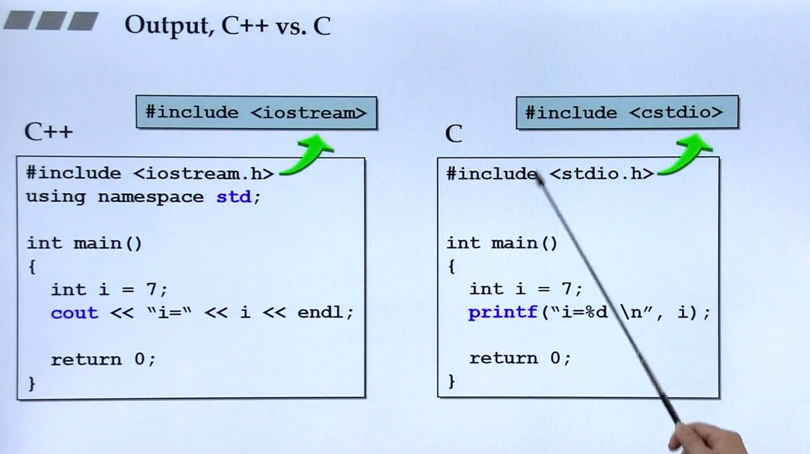

<br>

### 头文件中的防卫式声明

```cpp
#ifndef __COMPLEX__
#define __COMPLEX__

#endif
```

保证第二次include不会重复包含

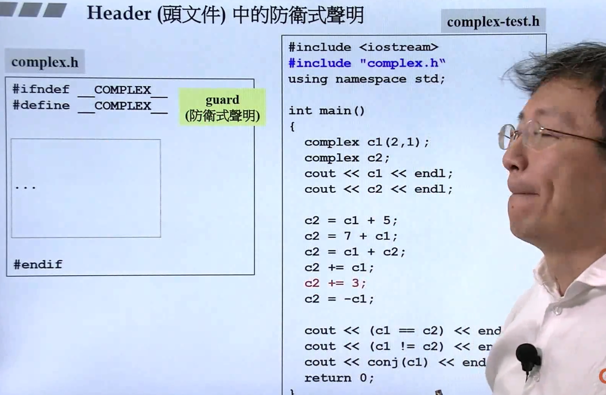

### 头文件的布局

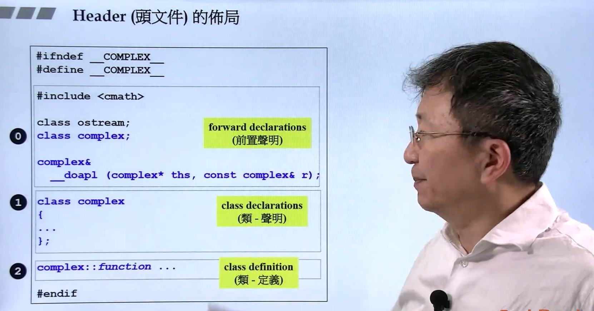

先写①和②，最后判断需要写什么前置声明

### class的声明(declaration)

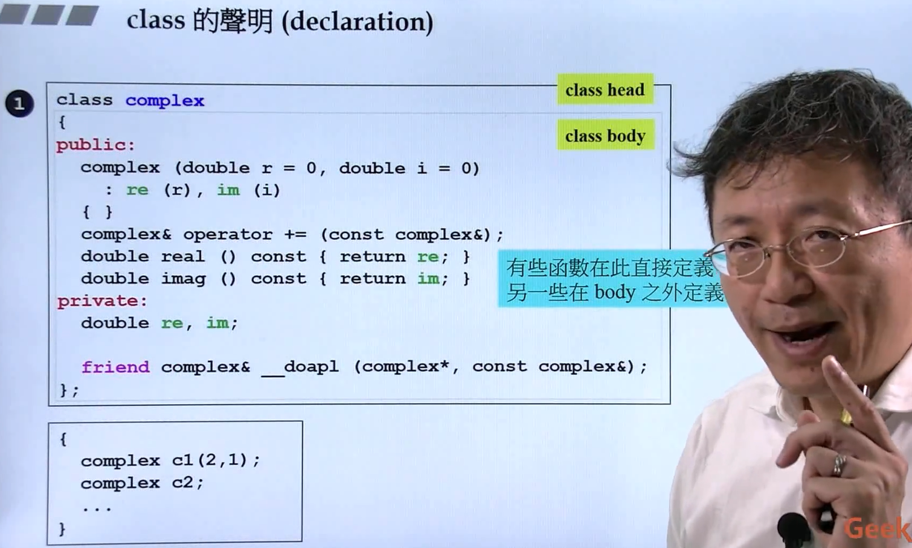

### class template(模板)简介

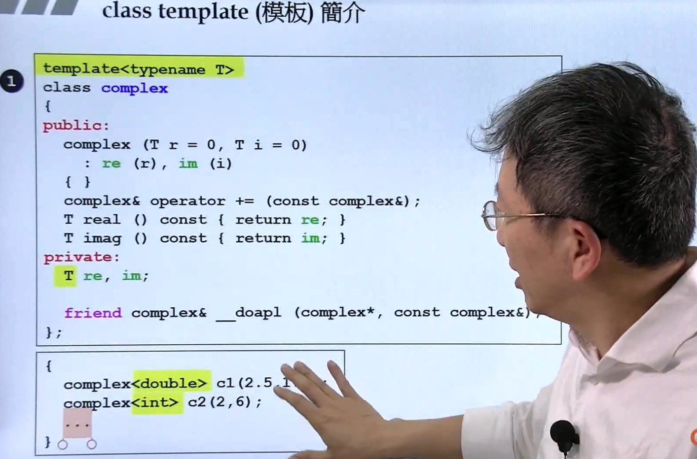

最后用
```cpp
complex<int>
complex<double>
```
绑定类型

<br>
<br>


## 03.构造函数

### inline内联函数

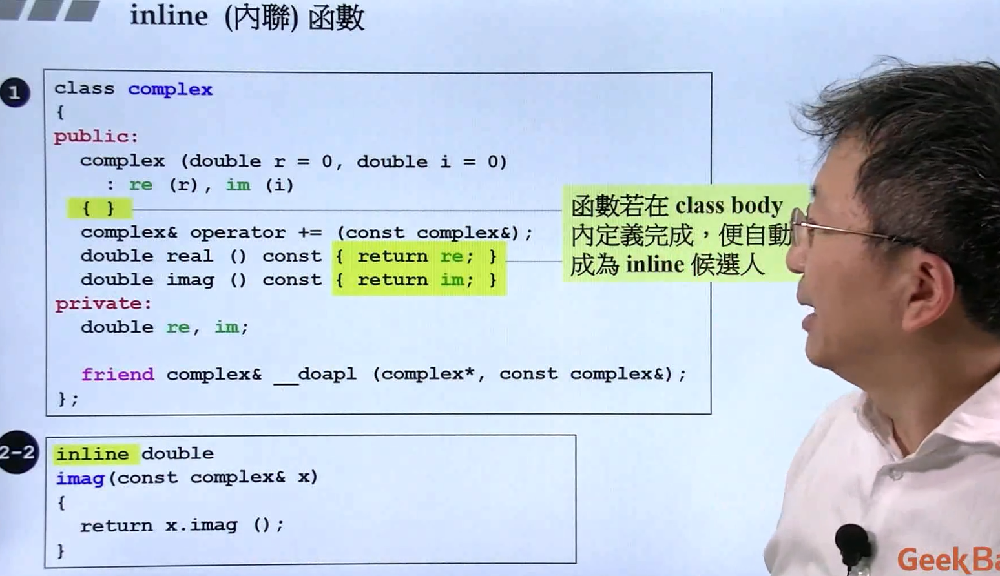

函数过于复杂，编译器不会将函数认定为inline

### access level(访问级别)

数据部分一般作为private

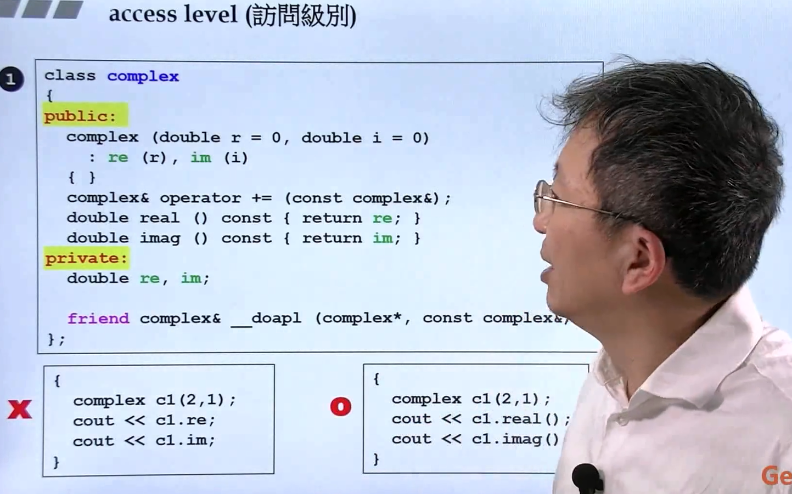

左边是直接取data，显然数据是private，所以是错误的

### constructor(ctor,构造函数)

创建一个对象，构造函数被自动调用

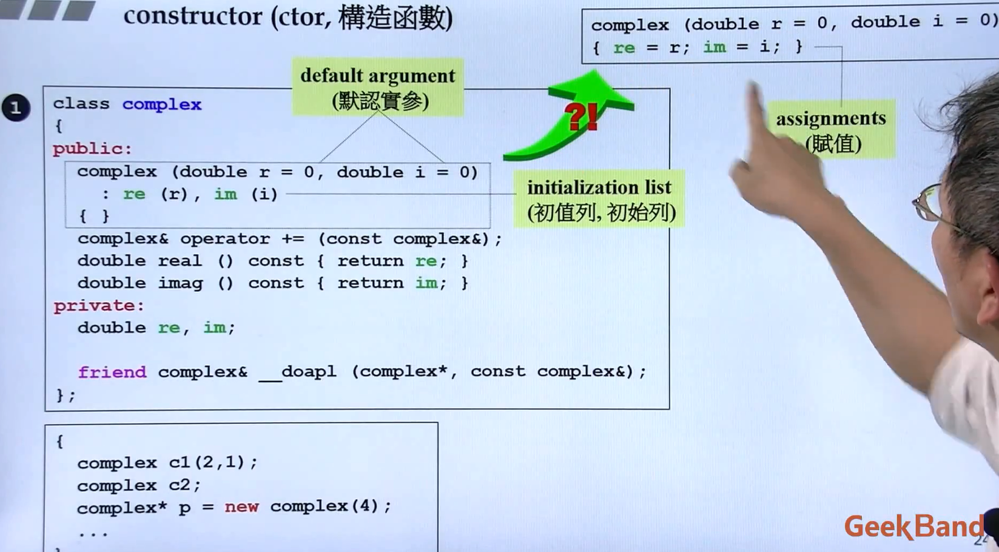

构造函数特点
1. 函数名称和类相同
2. 可以拥有参数
3. 参数可以有默认值
4. 没有返回类型（不需要有）
5. 特有的initialization list初始列(优于赋值，在初始化阶段完成)
6. 赋值可以但是不够大气
7. 可以重载

### ctor(构造函数)可以有重载(overloading)

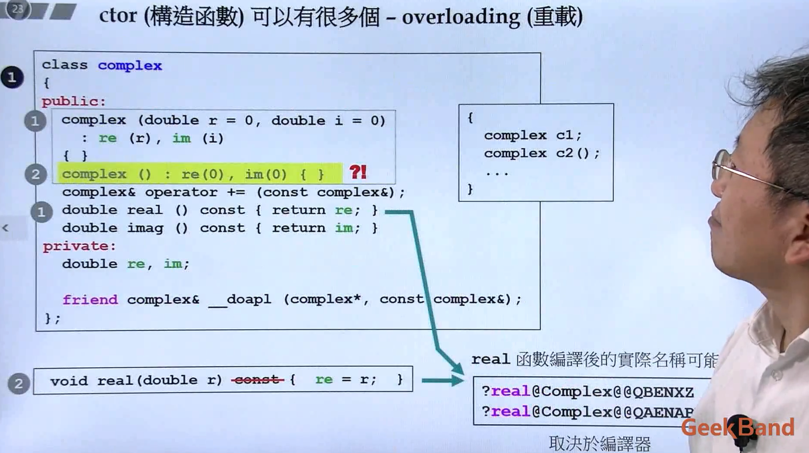

其实函数名称并不相同

黄色部分不行，如果没有给参数，编译器不知道调用谁

<br>
<br>

