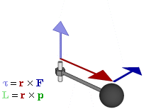
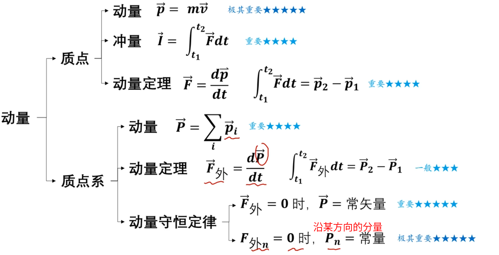
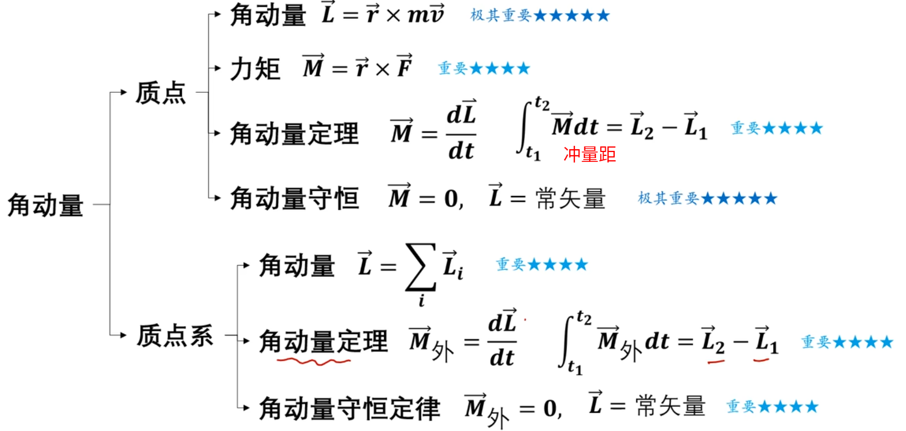
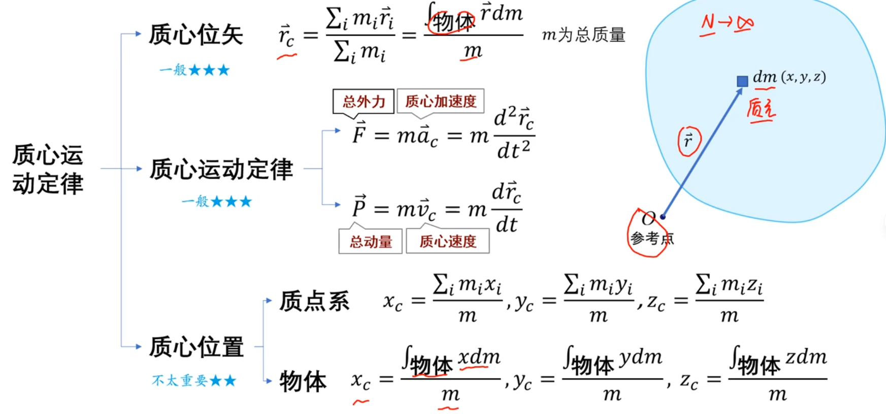
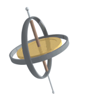
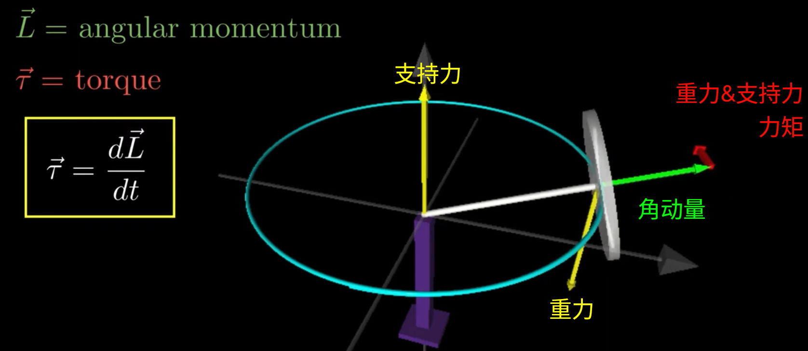

# Physics

---

---

# 动量 & 角动量

角动量
1. $$L = \vec{r} × \vec{P} = \vec{r} × (m \vec{v}) = \vec{r} × (\vec{\omega} × (m \vec{r})) = m \vec{r}^2 \vec{\omega} = I \vec{\omega}$$
   1. $\vec{v} = \vec{\omega} × \vec{r}$
   2. $\vec{\omega} · \vec{r} = 0$
   3. 利用 向量 三重积 公式 $a × (b × c) = b(a · c) - c(a · b)$
2. 物理量
   1. 角动量 $L$ : Angular Momentum，物体围绕 点/轴 旋转时，所包含的 旋转运动量
   2. 转动惯量 $I$ : Moment of Inertia
   3. 角速度 $\omega$ : Angular Velocity
3. **方向** : 右手螺旋法则，手指指向旋转方向，与角速度方向一致

类似于 描述 直线运动的 动量，可以类比为 旋转动量

动量
1. $P = m v$
2. 物理量
   1. 动量 $P$ : Linear Momentum
   2. 质量 $m$ : Mass
   3. 速度 $v$ : Velocity
3. **方向** : 动量的方向和速度的方向一致

**动量定理** (不考虑 m 变化)
1. $$\frac{d \vec{P}}{dt} = \frac{m d\vec{v}}{dt} = m \vec{a} = \vec{F}$$

**角动量定理**
1. $$\frac{d \vec{L}}{dt} = \frac{d (\vec{r} × \vec{P})}{dt} = \frac{d \vec{r}}{dt} × (m \vec{v}) + \vec{r} × \frac{d \vec{P}}{dt} = \vec{r} × \vec{F} = \vec{\tau}$$
   1. 注意 $\vec{r}$ 是 位置矢量，因此 $\frac{d \vec{r}}{dt} = \vec{v}$，因此 $\frac{d \vec{r}}{dt} × (m \vec{v}) = 0$

总结
1. 
2. 
3. 

角动量守恒 : 没有外部**力矩**作用的情况下，系统的总角动量保持不变

角动量是否守恒 与 动量是否守恒 没有直接的联系

---

# 进动(precession) & 章动(nutation)

进动
1. 当一个旋转的刚体 受到外力矩作用时，旋转轴不会静止不动，而是会绕某个方向缓慢地旋转
2. eg : 陀螺
   1.  
   2. 重力 & 支撑力 产生 力矩(右手螺旋)
      1. 起作用的力矩来源是重力
      2. 支持力的主要作用是提供一个反作用力，防止物体掉落，本身不直接产生力矩
   3. 根据角动量定理 $\frac{d \vec{L}}{dt} = \vec{\tau}$，力矩使角动量的方向发生变化
   4. 旋转轴发生进动，角动量的大小，方向随着施加的力矩方向发生旋转
   5. **陀螺的高速旋转产生了角动量，而角动量具有保持方向的特性**

