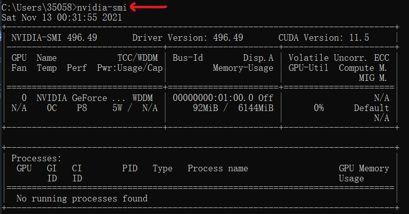
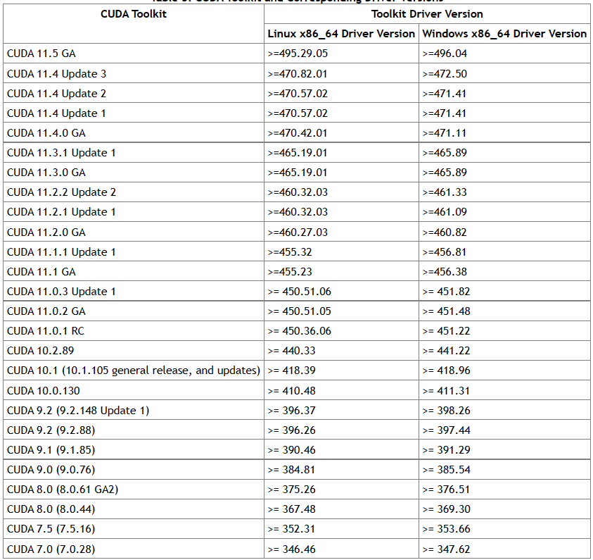
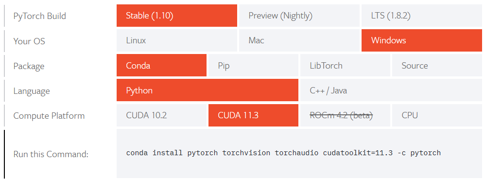
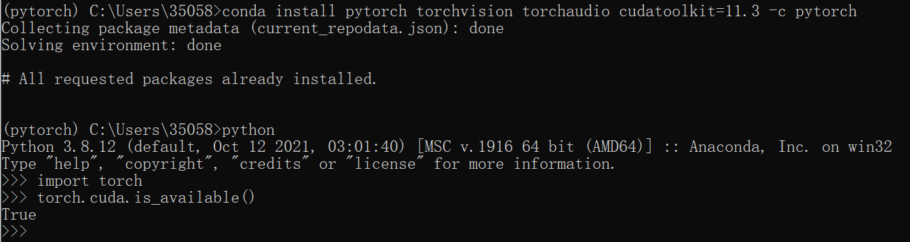
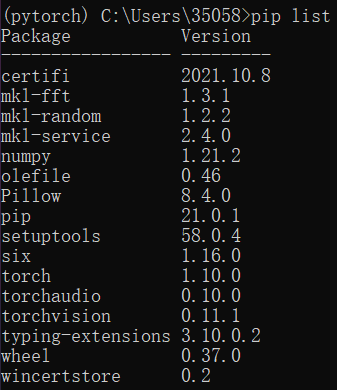
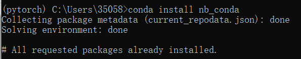
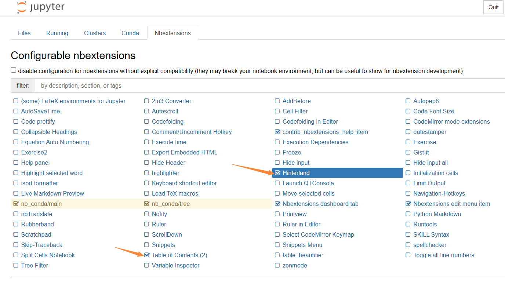

# Install PyTorch

## Anaconda

常用命令：

conda activate pytorch  激活环境

conda deactivate   回到base

pip list   列出功能包

## CUDA

先查看自己GPU版本，在命令行中输入nvidia-smi



[NVIDIA CUDA TOOLKIT DOCUMENTATION](https://docs.nvidia.com/cuda/cuda-toolkit-release-notes/index.html)

对照下表查看可以安装的CUDA Toolkit



不行就更新，可以直接使用GeForce Experience


[一篇博客：about_cuda_install](http://allophane.com/index.php/2021/05/04/about_cuda_install/)

## PyTorch

[PyTorch官网](https://pytorch.org/)



输入Run this Command中的指令即可开始安装



在命令行中输入指令

```python
import torch
torch.cuda.is_available()
```

pip list如下




## Jupyter Notebook

在anaconda中使用jupyter notebook，运行以下命令



[更改JupyterNotebook默认打开位置](https://www.cnblogs.com/zwt20120701/p/11253297.html)


### 自动补全

安装nbextensions

在anaconda prompt中激活对应环境

```
pip install jupyter_contrib_nbextensions

jupyter contrib nbextension install --user --skip-running-check
```

打开jupyter notebook的Nbextensions



之后重启即可

