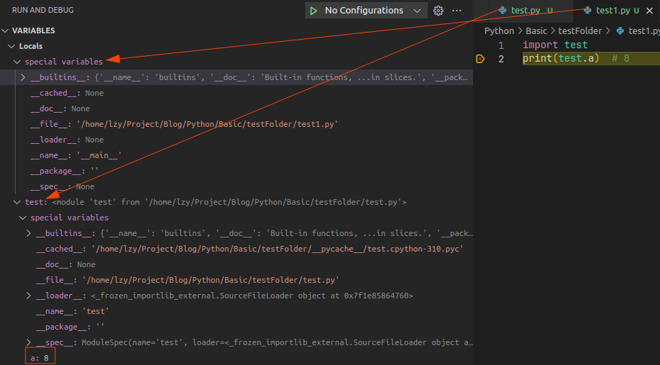

# 基础知识

[toc]

[python3 官方文档](https://docs.python.org/zh-cn/3.8/tutorial/index.html)

# pytorch cuda cudnn

## Portals

[NVIDIA 驱动程序下载](https://www.nvidia.cn/Download/index.aspx?lang=cn)

[NVIDIA 开发者](https://developer.nvidia.cn/zh-cn)

[CUDA 工具包/开发者套件](https://developer.nvidia.cn/zh-cn/cuda-zone)

CUDA® 是 NVIDIA 专为图形处理单元 (GPU) 上的通用计算开发的并行计算平台和编程模型。借助 CUDA，开发者能够利用 GPU 的强大性能显著加速计算应用。

在经 GPU 加速的应用中，工作负载的串行部分在 CPU 上运行，且 CPU 已针对单线程性能进行优化，而应用的计算密集型部分则以并行方式在数千个 GPU 核心上运行。

NVIDIA 的 CUDA 工具包提供了开发 GPU 加速应用所需的一切。CUDA 工具包中包含多个 GPU 加速库、一个编译器、多种开发工具以及 CUDA 运行环境。

[NVIDIA cuDNN](https://developer.nvidia.cn/zh-cn/cudnn)

NVIDIA **CUDA® 深度神经网络库** (cuDNN) 是一个 GPU 加速的深度神经网络基元库，能够以高度优化的方式实现标准例程（如前向和反向卷积、池化层、归一化和激活层）。

全球的深度学习研究人员和框架开发者都依赖 cuDNN 来实现高性能 GPU 加速。借助 cuDNN，研究人员和开发者可以专注于训练神经网络及开发软件应用，而不必花时间进行低层级的 GPU 性能调整。cuDNN 可加速广泛应用的深度学习框架，包括 Caffe2、Chainer、Keras、MATLAB、MxNet、PaddlePaddle、PyTorch 和 TensorFlow。

## 版本查看

如果 nvidia-smi 和 nvcc -V 命令看到的 CUDA 版本不同，这可能是因为它们显示的是不同的组件的版本号。

1. **nvidia-smi** 命令显示的 CUDA 版本是 NVIDIA 显卡驱动程序中包含的 CUDA 版本。这个版本通常是在安装显卡驱动时安装的，并且可以与系统上安装的多个 CUDA 版本之一兼容。
2. 另一方面，**nvcc -V** 命令显示的是 NVIDIA CUDA 编译器的版本号。这个版本通常是与您在系统上安装的 CUDA Toolkit 版本一起安装的，并且可能与您的显卡驱动程序中包含的 CUDA 版本不同。nvcc -V 命令只会显示 CUDA 编译器的版本信息，而不是显示 CUDA 运行时库的版本信息。
3. **torch.version.cuda** 显示的是 PyTorch 在编译时使用的 CUDA 版本
4. **torch.backends.cudnn.version()**输出当前 PyTorch 中使用的 cuDNN 版本号。如果您没有安装 cuDNN，或者使用的是不支持 cuDNN 的 PyTorch 版本，则此代码将引发异常。
5. **torch.cuda.is_available()** 是一个 PyTorch 函数，用于检查您的系统上是否安装了 CUDA 并且是否可以使用 CUDA 加速 PyTorch 中的操作。当您调用 **torch.cuda.is_available()** 时，它将返回一个布尔值，指示 CUDA 是否可用。如果 CUDA 可用，则返回 True，否则返回 False。
6. 访问torch.__ version __变量来获取 PyTorch 的版本信息

PyTorch 通常使用特定版本的 CUDA Toolkit 进行编译，而不是使用最新版本。因此，torch.version.cuda 显示的 CUDA 版本可能与您在系统上安装的 CUDA Toolkit 版本不同。另外，如果您的系统上有多个版本的 CUDA Toolkit 安装，您需要确保使用与 PyTorch 编译时使用的版本兼容的版本。

# 魔术方法大全

[【python】魔术方法大全 --- B站视频](https://www.bilibili.com/video/BV1b84y1e7hG/)

# global & local

全局变量和局部变量

```python
a = 8

def f1():
    print(a)  # 8

def f2():  
    # a = 18 使得 python 认为 a 是局部变量
    # 如果全局变量和局部变量重名，在函数中只用局部变量起作用
    print(a)  # UnboundLocalError: local variable 'a' referenced before assignment
    a = 18

def f2():
    print(a)
    global a  # SyntaxError: name 'a' is used prior to global declaration
    a = 18

def f3():
    a = 18
    print(a)  # 18

def f4():
    global a
    print(a)  # 8
    a = 18
    print(a)  # 18 外部的 a 的值被修改
```

全局变量仅在当前模块中全局可访问

两种引入其他文件中的全局变量方法

1. 导入目标模块，使用作用域运算符访问
   
2. 直接将所用内容导入当前模块，但是容易造成变量名、函数名的冲突，不推荐
   


# 当前工作目录

在 Python 中，你可以使用 os 模块来确定当前文件的路径和项目路径。具体来说，你可以使用以下代码来获取当前文件的路径和项目路径：

import os

获取当前文件的路径
current_path = os.path.dirname(os.path.abspath(__file__))

获取项目的根目录路径s
project_path = os.path.dirname(current_path)
在这段代码中，__file__ 是当前文件的特殊变量，它包含了当前文件的路径。使用 os.path.abspath() 函数可以将其转换为绝对路径，使用 os.path.dirname() 函数可以获取该路径的父目录路径。因此，current_path 变量包含了当前文件的路径，project_path 变量包含了项目的根目录路径。

注意，这种方法假定当前文件和项目根目录在同一级别。如果你的当前文件位于项目子目录中，则需要相应地更改代码。例如，如果你的当前文件位于 project/subdir/file.py 中，则可以使用以下代码来获取项目根目录路径：

import os

获取当前文件的路径
current_path = os.path.dirname(os.path.abspath(__file__))

获取项目的根目录路径
project_path = os.path.dirname(os.path.dirname(current_path))
在这个例子中，我们使用了两个 os.path.dirname() 函数来获取项目根目录路径，因为当前文件的父目录是 subdir 目录，而不是项目根目录。

# 当前文件路径

```python
# 只能在当前文件所在文件夹中打开
import sys
sys.path.append('..')  # add parent folder to path
from my_package import my_module_in_package

# 可以在任何位置打开
import os
import sys
parent_dir = os.path.abspath(os.path.join(os.path.dirname(__file__), '..'))  # 不加 os.path.abspath 也可以
sys.path.append(parent_dir)
from my_package import my_module_in_package
```

__ file __ is a special variable that contains the filepath of the current module.

os.path.dirname(__ file __) gets the directory containing the current module

and os.path.join(os.path.dirname( __ file __ ), '..') gets the parent directory

```python
import sys
print("sys.argv[0]                  ", sys.argv[0])

import os
print("os.path.dirname(__file__)    ", os.path.dirname(__file__))
print("os.path.abspath(sys.argv[0]) ", os.path.abspath(sys.argv[0]))
print("os.getcwd()                  ", os.getcwd())  #获取当前工作目录路径
print("os.path.abspath('.')         ", os.path.abspath('.'))  #获取当前文件目录路径
print("os.path.abspath('test.txt')  ", os.path.abspath('test.txt'))  #获取当前目录文件下的文件目录路径
print("os.path.abspath('..')        ", os.path.abspath('..'))  #获取当前文件目录的父目录 ！注意是父目录路径
print("os.path.abspath(os.curdir)   ", os.path.abspath(os.curdir)) #获取当前文件目录路径

filePath = os.path.abspath(sys.argv[0])  #  文件真实路径
print(os.path.exists(filePath))


# 当前文件位置 /home/lzy/Project/Blog/Python/Basic/test/test.py

# 在 ~/Project/Blog/Python/Basic 目录下运行 python3 test/test.py
# sys.argv[0]                   test/test.py
# os.path.dirname(__file__)     /home/lzy/Project/Blog/Python/Basic/test
# os.path.abspath(sys.argv[0])  /home/lzy/Project/Blog/Python/Basic/test/test.py
# os.getcwd()                   /home/lzy/Project/Blog/Python/Basic
# os.path.abspath('.')          /home/lzy/Project/Blog/Python/Basic
# os.path.abspath('test.txt')   /home/lzy/Project/Blog/Python/Basic/test.txt
# os.path.abspath('..')         /home/lzy/Project/Blog/Python
# os.path.abspath(os.curdir)    /home/lzy/Project/Blog/Python/Basic
# True

# 在 ~/Project/Blog/Python/Basic/test 目录下运行 python3 test.py
# sys.argv[0]                   test.py
# os.path.dirname(__file__)     /home/lzy/Project/Blog/Python/Basic/test
# os.path.abspath(sys.argv[0])  /home/lzy/Project/Blog/Python/Basic/test/test.py
# os.getcwd()                   /home/lzy/Project/Blog/Python/Basic/test
# os.path.abspath('.')          /home/lzy/Project/Blog/Python/Basic/test
# os.path.abspath('test.txt')   /home/lzy/Project/Blog/Python/Basic/test/test.txt
# os.path.abspath('..')         /home/lzy/Project/Blog/Python/Basic
# os.path.abspath(os.curdir)    /home/lzy/Project/Blog/Python/Basic/test
# True
```

```python
import os

print("__file__                                              :", __file__)
print("os.path.abspath(__file__)                             :", os.path.abspath(__file__))
print("os.path.abspath(os.path.join(os.getcwd(), __file__))  :", os.path.abspath(os.path.join(os.getcwd(), __file__)))
print("os.path.abspath(os.path.join(os.getcwd(), 'test.py')) :", os.path.abspath(os.path.join(os.getcwd(), 'test.py')))

"""
在更内层文件夹
lzy@legion:~/Desktop/test/inner$ python3 ../test.py 
__file__                                              : /home/lzy/Desktop/test/inner/../test.py
os.path.abspath(__file__)                             : /home/lzy/Desktop/test/test.py
os.path.abspath(os.path.join(os.getcwd(), __file__))  : /home/lzy/Desktop/test/test.py
os.path.abspath(os.path.join(os.getcwd(), 'test.py')) : /home/lzy/Desktop/test/inner/test.py

在外层文件夹
lzy@legion:~/Desktop/test$ python3 test.py 
__file__                                              : /home/lzy/Desktop/test/test.py
os.path.abspath(__file__)                             : /home/lzy/Desktop/test/test.py
os.path.abspath(os.path.join(os.getcwd(), __file__))  : /home/lzy/Desktop/test/test.py
os.path.abspath(os.path.join(os.getcwd(), 'test.py')) : /home/lzy/Desktop/test/test.py
"""
```

# 不同文件夹下的 import


python中导入某个模块，只需要该模块所在的文件夹路径在sys.path中即可

# import & from import

## 关于import你需要知道的一切！一个视频足够了

[关于import你需要知道的一切！一个视频足够了 --- B站](https://www.bilibili.com/video/BV1K24y1k7XA/)

**module**

1. 常见形式为一个 .py 文(也有其他形式的文件可以生成module)
2. 独立构成一个命名空间
3. python 运行时概念，保存在内存中
4. 本身是一个 python object(可以包含其他 python object)
5. 组织结构上最末端的概念

文件是一个操作系统级别的概念

**通过 import 从 文件 或 文件夹 生成 module 或 package**

**package**

1. 一种特殊形式的 module ，功能相同
2. 比 module 多一个 __ path __ 属性
3. 往往对应一个文件夹(可以有 subpackage 也可以有 module)
4. 无论是否包含 __ init __.py 文件都能作为一个 package

**import 时发生的事**

**import module(xxx)**

1. 将 xxx 字符串作为**名字**寻找 module
2. 首先检查缓存有无 xxx module 已经被读取
   1. 如果有，可以直接赋值给 xxx， 无需 load
   2. 如果无，则需要寻找这个 xxx module
      1. 首先检查是否为 builtin module (python 自带的 module eg:sys os math)
      2. 如果不是，则在数个文件夹中寻找可以被 load 为 xxx 的文件，常见的是 xxx.py 文件
         1. **寻找的文件夹路径保存在 sys.path 中(按顺序的寻找，找到就不再找了)**)
            
            1. 第一个元素 '' 代表当前目录 (文件所在文件夹)
            2. 注意命名冲突问题
            3. site-packages 是 pip install 的位置
            4. python 运行时 可以手动修改 sys.path
            5. sys.path 其实就是一个 list
         2. 寻找到符合条件的文件后，在单独的命名空间中运行该文件，建立 module (也会执行内部代码，定义一个类 等等)
         3. 完成 module object 后，更新缓存，方便其他程序 import 该module，不必再次 load (即使多次 import 也只会运行一遍)
         4. 最后，将module object 赋值给 xxx 变量

此处 xxx 有两个责任

1. 根据 xxx 名字 拿到 module
2. module 保存在名为 xxx 的变量中

可以将两个责任分开 使用 import ... as ...

**import xxx as yyy**

1. 根据 xxx 名字寻找 module
2. 将 module 保存在 yyy 变量中 (没有创建名为 xxx 的变量)

当只需要 module xxx 中的一个 object yyy

**from xxx import yyy**

1. load xxx 这个 module
2. 刷新缓存
3. 只是不把 module 赋值给变量
4. 而是在 module 中找到名为 yyy 的变量，将变量 yyy 中保存的 object 再赋值给 yyy
5. 此时 yyy 也有两个责任，也可以分开

**from xxx import yyy as zzz**

1. xxx module 中的变量 yyy 保存的 object 赋值给 zzz 变量

**import pkg(xxx)**

1. 与 import module 类似，在单独的命名空间运行 __ init __ 文件(如果有)，将这个命名空间构成 package
2. import package 时，会查看 package 文件夹下有无 __ init __ 文件
   1. 如果无，不会运行任何额外的代码
   2. 如果有，则仅仅会运行 __ init __.py 文件(即使有其他文件 python 也不会引入)(也可以)

**import pkg 时其实是在单独的命名空间中运行 __ init __.py 文件，将这个命名空间作为 module**

如果要引入 package 中的 module，则需要 import pkg.module

1. pkg.module 也会被当做字符串，作为 module 的 identifier
2. python 根据该字符串从 sys.path 中寻找
3. 会 load 整个 pkg (每一个 module) 并更新缓存
4. import 后会将 package 赋值给 pkg 对象

**import pkg.module**

1. 原理与 import module 类似
2. 将最外层的package 赋值给 pkg 变量

**import pkg.module as pm**

1. 将内层的 module 赋值给 pm 变量
2. 不存在 pkg 变量

**上述所讲的都是 absolute import 方式，根据确定的 string 寻找 module**  绝对

**此外还有 relative import 方式，在一个 package 中的不同 module 中相互引用，module 中的相对关系更加稳定** 相对

在同一个文件夹下可以省去一个包名，用 '.' 来代替 (这样当 package 改名后，仍能正确引用)

如果在上一个文件夹，可以用 '..'，代表往上走一个 package

**==relative import 只能在 package 里面的 module 中使用==**

**==要求被引用 module 的跟着 package 被一起引入的 如果单单是一个 module 则不行(relative 无法转为 absolute)==**

**每一个 relative import 都是先找到 module 绝对路径然后再 import** (relative import 先转为 absolute import)

通过 module 的 package 变量计算绝对路径

可以获取 module 的 package 属性(pkg.module.__ package __)

## python import中的绝对引用和相对引用

[python import中的绝对引用和相对引用 --- B站视频](https://www.bilibili.com/video/BV1EK411g7Ff/)

[Python Modules and Packages – An Introduction --- 英文文档](https://realpython.com/python-modules-packages/)

易混淆概念

1. script 脚本 : 脚本是一个旨在直接运行的 Python 文件，完成特定功能，一般不包含类和函数
2. module 模块 : 模块是一个 Python 文件，旨在导入到脚本或其他模块中，可以用于定义类和函数
3. package 包 : 包是相关模块的集合，它们一起工作以提供特定功能，老版本需要 __ init __
4. library 库 : 库是一个总称，泛指“一堆代码”。 这些可以有数十个甚至数百个可以提供广泛功能的单独模块

# __ init __.py 的作用

当包和模块被导入时，首先被自动执行 init.py

让一个文件夹变成Python的包（对于python3.3之前，不加init.py，文件夹无法被当做包）

然后才可以通过文件夹名引用module

**可以是空的**

在python3.3之后，还是可以继续使用，方便进行包的引用

例子

```
.
├── folder
│   ├── __init__.py
│   └── method.py
└── main.py
```

main.py

```python
import folder

folder.drink()
folder.eat()
```

或者(不用具体到文件名，具体到文件夹即可)，引用者不需要知道包内部结构(也可以在内部执行初始化操作)

```python
from folder import eat
from folder import drink

drink()
eat()
```

init.py（注意文件夹名也要写）

```python
from folder.method import *

print("this is __init__.py")
```

method.py

```python
def eat():
    print("eat")

def drink():
    print("drink")
```

# 语法糖 Syntactic Sugar

[Python中常用的九种语法糖](https://www.bilibili.com/video/BV1Nf4y1k7Pu/)

常用的9种

1. 交换两个变量的值 a,b=b,a
2. 判断变量是否在某个范围内 if a<=b<=c:
3. 格式化输出字符 print("#"*10)
4. 列表拼接 a=[1,2,3] b=[4,5,6] a+b
5. 列表切片 a=[1,2,3,4,5,6] b=a[1:-2] c=a[:3] d=a[-3:]
6. 打包&解包 a=(1,2,3) x,y,z=a
7. with语句 with open("xxx","xx") as file: data=f.read() 会自动关闭文件以及处理异常
8. 列表推导式 a=[1,2,3,4] b=[i+233 for i in a]
9. 数字分隔符 a=1_0000_0000

# 路径 虚拟环境

[路径 虚拟环境 poetry依赖管理](https://www.bilibili.com/video/BV1cX4y1Z7kv/)

查看版本 python3 --version

```
lzy@legion:~$ python3 --version
Python 3.10.6
```

```
lzy@legion:~$ which python3
/usr/bin/python3
```

对于linux自带的python

1. 解释器 位置 : /usr/bin
   ```bash
    lzy@legion:~$ ls /usr/bin/ | grep python
    activate-global-python-argcomplete3
    dh_python3-ply
    pvtkpython
    pybabel-python3
    python3
    python3.10
    python3.10-config
    python3.10-coverage
    python3-config
    python3-coverage
    python3-futurize
    python3-pasteurize
    python-argcomplete-check-easy-install-script3
    python-argcomplete-tcsh3
    register-python-argcomplete3
    vtkpython-9.0
    x86_64-linux-gnu-python3.10-config
    x86_64-linux-gnu-python3-config
   ```
2. 使用 pip3 安装第三方库的默认路径 位置 : /home/lzy/.local/lib/python[版本号]/site-packages
   ```bash
    lzy@legion:~/Project/Blog$ python3
    Python 3.10.6 (main, Nov 14 2022, 16:10:14) [GCC 11.3.0] on linux
    Type "help", "copyright", "credits" or "license" for more information.
    >>> import sys
    >>> sys.path
    ['', '/opt/ros/humble/lib/python3.10/site-packages', '/opt/ros/humble/local/lib/python3.10/dist-packages', '/usr/lib/python310.zip', '/usr/lib/python3.10', '/usr/lib/python3.10/lib-dynload', '/home/lzy/.local/lib/python3.10/site-packages', '/usr/local/lib/python3.10/dist-packages', '/usr/lib/python3/dist-packages']
   ```

使用conda激活虚拟环境，相应的python版本也随之改变

```bash
(opencv3.4.2) lzy@legion:/usr/lib/python3.10$ python3 --version
Python 3.6.13 :: Anaconda, Inc.
```

```python
import sys

print("path_prefix                  :", sys.prefix)  # python解释器路径前缀
print("path of current interpreter  :", sys.executable)  # 当前解释器的路径
print("search packages from         :", sys.path)  # 寻找依赖的路径
```

```bash
(opencv3.4.2) lzy@legion:~/Project/Blog$ conda deactivate
lzy@legion:~/Project/Blog$ python3 ./Python/Basic/basic.py 
path_prefix                  : /usr
path of current interpreter  : /usr/bin/python3
search packages from         : ['/home/lzy/Project/Blog/Python/Basic', '/opt/ros/humble/lib/python3.10/site-packages', '/opt/ros/humble/local/lib/python3.10/dist-packages', '/usr/lib/python310.zip', '/usr/lib/python3.10', '/usr/lib/python3.10/lib-dynload', '/home/lzy/.local/lib/python3.10/site-packages', '/usr/local/lib/python3.10/dist-packages', '/usr/lib/python3/dist-packages']
lzy@legion:~/Project/Blog$ conda activate opencv3.4.2
(opencv3.4.2) lzy@legion:~/Project/Blog$ python3 ./Python/Basic/basic.py 
path_prefix                  : /home/lzy/miniconda3/envs/opencv3.4.2
path of current interpreter  : /home/lzy/miniconda3/envs/opencv3.4.2/bin/python3
search packages from         : ['/home/lzy/Project/Blog/Python/Basic', '/opt/ros/humble/lib/python3.10/site-packages', '/opt/ros/humble/local/lib/python3.10/dist-packages', '/home/lzy/miniconda3/envs/opencv3.4.2/lib/python36.zip', '/home/lzy/miniconda3/envs/opencv3.4.2/lib/python3.6', '/home/lzy/miniconda3/envs/opencv3.4.2/lib/python3.6/lib-dynload', '/home/lzy/miniconda3/envs/opencv3.4.2/lib/python3.6/site-packages']
(opencv3.4.2) lzy@legion:~/Project/Blog$ 
```

# pip install 和conda install 的区别

## 常用命令

conda 常用命令

1. 查看环境
   ```
   # 两行效果一致
   conda env list
   conda info --envs
   ```
2. 查看源
   ```
   conda config --show-sources
   ```
3. 添加源
   ```
   conda config --add channels https://mirrors.tuna.tsinghua.edu.cn/anaconda/pkgs/free/
   ```
4. 移除源头
   ```
   conda config --remove channels https://mirrors.tuna.tsinghua.edu.cn/anaconda/pkgs/free/
   ```

pip 常用命令

## anaconda官网对比

[Understanding Conda and Pip --- anaconda 官方说明](https://www.anaconda.com/blog/understanding-conda-and-pip)


Conda 和 pip 通常被认为几乎相同。 尽管这两个工具的某些功能有重叠，但它们的设计目的不同，应该用于不同的目的。 Pip 是 Python Packaging 官方 推荐的工具，用于从 Python 包索引 PyPI 安装包。 Pip 安装打包为 wheels 或源代码发行版的 Python 软件。 后者可能需要系统在调用 pip 成功之前安装兼容的编译器和可能的库。

Conda 是一个跨平台包和环境管理器，它从 Anaconda 存储库和 Anaconda Cloud 安装和管理 conda 包。 Conda 包是二进制文件。 永远不需要编译器来安装它们。 此外，conda 包不限于 Python 软件。 它们还可能包含 C 或 C++ 库、R 包或任何其他软件。

这突出了 conda 和 pip 之间的一个关键区别。 Pip 安装 Python 包，而 conda 安装可能包含以任何语言编写的软件的包。 例如，在使用 pip 之前，必须通过系统包管理器或通过下载并运行安装程序来安装 Python 解释器。 另一方面，Conda 可以直接安装 Python 包和 Python 解释器。

这两个工具之间的另一个主要区别是 conda 能够创建隔离环境，其中可以包含不同版本的 Python 和/或安装在其中的包。 这在使用数据科学工具时非常有用，因为不同的工具可能包含相互冲突的要求，这可能会阻止它们全部安装到单一环境中。 Pip 没有对环境的内置支持，而是依赖于其他工具（如 virtualenv 或 venv）来创建隔离环境。 pipenv、poetry 和 hatch 等工具包装 pip 和 virtualenv 以提供使用这些环境的统一方法。

Pip 和 conda 在如何实现环境中的依赖关系方面也有所不同。 安装包时，pip 会在递归的串行循环中安装依赖项。 无法确保同时满足所有包的依赖性。 如果顺序中较早安装的包与顺序中较晚安装的包具有不兼容的依赖版本，这可能会导致环境以微妙的方式被破坏。 相反，conda 使用可满足性 (SAT) solver 来验证是否满足安装在环境中的所有包的所有要求。 此检查可能需要额外的时间，但有助于防止创建损坏的环境。 只要有关依赖项的包元数据是正确的，conda 就会按预期生成工作环境。

鉴于 conda 和 pip 之间的相似性，一些人尝试结合这些工具来创建数据科学环境也就不足为奇了。 将 pip 与 conda 结合使用的一个主要原因是一个或多个软件包只能通过 pip 安装。 Anaconda 存储库中提供了超过 1,500 个软件包，包括最流行的数据科学、机器学习和 AI 框架。 可以使用 conda 安装这些，以及来自通道（包括 conda-forge 和 bioconda）的 Anaconda 云上可用的数千个附加包。 尽管有如此庞大的包集合，但与 PyPI 上可用的超过 150,000 个包相比，它仍然很小。 有时需要一个包，它不能作为 conda 包使用，但在 PyPI 上可用，并且可以使用 pip 安装。 在这些情况下，尝试同时使用 conda 和 pip 是有意义的。

## 安装位置解析

conda install [包名]

1. 这种方式安装的库都会放在anaconda3/pkgs目录下(或者miniconda)
2. 这样的好处就是，当在某个环境下已经下载好了某个库，再在另一个环境中还需要这个库时，就可以直接从pkgs目录下将该库复制至新环境而不用重复下载

pip install [包名]  分两种情况

1. 如果当前conda环境的python是conda安装的，和系统的不一样，那么xxx会被安装到anaconda3/envs/[current_env]/lib/python3.x/site-packages文件夹中(/home/lzy/miniconda3/envs/[current_env])
   ```bash
   ls ~/miniconda3/envs/pytorch/lib/python3.8/site-packages/
   ```
2. 如果当前conda环境用的是系统的python，那么xxx会通常会被安装到~/.local/lib/python3.x/site-packages文件夹中
   ```bash
   ls ~/.local/lib/python3.10/site-packages/
   ```

## 查看包信息

pip show [包名]

可以看到版本 安装位置 被依赖 等等

```
lzy@legion:~$ pip show numpy
Name: numpy
Version: 1.24.1
Summary: Fundamental package for array computing in Python
Home-page: https://www.numpy.org
Author: Travis E. Oliphant et al.
Author-email: 
License: BSD-3-Clause
Location: /home/lzy/.local/lib/python3.10/site-packages
Requires: 
Required-by: albumentations, contourpy, e2cnn, imageio, kwarray, mmcls, mmcv, mmdet, mmengine, mmrotate, mmyolo, onnx, opencv-contrib-python, opencv-python, ortools, pandas, pycocotools, PyWavelets, qudida, scikit-image, scikit-learn, seaborn, tensorboard, tensorboardX, tifffile, ultralytics
```

## 优先级

conda和pip安装同一个xxx库情况下，conda环境下python代码中import xxx时，谁安装的xxx优先级较高会被import

```bash
python3 -m site
# 或
python -m site
```

**不在conda中**

```bash
lzy@legion:~$ python3 -m site
sys.path = [
    '/home/lzy',
    '/opt/ros/humble/lib/python3.10/site-packages',
    '/opt/ros/humble/local/lib/python3.10/dist-packages',
    '/usr/lib/python310.zip',
    '/usr/lib/python3.10',
    '/usr/lib/python3.10/lib-dynload',
    '/home/lzy/.local/lib/python3.10/site-packages',
    '/home/lzy/Project/mmyolo',
    '/usr/local/lib/python3.10/dist-packages',
    '/usr/lib/python3/dist-packages',
]
USER_BASE: '/home/lzy/.local' (exists)
USER_SITE: '/home/lzy/.local/lib/python3.10/site-packages' (exists)
ENABLE_USER_SITE: True
```

**在conda中**

```bash
lzy@legion:~$ conda activate pytorch
(pytorch) lzy@legion:~$ python3 -m site
sys.path = [
    '/home/lzy',
    '/opt/ros/humble/lib/python3.10/site-packages',
    '/opt/ros/humble/local/lib/python3.10/dist-packages',
    '/home/lzy/miniconda3/envs/pytorch/lib/python38.zip',
    '/home/lzy/miniconda3/envs/pytorch/lib/python3.8',
    '/home/lzy/miniconda3/envs/pytorch/lib/python3.8/lib-dynload',
    '/home/lzy/miniconda3/envs/pytorch/lib/python3.8/site-packages',
    '/home/lzy/Project/mmcv',
    '/home/lzy/Project/mmsegmentation',
]
USER_BASE: '/home/lzy/.local' (exists)
USER_SITE: '/home/lzy/.local/lib/python3.8/site-packages' (doesn't exist)
ENABLE_USER_SITE: True
```

# vscode debug 调试

创建 launch.json 并在 "configurations" 中添加参数

## 加入参数 args


## 指定 python 环境


可以在终端中使用 whereis 命令来找到路径

```bash
lzy@legion:~/Project/Blog$ conda activate pytorch

(pytorch) lzy@legion:~/Project/Blog$ whereis python
python: /home/lzy/miniconda3/envs/pytorch/bin/python

(pytorch) lzy@legion:~/Project/Blog$ whereis python3
python3: /usr/bin/python3 /usr/lib/python3 /etc/python3 /usr/share/python3 /home/lzy/miniconda3/envs/pytorch/bin/python3 /usr/share/man/man1/python3.1.gz

(pytorch) lzy@legion:~/Project/Blog$ whereis python3.8
python3.8: /home/lzy/miniconda3/envs/pytorch/bin/python3.8
```

### 测试案例

python 文件

```python
import os
os.system("conda env list & conda list | grep torch")
```

json文件，注意 configurations 中的 python 参数

```json
{
    // Use IntelliSense to learn about possible attributes.
    // Hover to view descriptions of existing attributes.
    // For more information, visit: https://go.microsoft.com/fwlink/?linkid=830387
    "version": "0.2.0",
    "configurations": [
        {
            "name": "Python: Current File",
            "type": "python",
            "python": "/home/lzy/miniconda3/envs/pytorch/bin/python3",
            "request": "launch",
            "program": "${file}",
            "console": "integratedTerminal",
            "justMyCode": true
        }
    ]
}
```

result，注意看 pytorch 后有个 * 号

```text
lzy@legion:~/Project/Blog$  cd /home/lzy/Project/Blog ; /usr/bin/env /bin/python3 /home/lzy/.vscode/extensions/ms-python.python-2023.8.0/pythonFiles/lib/python/debugpy/adapter/../../debugpy/launcher 50797 -- /home/lzy/Project/Blog/Python/Basic/testFolder/test.py 
# conda environments:
#
base                     /home/lzy/miniconda3
label                    /home/lzy/miniconda3/envs/label
mmlab                    /home/lzy/miniconda3/envs/mmlab
opencv3.4.2              /home/lzy/miniconda3/envs/opencv3.4.2
pytorch               *  /home/lzy/miniconda3/envs/pytorch

# packages in environment at /home/lzy/miniconda3/envs/pytorch:
torch                     2.0.0                    pypi_0    pypi
torch-tb-profiler         0.4.1                    pypi_0    pypi
torchaudio                2.0.1                    pypi_0    pypi
torchvision               0.15.1                   pypi_0    pypi
```

# python file

Different modes that can be used with the open() function:

1. 'r': Read mode. This is the default mode when you don't specify any mode. The file is opened for reading, and you can read the contents of the file using methods like read(). If the file doesn't exist, an error is raised.
2. 'w': Write mode. The file is opened for writing, and its contents are truncated. If the file doesn't exist, a new file is created. If there is already a file with the same name, its contents are deleted before writing to it.
3. 'a': Append mode. The file is opened for appending, and new data is written at the end of the file. If the file doesn't exist, a new file is created.
4. 'x': Exclusive creation mode. The file is opened for exclusive creation, which means that the file must not exist before opening it. If the file already exists, an error is raised.
5. 'b': Binary mode. The file is opened in binary mode, which is used for non-text files like images, audio, and video files. This mode is used in conjunction with the other modes. For example, 'rb' means read the file in binary mode.
6. 't': Text mode. The file is opened in text mode, which is used for text files. This mode is used in conjunction with the other modes. For example, 'wt' means write to the file in text mode. If you don't specify this mode, the file is opened in text mode by default.
7. '+': Read and write mode. The file is opened for both reading and writing. This mode is used in conjunction with the other modes. For example, 'r+' means read and write to the file.

It's important to note that the open() function returns a file object that you can use to read from or write to the file. When you're done with the file, you should close it using the close() method of the file object. Alternatively, you can use a with statement to automatically close the file when you're done with it. For example:

with open('myfile.txt', 'w') as f:
    f.write('Hello, world!')
This code opens the file myfile.txt in write mode, writes the text 'Hello, world!' to the file, and then automatically closes the file when the with block is exited.

| Character | Meaning                                                         |
| --------- | --------------------------------------------------------------- |
| 'r'       | open for reading (default)                                      |
| 'w'       | open for writing, truncating the file first                     |
| 'x'       | create a new file and open it for writing                       |
| 'a'       | open for writing, appending to the end of the file if it exists |
| 'b'       | binary mode                                                     |
| 't'       | text mode (default)                                             |
| '+'       | open a disk file for updating (reading and writing)             |
| 'U'       | universal newline mode (deprecated)                             |

# pycharm 技巧

[PyCharm 官方文档](https://www.jetbrains.com/help/pycharm/getting-started.html)


右键左上角执行按钮即可进行配置

可以在parameters中配置参数，这样就不用每次都在终端中写一长段args

有些时候，在pycharm里面能正常运行的程序，只是换了终端运行，就报错了。是因为pycharm默认开启了下方方框的两项。“add content roots to PYTHONPATH”这句话的作用其实就是相当于在终端运行时手动添加的代码“sys.path.append("/home/jgirl/Workspace/PycharmProjects/Test")”。一般来说，在pycharm中执行代码不用手动添加自定义模块导入路径是因为系统已经帮你导入好了，特别是自定义模块在与运行程序在同一个项目文件夹。而终端没有自动导入的功能。当然，你也可以修改PYTHONPATH，把一些常用的模块的路径添加进去，方便使用。

官方说明：

1. **Add content roots to PYTHONPATH** : Select this checkbox to add all content roots of your project to the environment variable PYTHONPATH
   1. Content root : In PyCharm, content is a collection of files with which you are currently working, possibly organized in a hierarchy of subfolders. The folder that is the highest in this hierarchy is called the content root folder or content root (shown as the Content root icon) for short. A project has at least one content root folder, which by default is the project folder itself.
2. **Add source roots to PYTHONPATH** : Select this checkbox to add all source roots of your project to the environment variable PYTHONPATH;
   1. Source root : These roots contain the actual source files and resources. PyCharm uses the source roots as the starting point for resolving imports.The files under the source roots are interpreted according to their type. PyCharm can parse, inspect, index, and compile the contents of these roots.

[Using Python environments in VS Code](https://code.visualstudio.com/docs/python/environments)

# 迭代器 iterator

[python 官方文档](https://docs.python.org/zh-cn/3.8/tutorial/classes.html#iterators)

[【python】对迭代器一知半解？看完这个视频就会了 --- B站视频](https://www.bilibili.com/video/BV1ca411t7A9/)

# 生成器

[【python】生成器是什么？怎么用？能干啥？ --- B站视频](https://www.bilibili.com/video/BV1KS4y1D7Qb/)

# 装饰器 decorator

## [【python】装饰器超详细教学 --- B站视频](https://www.bilibili.com/video/BV1Gu411Q7JV/)

python中万物皆对象，函数也是object

__ callable __ 后面可以跟小括号然后调用，如果不是 __ callable __ 但被调用 runtime 会出错

**函数也可以被当做参数传入其他函数**

```python
def inner(content):
    print(content , "from inner")

def callFunc(func, content):
    func(content)

if __name__ == "__main__":
    callFunc(inner, "HAHA")  # result : HAHA from inner
```

**函数本身也可以被当做返回值**

```python
def returnFunc(choice):
    def first():
        print("first")
    def second():
        print("second")
  
    if choice == 1:
        return first
    else:
        return second

if __name__ == "__main__":
    returnFunc(1)()  # result : first
    returnFunc(2)()  # result : second
```

**decorator 本身只是一个语法糖 就是一个 __ callable __**

是一个输入和输出都可以是函数的函数，输入一定是函数

```python
@dec
    def xxx():
        ...

# 完全等价于

xxx = dec(xxx)  # 可以理解为xxx已经被修饰(修改)了

```

一个极端的例子

```python
def dec(f):
    f("haha from dec")

if __name__ == "__main__":
    def showContent1(content):
        print(content)  # result : haha from dec
    showContent1 = dec(showContent1)  # 注意不是 dec(showContent())  # showContent1 此时是 None，因为dec没有返回值
    print(showContent1)  # result : None

    # 上下等价

    @dec
    def showContent2(content):
        print(content)  # result : haha from dec
    print(showContent2)  # result : None
```

```python
import time

def timeit(f):
    def decoratedFunc(x):
        start = time.time()
        ret = f(x)  # 原本内容
        end = time.time()
        print("end-start : ", end-start)
        return ret
  
    def originFunc(x):
        return f(x)

    # return originFunc  # HAHA 下面的输出
    return decoratedFunc  # HAHA
                          # end-start :  1.33514404296875e-05


if __name__ == "__main__":
    @timeit
    def showContent(content):
        print(content)

    showContent("HAHA")  # 已经被修饰(修改)了
```

利用 *args 和 **kwargs 来传入任意数量的参数

```python
import time

def timeit(f):
    def decoratedFunc(*args, **kwargs):
        start = time.time()
        ret = f(*args, **kwargs)  # 原本内容
        end = time.time()
        print("end-start : ", end-start)
        return ret

    return decoratedFunc  # HAHA
                          # {'a': 123, 'b': 456}
                          # end-start :  4.8160552978515625e-05


if __name__ == "__main__":
    @timeit
    def showContent(content1, content2):
        print(content1)
        print(content2)

    showContent("HAHA", {"a":123, "b":456})  # 已经被修饰(修改)了
```

**带参数的decorator**

相当于在等价代换前多加了一次函数调用

```python
@timeit(10)
def multiple(x):
    return x*2

multiple = timeit(10)(multiple)
```

可以理解为多套了一层

```python
import time

def timeit(iters):
    def inner(f):
        def decoratedFunc(*args, **kwargs):
            start = time.time()
            for iter in range(iters):
                print(iter)
                f(*args, **kwargs)
            end = time.time()
            print("end-start : ", end-start)
        return decoratedFunc  # 返回装饰后的函数，不返回则showContent为NoneType
    return inner  # HAHA

if __name__ == "__main__":
    @timeit(3)
    def showContent(content):
        print(content)

    showContent("iters")

# 0
# iters
# 1
# iters
# 2
# iters
# end-start :  2.2172927856445312e-05
```

## [【python】一个公式解决所有复杂的装饰器 --- B站视频](https://www.bilibili.com/video/BV19U4y1d79C/)

两种理解

1. 可以当做装饰器的类
2. 可以装饰类的装饰器

装饰器本身既可以是函数也可以是类

装饰的对象可以是函数也可以是类

### 装饰器"**类**"

```python
import time

class Timer:
    def __init__(self, func):
        self.func = func
    def __call__(self, *args, **kwargs):  # __call__ 让类的实例变为 callable，可以当做函数用
        start =time.time()
        ret = self.func(*args, **kwargs)
        print(ret)
        end =time.time()
        print("end-start", end-start)
        return ret

if __name__ == "__main__":
    def add(a,b):
        return a+b
    add(2,3)
    print(add)  # <function add at 0x7fa7d6163d90>
    print(type(add))  # <class 'function'>

    # add 从一个函数对象转为一个 Timer 对象

    @Timer  # 等价于 add = Timer(add) 
    def add(a,b):
        return a+b
    add(2,3)  # 5  # 调用 Timer 对象的 __ call __
              # end-start 1.9073486328125e-06
    print(add)  # <__main__.Timer object at 0x7f2556197a60>
    print(type(add))  # <class '__main__.Timer'>
```

```python
import time

class Timer:
    def __init__(self, prefix):
        self.prefix = prefix

    def __call__(self, func):  # __call__ 让类的实例变为 callable，可以当做函数用
        def wrapper(*args, **kwargs):
            start =time.time()
            ret = func(*args, **kwargs)
            print(ret)
            end =time.time()
            print(self.prefix, end-start)
            return ret
        return wrapper


if __name__ == "__main__":
    def add(a,b):
        return a+b
    add(2,3)
    print(add)  # <function add at 0x7fa7d6163d90>
    print(type(add))  # <class 'function'>

    # add 从一个函数对象转为一个 Timer 对象

    @Timer(prefix = "spend_time : ")  # 等价于 add = Timer(prefix = "spend_time : ")(add) 
    def add(a,b):
        return a+b
    add(2,3)  # 5  # 首先利用 prefix 创建 Timer 对象，再利用 Timer 对象的 __call__ ，返回一个函数
              # end-start 1.9073486328125e-06
    print(add)  # <function Timer.__call__.<locals>.wrapper at 0x7f5a8a0153f0>
    print(type(add))  # <class 'function'>
```

### 类"**装饰器**"

```python
def add_str(cls):
    def __str__(self):
        return str(self.__dict__)
    cls.__str__ = __str__  # 重载 __str__ 改变默认 print
    return cls

if __name__ == "__main__":
    @add_str  # 装饰类的装饰器
    class Obj:
        def __init__(self,a,b):
            self.a = a
            self.b = b

    # 等价形式 : Obj = add_str(Obj)  # 直接对类做手脚

    obj = Obj(1,2)  # 类已经被动了手脚，然后才初始化的对象
    print(obj)  # {'a': 1, 'b': 2}


    class Obj:
        def __init__(self,a,b):
            self.a = a
            self.b = b
    obj = Obj(1,2)
    print(obj)  # <__main__.Obj object at 0x7f72198d38e0>
```

同样也可以带参数(转化为等价形式理解即可)

# 描述器 descriptor

[【python】你知道描述器是多么重要的东西嘛？ --- B站视频](https://www.bilibili.com/video/BV1pT4y1a7dd/)

# Python中的 *args 和 **kwargs

[Python中的*args和**kwargs](https://zhuanlan.zhihu.com/p/50804195)

## From ChatGPT

在 Python 中，*args 和 **kwargs 是用来处理函数参数的特殊语法。它们可以让函数接受可变数量的参数，从而使函数更加灵活。

**\*args 以元组（tuple）的形式接收任意数量的位置参数，这些参数将被传递给函数**。例如：

```python
def my_function(*args):
    for arg in args:
        print(arg)

my_function(1, 2, 3)  # 输出：1 2 3
```

在上面的示例中，my_function() 接收任意数量的位置参数，这些参数被**打包成元组 args**，然后在函数中循环遍历输出。

**\*\*kwargs 则以字典（dictionary）的形式接收任意数量的关键字参数，这些参数将被传递给函数**。例如：

```python
def my_function(**kwargs):
    for key, value in kwargs.items():
        print(f"{key}: {value}")

my_function(name="Alice", age=25, city="New York")  # 输出：name: Alice  age: 25  city: New York
```

在上面的示例中，my_function() 接收任意数量的关键字参数，这些参数被**打包成字典 kwargs**，然后在函数中循环遍历输出。

**需要注意的是，*args 和 **kwargs 必须放在函数定义的参数列表的最后面，以便与其他参数区分开来**。例如：

```python
def my_function(name, age, *args, **kwargs):
    print(f"name: {name}")
    print(f"age: {age}")
    for arg in args:
        print(arg)
    for key, value in kwargs.items():
        print(f"{key}: {value}")

my_function("Alice", 25, "New York", "Programmer", hobby="Swimming", favorite_color="Blue")

# 输出：
# name: Alice
# age: 25
# New York
# Programmer
# hobby: Swimming
# favorite_color: Blue
```

在上面的示例中，*args 和 **kwargs 分别接收任意数量的位置参数和关键字参数，而 name 和 age 则是必需的位置参数。

# super().__ init __()

super().__init__()是Python中用于调用父类构造函数的语法。在Python中，当定义一个类的子类时，我们通常需要在子类的构造函数中调用父类的构造函数以初始化父类中的属性和方法。super().__init__()提供了一种简便的方式来调用父类的构造函数。

以下是一个简单的示例，演示如何在子类的构造函数中使用super().__init__()调用父类的构造函数：

```python
class Parent:
    def __init__(self, name):
        self.name = name
        print("Parent __init__")

class Child(Parent):
    def __init__(self, name, age):
        super().__init__(name)
        self.age = age
        print("Child __init__")

child = Child("Alice", 10)
```

在这个例子中，我们定义了一个Parent类和一个Child类，Child类是Parent类的子类。Parent类有一个构造函数，接受一个名字参数，并将其赋值给实例变量name。Child类也有一个构造函数，接受一个名字参数和一个年龄参数。在Child类的构造函数中，我们首先使用super().__ init __(name)调用父类的构造函数来初始化name属性，然后将年龄参数赋值给age属性。

当我们实例化一个Child对象时，它会自动调用Child类的构造函数。在构造函数中，首先调用父类的构造函数来初始化父类中的属性，然后初始化子类中的属性。最后，我们打印了一条消息，以便在创建对象时进行调试。

请注意，在Python 3中，super()可以不带参数地调用，因为它会自动获取当前类和实例作为参数。但是，在Python 2中，必须显式地传递当前类和实例作为参数。例如，super(Child, self).__ init __(name)将调用Child类的父类构造函数，并传递self和name作为参数。

```python
class Parent():
    def __init__(self, name):
        self.name = name
        print("Parent")
        print(name)

class Child(Parent):
    def __init__(self, age, name):
        super().__init__(name)
        self.age = age
        print("Child")
        print(self.age)
        print(self.name)
      
      
if __name__ == "__main__":
    Child(1,"sb")
```

父类的成员变量，子类也能 "self.xxx" 调用
