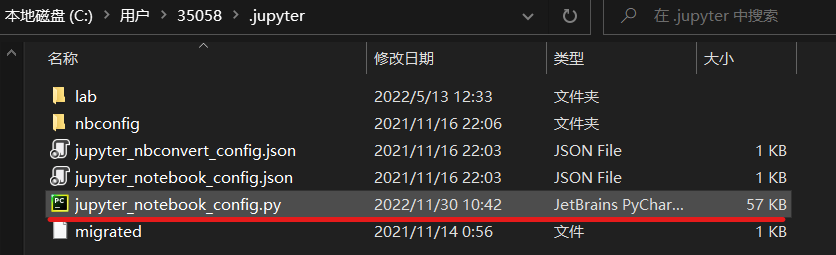
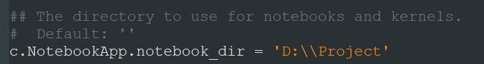
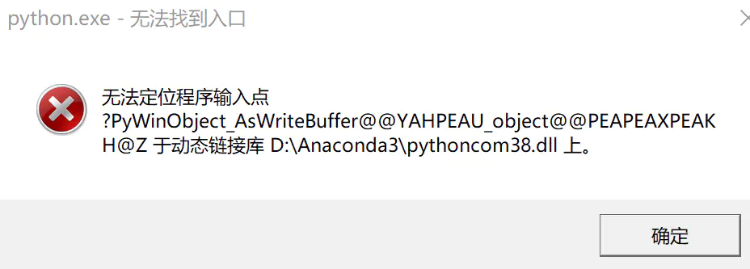
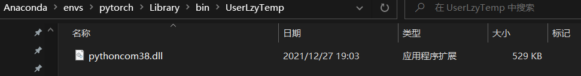

# Jupyter Notebook

[toc]

# Portals


# Config

## 01 修改 jupyter notebook的默认文件夹位置

[修改 jupyter notebook的默认文件夹位置](https://blog.csdn.net/fanlily913/article/details/106171791/)

```C:\Users\35058\.jupyter\jupyter_notebook_config.py```





# Bug

## 01 无法定位程序输入点?init@PyWinBufferView@@。。。于动态链接库python38com.dll



把对应环境的python38com.dll删了即可，或者暂存在一个文件夹中




