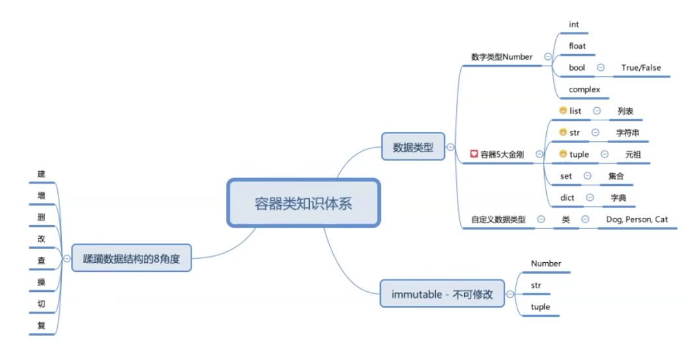

# Learn Python

# 零碎知识点

##

## 文件基本操作

为什么要用文件？

保存重要数据，在程序关闭后保存，下次可以不用再次计算出数据

```python
# 打开文件
f = open("title.xxx","w")
f = open("title.xxx","wb")#二进制
f = open("title.xxx","r")
f = open("title.xxx","rb")#二进制

# 写数据
f.write("xxx")
content = f.read()

# 关闭文件
f.close()
```

<br>
<br>

### os模块

os:operate system

### os.walk

walk能够遍历文件夹中，所有文件、文件夹(深度优先遍历)

os.walk() 方法用于通过在目录树中游走输出在目录中的文件名，向上或者向下。

os.walk() 方法是一个简单易用的文件、目录遍历器，可以帮助我们高效的处理文件、目录方面的事情。

<br>

语法

```python
os.walk(top[, topdown=True[, onerror=None[, followlinks=False]]])

'''
top -- 是你所要遍历的目录的地址, 返回的是一个三元组(root,dirs,files)。
    root 所指的是当前正在遍历的这个文件夹的本身的地址
    dirs 是一个 list ，内容是该文件夹中所有的目录的名字(不包括子目录)
    files 同样是 list , 内容是该文件夹中所有的文件(不包括子目录)

topdown --可选，为 True，则优先遍历 top 目录，否则优先遍历 top 的子目录(默认为开启)。如果 topdown 参数为 True，walk 会遍历top文件夹，与top 文件夹中每一个子目录。

onerror -- 可选，需要一个 callable 对象，当 walk 需要异常时，会调用。

followlinks -- 可选，如果为 True，则会遍历目录下的快捷方式(linux 下是软连接 symbolic link )实际所指的目录(默认关闭)，如果为 False，则优先遍历 top 的子目录。

'''

```

<br>

一些例子

```python
import os

os.walk(".")#.或者./表示当前路径（该.py文件的路径）

for temp in os.walk("./"):#os.walk返回迭代器
    print(temp)


import os
for root, dirs, files in os.walk(".", topdown=False):
    for name in files:
        print(os.path.join(root, name))
    for name in dirs:
        print(os.path.join(root, name))
```

<br>

### 使用递归函数遍历目录

```python
import os

def list_file_or_folder(path_name):
    file_folder_names =os.listdir(path_name)
    print(file_folder_names)
    for name in file_folder_names:
        temp_path_name=os.path.join(path_name,name)
        if os.path.isdir(temp_path_name):#这里很关键，相对路径
            print("%s是文件夹" % name)
            list_file_or_folder(temp_path_name)
        else:
            print(("%s是文件" % name))

```

<br>

### os.path

[菜鸟教程  Python os.path()模块](https://www.runoob.com/python/python-os-path.html)

一些例子

```python
import os
 
print( os.path.basename('/root/runoob.txt') )   # 返回文件名
print( os.path.dirname('/root/runoob.txt') )    # 返回目录路径
print( os.path.split('/root/runoob.txt') )      # 分割文件名与路径
print( os.path.join('root','test','runoob.txt') )  # 将目录和文件名合成一个路径

# runoob.txt
# /root
# ('/root', 'runoob.txt')
# root/test/runoob.txt

```

<br>
<br>

## 变量作用域

Python作用域共四种

1. L：local 局部作用域
2. E：enclosing 闭包函数外的函数中
3. G：global 全局作用域
4. B：built-in 内建作用域

python中，一个源代码文件就是一个模块

在模块中定义的变量，作用域是这个模块->全局变量

在函数中定义的变量，作用域仅限于该函数内部->局部变量

如果一个函数中，全局变量和局部变量重名，则用的是局部变量

在函数中，用global关键字声明变量，则升级为全局变量

一个错误范例(会报错)

```python
s=0
def foo():
    for i in range(10)：
        s=s+60

foo()
print(s)
```
原因：在函数中给变量赋值的时候，python会将其强行创建为局部变量

## List




<br>
<br>

## Python Generator Yield

```python
# 使用python推导式
nums = [1,2,3,4,5]
square_nums=[n*n for n in nums]
print(square_nums)

# 使用generator
# 通过next生成下一个
nums = [1,2,3,4,5]
square_nums=(n*n for n in nums)
# 可以使用for循环
# for n in square_nums:
#     print(n)

#调用next，不接受len
print(next(square_nums))
print(next(square_nums))
# ...
# 没有下一个数会抛出异常 StopIteration
# print(len(square_nums)) #会报错，无法知道有多少数字

print(square_nums)

# 推导式一次性生成全部数据
# generator需要的全部数据并没有实实在在的生成
# generator在时间复杂度和内存占用中都更胜一筹


# yield例子（解决复杂情况，无法用推导式写出）
# 不使用yield
def gen_nums(nums):
    new_nums=[];
    for n in nums:
        if(n%3==0):
            new_nums.append(3*10)
        elif(n%5==0):
            new_nums.append(5*10)
        else:
            new_nums.append(n*10)
    return new_nums

#使用yield（将单次的return改为yield）
def gen_nums(nums):
    for n in nums:
        if(n%3==0):
            yield 3*10
        elif(n%5==0):
            yield 5*10
        else:
            yield n*10

```

<br>
<br>

# 标准库

## time

[标准库time](https://www.bilibili.com/video/BV1GT4y1E725)

time

datatime

calendar

time模块中三种时间表示方法
1. 时间戳（数字，浮点型，从1970.1.1零时到现在的时间差距，单位秒）
2. 结构化时间对象（对象，属性和访问方法）
3. 格式化时间字符串（字符串）


