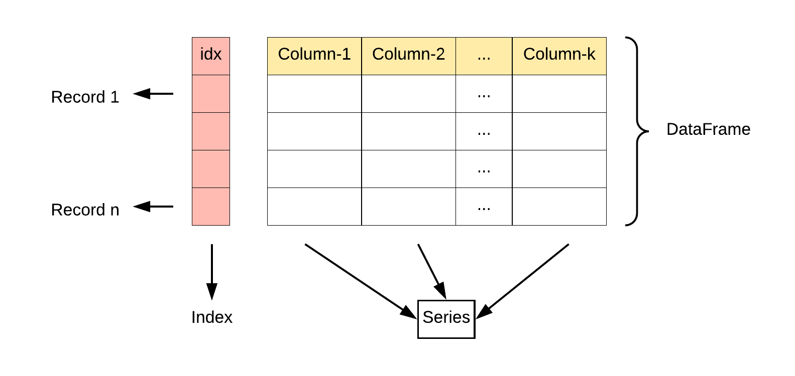
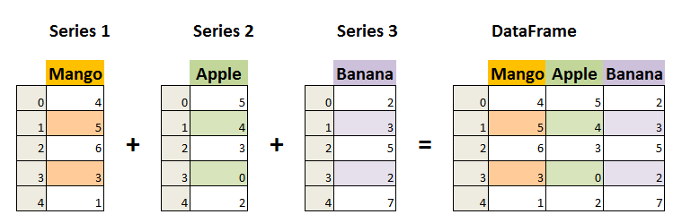

# Pandas

[toc]

# Portals

[莫烦Python Pandas教程](https://www.bilibili.com/video/BV1Ex411L7oT)

[菜鸟教程 Pands](https://www.runoob.com/pandas/pandas-tutorial.html)

# 莫烦Python

## 常见用法

不需要括号，因为这是属性
```python
df.dtypes  # 查看每一列的数据类型

df.index  # 行标

df.columns  # 列表

df.values  # 值

df.describe()  # 一些描述

df.T  # 转置

df.sort_index(axis=[num], ascending=False)  # 根据索引的大小对整个DataFrame进行重排
# num==0 对index排序
# num==1 对columns排序
# ascending==True升序 ==False降序

df.sort_values(xxx)  # 根据某一列的值进行排序
```

## 选择数据

### .loc 标签

```python
x = [[1,2,3,4],
     [5,6,7,8],
     [9,10,11,12],
     [13,14,15,16],
     [17,18,1,20],]

df = pd.DataFrame(x, index=['_0','_1','_2','_3','_4'],columns=['|0','|1','|2','|3'])
print(df)
"""
    |0  |1  |2  |3
_0   1   2   3   4
_1   5   6   7   8
_2   9  10  11  12
_3  13  14  15  16
_4  17  18   1  20
"""
print(df[1:2])
"""
    |0  |1  |2  |3
_1   5   6   7   8
"""
print(df[['|2','|3']])
"""
    |2  |3
_0   3   4
_1   7   8
_2  11  12
_3  15  16
_4   1  20
"""
print(df.loc[:, ['|1', '|2']])
"""
    |1  |2
_0   2   3
_1   6   7
_2  10  11
_3  14  15
_4  18   1
"""
print(df.loc[['_0', '_1'], ['|1', '|2']])
"""
    |1  |2
_0   2   3
_1   6   7
"""
```
### .iloc 坐标
```python
# 切片
print(df.iloc[3:4, 1:3])
"""
    |1  |2
_3  14  15
"""
print(df.iloc[3:, 1:3])
"""
    |1  |2
_3  14  15
_4  18   1
"""
# 不连续切片
print(df.iloc[[0, 2, 4], [1, 1, 2]])
"""
    |1  |1  |2
_0   2   2   3
_2  10  10  11
_4  18  18   1
"""
```

### .ix

```python
# 不推荐使用
```

### Boolean indexing 布尔

```python
print(df[df >= 8])
"""
      |0    |1    |2    |3
_0   NaN   NaN   NaN   NaN
_1   NaN   NaN   NaN   8.0
_2   9.0  10.0  11.0  12.0
_3  13.0  14.0  15.0  16.0
_4  17.0  18.0   NaN  20.0
"""
print(df[df.iloc[1:3] > 9])
"""
    |0    |1    |2    |3
_0 NaN   NaN   NaN   NaN
_1 NaN   NaN   NaN   NaN
_2 NaN  10.0  11.0  12.0
_3 NaN   NaN   NaN   NaN
_4 NaN   NaN   NaN   NaN
"""
print(df[df.iloc[0:3,1:3] > 9])
"""
    |0    |1    |2  |3
_0 NaN   NaN   NaN NaN
_1 NaN   NaN   NaN NaN
_2 NaN  10.0  11.0 NaN
_3 NaN   NaN   NaN NaN
_4 NaN   NaN   NaN NaN
"""
```

## pandas设置值

利用上面的选择数据方法然后赋值即可
1. iloc
2. loc

```python
df.iloc[[1, 4], [2, 3]] = 999
print(df)
"""
    |0  |1   |2   |3
_0   1   2    3    4
_1   5   6  999  999
_2   9  10   11   12
_3  13  14   15   16
_4  17  18  999  999
"""

df.loc['_0'] = np.nan  # 行(会被覆盖)
df['|0'] = 2  # 列
df.loc[:, '|2'] = 3  # 列
print(df)
"""
    |0    |1  |2    |3
_0   2   NaN   3   NaN
_1   2   6.0   3   8.0
_2   2  10.0   3  12.0
_3   2  14.0   3  16.0
_4   2  18.0   3  20.0
"""

df = pd.DataFrame(x, index=['A','B','C','D','E'],columns=['A','B','C','D'])
print(df)
"""
    A   B   C   D
A   1   2   3   4
B   5   6   7   8
C   9  10  11  12
D  13  14  15  16
E  17  18   1  20
"""
df.B[df.A>8]=0
print(df)
"""
    A  B   C   D
A   1  2   3   4
B   5  6   7   8
C   9  0  11  12
D  13  0  15  16
E  17  0   1  20
"""
```


## 合并concat

```python
df1 = pd.DataFrame(np.ones((3, 4)) * 1, columns=['a', 'b', 'c', 'd'])
df2 = pd.DataFrame(np.ones((3, 4)) * 2, columns=['a', 'b', 'c', 'd'])
df3 = pd.DataFrame(np.ones((3, 4)) * 3, columns=['a', 'b', 'c', 'd'])

df = pd.concat(objs=[df1, df2, df3], axis=0, ignore_index=True)
# axis=0是竖着叠在一起，axis=1是横着拼在一起
# ignore_index是否忽略index重新从0赋值

print(df)

"""
     a    b    c    d
0  1.0  1.0  1.0  1.0
1  1.0  1.0  1.0  1.0
2  1.0  1.0  1.0  1.0
3  2.0  2.0  2.0  2.0
4  2.0  2.0  2.0  2.0
5  2.0  2.0  2.0  2.0
6  3.0  3.0  3.0  3.0
7  3.0  3.0  3.0  3.0
8  3.0  3.0  3.0  3.0
"""
```


# 菜鸟教程

## 01 初识

Pandas 的主要数据结构是 Series （一维数据）与 DataFrame（二维数据）

这两种数据结构足以处理金融、统计、社会科学、工程等领域里的大多数典型用例。

Series 是一种类似于一维数组的对象，它由一组数据（各种Numpy数据类型）以及一组与之相关的数据标签（即索引）组成。

DataFrame 是一个表格型的数据结构，它含有一组有序的列，每列可以是不同的值类型（数值、字符串、布尔型值）。DataFrame 既有行索引也有列索引，它可以被看做由 Series 组成的字典（共同用一个索引）。

```python
import pandas as pd

mydataset = {
  'sites': ["Google", "Runoob", "Wiki"],
  'number': [1, 2, 3]
}

myvar = pd.DataFrame(mydataset)

print(myvar)

"""
    sites  number
0  Google       1
1  Runoob       2
2    Wiki       3
"""
```

## 02 数据结构 Series

Pandas Series 类似表格中的一个列（column），类似于一维数组，可以保存任何数据类型。

Series 由索引（index）和列组成，函数：pandas.Series( data, index, dtype, name, copy)
1. data：一组数据(ndarray 类型)。
2. index：数据索引标签，如果不指定，默认从 0 开始。
3. dtype：数据类型，默认会自己判断。
4. name：设置名称。
5. copy：拷贝数据，默认为 False。

**可以根据索引值读取数据**
```python
import pandas as pd
a = [11, 22, 33]
b = pd.Series(a)
print(b[2])  # 33
```

**可以指定索引值**
```python
import pandas as pd
a = ['xxx','yyy','zzz']
b = ['_x_','_y_','_z_']
t = pd.Series(a, b)
print(t)

"""
_x_    xxx
_y_    yyy
_z_    zzz
dtype: object
"""
print(t["_z_"])  # zzz
```

**可以使用 key/value 对象，类似字典来创建 Series**
```python
import pandas as pd
sites = {1: "Google", 2: "Runoob", 3: "Wiki"}
var = pd.Series(sites)
print(var)
"""
1    Google
2    Runoob
3      Wiki
dtype: object
"""
print(var[1])  # Google
```
字典的 key 变成了索引值。

如果我们只需要字典中的一部分数据，只需要指定需要数据的索引即可
```python
import pandas as pd
sites = {1: "Google", 4: "Runoob", 3: "Wiki"}
var = pd.Series(sites, index=[3, 4])
print(var)
"""
3      Wiki
4    Runoob
dtype: object
"""
```

**设置 Series 名称参数**
```python
import pandas as pd
sites = {1: "Google", 4: "Runoob", 3: "Wiki"}
var = pd.Series(sites, index=[3, 4],  name="test")
print(var)
"""
3      Wiki
4    Runoob
Name: test, dtype: object
"""
```

## 03 数据结构 DataFrame

DataFrame 是一个表格型的数据结构，它含有一组有序的列，每列可以是不同的值类型（数值、字符串、布尔型值）。DataFrame 既有行索引也有列索引，它可以被看做由 Series 组成的字典（共同用一个索引）。

**两层列表，创建的DataFrame和列表格式相同（可以缺少数据）**

**一层字典，字典的key指明的是列标签。（如果是字典中嵌套列表，则不能缺少数据）**

**两层字典，外层字典的key指明列标签，内层字典指明行标签（可以缺少数据）**

**如果通过字典创建，则不要在pd.DataFrame的时候重新指定标签，这将导致找不到数据**

**标签可以重复，输出时会一并输出**

**对于用列表创建的，列的哪一个维度指定index或columns的时候，长度一定要和列表相应长度对应。（相当于给那一个维度起一个名字）**

**读取数据的时候，使用两层中括号，可以维持和原DataFrame相同的组织形式**





pandas.DataFrame( data, index, columns, dtype, copy)
1. data：一组数据(ndarray、series, map, lists, dict 等类型)
2. index：索引值，或者可以称为行标签。
3. columns：列标签，默认为 RangeIndex (0, 1, 2, …, n) 。
4. dtype：数据类型。
5. copy：拷贝数据，默认为 False。

```python
import pandas as pd
data = [['Google'],
        ['Runoob', 12],
        ['Wiki', 13]]
df = pd.DataFrame(data,columns=['Site','Age'],dtype=float)
print(df)
"""
     Site   Age
0  Google   NaN
1  Runoob  12.0
2    Wiki  13.0
如果缺少数据填入NaN
"""
```

**使用 ndarrays 创建**

使用 ndarrays 创建，ndarray 的长度必须相同， 如果传递了 index，则索引的长度应等于数组的长度。如果没有传递索引，则默认情况下，索引将是range(n)，其中n是数组长度。

```python
import pandas as pd
data = {'Site': ['Google', 'Runoob', 'Wiki'], 'Age': [10, 12, 13]}
# 只有这种情况，列表长度不同会带来问题
df = pd.DataFrame(data)
print(df)
"""
     Site  Age
0  Google   10
1  Runoob   12
2    Wiki   13
"""
```

```python
import pandas as pd
data = [['Google', 'Runoob', 'Wiki'], [10, 12, 13]]
# 一次创建一整行，使用列表的方式
df = pd.DataFrame(data)
print(df)
"""
        0       1     2
0  Google  Runoob  Wiki
1      10      12    13
"""
```

**使用字典（key/value）**

其中字典的 key 为列名

```python
import pandas as pd
data = [{'a': 1, 'b': 2},{'a': 5, 'b': 10, 'c': 20}]
df = pd.DataFrame(data)
print(df)
"""
   a   b     c
0  1   2   NaN
1  5  10  20.0
"""
```

```python
import pandas as pd
data = {11: {'a': 1, 'b': 2}, 12: {'a': 5, 'b': 10, 'c': 20}}
df = pd.DataFrame(data)
print(df)
"""
    11  12
a  1.0   5
b  2.0  10
c  NaN  20
"""
```

```python
import pandas as pd
data = [[1,2,4],
        [3,5,7]]
df = pd.DataFrame(data, index=['a','a'], columns=['a','a','a'])
print(df)
"""
   a  a  a
a  1  2  4
a  3  5  7
"""
```

**可以使用新名称进行索引，但是这将导致取不到理想的数据**（行列的索引是新指定的但是数据并不会跟过来）

```python
import pandas as pd
data = {11: {'a': 1, 'b': 2}, 12: {'a': 5, 'c': 20}}
df = pd.DataFrame(data, index=['r1', 'r2', 'r3'], columns=['c1', 'c2'])
print(df)
"""
     c1   c2
r1  NaN  NaN
r2  NaN  NaN
r3  NaN  NaN
"""
```

选择数据后面有详细范例

**返回指定行的数据**

Pandas 可以使用 loc 属性返回指定行的数据，如果没有设置索引，第一行索引为 0，第二行索引为 1，以此类推

使用loc，注意后面不是使用小括号，而是使用**中括号**

**返回多行数据，使用 [[ ... ]] 格式，... 为各行的索引，以逗号隔开**

1. **返回一行：返回结果其实就是一个 Pandas Series 数据。**
2. **返回多行：返回结果其实就是一个 Pandas DataFrame 数据。**

```python
import pandas as pd
data = {
  "mango": [420, 380, 390],
  "apple": [50, 40, 45],
  "pear": [1, 2, 3],
  "banana": [23, 45, 56]
}
df = pd.DataFrame(data)
print(df)
"""
   mango  apple  pear  banana
0    420     50     1      23
1    380     40     2      45
2    390     45     3      56
"""
print(df.loc[0])
"""
mango     420
apple      50
pear        1
banana     23
Name: 0, dtype: int64
"""
print(df.loc[[0]])
"""
   mango  apple  pear  banana
0    420     50     1      23
"""
print(df.loc[[0, 2]])
"""
   mango  apple  pear  banana
0    420     50     1      23
2    390     45     3      56
"""
```

**返回指定列的数据**

当处理数据时候 series 较多而我们其中只关注其中一些特定的列时候可以使用。

**使用两层中括号，使得输出保持DataFrame形式**

```python
import pandas as pd
data = {
  "mango": [420, 380, 390],
  "apple": [50, 40, 45],
  "pear": [1, 2, 3],
  "banana": [23, 45, 56]
}
df = pd.DataFrame(data)
print(df)
"""
   mango  apple  pear  banana
0    420     50     1      23
1    380     40     2      45
2    390     45     3      56
"""
print(df["banana"])
"""
0    23
1    45
2    56
Name: banana, dtype: int64
"""
print(df[["banana"]])
"""
   banana
0      23
1      45
2      56
"""
print(df[["mango", "pear"]])
"""
   mango  pear
0    420     1
1    380     2
2    390     3
"""
```


## 04 Pandas读取保存csv、txt文件

CSV（Comma-Separated Values，逗号分隔值，有时也称为字符分隔值，因为分隔字符也可以不是逗号），其文件以纯文本形式存储表格数据（数字和文本）。

CSV 是一种通用的、相对简单的文件格式，被用户、商业和科学广泛应用。

**to_string() 用于返回 DataFrame 类型的数据，如果不使用该函数，则输出结果为数据的前面 5 行和末尾 5 行，中间部分以 ... 代替。**

**读取csv文件**（txt也可以用该方式打开）

函数pd.read_csv(...)

主要参数
1. filepath_or_buffer--(文件路径)
2. sep--(分隔符) \t制表符、 \r、 \n、 " "（空格） 默认逗号
3. encoding--(文件编码)
4. header--(可以理解为每一列的名称) None表示没有指定（文件文件没有给出列名） 数字表示某一行

**将DataFrame存储为csv文件**

函数xxx.to_csv(...)  # xxx是DataFrame格式


### 数据处理
1. .head(n)  # 用于读取前面的 n 行，如果不填参数 n ，默认返回 5 行
2. .tail(n)  # 读取尾部的 n 行，如果不填参数 n ，默认返回 5 行，空行各个字段的值返回 NaN
3. .info()  # 返回表格的一些基本信息


## 05 Pandas读取excel文件

函数pd.read_excel(...)

主要参数
1. io
2. sheet_name
3. header
4. names
5. index_col
6. usecols

**待完善**

## 06 Pandas JSON

## 07 Pandas 数据清洗