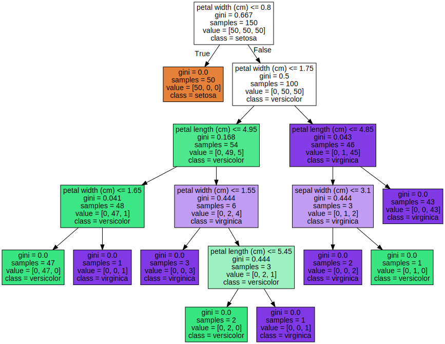

# scikit-learn


[toc]

## Portals

[sklearn 官网](https://scikit-learn.org/stable/user_guide.html)

[sklearn 中文文档](https://www.scikitlearn.com.cn/)

[sklearn常用函数 知乎](https://zhuanlan.zhihu.com/p/393113910)


# 1 监督学习

## 1.10 决策树

**1.10.1. Classification**
DecisionTreeClassifier 是能够在数据集上执行多分类的类。

As with other classifiers, DecisionTreeClassifier takes as input two arrays: 
1. an array X, sparse or dense(稀疏或致密), of shape (n_samples, n_features) holding the **training samples**
2. an array Y of ==**integer**== values, shape (n_samples,), holding the class **labels for the training samples**


```python
from sklearn import tree
X = [[0, 0], [1, 1]]
Y = [0, 1]
clf = tree.DecisionTreeClassifier()  # 除了classifier还有regressor
clf = clf.fit(X, Y)

# After being fitted, the model can then be used to predict the class of samples

clf.predict([[2., 2.]])
# 注意就算只有一个预测样本，也要有外层括号
tree.plot_tree(clf)
```

```python
# 画出决策树
import graphviz 
dot_data = tree.export_graphviz(clf, out_file=None) 
graph = graphviz.Source(dot_data) 
graph.render("iris") 
dot_data = tree.export_graphviz(clf, out_file=None, feature_names=iris.feature_names,  
                     class_names=iris.target_names, filled=True, rounded=False,  
                     special_characters=False)  
# 颜色似乎是由filled引起的，rounded是指边框有没有圆角
graph = graphviz.Source(dot_data)  
graph 
```


**1.10.2. Regression**
Decision trees can also be applied to regression problems, using the **DecisionTreeRegressor** class.

```python
from sklearn import tree
X = [[0, 0], [2, 2]]
y = [0.5, 2.5]
clf = tree.DecisionTreeRegressor()
clf = clf.fit(X, y)
clf.predict([[1, 1]])
# 注意就算只有一个预测样本，也要有外层括号
```

**1.10.3. Multi-output problems**

A multi-output problem is a supervised learning problem with several outputs to predict

when Y is a 2d array of shape (n_samples, n_outputs)

When there is no correlation between the outputs, a very simple way to solve this kind of problem is to build n independent models, i.e. one for each output, and then to use those models to independently predict each one of the n outputs.

如果多个label之间没有相关性，可以分解为多个单label问题，训练多个模型解决。

**1.10.6. Tree algorithms: ID3, C4.5, C5.0 and CART**

scikit-learn uses an optimized version of the CART algorithm

scikit-learn implementation does not support categorical variables（分类变量）


## 1.11 集成方法(Ensemble methods)

The goal of ensemble methods is to combine the predictions of several base estimators built with a given learning algorithm in order to improve generalizability / robustness over a single estimator.

Two families of ensemble methods
1. **averaging methods**：Examples: Bagging methods, Forests of randomized trees, …
2. **boosting methods**：Examples: AdaBoost, Gradient Tree Boosting, …

**1.11.1. Bagging meta-estimator**

**1.11.2. Forests of randomized trees**
The sklearn.ensemble module includes two averaging algorithms based on randomized decision trees
1. the RandomForest algorithm
2. the Extra-Trees method

perturb-and-combine techniques（扰动和组合）

这种技术通过在分类器构造过程中引入随机性来创建一组不同的分类器，集成分类器的预测结果就是单个分类器预测结果的平均值。

*Random Forests*

RandomForestClassifier and RandomForestRegressor classes

==sklearn.ensemble.RandomForestClassifier==类构造函数参数
1. n_estimators : int, default=100(The number of trees in the forest)
2. criterion : {“gini”, “entropy”, “log_loss”}, default=”gini”(function to measure the quality of a split)
3. max_depth : int, default=None
4. min_samples_split : int or float, default=2
5. min_samples_leaf : int or float, default=1
6. bootstrap : bool, default=True

```python
from sklearn.ensemble import RandomForestClassifier  # 在ensemble中
X = [[0, 0], [1, 1]]
Y = [0, 1]
clf = RandomForestClassifier(n_estimators=10)  # The number of trees in the forest
clf = clf.fit(X, Y)
```


*Extremely Randomized Trees*

ExtraTreesClassifier and ExtraTreesRegressor classes


**1.11.3. AdaBoost**

The module sklearn.ensemble includes the popular boosting algorithm AdaBoost

AdaBoost can be used both for classification and regression problems


[combine data](https://pandas.pydata.org/docs/getting_started/intro_tutorials/08_combine_dataframes.html)

# 2 无监督学习

# 3 模型选择和评估

# 4 检验

# 5 数据集转换

# 6 数据集加载工具
