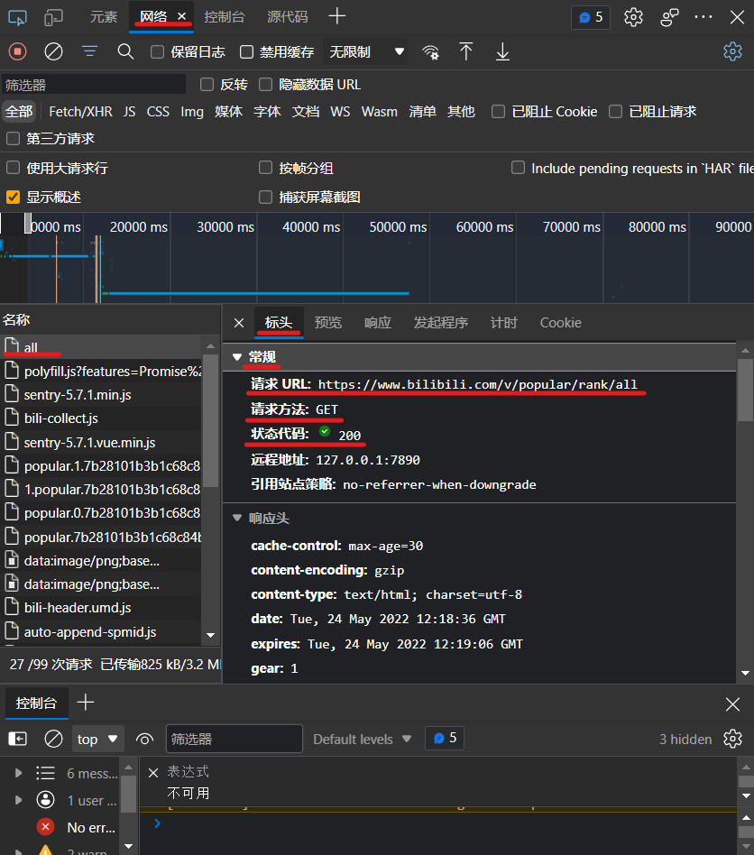
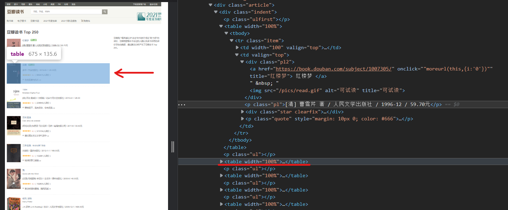
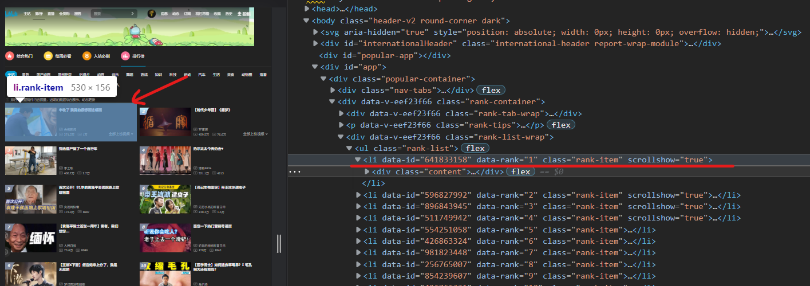

# 网页爬虫

[toc]

## Portals

[麦叔编程 爬虫实战](https://www.bilibili.com/video/BV1o7411q7za)


# 麦叔编程 爬虫实战

浏览器和服务器通过http协议通讯

**爬虫工作**
1. 爬虫根据URL，模拟浏览器向服务器发送请求，获取HTML文本
2. 解析HTML文本，提取所需数据
3. 从HTML中解析出超链接，继续爬取内容

**robots.txt**写明了不允许爬取的内容
```txt
<!-- 豆瓣读书的robots.txt -->
User-agent: *
Disallow: /subject_search
Disallow: /search
Disallow: /new_subject
Disallow: /service/iframe
Disallow: /j/
Sitemap: http://www.douban.com/sitemap_index.xml
Sitemap: http://www.douban.com/sitemap_updated_index.xml

User-agent: Wandoujia Spider
Disallow: /
```

**requests**
```python
import requests
url = 'xxxx'
headers = 'xxxx'
response = requests.get(url, headers = xxxx )
response.text
response
```

**edge浏览器控制台**


**HTML标签属性**

**BeautifulSoup**
soup = BeautifulSoup(html_text, 'html.parser')
soup.title.text

**解析列表**




使用find_all方法或者find方法
find_all的结果为一个数组
find可以级联
.get('xxx')获取属性

p15


```python
import requests
from bs4 import BeautifulSoup
import csv
import datetime

url = 'https://www.bilibili.com/ranking'
#发起网络请求
response = requests.get(url)
html_text = response.text
soup = BeautifulSoup(html_text, 'html.parser')

#用来保存视频信息的对象
class Video:
	def __init__(self, rank, title, score, visit, up, up_id, url):
		self.rank = rank
		self.title = title
		self.score = score
		self.visit = visit
		self.up = up
		self.up_id = up_id
		self.url = url
	def to_csv(self):
		return [self.rank, self.title, self.score, self.visit, self.up, self.up_id, self.url]

	@staticmethod
	def csv_title():
		return ['排名','标题','分数','播放量','Up主','Up Id', 'URL']

#提取列表
items = soup.findAll('li',{'class':'rank-item'})
vidoes = [] #保存提取出来的Video列表

for itm in items:
	title = itm.find('a',{'class':'title'}).text #视频标题
	score = itm.find('div',{'class':'pts'}).find('div').text #综合得分
	rank = itm.find('div',{'class':'num'}).text #排名
	visit = itm.find('span',{'class':'data-box'}).text #播放量
	up = itm.find_all('a')[2].text #播放量
	space = itm.find_all('a')[2].get('href')
	up_id = space[len('//space.bilibili.com/'):] #播放量
	url = itm.find('a', {'class':'title'}).get('href')
	v = Video(rank, title, score, visit, up, up_id, url)
	vidoes.append(v)

now_str = datetime.datetime.now().strftime('%Y%m%d_%H%M%S')
file_name = f'top100_{now_str}.csv'
with open(file_name, 'w', newline='') as f:
	pen = csv.writer(f)
	pen.writerow(Video.csv_title())
	for v in vidoes:
		pen.writerow(v.to_csv())


url2 = 'https://www.bilibili.com/video/av85054372'
with open('temp.html', 'w', newline='') as f:
	f.write(requests.get(url2).text)

```


```python
from matplotlib import pyplot as plt

# 为了在Jupyter Notebook中显示图片的必须配置项
%matplotlib inline

# 用兼容字体解决中文显示为方格的问题
plt.rcParams['font.sans-serif'] = ['SimHei']
plt.rcParams['font.serif'] = ['SimHei']
plt.rcParams['font.family'] = 'sans-serif'

# 解决保存图像是负号'-'显示为方块的问题
plt.rcParams['axes.unicode_minus'] = False
```


# 问题解决

## 中文乱码问题

[Python 爬虫遇到中文乱码](https://blog.csdn.net/weixin_42750611/article/details/122394100)

**方法1**
通过.text方法获取到的源码，之后进行打印输出的话，确实是会存在乱码的。考虑将请求变为.content，得到的内容就是正常的。

```python
soup = BeautifulSoup(response.text, 'html.parser') 
# 改为
soup = BeautifulSoup(response.content, 'html.parser') 
```

**方法2**
手动指定网页编码

```python
response.encoding = response.apparent_encoding
```

