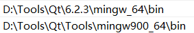
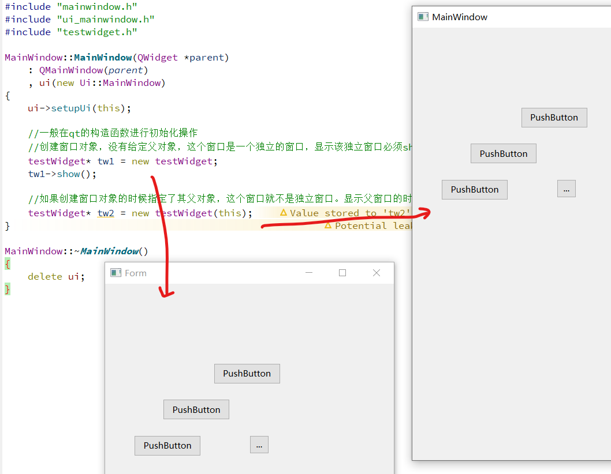
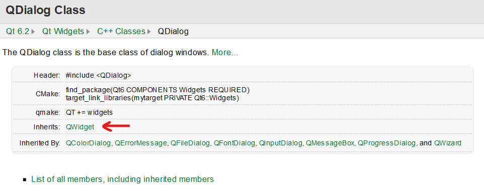
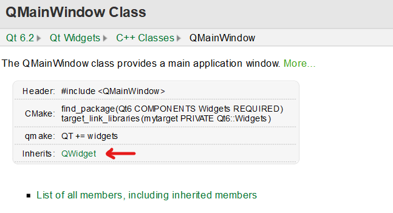
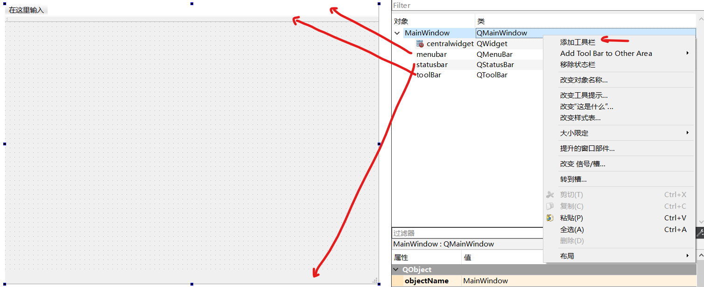
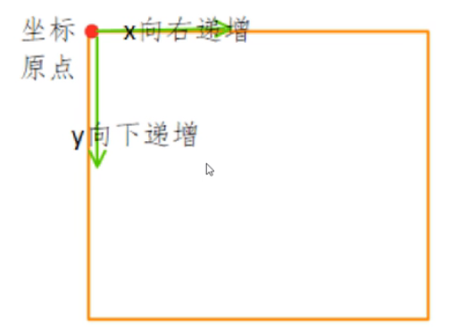

# Qt

[toc]

## Portals

[Qt开发编程-入门基础教程Qt5](https://www.bilibili.com/video/BV1Jp4y167R9)

# 安装

下载在线安装工具，登录qt账号，选择需要的组件即可。

下载和解压过程极其漫长。

添加组件也可以使用Uninstall Qt工具。（选择Add or Remove Components即可）

添加两个环境变量。



为了可以加载到需要的动态库。

# Qt开发编程-入门基础教程Qt


[Qt开发编程-入门基础教程Qt5](https://www.bilibili.com/video/BV1Jp4y167R9)

## 简介

GUI(Graphical user interface)

跨平台

有属于自己的事件处理机制


丰富API

支持正则表达式，OpenGL、xml、json


## Qt中的模块

Qt类库中大量的类根据功能分为各种模块：
1. Qt Essentials：Qt再所有平台上的基本功能
   1. Qt Core：类库的核心（默认添加）
   2. Qt GUI：设计GUI界面的基础类（默认添加）
   3. Qt Widgets：用于构建GUI界面的C++图形组件库（默认添加）
   4. Qt Multimedia：音频、视频、摄像头和广播功能的类
   5. Qt Multimedia Widgets：实现多媒体功能的界面组件类
   6. Qt Network：使网络编程更简单轻便的类
   7. Qt SQL：使用SQL用于数据库操作的类
   8. Qt Test：用于应用程序和库进行单元测试的类
2. Qt Add-Ons：实现一些特定功能的提高附加价值的模块
3. Value-AddModules：单独发布的提供额外价值的模块或工具
4. Technology Preview Modules：一些处于开发阶段，但是可以作为奇数预览使用的模块
5. Qt Tools：帮助应用开发的一些工具

## 第一个Qt项目

xxxx.pro：项目文件
1. QT += xxx xxx：可以在第一行添加相应的Qt模块
2. greaterThan：第4版之后，widgets从gui中被分离出来（版本兼容）
3. CONFIG += xxxx：支持c++11
4. DEFINES += QT_DEPRECATED_WARNINGS：使用过时函数，不经过
5. SOURCES:源文件
6. HEADERS：头文件
7. FORMS：ui文件

main.cpp：使用到相应的类，要添加相应的头文件（类名就是头文件的名字）
```cpp
// 应用程序类，主要负责窗口的事件处理（在一个Qt应用程序中，该对象只有一个）
QApplication a(argc, argv);
MainWindow w;  // 窗口对象
w.show();  // 显示窗口
return a.exec();  // 进入事件循环。调用exec，阻塞函数，进入事件循环。
```

mainwindow.h：继承Qt的QMainWindow类。还有一个ui命名空间的同名类（在private中）。

mainwindow.cpp：实例化ui指针。也就是mainwindow.ui被实例化。

mainwindow.ui：xml格式文件。可以拖拽控件。

均由Qt生成和维护。

## QWidget类型窗口特点

Qt窗口类：
1. QMainWindow
2. QDialog
3. QWidget：所有窗口类的基类。可以内嵌到其他窗口的内部（无边框），可以作为独立的窗口显示。
   1. 创建窗口对象，没有给定父对象，这个窗口是一个独立的窗口，显示该独立窗口必须show。
   2. 如果创建窗口对象的时候指定了其父对象，这个窗口就不是独立窗口。显示父窗口的时候，子窗口会一并显示出来。
   


## QDialog类型的窗口特点

对话框窗口类



是QWidget的子类，但是属性更多

只能单独显示，不能内嵌

模态和非模态两种显示方式：
1. 模态：会阻塞程序的运行，调用exec。dlg->exec();（mainwindow没有显示出来因为构造函数还没有走完，阻塞在exec。同时也无法切换子窗口）
2. 非模态：不管是否指定父对象，都需要进行show。dlg->show();（可以进行焦点切换）


## QMainWindow类型的窗口特点

主窗口类

可以包含菜单栏（只能有一个）、工具栏（可以有多个）、状态栏（只能有一个）

不能内嵌





## Qt中的坐标体系



坐标原点在左上角，**采用x-y坐标系，而非row-col坐标系**。

每一个子窗口的位置都是基于父窗口的位置（左上角在父窗口坐标系的位置）（只管上一层，相对坐标系）。

单位是像素。

p11

## Qt中的内存回收机制


