# Learn Risc-V

# 汇编语言入门（RISC-V）

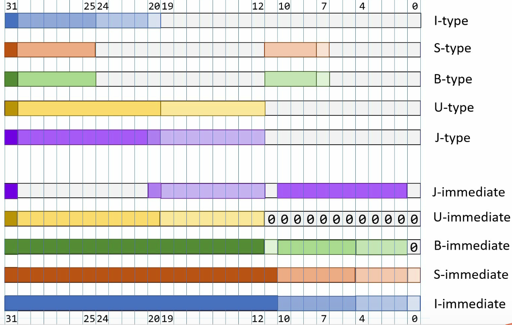

## Register Operands（操作对象）

RISC-V 32*32bit register file(32bit for a "word")

用于快速获取数据

寄存器从0-31

## 给数组分配地址

little-endian 

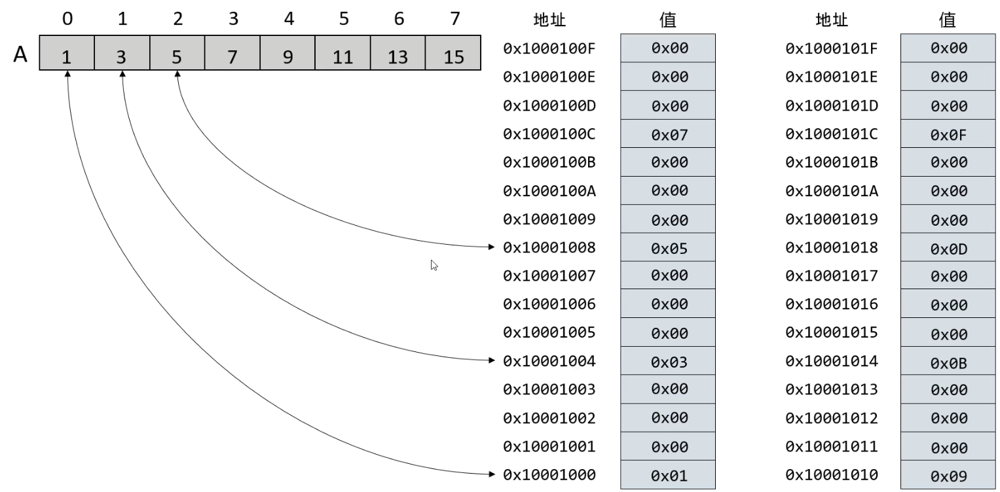

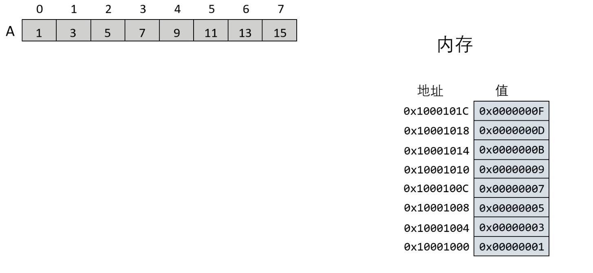

8位16进制=32位2进制

## Word

处理器最常用的数据单位（4bytes/32bits）

### lw

lw loads a word from a specified memory location into a register int the processor（读取数据并放入寄存器）

### sw

sw stores a word from a register in the processor into a specified memory location

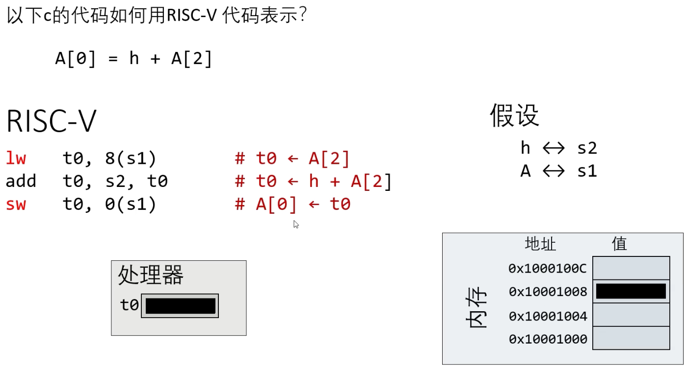

注：上图8是由于A[2]偏移8个字节（2个word）

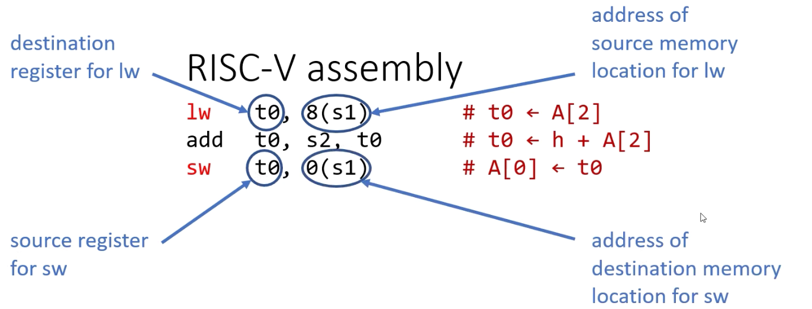

注意lw、sw的source和destination顺序不同

lw操作

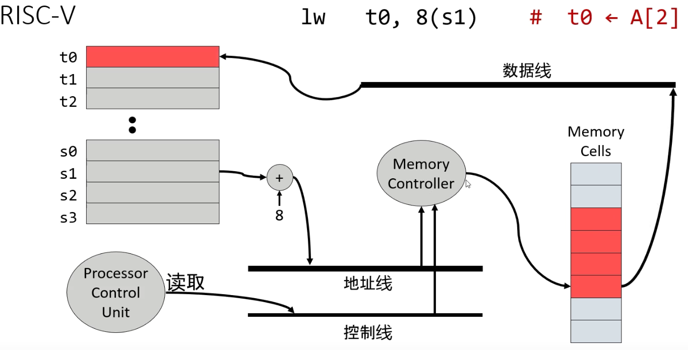

sw操作

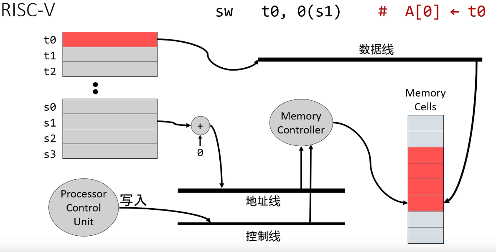

## 指令

由二进制机器语言表达

RISC-V指令：Encoded as 32-bit instruction words,Small number of formats encoding operation code(opcode),register number,...

### R-Type指令

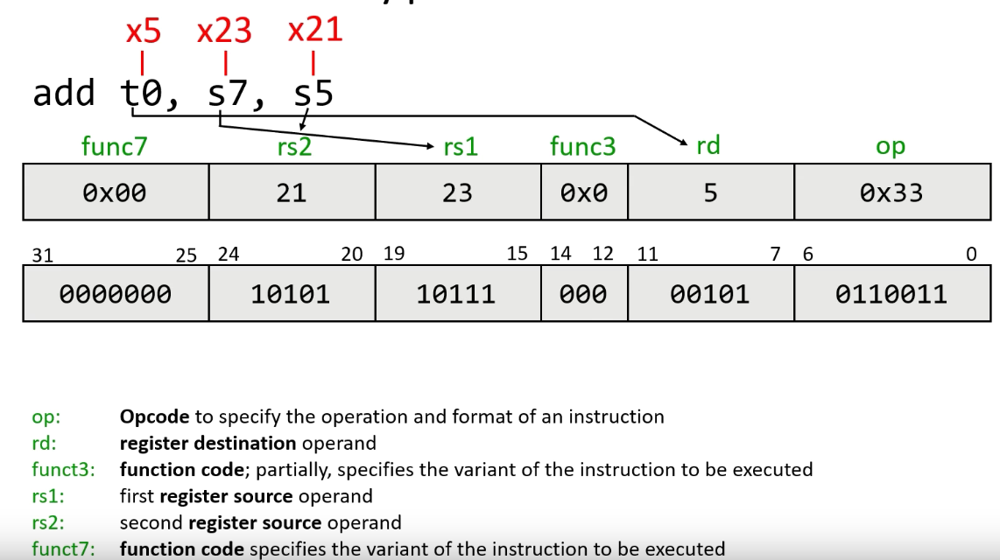

### I-Type指令

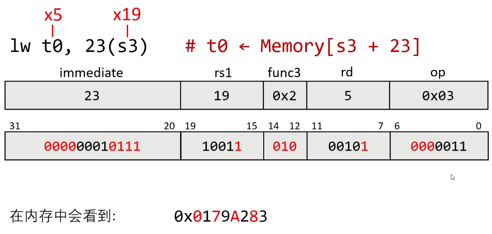

### S-Type指令

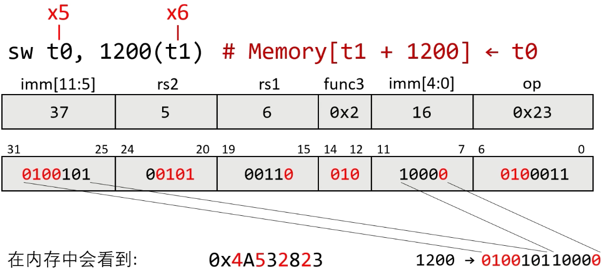

将imm拆分成两份

### 区分地址和值

PC是程序计数器（是一个地址），通过该地址得到指令的值

### SB-Type（分支指令）

beq：分支相同则跳转

bne：分支不同则跳转

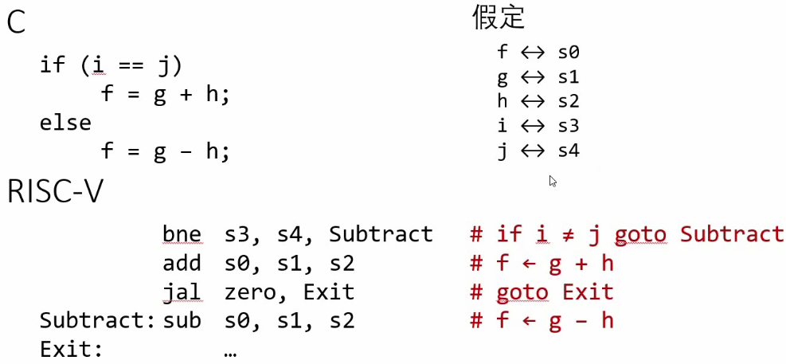

bne(branch not equal)

s3、s4不相等跳转到substract，否则执行加法，然后通过jal跳转到Exit

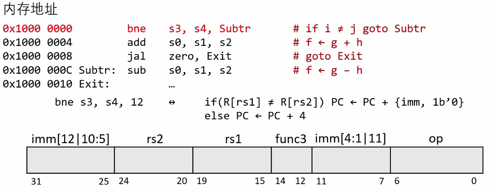

bne s3,s4,12(12是计算subtr指令到当前指令的距离)

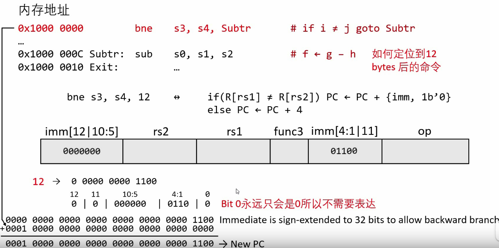

偏移量加原来的指令地址得到新PC地址

最后一位零永远会是0，变为默认

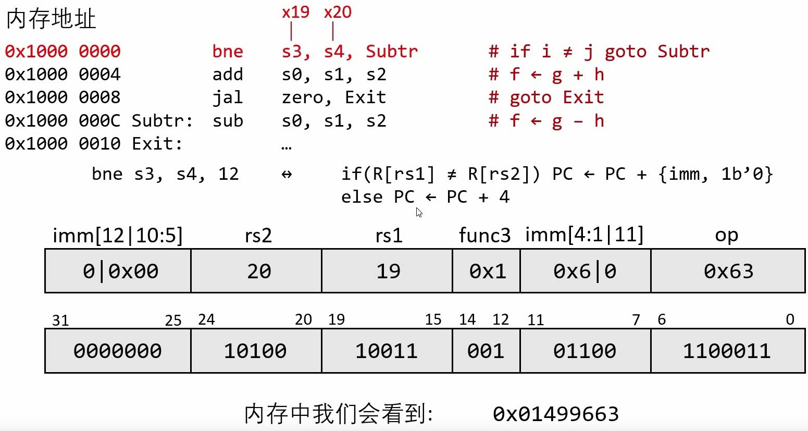

### 常数0-zero

RISC-V中zero寄存器(x0)存储的永远是常数0

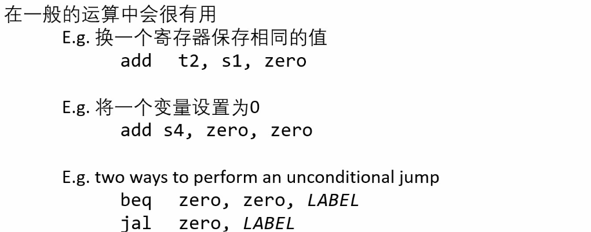

最后一行jal：如果返回值为0，则跳转到LABEL；否则应先设置返回值

### U-Type

lui：load upper immediate(前面二十位为立即数，后面12位补0)

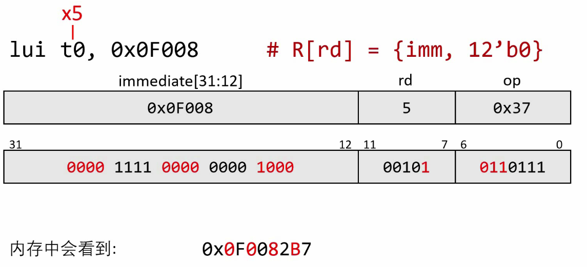

### UJ-Type

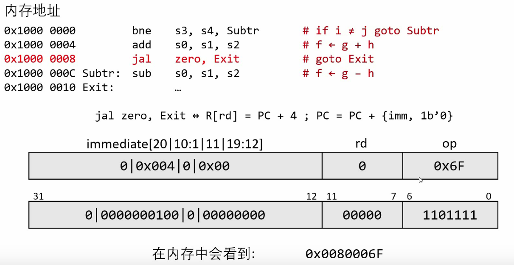

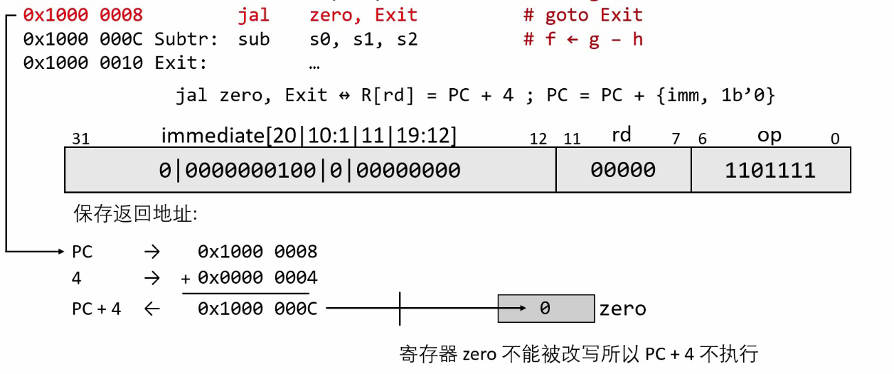

### 算术运算

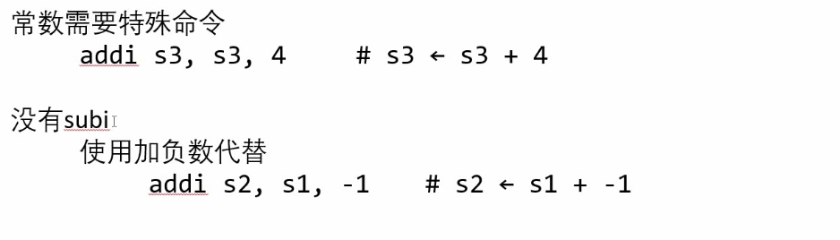

## 逻辑运算

slli：shift left logical immediate

新增加的位用0补齐

# 大端序&小端序

1、大端模式：高字节保存在内存的低地址

2、小端模式：高字节保存在内存的高地址

距离：var=0x11223344（高字节为0x11，低字节为0x44）

大端模式

|地址|数据|
|---|---|
|0x0004(高地址)|0x44|
|0x0003|0x33|
|0x0002|0x22|
|0x0001|0x11|

小端模式

|地址|数据|
|---|---|
|0x0004(高地址)|0x11|
|0x0003|0x22|
|0x0002|0x33|
|0x0001|0x44|

 

 

# 一、RISC-V架构处理器基础

## 1.1 计算机体系架构

计算机体系架构
1. CPU（ALU、寄存器）
2. 存储器（RAM）
3. 输入输出设备

处理器关键技术
1. 单指令周期（输入）取值、译码、执行、访存、写回（输出）
2. 流水线，提高性能
3. 分支预测，使流水线高效执行
4. 乱序执行，先执行不依赖前面数据的操作

存储器结构与内存访问
1. 性价比原理（金字塔）
    

2. 局部性原理（被引用的程序位置可能再次被引用）

## 1.2 指令集架构

ISA:Instruction Set Architecture

位于软件和硬件之间

不具备实体

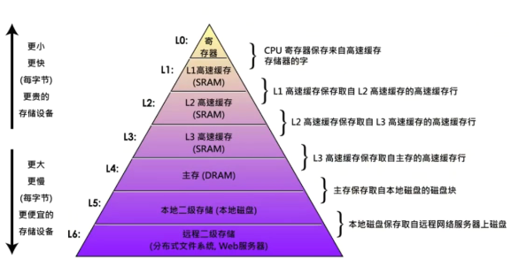

CISC与RISC
1. CISC: complex instruction set computer
   1. 指令系统庞大
   2. 寻址方式多
   3. 有专用寄存器
   4. 采用微程序设计
   5. 电路单元丰富，结构复杂，面积大

2. RISC: reduced instruction set computer
   1. 指令数目少
   2. 单纯的寻址方式
   3. 通用寄存器
   4. 适合流水线
   5. 电路布局紧凑，结构简单，面积小

## 1.3 RISC-V指令架构

RISC-V的发展历程

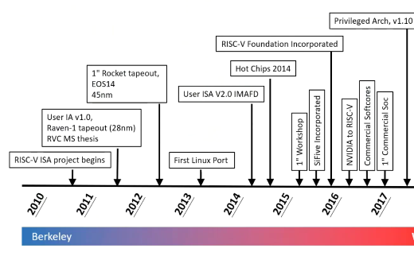

指令集完全开源

指令数码简洁

模块化指令集

可扩展定制指令

完整工具链

大量开源实现

## 1.4 RISC-V统一的指令编码

规整的指令编码：指令所需通用寄存器的索引在固定位置

简化指令译码器的设计

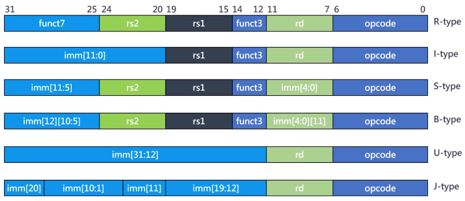

### R型指令（register）

funct7：功能码

rs1，rs2：原寄存器

rd：目的寄存器

funct3：功能码

opcode：操作码 7bit 0110011（固定）

### I型指令（immediate）立即数

imm:12bit立即数

rs1:

funct3:

rd:

opcode:不固定

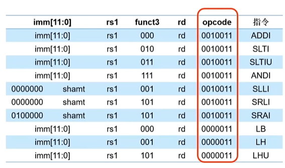

### S型指令（store）

imm

rs2

rs1

funct3

imm

opcode

### B型指令（branch）

S型指令的变体

条件地址

imm

rs2

rs1

funct3

imm

opcode

### U型指令（upper immediate）

imm

rd

opcode

### J型指令（jump）

无条件直接跳转

U型指令的变体

imm

rd

opcode

## 通用寄存器

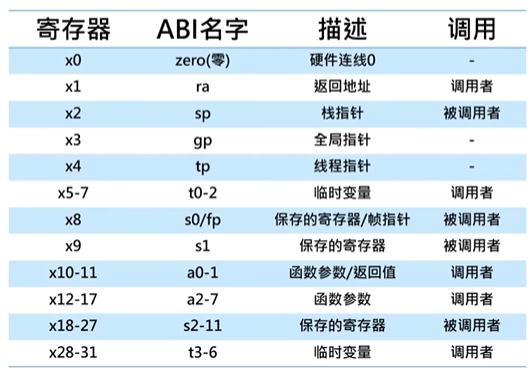

32个整数寄存器

## CSR寄存器组

独立的12位地址编码空间

## RISC-V的存储访问

1. Load&Store（数据从存储器装载到寄存器或从寄存器到存储器）
2. 不支持地址自增自减（降低处理器设计难度）
3. 采用松散的存储器模型（可结合存储器屏障指令）
4. 支持小端格式

## RISC-V寻址方式

1. 立即数寻址
2. 寄存器寻址
3. 基址寻址
4. 程序计数器相对寻址

## RISC-V的中断

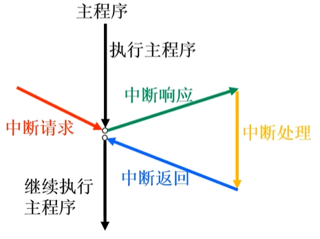

1. 外部中断
2. 计时器中断
3. 软件中断
4. 调试中断

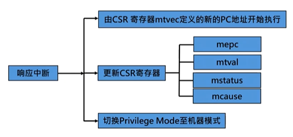

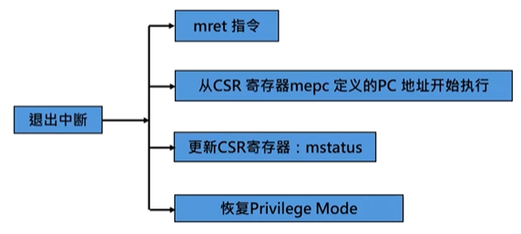

# 二、RISC-V处理器ALU设计与实现

## 2.1 ALU概述

ALU是实现数据通路的核心

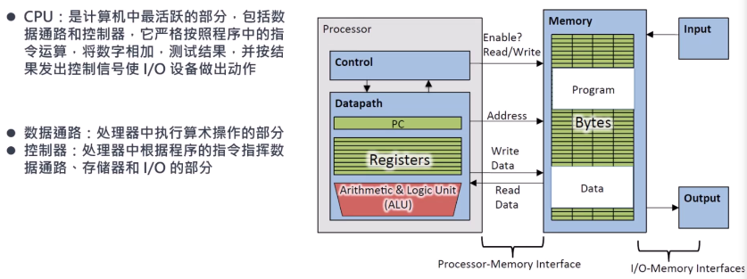

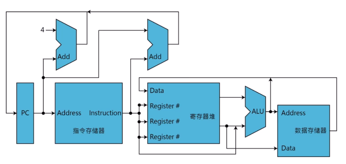

## 2.2 RISC-V指令集与ALU

六种指令集类型

R、I不涉及存储器操作

这里考虑32位

1. R

   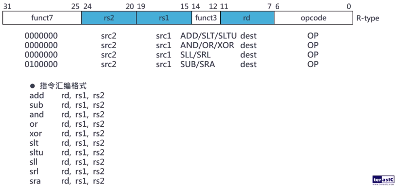

   

2. I

   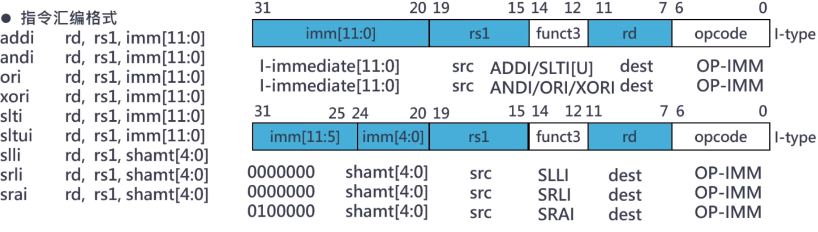

   

3. L&S
   
   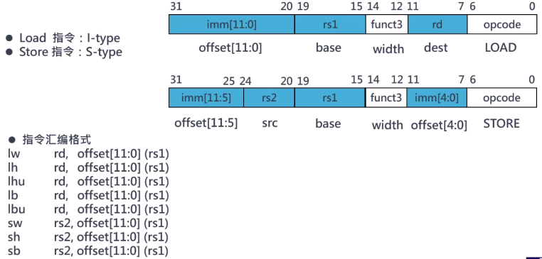

   

4. B
5. 

## 2.3 RISC-V ALU的设计与实现

## 4.3建立数据通路

数据通路（让指令和数据通过得到结果）

CPU中处理数据和地址的单元

组成：寄存器、ALU、多路选择器、存储器

### 取址

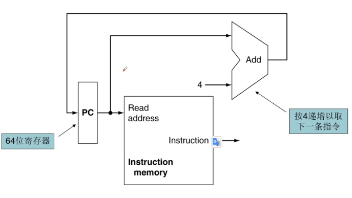

单独的指令存储器保存指令

程序保存在代码段（通常只读）

指令存储器只提供读操作端口

PC程序计数器，保存指令地址

32位，下一条加4（非压缩指令）

### R型指令

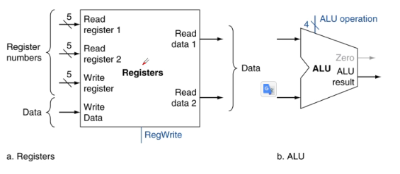

1. 读两个寄存器操作数
2. 执行算术、逻辑操作
3. 写寄存器结果

两个模块：寄存器堆，运算器（运算结果、zero标志位）

32个通用寄存器->5bit（寄存器地址）

### 取数/存数指令

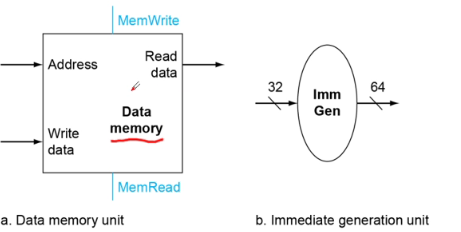

访问内存

CPU中使用了独立的数据存储器Data Memory（可读可写）

MemRead和MemWrite不能同时为1

立即数（12位偏移量计算地址，一个寄存器存首地址）

ImmGen将32位指令中的12位立即数提取出来，符号扩展为64位

使用ALU（64位），首地址+偏移量

取数：读存储器并更新寄存器

存数：将寄存器值写入存储器

### 分支指令

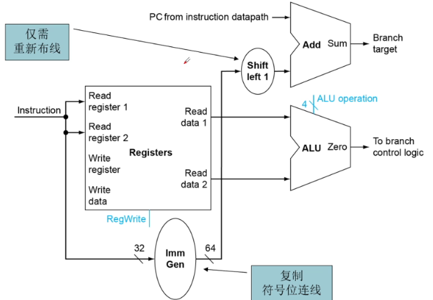

beq：相等则分支

x1==x2？PC<-target

读寄存器操作数

比较操作数（ALU做减法并检测零标志位输出）

计算目标地址
1. 符号扩展位移量（指令中提供位移量）
2. 左移一位
3. 与PC值相加

# 传送门

[遇庶邻疯UP主页（汇编语言入门）](https://space.bilibili.com/22230617)

