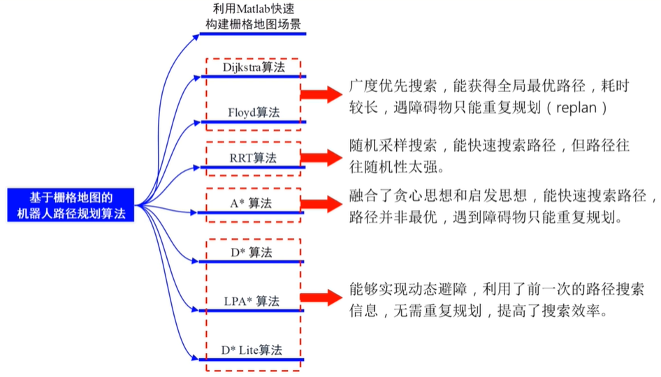
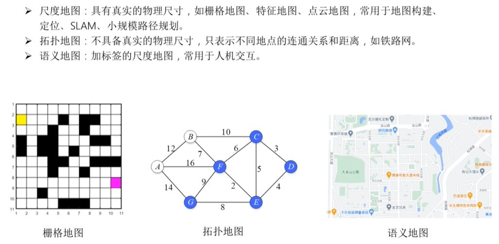
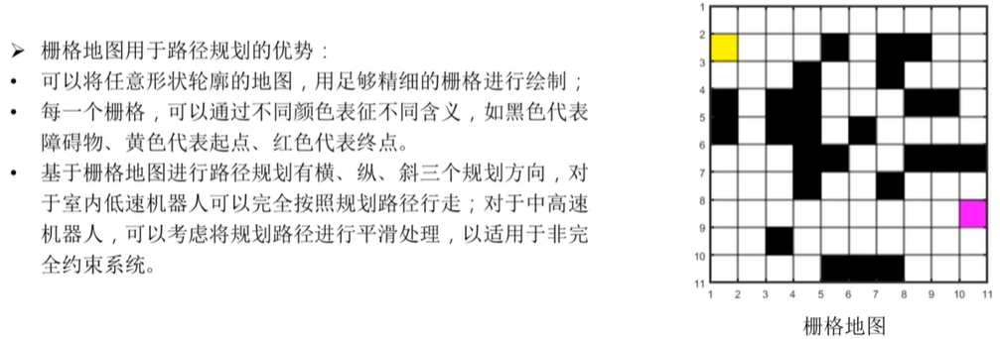
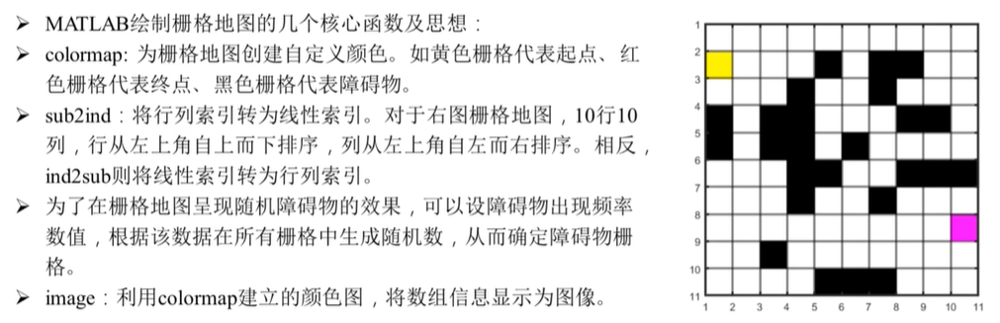
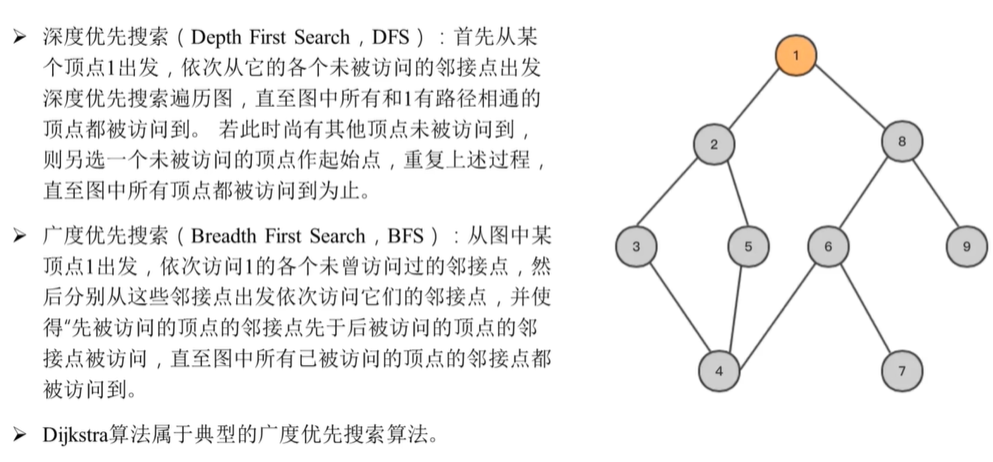
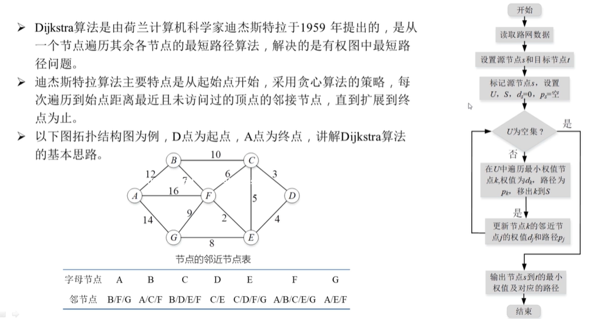
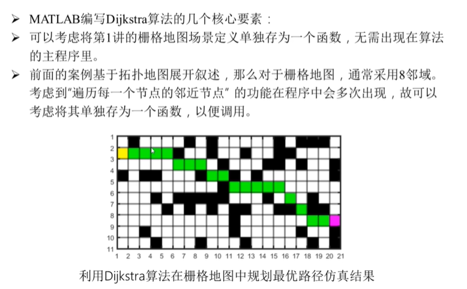

# 路径规划

[toc]

## Portals

[古月居-黎万洪-基于栅格地图的机器人路径规划算法指南](https://class.guyuehome.com/detail/v_6099f8b4e4b0adb2d8630857/3)

[github 课程源码](https://github.com/guyuehome/guyueclass/tree/main/robotics/path_planning)

# 基于栅格地图的机器人路径规划算法指南

## 01 利用Matlab快速绘制栅格地图

## 02 Dijkstra算法

[最短路径查找—Dijkstra算法](https://www.bilibili.com/video/BV1zz4y1m7Nq)

## 03 Floyd算法

所有顶点对

## 04 RRT算法

## 05 A*算法

## 06 D*算法

## 07 LPA*算法

## 08 D* Lite算法

