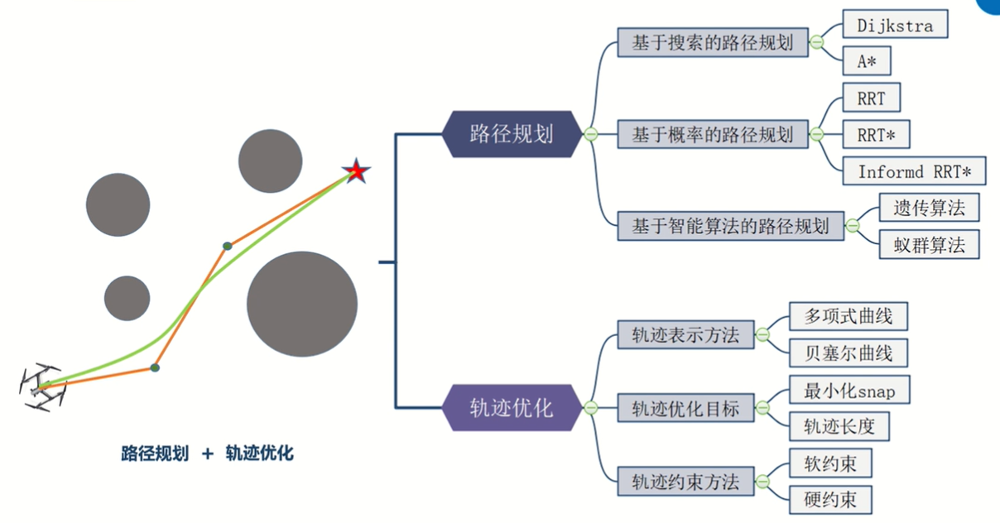
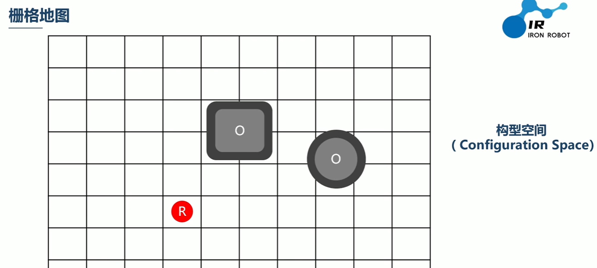
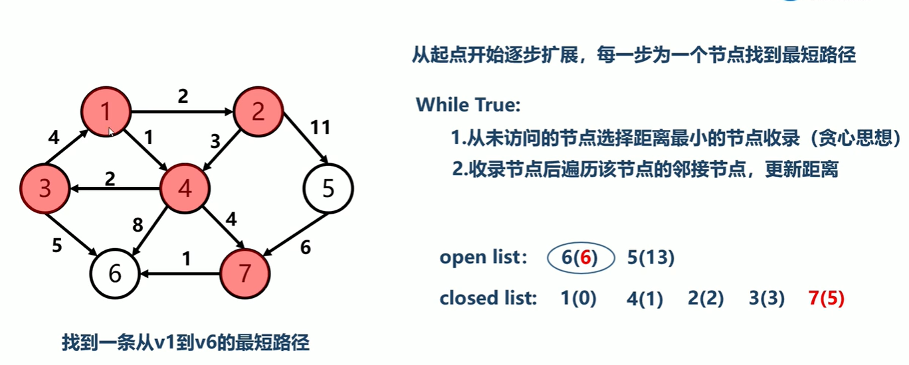
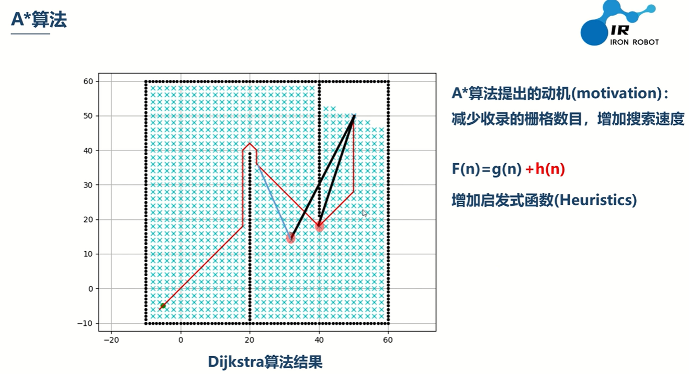
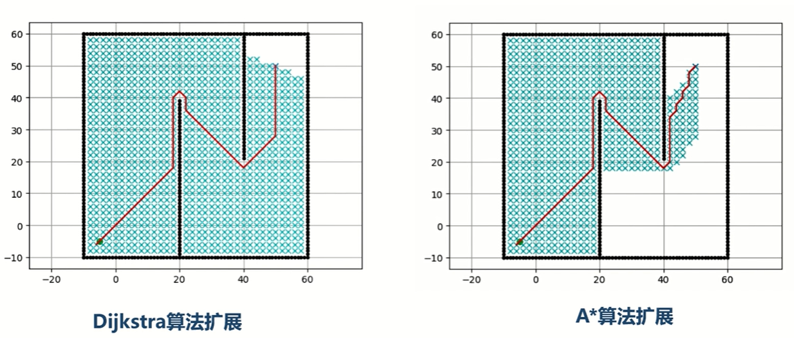
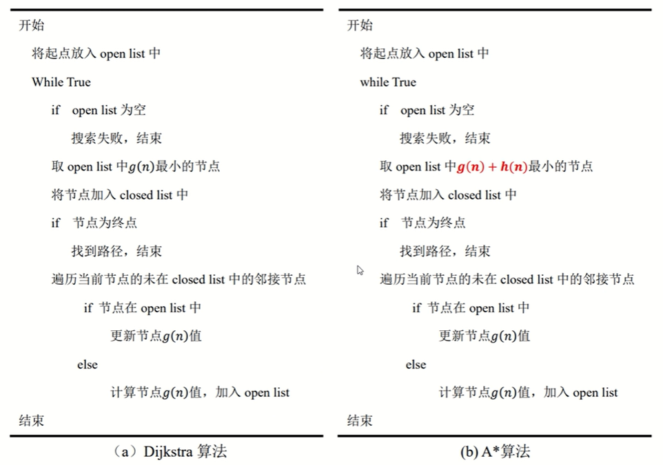

# 机器人轨迹规划

## Portals

[艾若机器人 轨迹规划](https://www.bilibili.com/video/BV1yT4y1T7Eb)

# 艾若机器人 轨迹规划

## 01 轨迹规划导论

轨迹规划：路径规划+轨迹优化(直线转为平滑曲线)

**构型空间 Configuration Space**
1. 膨胀障碍物（使得机器人无法通行）
2. 将机器人视为质点

## 02 Dijkstra

可以这样去想，每次收录距离初始点s的最近的节点p，因为通过其他open list节点q再到p的路径长度显然会更大（初始点到q的距离已经大于到p）。

## 03 A*

Dijkstra收录的冗余节点过多，所有比最终路径短的节点都进行了遍历。

使用A*，添加启发式函数，减少冗余部分

代码框架类似

加入启发式函数后，需要添加条件才能保证最优路径。

## 04 RRT

## 05 RRT*

## 06 Informed RRT*

## 07 遗传算法

## 08 蚁群算法

## 09 路径规划算法总结

## 10 多项式曲线

## 11 贝塞尔曲线

## 12 最小化snap

## 13 轨迹长度

## 14 软约束

## 15 硬约束

