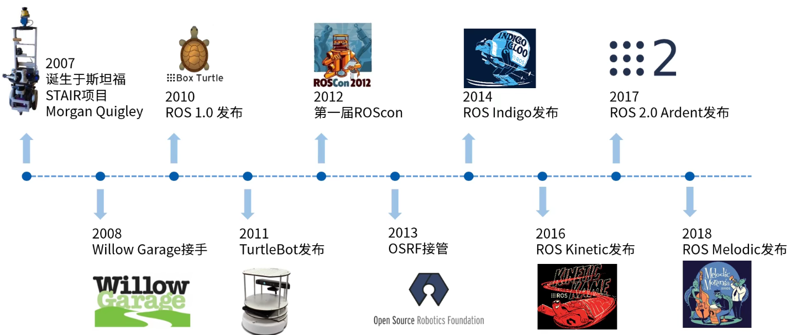
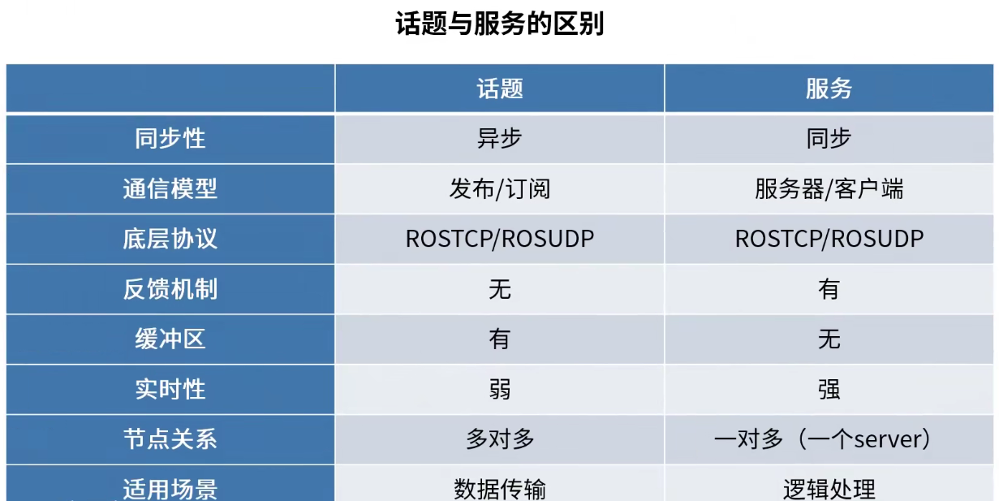
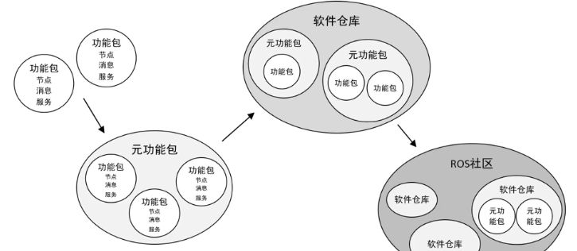

# ROS

## 古月居ROS入门21讲

### 1.课程介绍

ROS:robot operating system

通信机制、开发工具、应用功能、生态系统

### 2.Linux系统介绍及安装

### 3.Linux系统基础操作

### 4.C++/Python极简基础

### 5.安装ROS系统

### 6.ROS是什么

**目的：提高机器人研发中的软件复用率**

1. 通信机制
   1. 松耦合分布式通信
2. 开发工具
   1. Gazebo
   2. TF坐标变换
   3. Rviz
   4. QT工具箱
   5. 命令行&编译器
3. 应用功能
   1. Navigation
   2. SLAM
   3. MoveIt
4. 生态系统
   1. 发行版（Distribution）
   2. 软件源（Repository）
   3. ROS Wiki

### 7.ROS中的核心概念

①节点与节点管理器

节点（Node）——执行单元

1. 执行具体任务的进程、独立运行的可执行文件
2. 不同节点可使用不同编程语言，可分布式运行在不同的主机
3. 节点在系统中的名称必须统一

节点管理器（ROS Master）——控制中心

1. 为节点提供命名和注册服务
2. 跟踪和记录话题、服务信息，辅助节点相互查找、建立连接
3. 提供参数服务器（全局对象字典），节点使用此服务存储和检索运行时的参数

    

②话题通信

话题（Topic）——异步通信机制

1. 节点间用来传输数据的重要总线
2. 使用**发布/订阅**模型，数据由发布者传输到订阅者，**同一个话题的订阅者或发布者可不唯一**

消息（Message）——话题数据

1. 具有一定的类型和数据结构，包括**ROS提供的标准类型和用户自定义类型**
2. 使用**编程语言无关的\.msg文件定义**，编译过程中生成对应的文件代码

**不保证时效性，单向的，可能有阻塞**

③服务（Service）——同步通信机制

1. 使用客户端/服务器（Client/Server）模型，客户端发送请求数据，服务器完成处理后，返回应答数据
2. 使用**编程语言误差的.srv文件定义**请求和应答数据结构，编译过程中生成对应代码文件

**双向的，可以得到回复，带有反馈机制，只有一个server**

④话题与服务的区别

⑤参数（Parameter）——全局共享字典

1. 可通过网络访问的共享、多变量字典
2. 节点使用此服务来存储和检索运行时参数
3. 适合存储静态、非二进制的配置参数，不适合存储动态配置的参数（若listener没有重新获取值，则不知道发生改变）

⑥文件系统

1. 功能包（Package）
   1. ROS软件中的基本单元，包括节点源码、配置文件、数据定义etc
2. 功能包清单（Package Manifest）
   1. 记录功能包的基本信息（作者信息、许可信息、依赖选项、编译标志etc）
3. 元功能包（Meta Package）
   1. 组织多个用于同一目的的功能包

### 8.ROS命令行工具的使用

 
 
 

# TIPS

## Linus

--help

## 查看ROS的版本
启动ROS核心：roscore（其实已经可以看到参数了）
获取ROS参数：rosparam get /rosdistro（查看rosdistro）

NanoRobot参数

    rosdistro：kinetic
    rosversion：1.12.14

# SLAM

simultaneous localization and mapping

定位&地图构建

深度信息（激光雷达、相机）

回环检测（Loop Detection）

认出曾今经过的地方->环，减少误差、矫正轨迹形状

# Gazebo

[gazebo官网教程](http://gazebosim.org/tutorials)

[ROS官网urdf相关](http://wiki.ros.org/urdf/Tutorials)

