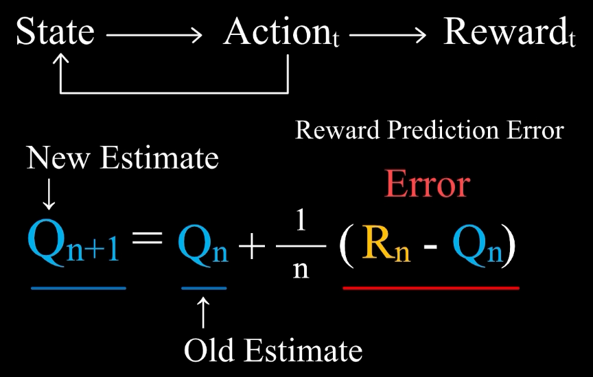

# 强化学习 基础

---

基本元素
1. **Agent**
2. **Environment**
3. **Goal**

主要元素
1. **State**
2. **Action**
3. **Reward**奖励 - 即时的反馈，需要最大化总奖励

核心函数
1. **Policy Function** - 输入状态，输出行动
2. **Value Function** - 价值是预期将来会得到的所有奖励之和
   1. **Action-Value** Function(动作价值函数)
      1. 状态 s 下，采取动作 a 后，按照当前策略 π 行动，未来能获得的期望累积奖励
      2. 与 动作 和 状态 要 配套
      3. 应该 选择 Action Value 最大的 行动
   2. **State-Value** Function(状态价值函数)
      1. 状态 s 下，按照当前策略 π 行动，期望获得的累积奖励
   3. **Advantage** Function(优势函数)
      1. 状态 s 下，选择动作 a，比起随机按照策略 π 选择所有动作的平均水平，能获得的额外优势
      2. 用于 Actor-Critic 结构(如 PPO, A2C)，让策略优化更稳定

---

强化学习 特点
1. Trial and Error - 试错
2. Delay Reward - 延迟奖励 (eg : 围棋最终获胜才有奖励)，**可以没有 即时奖励，但是可以有 价值**
3. Credit Assignment & BackPropagation - 学习过去行动的价值 (复盘)

问题 : **Exploration**(尝试不同的行动) & **Exploitation**(利用现有价值函数，类似 greedy)

----

**K-Armed Bandit 多臂老虎机**
1. 多臂老虎机 可以等价于 多个 相同 单臂老虎机(概率分布不同，但是固定)
2. Agent : 玩家
3. Environment : 老虎机
4. 状态单一，无 延迟奖励，即时 reward
5. ，只需要学习不同行动具有的价值 Action Value (输入 行动，输出 价值)

价值函数 初始值设定，可以设置比较大，进行探索后，进行替换，等价于 鼓励每种情况 都探索一遍

初始值 可以 参与/不参与 价值函数 的 平均，参与 相当于 鼓励 跟多次的 exploration

$\epsilon$-Greedy，在大多数情况做出贪婪选择，以 $\epsilon$ 的概率随机

---

多臂老虎机，情况较为简单

完整的 强化学习 需要考虑
1. 多个状态
2. 每次行动都会对将来的 状态 和 奖励 产生影响

Finite Markov Decision Process

Dynamic Programming

Monte Carlo Methods

Temporal-Difference Learning

---

**误差 Error**

使用 Sample-Average 估计价值
1. 考虑 **只有一个状态，没有延迟奖励**
2. 
3. 
4. $Q_1$ : 行动价值初始值
5. $Q_{n}$ : 采取行动 n-1次 后，对行动价值的估计值，**old estimate**，是对于 $R_n$(实际值) 的一个预测值
6. $Q_{n+1}$ : 采取行动 n次 后，对行动价值的估计值，**new estimate**
7. $R_n - Q_n$ : Reward Predication Error (实际值 - 估计值)

基于误差来学习

步长/学习率 = $1/n$，会逐渐变小，应该根据误差，随时调整对于价值的估计

采用 常数 $\alpha$ 作为步长，Weighed-Average
1. 
2. 对于价值的估计不再是实际奖励的均值，而是加权平均，时间越早，权重越小，更看重新得到的奖励
3. 初始估计 对后续 价值估计 有影响

---

Monte-Carlo Methods + Temporal-Difference Learning

动作价值 学习公式
1. 价值 是 全部 奖励的期望
2. 
3. 
4. ≈ 是因为，用 估计值 $Q(S_{t+1}, A_{t+1})$ 代替 实际值

状态价值 学习公式
1. 

Tic-Tac-Toe 井字棋
1. 对于状态价值函数，玩家进入的状态，不仅仅由自己的行动决定，还取决于对手的行动，需要对于对手的行动有预测
2. 因此学习，动作价值，state-action pair 的数量很多，一个状态下可以有多种行动

后果 Outcome (AfterState)
1. 玩家 根据 状态，做出 行动，得到 后果
2. 玩家 Action 后的 Outcome 对于 对手 是 State，对于 玩家 本身，不是 State。反之亦然
3. 
4. 不同的 状态行动对，导致的后果 可能是一样的，状态行动对的价值也就可能一样
   1. 
5. 后果在特定的状态下，和特定的行动是对应的
6. 有时，状态行动对会有冗余，使用 后果进行代替

