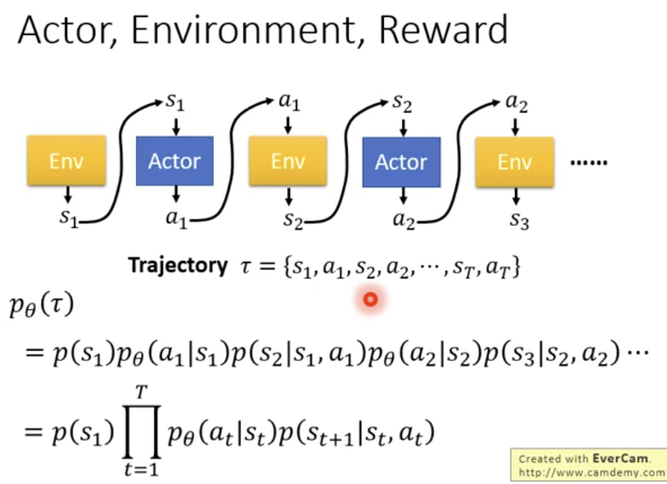
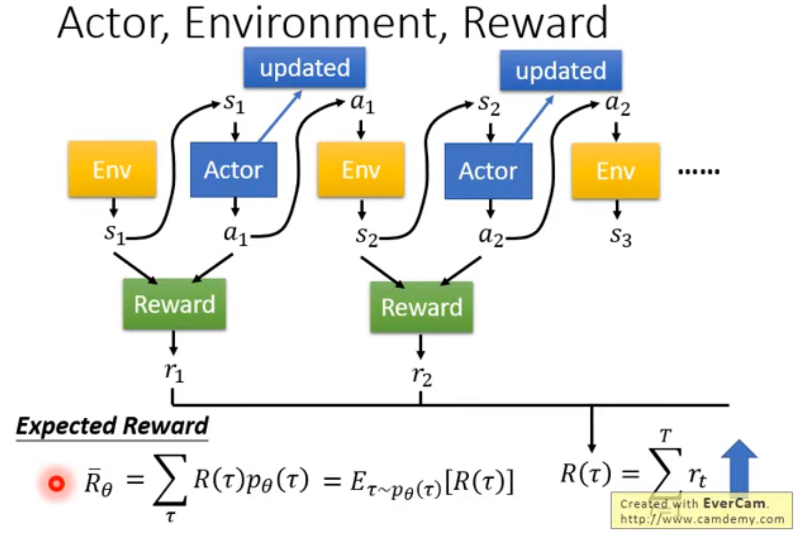
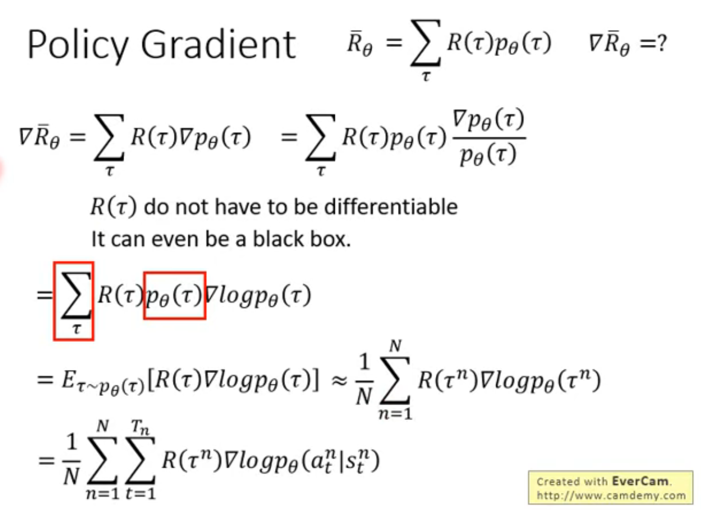

# 李宏毅 - Deep Reinforcement Learning - 2018

[李宏毅 - Deep Reinforcement Learning - 2018](https://www.youtube.com/playlist?list=PLJV_el3uVTsODxQFgzMzPLa16h6B8kWM_)

`Policy Gradient` -> `On-Policy/Off-Policy` -> `Add Constraint`

On-Policy : 只能用当前策略收集的数据
1. PPO(Proximal Policy Optimization)
2. A2C(Advantage Actor-Critic)

Off-Policy : 允许使用旧数据，数据效率更高
1. DQN(Deep Q-Network)
2. DDPG(Deep Deterministic Policy Gradient)
3. SAC(Soft Actor-Critic)

Add Constraint : 约束优化

---

## Table of Contents

- [李宏毅 - Deep Reinforcement Learning - 2018](#李宏毅---deep-reinforcement-learning---2018)
  - [Table of Contents](#table-of-contents)

---

# DRL Lecture 1: Policy Gradient

Basic Components
1. Actor/Agent (只能调整 Actor Policy，无法改变 Env 和 Reward)
2. Environment (Pre-Defined, Cannot Control)
3. Reward Function (Pre-Defined, Cannot Control)

Policy **$\pi$**
1. is a network with parameter $\theta$
2. **input**  : observation
3. **output** : action (network 给每个 action 分数，将分数作为 probability)

actor 看到 游戏画面，根据 policy 决定 action(a1)，执行完 action 会得到 reward(r1)，不断循环，直到 environment 决定 结束

对于 episode(一整场 游戏) : 需要 maximize total reward ($R = \sum_{t=1}^{T} r_t$)

整体过程
1. 
2. Trajectory : state & action
3. 带下标 $\theta$ 的 是 actor 的 概率
4. 不带下标 的 是 environment 的 概率
5. 应该用到了 Markov 假设
6. Expected Reward 只能是一个期望值，根据给定的 $\theta$，通过穷举所有 trajectory 来求期望，需要 maximize
7. 

Policy Gradient
1. 使用 Policy Gradient 来 maximize reward
2. 对 $\theta$ 求导，因此 $R(\tau)$ 可以不可微
3. 
4. 其中 $p_{\theta}(\tau)$ 中 包含 agent部分(需要求导) 以及 environment部分(无需求导)
5. 由于使用了 对数log，相乘变相加，environment部分 求导变成0，相加无影响，直接忽略，因此只考虑 agent 部分
6.

从 On-Policy 到 Off-Policy

# DRL Lecture 2: Proximal Policy Optimization (PPO)

default RL algorithm at OpenAI

PPO 是 Policy Gradient 的变形

# DRL Lecture 3: Q-learning (Basic Idea)

# DRL Lecture 4: Q-learning (Advanced Tips)

# DRL Lecture 5: Q-learning (Continuous Action)

# DRL Lecture 6: Actor-Critic

# DRL Lecture 7: Sparse Reward

# DRL Lecture 8: Imitation Learning

