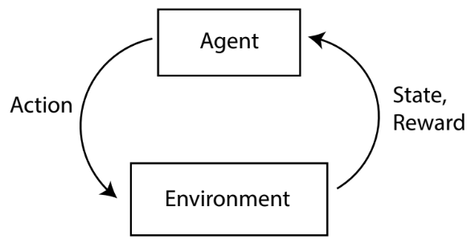
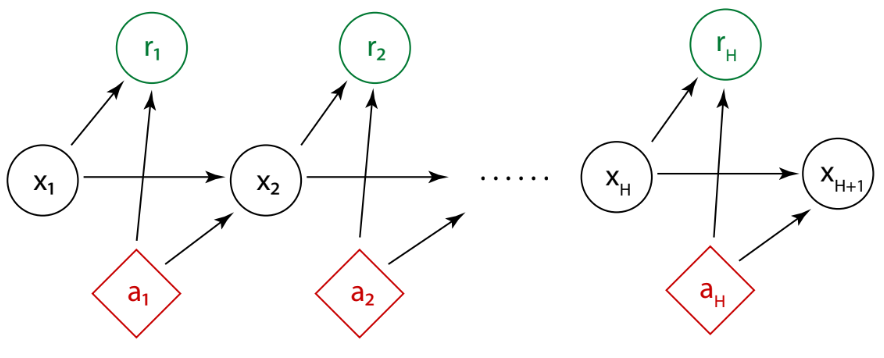

# Princeton - ECE524 - Foundations of Reinforcement Learning

[Princeton(Chi Jin 金驰) - ECE524 Foundations of Reinforcement Learning Spring 2024 - YouTube](https://www.youtube.com/playlist?list=PLYXvCE1En13epbogBmgafC_Yyyk9oQogl)

[Princeton(Chi Jin 金驰) - ECE524: Foundations of Reinforcement Learning - Slides & Notes](https://sites.google.com/view/cjin/teaching/ece524)

# Lec01 : Introduction and MDP Basics

Application
1. Robotics
2. Gaming
3. Autonomous Driving
4. GPT

共性 : Sequential Decision Making

Reward Find a good policy to maximize the cumulative rewards.

**Markov Decision Process**
1. 
2. Settings: simulator, exploration, function approximation ...
3. state 状态 $\mathcal{S}$
4. action 动作 $\mathcal{A}$
5. reward 奖励 $\mathcal{r}$
6. 状态转移 $\mathbb{P}$
7. 时间步 $\mathcal{H}$

Algorithms : Value Iteration, Q-learning, Fitted Q-Iteration...

Upper Confidence Bound, UCB

Strategic exploration: optimism

Leverage offline data: pessimism

Exploitation & Exploration

Sample Efficiency

