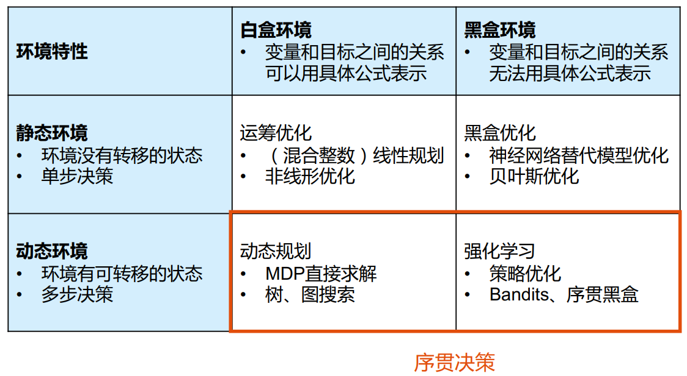
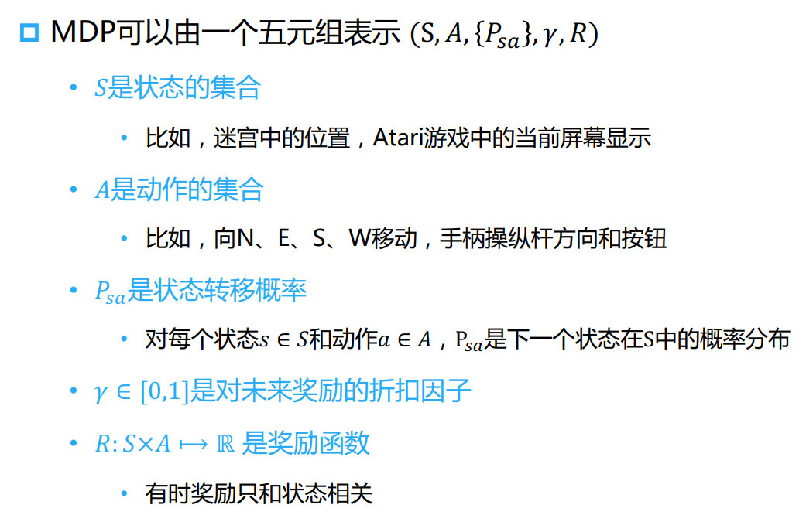
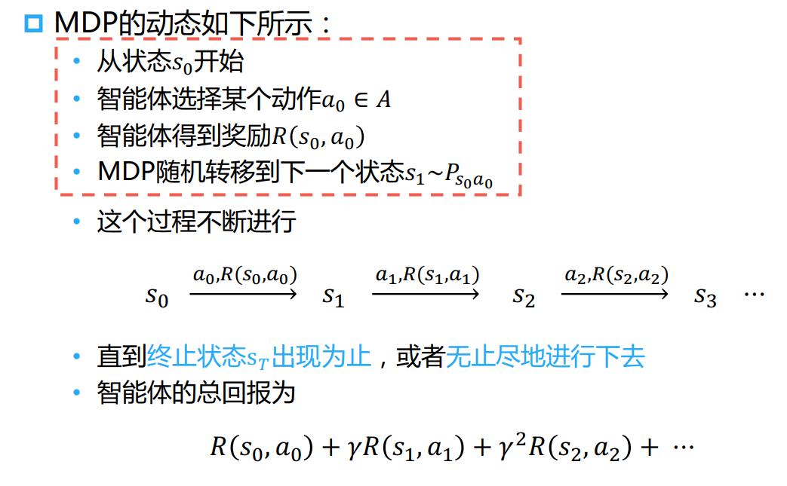
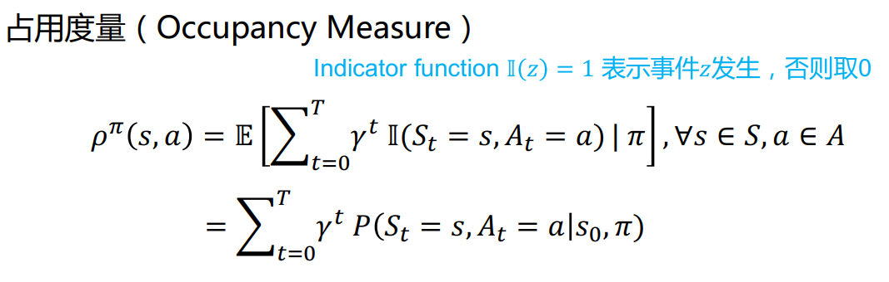
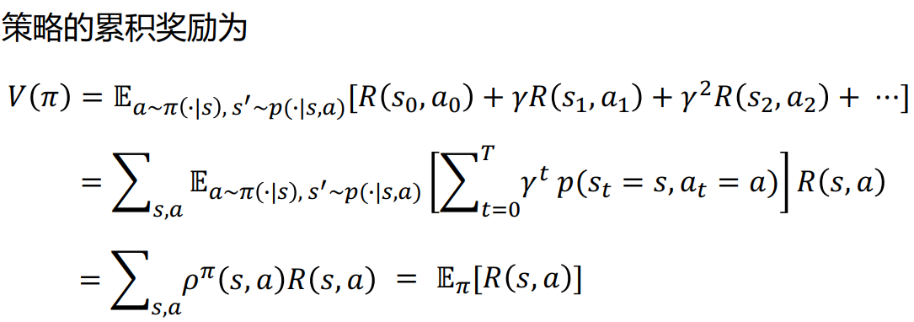
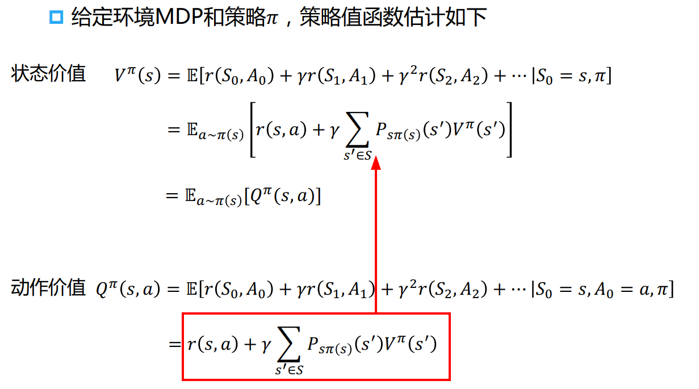

# 张伟楠

[张伟楠 - B站](https://space.bilibili.com/3546754433681656)

[RLChina 2024 | 3小时强化学习入门课程](https://www.bilibili.com/video/BV1yFm1Y4Evf)

## 强化学习技术概览

预测型任务(包含 生成式)
1. 不改变环境
2. 数据静态，可以提前收集

决策型任务
1. 需要与环境交互
2. 交互时收集

分类
1. 
2. 黑盒/白盒
3. 静态/动态

Sequential Decision Making(序贯决策) - 序贯地做出一个个决策，并接续看到新的观测，直到最终任务结束

agent 的输出 给到环境，给出新一轮观测，计算奖励

## 马尔科夫决策过程

概率 : 静态

随机过程 : 动态，一个或多个事件、随机系统或者随机现象 **随时间发生演变**的过程

**马尔科夫 过程** $\mathbb{P}[S_{t+1} | S_t] = \mathbb{P}[S_{t+1} | S_1, \cdots, S_{t}]$ : 当前状态是未来的充分统计量，与当前状态之前的状态独立

**马尔科夫 决策过程** $\mathbb{P}[S_{t+1} | S_t, A_t]$ : 状态转换时，除了根据环境本身的状态，还有 智能体 Agent
1. **MDP五元组**
   1. 状态集合
   2. 动作集合
   3. 状态转移概率
   4. 折扣因子(未来奖励的重要性)
   5. 奖励函数(当前)
2. 
3. 

Occupancy Measure 占用度量 $\rho ^{\pi}$
1. 衡量在一个策略下访问到的状态动作对的概率
2. 
3. 给定同一个动态环境(即MDP)，不同的策略采样出来的(状态-行动)pair 的分布是不同的
4. 给定两个策略及其与一个动态环境交互得到的两个占用度量，**当且仅当** 这两个占用度量相同时，这两个策略相同
5. 强化学习的策略在训练中会不断更新，其对应的数据分布(即占用度量)也会相应地改变
6. 策略的价值可以等价转换成奖励函数在策略的占用度量上的期望
7. 状态占用度量，对 $\rho^{\pi}(s, a)$ 对 $s$ 进行 summation 得到 $\rho^{\pi}(s)$

策略的累计奖励
1. 
2. 对 全部 s-a pair 进行 summation
3. 此处的期望不是概率分布，和 不等于 1，等于 $\frac{1}{1-\gamma}$

## 策略提升 & 动态规划

不是拟合数据，而是要最大化累计奖励期望

Policy Evaluation'
1. 
2. 状态价值 $V^{\pi}(s)$
3. 动作价值 $Q^{\pi}(s, a)$ (动作建立在状态上)

