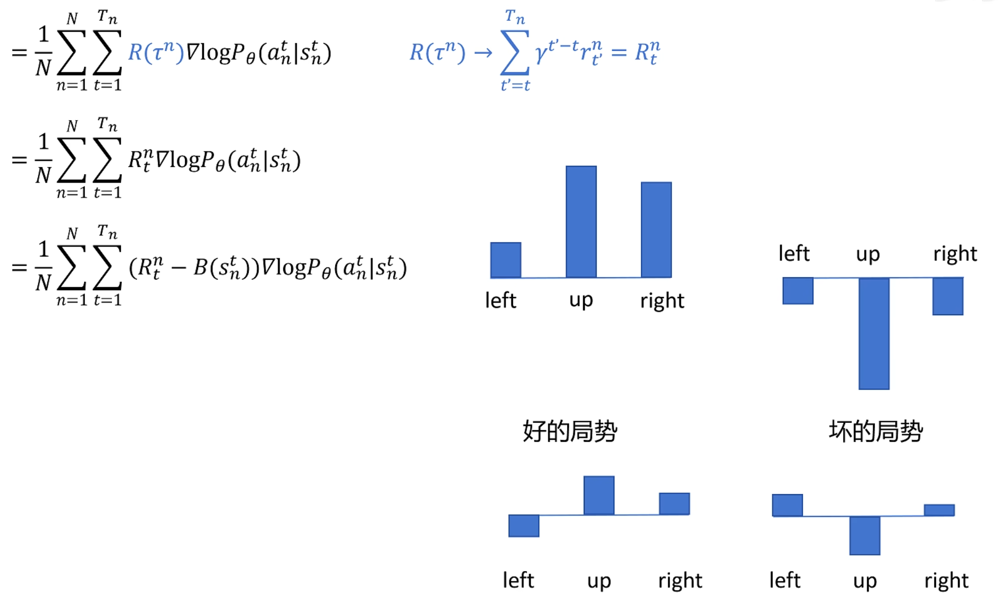
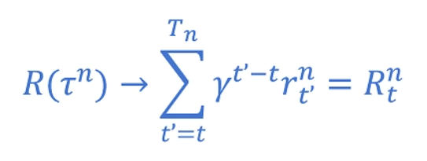

# 莫烦Python - 强化学习

[莫烦Python - 强化学习](https://www.bilibili.com/video/BV13W411Y75P)

[强化学习科普 - 莫烦Python](https://space.bilibili.com/243821484/lists/1607999?type=series)

## Table of Contents

- [莫烦Python - 强化学习](#莫烦python---强化学习)
  - [Table of Contents](#table-of-contents)
- [简介 \& 概念](#简介--概念)
  - [Monte-Carlo Tree Search (MCTS)](#monte-carlo-tree-search-mcts)
  - [Overfitting](#overfitting)
  - [Functions](#functions)
- [分类](#分类)
  - [是否是 Model-Based](#是否是-model-based)
  - [概率/价值](#概率价值)
  - [更新方式](#更新方式)
  - [在线/离线](#在线离线)
- [Q-Learning](#q-learning)
- [DQN (Deep Q-Network)](#dqn-deep-q-network)
- [Policy Gradient](#policy-gradient)
- [DDPG (Deep Deterministic Policy Gradient)](#ddpg-deep-deterministic-policy-gradient)
- [A3C (Asynchronous Advantage Actor-Critic)](#a3c-asynchronous-advantage-actor-critic)
- [PPO (Proximal Policy Optimization)](#ppo-proximal-policy-optimization)
- [经验回访](#经验回访)

---

# 简介 & 概念

分类
1. 

分数导向性

Action Space : 可选择的动作

Policy $\pi$
1. 是 Agent 在给定状态下选择动作的规则
2. 分类
   1. 确定性策略(Deterministic Policy) : AlphaGo 里，AI 在同一个棋局里每次都会走相同的最佳棋步
   2. 随机策略(Stochastic Policy) : 在 PPO / SAC 里，策略不是固定的，而是一个概率分布，智能体会以一定概率选择不同的动作

Trajectory $\tau$ (Episode/Rollout)
1. 一连串的状态 & 动作序列

Return : 回报，从当前时间点，到游戏结束的 Reward 累积和
1. 强化学习 目标，训练一个 Policy $\pi$ 在所有状态 S 下，给出相应 Action，(在所有的 Trajectory 中)，得到 Return 的期望最大

通过价值选择行为
1. Q-Learning(表格)
2. Sarsa(表格)
3. Deep Q Network(网络)

直接选择行为
1. Policy Gradient

想象环境并从中学习
1. Model-Based RL

rollout(展开/模拟)
1. 指 从当前状态开始，按照策略(policy)执行动作，并观察环境反馈(reward)，直到达到终止条件
2. 收集数据、评估策略、估算未来回报

## Monte-Carlo Tree Search (MCTS)

Monte-Carlo Tree Search (MCTS)
1. 用于决策过程的搜索算法，能够在有限计算资源下高效搜索最优决策
2. 基本目标是构建一个**搜索树**，并通过 模拟(rollout) 来评估不同决策的质量，从而选择最优动作
3. **四个步骤**
   1. 选择 (Expansion/Tree Traversal)
      1. 从根节点 Root 开始，连续向下选择子节点至叶子节点 L，使用一种选择子节点的方法，让游戏树向最优的方向扩展
   2. 扩展 (Node Expansion)
      1. 除非任意一方的输赢使得游戏在 L 结束，否则创建一个或多个子节点并选取其中一个节点 C
   3. 模拟 (Rollout/Random Simulation)
      1. 如果 该节点没有被 访问过，则 rollout，否则 创建一个新 节点，并 rollout
      2. 再从节点C开始，用随机策略进行游戏
      3. 除非 到了 terminal state，否则 选择 random available actions，并 simulate
   4. 反向传播 (BackPropagation)
      1. 使用随机游戏的结果，更新从 C 到 Root 的路径上的节点信息
4. 根据 **大数定理**，当采样数量足够大，采样样本 可以无限近似表示 原分布
5. 随机采样作为近似估计，大量自博弈，寻找最有可能走的节点，记录自博弈结果，并更新相关数据
6. **UCB/UCT**(Upper Confidence Bound for Trees)
   1. UCT 是 MCTS 里应用 UCB 的方法，专门用于决策树搜索
   2. **$$UCB(s, a) = \frac{Q(s, a)}{N(s, a)} + c \sqrt{\frac{\ln N(s)}{N(s, a)}}$$**
   3. 其中
      1. **$Q(s, a)$**：动作 $a$ 在状态 $s$ 下的 **累积奖励总和**
      2. **$N(s, a)$**：动作 $a$ 在状态 $s$ 下的 **访问次数**
         1. 显然 对于 没有访问过的($N(s, a)$ = 0)，UCB score 是无穷大
      3. **$N(s)$**：状态 $s$ 的 **总访问次数** (所有子节点访问次数的总和 / 父节点的访问次数)
      4. **$c$**：探索因子(通常设为 **$\sqrt{2}$**)，用于控制 **探索(Exploration)** 的程度
   4. 第一项 : (偏向于选择当前表现最好的动作)，可以理解为胜率
   5. 第二项 : (偏向于选择访问次数较少的动作)，可以理解为一个随次数衰减的函数，因此更倾向于选择没怎么被统计过的节点，避免**胜率高&置信度低**的问题
7. 每次选择 UCT 值最高的节点进行 自博弈，访问次数最高的节点就是最佳节点
8. Reference
   1. [蒙特卡洛方法 - B站视频](https://www.bilibili.com/video/BV1hV4y1Q7TR)
   2. [Monte Carlo tree search - Wiki](https://en.wikipedia.org/wiki/Monte_Carlo_tree_search)
   3. [Monte Carlo Tree Search - YouTube](https://www.youtube.com/watch?v=UXW2yZndl7U) - Good
   4.  - TODO
9. Images
   1. 
   2. 判断是否为 leaf & 判断是否初次访问
   3. 
   4. ~~ 表示 rollout

## Overfitting

强化学习 同样会遇到 **过拟合 Overfitting** 问题
1. 训练过程中过度适应特定环境或特定任务，导致泛化能力下降
2. 过度拟合某些固定状态，而忽略更广泛的探索(过度依赖历史经验/依靠某些特定动作模式)
3. 解决方案
   1. Domain Randomization
      1. 随机改变地面摩擦力、坡度、障碍物
      2. 随机 push
   2. Data Augmentation
      1. 加入 噪声 & 观测误差
   3. Exploration
      1. 增加 Entropy Bonus
      2. 随机初始化
   4. 正则化 Regularization
      1. 权重衰减
      2. Dropout(RL 中较少使用)
      3. Batch Normalization/Layer Normalization
   5. Early Stop
   6. Transfer Learning

## Functions

Action-Value Function(动作价值函数)
1. 状态 s 下，采取动作 a 后，按照当前策略 π 行动，未来能获得的期望累积奖励

State-Value Function(状态价值函数)
1. 在状态 s 下，按照当前策略 π 行动，期望获得的累积奖励

Advantage Function(优势函数)
1. 在状态 s 选择动作 a，比起随机按照策略 π 选择所有动作的平均水平，能获得的额外优势
2. 用于 Actor-Critic 结构(如 PPO, A2C)，让策略优化更稳定

将 动作价值函数，用 状态价值函数 拟合 动作价值函数，现在只需要 训练 一个 状态价值网络

对于 状态价值函数，采样有不确定性，因此用 ≈

进行多步采样
1. 采样的步数越多，偏差越小(越能反映 return 的 期望)，方差越大

用 $\delta$ 表示 优势

GAE (Generalized Advantage Estimation) 优势函数
1. 给不同步数的采样分配不同的权重
2. 

状态价值函数，用神经网络拟合，一般可以和策略函数公用网络参数，最后一层不同，只需要输出单一的值，代表当前状态的价值

# 分类

## 是否是 Model-Based

用模型(Model)表示环境

不理解环境 (Model-Free RL)
1. 只能一步步等待真实世界的反馈
2. 不需要知道 环境的 状态转移概率
3. 算法
   1. Q-Learning
   2. Sarsa
   3. Policy Gradients

理解环境 (Model-Based RL)
1. 建立模型，模拟环境的反馈 (虚拟环境)
2. 可以预判环境的反馈，选择最好的

## 概率/价值

基于概率 (Policy-Based RL)
1. 最直接，通过分析环境，直接输出各个行动概率，根据概率采取行动，每种行动都有可能被选中
2. 对于连续的可以使用一个概率分布
3. 算法
   1. **Policy Gradient**
   2. PPO

基于价值 (Value-Based RL)
1. 输出所有动作的价值，选择最高价值的动作
2. 无法处理连续的动作
2. 算法
   1. Q-Learning
   2. Sarsa

结合两种优势，建立 Actor-Critic
1. Actor  : 基于概率做动作
2. Critic : 对于动作给出价值

## 更新方式

回合更新(Monte-Carlo Update)(Episodic Update)
1. 需要等待整体结束
2. 算法
   1. 基础版 Policy Gradient
   2. Monte-Carlo Learning

单步更新(Temporal-Difference Update)(Truncated Mini-Batch Updates)
1. 每一步都更新，更有效率
2. 算法
   1. Q-Learning
   2. Sarsa
   3. 升级版 Policy Gradient

## 在线/离线

在线学习(On-Policy)
1. 必须本人在场，学习
2. 算法
   1. Sarsa
   2. Sarsa(lambda)
   3. A2C
   4. PPO(Proximal Policy Optimization)

离线学习(Off-Policy)
1. 可以观察别人的经历，可以 experience replay
2. 算法
   1. Q-Learning
   2. Deep Q Network
   3. DDPG
   4. SAC

---

# Q-Learning

Value-based & Model-Free & Off-Policy

潜在奖励 使用 Q表 表示

**$$Q(s_t, a_t) \leftarrow Q(s_t, a_t) + \alpha \left[ r_t + \gamma \max_{a'} Q(s_{t+1}, a') - Q(s_t, a_t) \right]$$**
1. 当前 Q 值 = 旧的 Q 值 + 学习步长 × (实际奖励 + 未来最大 Q 值 - 旧的 Q 值)
2. $\alpha$ : learning rate

R 是 Immediate Reward

Q 是 在状态 s 选择动作 a 后，未来能获得的累积奖励的估计值，不仅仅考虑当前奖励，还考虑未来可能获得的奖励，类似于 **经验分数**

$\epsilon$-greedy : 百分数，表示按照Q表选择动作的概率，其他时候随机选择行为

不断扩展，可以看出不断衰减

---

# DQN (Deep Q-Network)

由 DeepMind 在 2015 年提出，用于在 Atari(雅达利) 游戏环境中训练 AI 代理

Value-Based

在 Q-Learning 上的改进
1. 神经网络 Q网络 代替 Q表
2. Experience Replay : Off-Policy，从经验库中学习
3. Fixed Q-Targets

Q-Learning 的问题
1. 状态空间过大，无法用 Q 表存储
2. Q 值更新不稳定

DQN 结构
1. 输入 : 状态 s
2. **输出 : 每个动作 a 的 Q 值**
3. 采用 CNN 处理图像输入（如 Atari 游戏）

DQN 的 更新 公式 和 Q-Learning 一致

DQN 采用 两套 Q网络，解决 训练不稳定
1. 主 Q网络(Online Q-Network) : 用于选择动作并学习 (Q估计)
   1. 主 Q网络 负责训练，每次更新时，它不会影响 目标 Q网络
2. 目标 Q网络(Target Q-Network) : 用于计算 固定 Q 目标 (Q显示)
   1. 它的参数 固定一段时间(隔一定步数同步 主Q网络) 再更新

---

# Policy Gradient

不通过分析奖励值，直接输出 行为，可以在 连续空间内 选择动作

通过 reward 让 好的行为 发生概率更大

**$$E(R(\tau))_{\tau \sim P_{\theta}(\tau)} = \sum_\tau R(\tau)P_{\theta}(\tau)$$**
1. $\theta$ 是需要训练的Policy网络参数
2. $P_{\theta}(\tau)$ 服从 参数为 $\theta$ 的 分布

**Policy Gradient**
1. 需要最大化期望，使用梯度上升的方法，**对 $\theta$(网络参数) 求导**，最终优化的是动作的概率分布
2. 
3. 使用 梯度对数技巧
4. Monte-Carlo 近似
5. 从对于所有 Trajectory($\tau$) 求和，到 对所有 采样的 Trajectory 求和
6. 认为 下一个状态 完全由 当前状态&当前动作 决定，因此 Trajectory 的 概率分布可以由 state & action 表示
7. 
8. 将 Trajectory 拆分为 单步概率
9. $\theta \rightarrow \theta + \alpha R(\tau) \nabla \log P_\theta(a_t | s_t)$
   1. trajectory 得到的 return 大于0，那么这个轨迹的 所有状态下 对应动作的选择概率都会增加，智能体更倾向于复现这个轨迹

要最大化期望，也就是要最小化 期望的相反数

输入是游戏画面，经过 CNN，Softmax 得到 动作的 概率

Policy Gradient 改进
1. 增大或者减小概率，应该取决于 当前动作 到 结束的 reward，而不是整个 trajectory 的 reward，因为 action 只影响后续
2. 使用衰减因子(步数作为指数，衰减)，action 只影响后续的 几步，而且影响逐渐衰减
3. 给所有 action 的 reward 减掉 baseline，让相对好的action概率增加，相对差的action概率减小(原因 : 对于好的局势，所有动作都有 正reward，训练慢，需要让好的动作反应相当于其他动作的好处)
   1. 
   2. baseline 也是 由神经网络估算 (actor-critic 中的 critic)

# DDPG (Deep Deterministic Policy Gradient)

DDPG 由 DeepMind 在 2016 年提出

是 Actor-Critic 结构的一个变种，结合了 DQN 和 DPG（Deterministic Policy Gradient）

# A3C (Asynchronous Advantage Actor-Critic)

DeepMind 在 2016 年提出

异步 的 Actor-Critic 算法

核心思想
1. Actor-Critic 结构
   1. Actor  负责生成策略
   2. Critic 估计值函数
2. Advantage 函数
3. 异步更新
   1. 多个 Worker 线程在不同环境中收集数据，并异步更新全局网络

# PPO (Proximal Policy Optimization)

On-Policy，只能使用最新策略收集的数据来更新网络，不能使用 经验回放

基于 Policy Gradient，属于Actor-Critic 结构

PPO 采用 剪切(Clipping)损失 以避免策略更新幅度过大，防止训练不稳定

PPO 可以直接优化连续动作空间 (如机器人关节角度)，相比 DQN 这种基于值的强化学习方法(Value-Based RL) 更适合机器人任务

如何提高数据效率
1. Mini-Batch 更新，在同一批数据上，切分为 mini-batch 进行多次梯度更新
2. 并行 环境采样 (Isaac Gym)

# 经验回访

经验回放 (Experience Replay)
1. 存储过去的经验，并在训练时随机采样
2. 训练数据可能由 不同时间步、不同策略 采样得到，数据是 非序列化的
3. **不适用于** on-policy(在线策略)，**适用于** off-policy(离线策略)
4. **核心思想** : 将智能体的交互经验存储在一个缓冲区(Replay Buffer)，并在训练时随机抽取一批样本进行学习

