# Policy Gradient & PPO

[零基础学习强化学习算法 : PPO - B站(RethinkFun)](https://www.bilibili.com/video/BV1iz421h7gb)

---

## Table of Contents
- [Policy Gradient \& PPO](#policy-gradient--ppo)
  - [Table of Contents](#table-of-contents)
- [Background Knowledge](#background-knowledge)
- [Policy Gradient](#policy-gradient)
- [PPO (Proximal Policy Optimization)](#ppo-proximal-policy-optimization)

---

# Background Knowledge

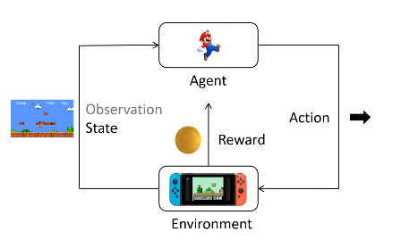

不了解 env 实现细节，只能根据规则 进行交互

**State & Observation**
1. 完全可观测任务 (Markov Decision Process)
   1. 二者可视为同一个向量
   2. eg : 棋盘游戏、经典控制的倒立摆
2. 部分可观测任务 (Partially Observable Markov Decision Process)
   1. state 更完整、对外不可见
   2. observation 只是它的部分 或 带噪版本
   3. eg : 机器人只靠激光雷达、相机，无法直接知道全局坐标 / 游戏里只看到屏幕像素，不知道隐藏的计分器

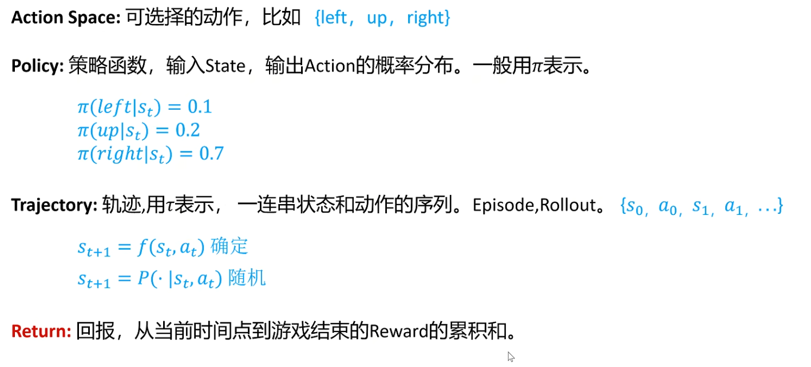

Action Space : 可选择的动作

**Policy $\pi$**
1. 是 Agent 在给定 状态 下选择 动作 的规则
2. 分类
   1. 确定性策略(Deterministic Policy) : AlphaGo 里，AI 在同一个棋局里每次都会走相同的最佳棋步
   2. 随机策略(Stochastic Policy) : 在 PPO / SAC 里，策略不是固定的，而是一个概率分布，智能体会以一定概率选择不同的动作
      1. 训练时 探索更多 action 可能
      2. 推理时 输出多样性

**Trajectory $\tau$** (**Episode / Rollout**)
1. 一连串的状态 & 动作序列
2. 根据当前的 state & action，想要推出下一步的 state，可能是确定的，也有可能是随机的服从概率分布
   1. 取决于 环境是否随机(游戏开宝箱) & 策略是否随机
   2. 确定 : $s_{t+1} = f(s_t, a_t)$
   3. 随机 : $s_{t+1} = P(· | s_t, a_t)$

**Return(总回报)** : 回报，从当前时间点，到游戏结束的 Reward 累积和

**Reward(即时奖励)** : 当前时间步获得的直接回报

Value(价值) : 从某状态开始，期望得到的总回报

**强化学习 目标**，训练一个 Policy $\pi$ 在所有状态 S 下 给出相应 Action (在所有的 Trajectory 中)，得到 Return 的期望最大

# Policy Gradient

不通过分析奖励值，直接输出 行为，可以在 连续空间内 选择动作

通过 reward 让 好的行为 发生概率更大

**$$E(R(\tau))_{\tau \sim P_{\theta}(\tau)} = \sum_\tau R(\tau)P_{\theta}(\tau)$$**
1. $\theta$ 是需要训练的 Policy 网络参数
2. $P_{\theta}(\tau)$ 服从 参数为 $\theta$ 的 分布

需要最大化 Return的 期望，使用梯度上升的方法，**对 $\theta$(网络参数) 求导**，最终优化的是动作的 概率分布

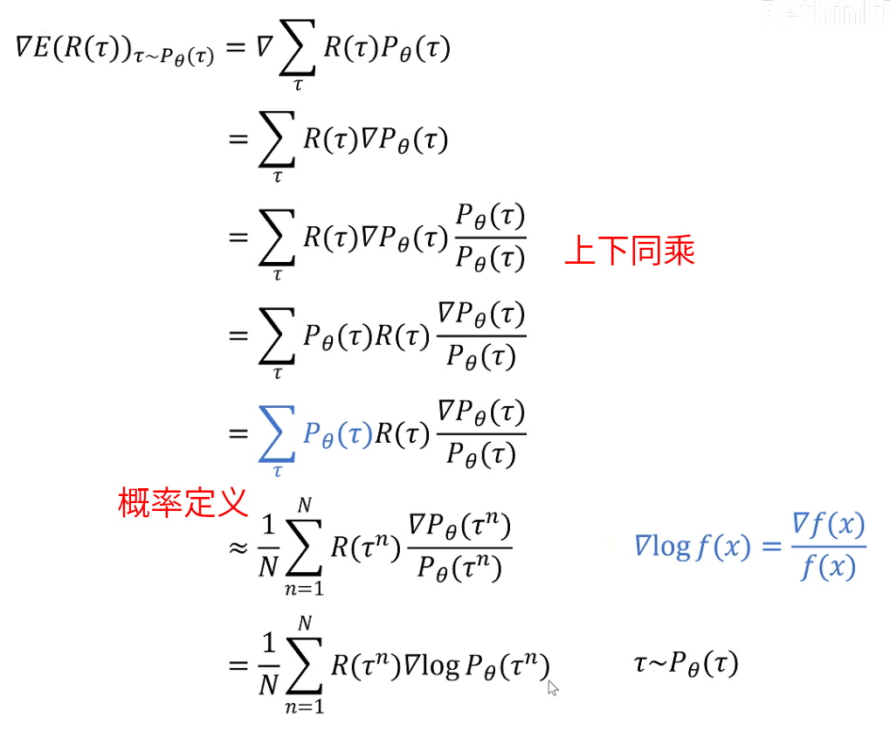

通过采样 N 次来近似计算期望值

使用 **梯度对数技巧**

Monte-Carlo 近似

从对于所有 Trajectory($\tau$) 求和，到 对所有 采样的 Trajectory 求和

认为 下一个状态 完全由 当前状态 & 当前动作 决定，因此 Trajectory 的 概率分布可以由 state & action 表示

$$P_{\theta}(\tau) = P_{\theta}(s_0, a_0, s_1, a_1, \dots, s_{T_n}) = p(s_0) \prod_{t=0}^{T_n-1} \pi_{\theta}(a_t|s_t) p(s_{t+1}|s_t, a_t)$$

下图中 没有写 $p(s_{t+1}|s_t, a_t)$，因为环境转换 不依赖 $\theta$

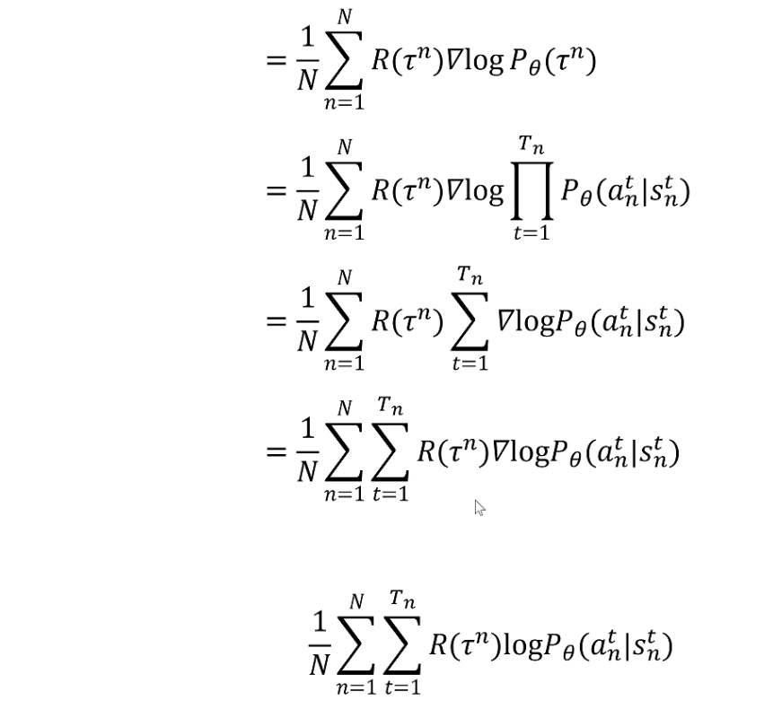

将 Trajectory 拆分为 单步概率

最后一行是 return(预期回报)，可以理解为 Loss 的 相反数，Loss 需要下降，这里需要梯度上升

$\theta \rightarrow \theta + \alpha R(\tau) \nabla \log P_\theta(a_t | s_t)$

某个 trajectory 得到的 return 大于0
1. 网络将增加这些动作在对应状态下的概率
2. 那么 这整个轨迹的 所有状态下 对应动作的选择概率都会增加，智能体更倾向于复现这个轨迹

要 最大化 期望，也就是要 最小化 期望的相反数

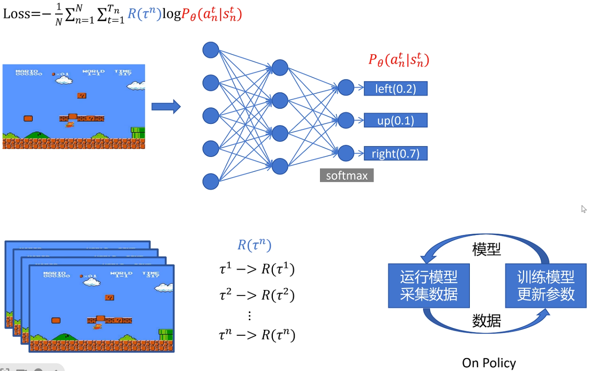

输入是游戏画面，经过 CNN，Softmax 得到 动作的 概率，按照概率进行采样

---

# PPO (Proximal Policy Optimization)

**On-Policy**，只能使用最新策略收集的数据来更新网络，不能使用 经验回放

基于 Policy Gradient，属于 **Actor-Critic** 结构

PPO 采用 剪切(Clipping)损失，以避免策略更新幅度过大，防止训练不稳定

PPO 可以直接优化连续动作空间 (如机器人关节角度)，相比 DQN 这种基于值的强化学习方法(Value-Based RL) 更适合机器人任务

如何提高数据效率
1. Mini-Batch 更新，在同一批数据上，切分为 mini-batch 进行多次梯度更新
2. 并行 环境采样 (Isaac Gym)

[Policy Gradient - 个人笔记](#policy-gradient)

**==对 Policy Gradient 改进==**
1. 思想
   1. 增大或者减小概率，应该取决于 **当前动作 到 结束的 reward**，而不是整个 trajectory 的 reward，因为 **action 只影响后续**
   2. 使用 **衰减因子**(步数作为指数，衰减)，action 只影响后续的 几步，而且影响逐渐衰减
2. 改进
   1. 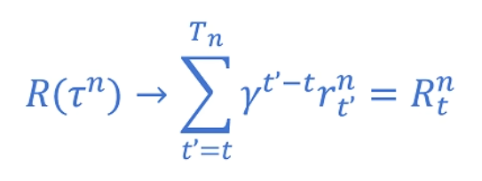
   2. Reward 从当前步 t 开始 往后 求和
   3. Reward 添加 $\gamma$ 为 衰减因子
3. 给所有 action 的 reward 减掉 baseline，让相对好的action概率增加，相对差的action概率减小 (好的局势，所有动作都有 正reward，训练慢，需要让好的动作 反映相对于 其他动作的好处)
   1. 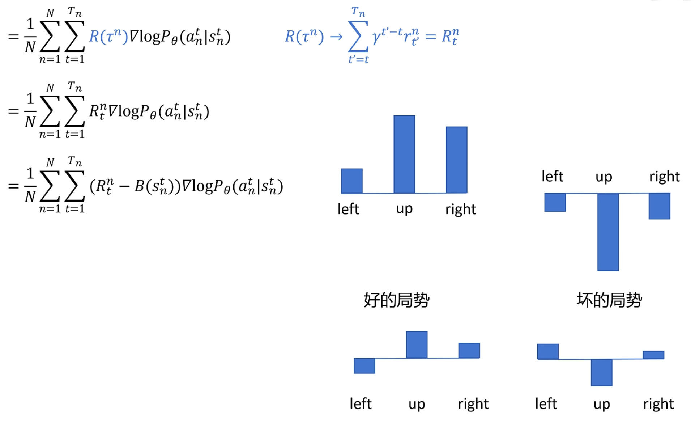
   2. **baseline**($B(s_n^t)$) 也是 由神经网络估算 **==(actor-critic 中的 critic)==**，评价 就相当于 基准分
   3. 再结合 **GAE(Generalized Advantage Estimation)**(说明在后面) 得到 Advantage

**补充 : 具体实现**
1. 用 **当前冻结的策略** 在环境里并行跑 若干条 轨迹，该阶段 策略不更新，稳定采样
   1. 每条轨迹遇到 提早终止 事件(机器人摔倒 / 时间上限 T 步)就结束
   2. 累计到 N × T 个时间步 或 M 条 episode 后停止收集
2. 计算目标量
   1. 按整条轨迹反向回溯
   2. 算 reward-to-go 或 GAE-λ，得到每个时刻的 优势 $A_t$、目标价值 $R_t$
3. 批量更新
   1. 上述 batch 按小批 (mini-batch) 随机打乱，重复 K 个 epoch
      1. 用 剪切损失 $L_\text{clip}$ 更新 策略网络(Actor)
      2. 用 均方误差 更新 价值网络(Critic)
   2. 更新完毕即得到 新策略 $\pi'$
4. 再用 $\pi'$(新策略) 重新 rollout 收集新数据，重复上述步骤

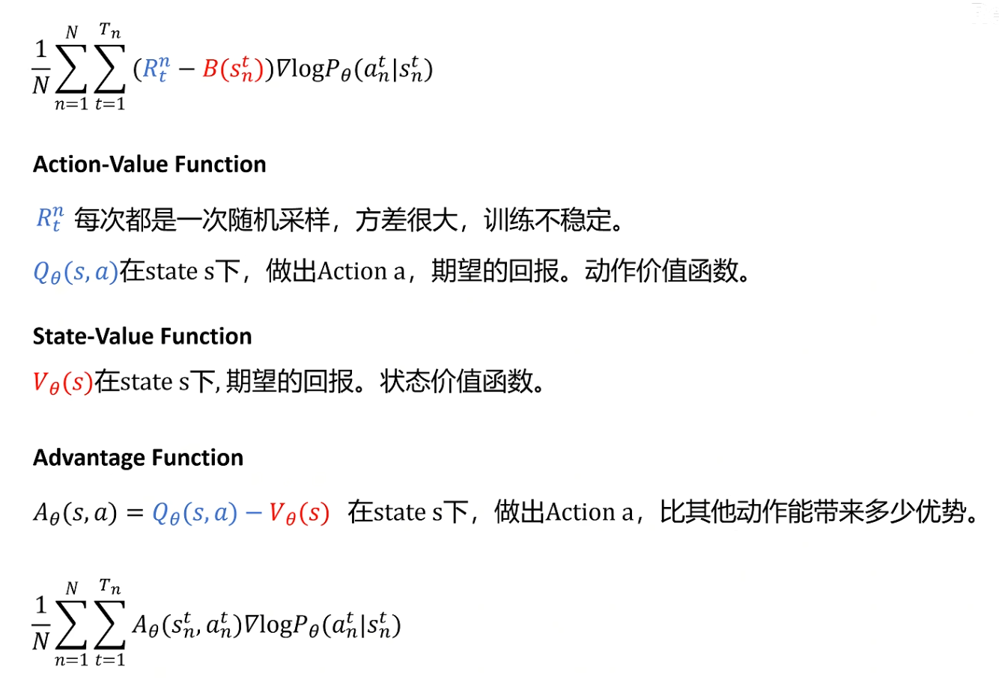

**Action-Value Function(动作价值函数)**
1. 状态 s 下，采取 动作 a 后，按照当前策略 π 行动，未来能获得的期望累积奖励

**State-Value Function(状态价值函数)**
1. 在状态 s 下，按照当前策略 π 行动，期望获得的累积奖励
2. 相当于之前说的 baseline，也就是 **==actor-critic 中的 critic==**

**Advantage Function(优势函数) = 动作价值 - 状态价值**
1. 在状态 s 选择动作 a，比起随机按照策略 π 选择所有动作的平均水平，能获得的额外优势
2. 用于 Actor-Critic 结构(如 PPO, A2C)，让策略优化更稳定

Q/V/A Function 解决 问题
1. 方差过大，收敛慢
   1. 没有 Q、V、A 评价，策略梯度只能用采样完一整局得到的总回报来更新
   2. 方差大，梯度抖动，学习率就得很小，样本利用率极低
   3. 使用 优势函数 $A = Q - V$ 降低方差
2. 无法 边采样边更新
   1. 如果 只依赖回报 意味着必须 等一整条轨迹结束 后才知道
   2. 在许多任务里 episode 很长，甚至无终点(持续控制、在线对话)，这会让算法陷入 长时间 采样但不更新 的真空期
   3. 通过 **==BootStrapping==**，即时给出对未来收益 的估计，无须等到 episode 结束
3. 方便使用 **GAE** 平滑估计

**==PPO 不直接使用 动作价值函数 $Q(s,a)$，而是通过 状态价值函数 $V(s)$，来近似估计 优势函数 $A(s,a)$==**

除了 GAE 可以用更简单 **TD(Temporal Difference，时序差分)**
1. TD目标 : $r_t + \gamma V(s_{t+1})$
2. TD误差 : $\delta_t = [r_t + \gamma V(s_{t+1})] - V(s_t)$

GAE(**多步** 混合优势估计) 需要 完整 episode，TD(**单步**) 不需要，GAE 平衡 偏差&方差，更加稳定

将 动作价值函数，用 状态价值函数 拟合(只训练一个 状态价值网络)

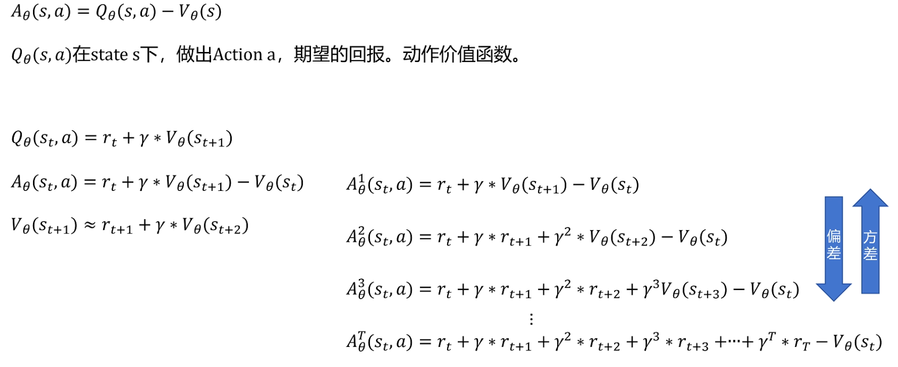

≈ 是 因为 采样有不确定性，真正成立的是 **贝尔曼期望公式** $V_\pi(s) = \mathbb{E}[r + \gamma V_\pi(s')]$

相当于 对 后面的 reward 都乘 $\gamma$

可以进行 **不同步数的采样**

进行多步采样
1. 采样的步数越多，偏差越小(越能反映 return 的 期望，拟合更准)，方差越大(数据多样性大)
   1. 1-step : **方差最低** 却 **偏差大**
   2. 纯 Monte-Carlo(整段回报) : **无偏** 但 含所有随机性的噪声，**方差最高**
   3. 在 **低方差** 与 **低偏差** 之间取得更佳折中
2. 将更远的奖励带来，让远期收益影响前面

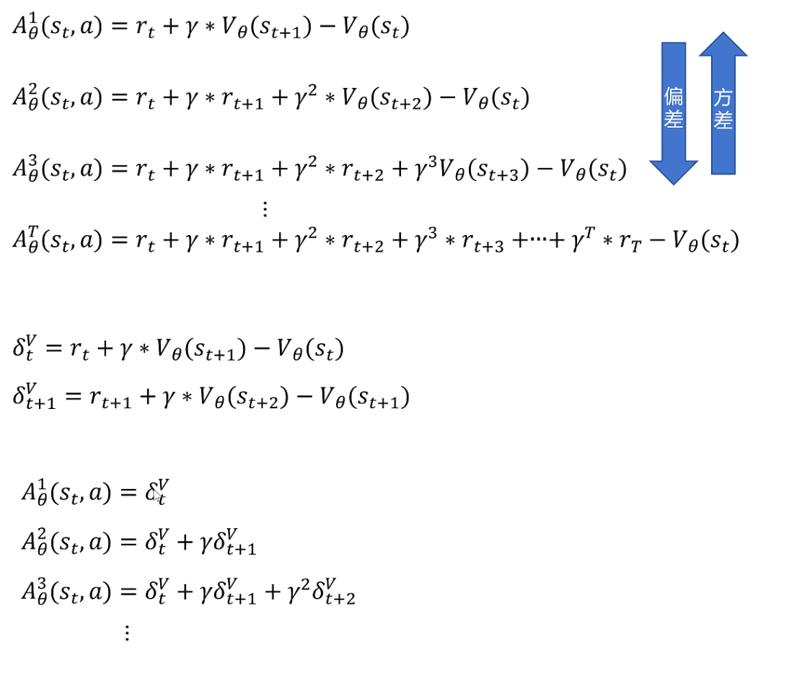

用 $\delta$ 表示 优势

**GAE (Generalized Advantage Estimation)** 优势函数
1. 给不同采样步数下的 优势函数
2. 分配不同的权重
3. 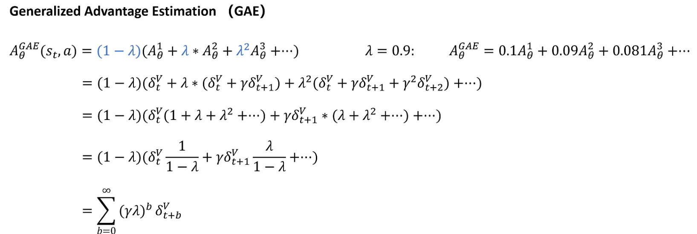

公式合集
1. 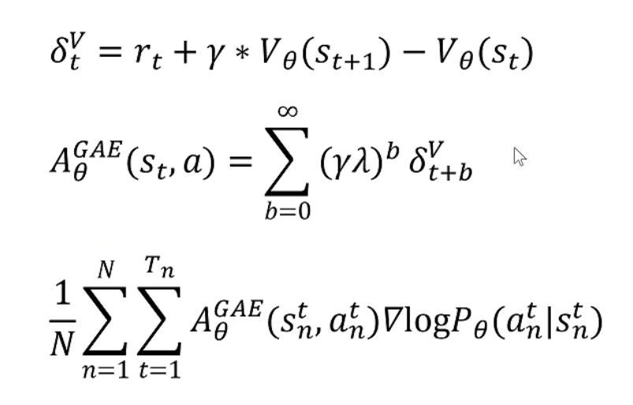
2. 第 1 个 : advantage function
3. 第 2 个 : GAE
4. 第 3 个 : 改进的 Policy  Gradient 优化目标

状态价值函数，用神经网络拟合，可以和 策略函数 共用网络参数，最后一层不同，只需要输出单一的值，代表当前状态的价值

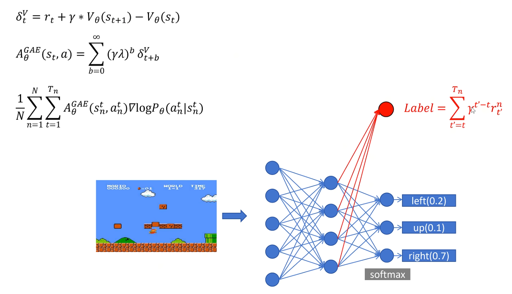

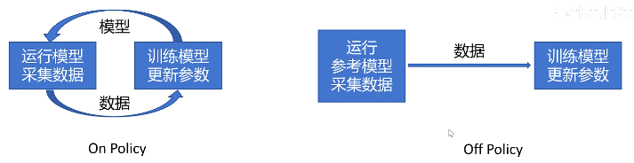

可以使用 **重要性采样**(Importance Sampling)，**将 On-Poliy 替换为 Off-Policy**，可以理解为 用历史数据 更新 当前 policy 时，更新强度需要调整

使用 参考的 Policy(θ') 进行 数据采样，并可以多次使用，解决效率太低的问题

从 p 分布 转到 q 分布

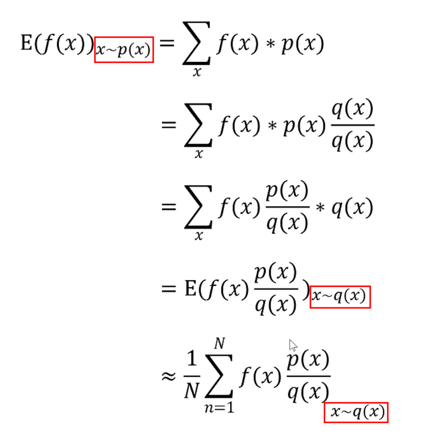

把 $A_{\theta'}^{GAE} \frac{P_\theta}{P_{\theta'}}$ 当做一个整体，对应 之前的 $f(x) \frac{p(x)}{q(x)} _{x \sim q(x)}$

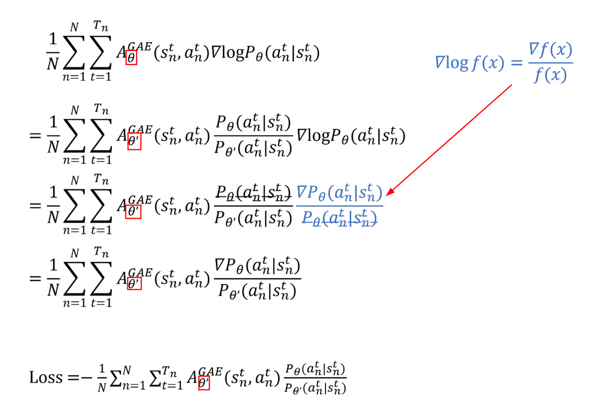

条件是 参考的 Policy(θ') 和 当前 Policy(θ) 的 统一情况给出的 **概率分布 差别 不能太大**

PPO 有两种实现方式
1. 可以使用 KL 散度，判断 分布差别
   1. 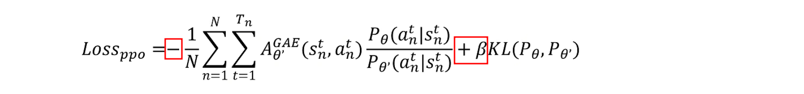
2. 也可以使用 Clip 方法，截断函数 (代替 KL 散度)，直接对 Loss 进行 裁剪，限制 策略 更新幅度，防止策略跳变过大导致训练不稳定
   1. 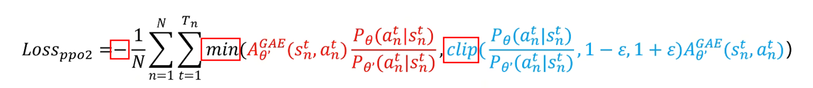

surrogate(替代的，代理的)

这里两张图 都是 surrogate_loss，没有包括 rsl_rl 中 实现的 value_loss & entropy_loss

PPO 只是为了稳定性，在一个 rollout 数据上多做几次更新，用 importance sampling 纠正轻微的策略偏移，但它本质仍是 依赖新数据 的

surrogate loss，初期阶段 可能相对较大 因为策略从随机初始化开始学，后期应该 组件区域稳定，策略逐渐收敛

surrogate loss 可以和 mean action noise std 一块 判断 策略是否 收敛

PPO 训练
1. PPO 在一次 rollout 结束后会 同步更新 Actor 和 Critic
2. 分成3步理解
   1. **收集数据/采样 阶段 rollout**
      1. 把当前策略 Actor 和当前价值网络 Critic 都锁定(不做梯度)，与环境交互 T 步或 M 个 episode
      2. 记录数据
         1. state : 状态
         2. action : 动作
         3. reward : 即时奖励
         4. $P_{\theta'}(a|s)$ : 动作发生时旧策略给出的概率
         5. v : **旧Critic** 对该状态的价值估计
   2. 离线计算目标量
      1. 反向回溯得到
         1. R : 回报(某个 step 往后所有 r 的加权和)
         2. A = R - v : 优势(用的仍是 rollout 时记录的旧 baseline)
      2. R & A **在接下来的若干个训练 epoch 里保持不变**，不随 Critic 更新而重新计算
   3. 批量更新(epoch & mini-batch)
      1. 对同一份 batch，同时计算 3项 损失 并 反向传播
      2. $Loss = L_\text{actor} + c_1 * L_\text{value} − c_2 * L_\text{entropy}(π_θ)$
         1. $L_\text{actor}$ : Actor
            1. clip (论文主推，工业界常用)
            2. KL散度 惩罚
            3. 二者可并存
         2. $L_\text{value}$ : Critic
         3. $L_\text{entropy}$ : 香农熵奖励，给策略加一点随机性，防止过早收敛到单一动作，熵越大说明越爱探索
            1. 希望让 熵奖励大，也就是让 负熵 做梯度下降
            2. $H(p) = - \sum_i p_i \log(p_i)$

