# 强化学习 基础

---

## Table of Contents

- [强化学习 基础](#强化学习-基础)
  - [Table of Contents](#table-of-contents)
- [基础](#基础)
- [贝尔曼最优方程 (Bellman Optimality Equation)](#贝尔曼最优方程-bellman-optimality-equation)
- [有限马尔可夫决策过程](#有限马尔可夫决策过程)
- [动态规划](#动态规划)

---

# 基础

[【强化学习】一小时完全入门 - B站(PenicillinLP)](https://www.bilibili.com/video/BV13a4y1J7bw/)

基本元素
1. **Agent**
2. **Environment**
3. **Goal**

主要元素
1. **State**
2. **Action**
3. **Reward**奖励 - 即时的反馈，需要最大化总奖励

核心函数
1. **Policy Function** - 输入状态，输出行动
2. **Value Function** - 价值是预期将来会得到的所有奖励之和
   1. **Action-Value** Function(动作价值函数)
      1. 状态 s 下，采取动作 a 后，按照当前策略 π 行动，未来能获得的期望累积奖励
      2. 与 动作 和 状态 要 配套
      3. 应该 选择 Action Value 最大的 行动
   2. **State-Value** Function(状态价值函数)
      1. 状态 s 下，按照当前策略 π 行动，期望获得的累积奖励
   3. **Advantage** Function(优势函数)
      1. 状态 s 下，选择动作 a，比起随机按照策略 π 选择所有动作的平均水平，能获得的额外优势
      2. 用于 Actor-Critic 结构(如 PPO, A2C)，让策略优化更稳定

---

强化学习 特点
1. Trial and Error - 试错
2. Delay Reward - 延迟奖励 (eg : 围棋最终获胜才有奖励)，**可以没有 即时奖励，但是可以有 价值**
3. Credit Assignment & BackPropagation - 学习过去行动的价值 (复盘)

问题 : **Exploration**(尝试不同的行动) & **Exploitation**(利用现有价值函数，类似 greedy)

----

**K-Armed Bandit 多臂老虎机**
1. 多臂老虎机 可以等价于 多个 相同 单臂老虎机(概率分布不同，但是固定)
2. Agent : 玩家
3. Environment : 老虎机
4. 状态单一，无 延迟奖励，即时 reward
5. ，只需要学习不同行动具有的价值 Action Value (输入 行动，输出 价值)

价值函数 初始值设定，可以设置比较大，进行探索后，进行替换，等价于 鼓励每种情况 都探索一遍

初始值 可以 参与/不参与 价值函数 的 平均，参与 相当于 鼓励 跟多次的 exploration

$\epsilon$-Greedy，在大多数情况做出贪婪选择，以 $\epsilon$ 的概率随机

---

多臂老虎机，情况较为简单

完整的 强化学习 需要考虑
1. 多个状态
2. 每次行动都会对将来的 状态 和 奖励 产生影响

Finite Markov Decision Process

Dynamic Programming

Monte Carlo Methods

Temporal-Difference Learning

---

**误差 Error**

使用 Sample-Average 估计价值
1. 考虑 **只有一个状态，没有延迟奖励**
2. 
3. 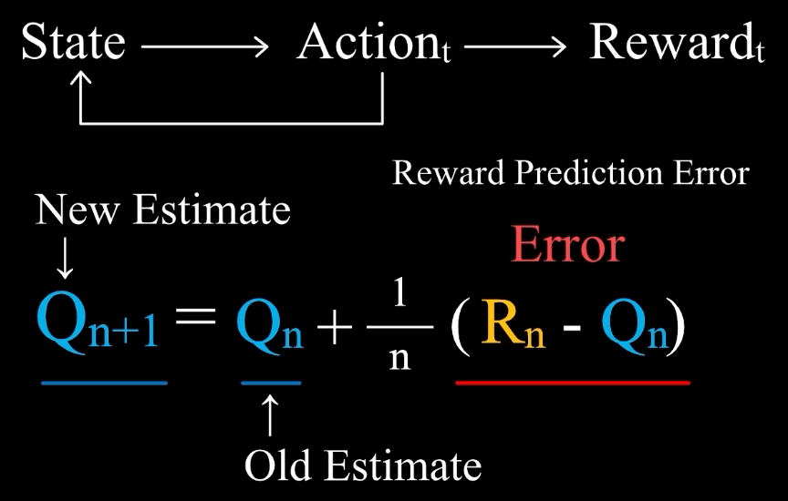
4. $Q_1$ : 行动价值初始值
5. $Q_{n}$ : 采取行动 n-1次 后，对行动价值的估计值，**old estimate**，是对于 $R_n$(实际值) 的一个预测值
6. $Q_{n+1}$ : 采取行动 n次 后，对行动价值的估计值，**new estimate**
7. $R_n - Q_n$ : Reward Predication Error (实际值 - 估计值)

基于误差来学习

步长/学习率 = $1/n$，会逐渐变小，应该根据误差，随时调整对于价值的估计

采用 常数 $\alpha$ 作为步长，Weighed-Average
1. 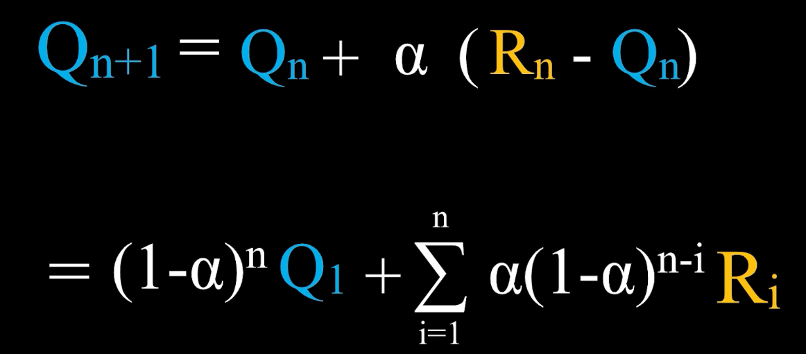
2. 对于价值的估计不再是实际奖励的均值，而是加权平均，时间越早，权重越小，更看重新得到的奖励
3. 初始估计 对后续 价值估计 有影响

---

Monte-Carlo Methods + Temporal-Difference Learning

动作价值 学习公式
1. 价值 是 全部 奖励的期望
2. 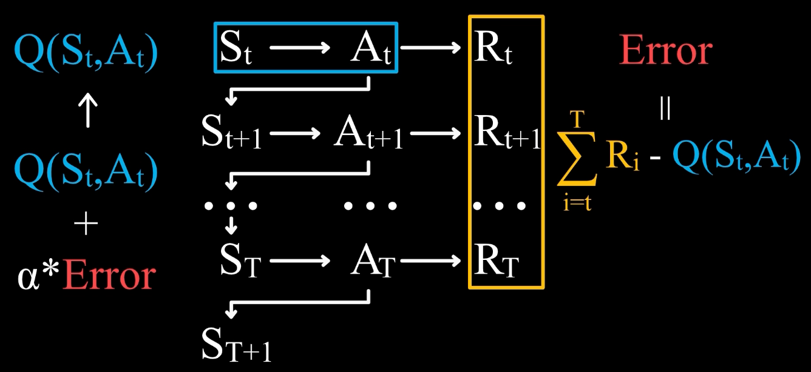
3. 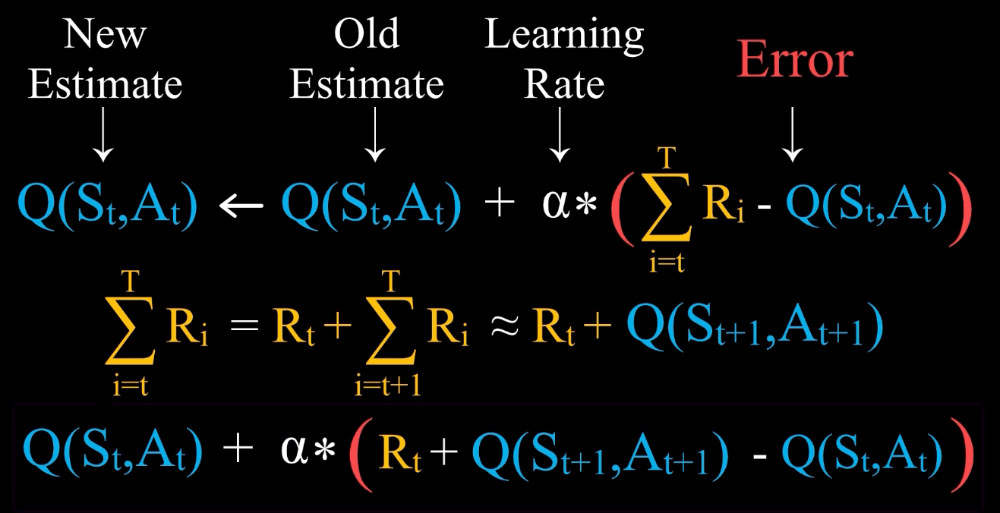
4. ≈ 是因为，用 估计值 $Q(S_{t+1}, A_{t+1})$ 代替 实际值

状态价值 学习公式
1. 

Tic-Tac-Toe 井字棋
1. 对于状态价值函数，玩家进入的状态，不仅仅由自己的行动决定，还取决于对手的行动，需要对于对手的行动有预测
2. 因此学习，动作价值，state-action pair 的数量很多，一个状态下可以有多种行动

后果 Outcome (AfterState)
1. 玩家 根据 状态，做出 行动，得到 后果
2. 玩家 Action 后的 Outcome 对于 对手 是 State，对于 玩家 本身，不是 State。反之亦然
3. 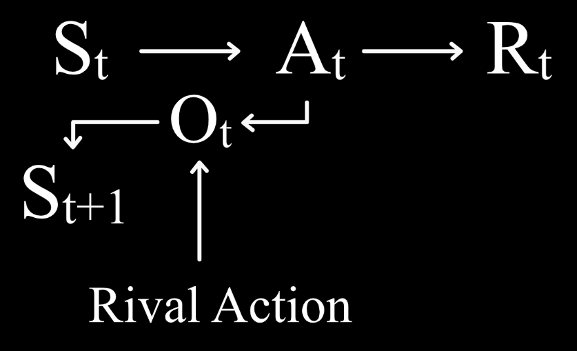
4. 不同的 状态行动对，导致的后果 可能是一样的，状态行动对的价值也就可能一样
   1. 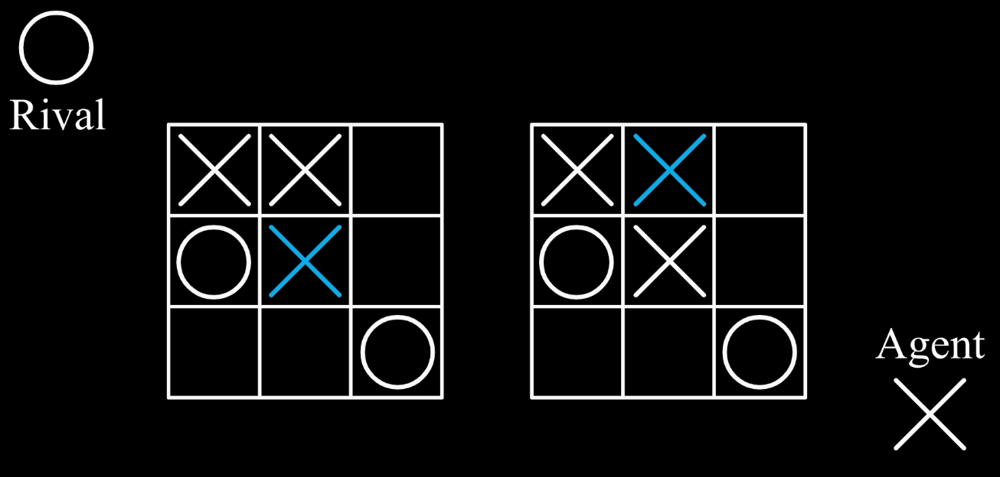
5. 后果在特定的状态下，和特定的行动是对应的
6. 有时，状态行动对会有冗余，使用 后果进行代替

---

# 贝尔曼最优方程 (Bellman Optimality Equation)

$\mathbb{E}_{s'\sim P(\cdot\mid s,a)}$ : 对 环境转移的随机性 取 期望

$\gamma$ : 折扣系数(< 1)，**远期回报打折**，保证无限期任务的数学可解性与算法收敛，降低方差，提高学习稳定性

**动作价值 (Q 形式)**
1. $$Q^{*}(s,a)=\mathbb{E}_{s'\sim P(\cdot\mid s,a)}\Big[\, r(s,a,s') + \gamma \max_{a'} Q^{*}(s',a') \,\Big]$$
2. 当前 state，做某个 action 的前途如何
3. 在状态 $s$ 先做动作 $a$，之后照策略 $\pi$ 走，期望累计折扣回报

**状态价值 (V 形式)**
1. $$V^{*}(s)=\max_{a}\; \mathbb{E}_{s'\sim P(\cdot\mid s,a)}\Big[\, r(s,a,s') + \gamma V^{*}(s') \,\Big]$$
2. 当前 state 的前途如何
3. 从状态 $s$ 出发，按策略 $\pi$ 走到底，期望能拿到的累计折扣回报
4. $\max_{a}$ : 在 当前 state 挑 最优 action

---

# 有限马尔可夫决策过程

[【强化学习 2-1】有限马尔可夫决策过程 - B站(PenicillinLP)](https://www.bilibili.com/video/BV1SvXAYcEb7/)

Markov Decision Process

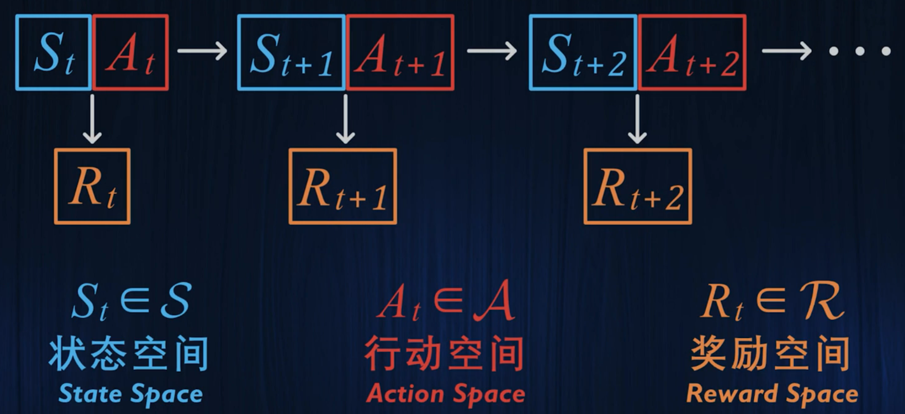

有限指的是 $\mathcal{S}$, $\mathcal{A}$, $\mathcal{R}$ 都是有限的，而不是时间上有限，离散才对应时间

强化学习 中，尝尝认定，研究的 决策过程 具有 马尔可夫性

即，玩家 取得的奖励$R_{t}$ 和 下一时刻的状态$S_{t+1}$ 完全取决于 当前时刻的状态$S_{t}$ 以及 当前时刻的行动$A_{t}$，确定 当前的状态和行动后，和过去的状态和行动无关

可以通过 拓展对状态的定义(是否经过什么，是否获得过什么)，使得具有马尔可夫性

主要 基于离散的 有限马尔可夫决策过程，连续问题可以进行离散化

随机性 体现在 在一个特定状态下，选择了一个特定的行动后，**得到的奖励随机，下一时刻状态也随机**(可能是因为环境随机)，可以用 概率函数表示(具体值小写)

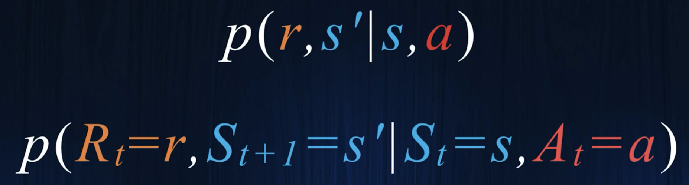

时间是否有限？
1. 存在 终止状态 $S^T$ (termination)，状态到达 $S^T$，马尔可夫决策过程终止，开始下一次过程，时间有限，**episodic**
2. 不存在 终止状态，会持续下去，**continuing**

Goal (将来所获得的所有奖励之和最大化)
1. 对于 episodic，是从 $R_t$ 累积到 $R_T$ 的所有奖励，将综合成为 **Return**
2. 对于 continuing，最终时刻无穷大，引入 **Discounting**，对于未来的奖励值进行一个折扣，确保回报有界
   1. 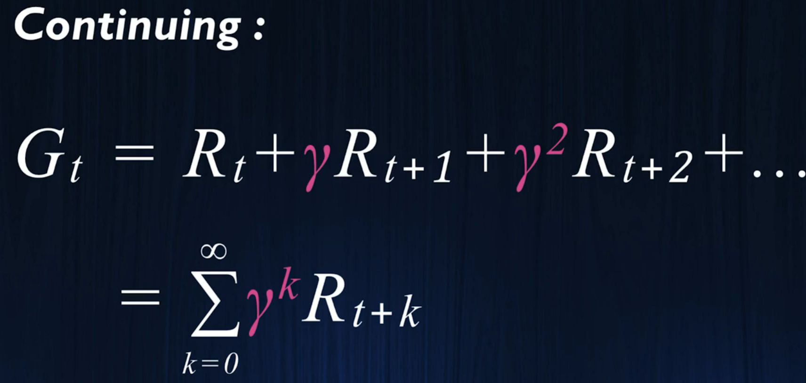
   2. Discount Factor : $\gamma \in [0,1]$，折扣率，折扣因子
3. 相邻关系
   1. 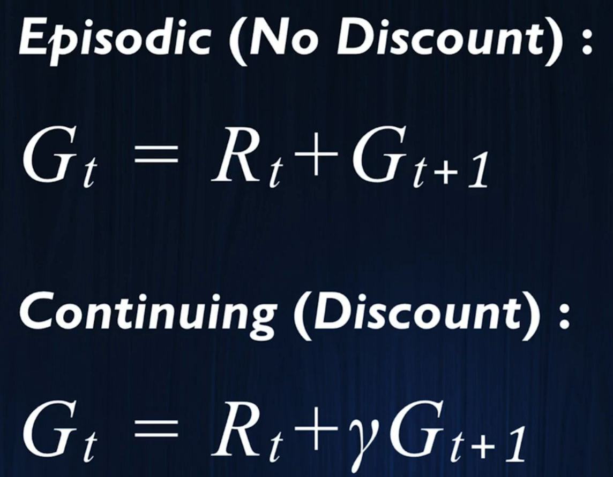

Policy (函数)
1. 同一个状态下，可以有不同的概率选择不同的行动
2. 使用概率分布 **$\pi(\alpha|s)$** 描述策略
3. 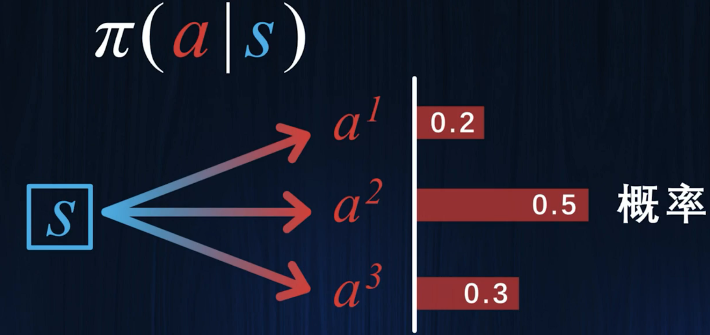

Value (将来所能获得的 奖励之和的 期望值)
1. 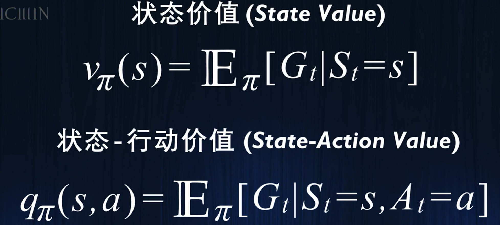
2. 策略改变，价值也会相应改变，加入下标 $\pi$

---

# 动态规划

[【强化学习 2-2】动态规划 - B站(PenicillinLP)
](https://www.bilibili.com/video/BV1MMZMYXEiW/)

将复杂问题分解为简单的子问题

先考虑 确定的 离散的 动态规划问题

**状态最优价值** $v_{*}(s)$(* 表示最优策略) : 在 最优策略下的 状态价值

**贝尔曼最优方程 - Bellman Optimality Equation**
1. 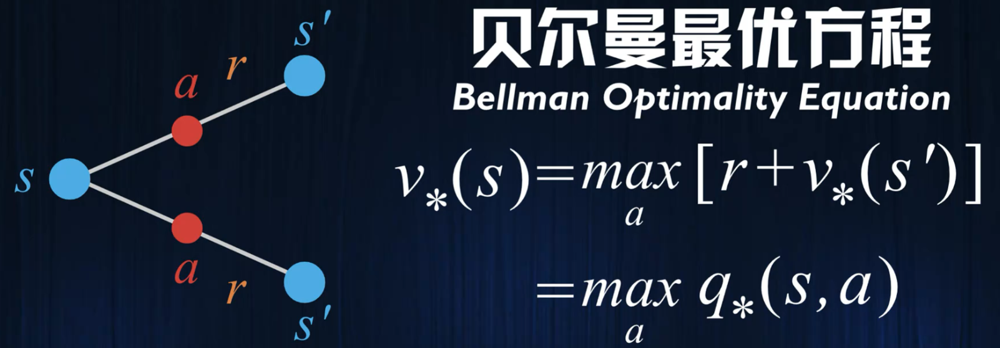
2. 一个状态的 状态最优价值，等于 状态-行动最优价值 中 最大的

计算 **状态最优价值**
1. 首先 进行 任意的估计，通常初始化为 0
2. $\hat{}$ 表示 估计值
3. 将 估计值 带入 贝尔曼最优方程，作为一个 迭代规则，对所有状态不断进行迭代 (**价值迭代 Value Iteration**)
4. 也可以进行折扣
5. 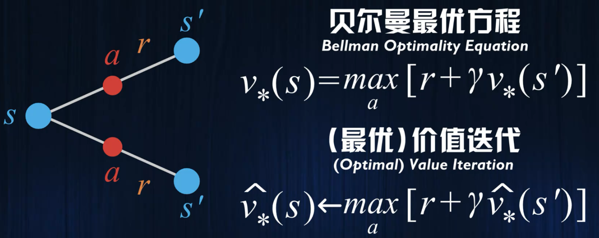
6. 不断进行迭代，估计值 最终会收敛到 真实的 状态最优价值 (只有在 状态空间有限的情况下，才能保证收敛)

需要从 确定的 离散的 进行推广

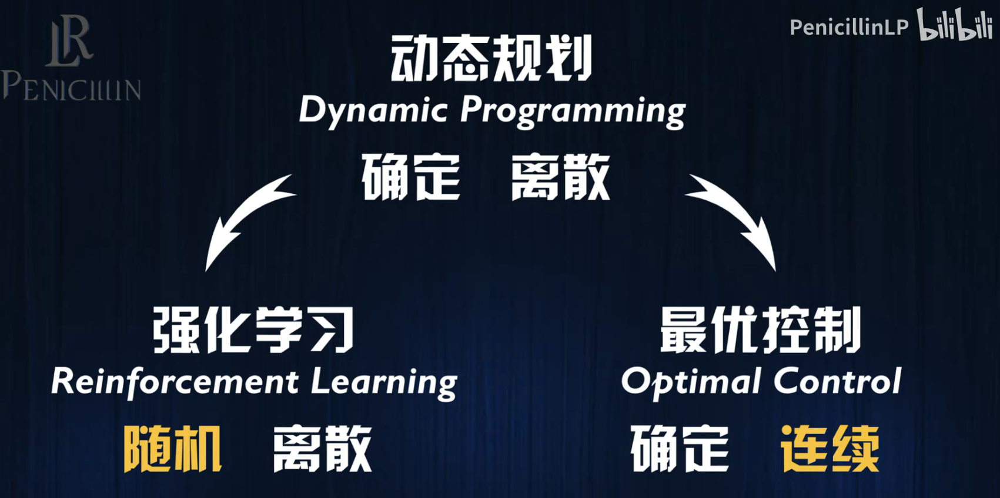

---

