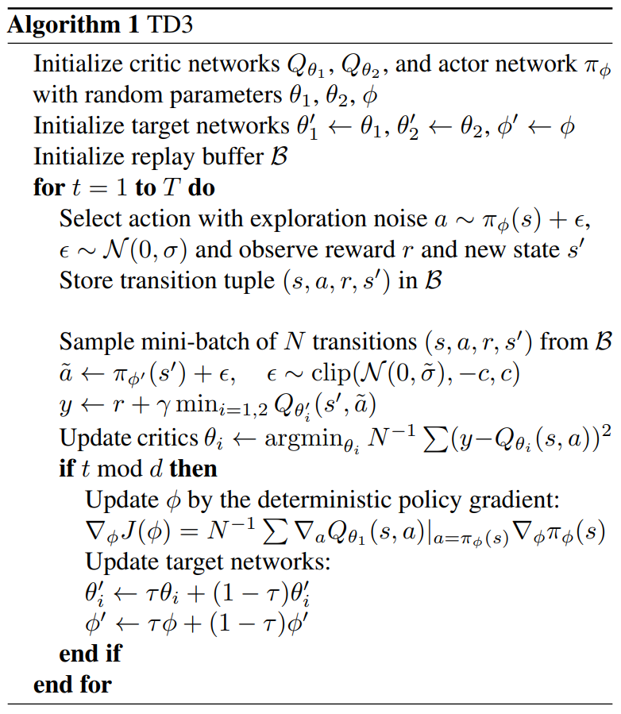

# TD3 (Twin Delayed Deep Deterministic Policy Gradient)

Actor-Critic 架构

PPO 是 on-policy，使用 重要性采样 & clip 改进，相对提升 数据利用率

TD3 是 off-policy，数据利用率高
1. 对 DDPG 算法的改进
2. **延迟更新** (Delayed Policy Updates)
   1. Online Actor Network 的参数 缓慢更新
   2. Target Actor/Critic Networks 的参数 缓慢更新
3. **双 Q 网络**(Twin Q-Networks)，降低 Q 值的高估
   1. 双 Q 就是 两个 Critic 网络
   2. Critic 网络估计 ==在状态 $s$ 下采取动作 $a$，并在此后永久遵循特定策略 $\pi$ 时，能够获得的所有未来折扣奖励的期望总和== (**期望回报**)
4. **目标策略平滑** (Target Policy Smoothing)

**==TD3 Algorithm Overview==**
1. 
2. Initialize
   1. **==Online Networks==**
      1. 2 **critic** networks ($Q_{\theta_1}$ & $Q_{\theta_2}$)
      2. 1 **actor** network ($\pi_{\phi}$)
   2. **==Target Networks==**
      1. 2 **critic** networks ($Q_{\theta_1'}$ & $Q_{\theta_2'}$)
      2. 1 **actor** network ($\pi_{\phi'}$)
   3. **Replay Buffer** $\mathcal{B}(s, a, r, s')$ (**transition tuple**)，即 state / action / reward / next_state，或包含 done flag
3. 主循环 T次
   1. **经验收集** (Experience Collection)
      1. 仅在 经验收集阶段，与环境交互
      2. **选择动作** : 当前状态下，Online Actor Network，得到 确定性 action，加入 **exploration noise** $\epsilon$，得到 action $a$
         1. **$$a \leftarrow \pi_{\phi}(s) + \epsilon, \quad \epsilon \sim \mathcal{N}(0, \sigma)$$**
      3. **交互** : 环境中执行 action $a$，获得 奖励 $r$ & 新状态 $s'$
      4. **存储经验** : transition tuple 放入 **Replay Buffer** $\mathcal{B}$
      5. 类似 FIFO 的 队列 Queue，新经验进来时，最老的经验被淘汰
   2. **学习/网络更新** (Learning/Network Updates) - 预热期(Pre-fill / Warm-up)，只收集经验到 $\mathcal{B}$，不更新网络
      1. **采样** :  从 $\mathcal{B}$ 中随机采样一个包含 N 个 transition tuple 的 mini-batch
      2. **计算 Target Q 值** - **==核心==**
         1. 目标策略平滑 (Target Policy Smoothing)
            1. **对下一个状态 $s'$**，使用 Target Actor 网络 $\pi_{\phi'}(s')$ 生成动作 $\tilde{a}$，添加 **被截断的 随机噪声 $\tilde{\epsilon}$**，eg : $\text{clip}(\mathcal{N}(0, \tilde{\sigma}), -c, c)$
            2. 限制目标策略的探索范围，保证平滑性在合理的边界内
            3. 使得 Q 值估计 对于策略中的 微小变化 更加平滑，避免策略陷入尖锐的、不稳定的 Q 值估计峰值
            4. **$$\tilde{a} \leftarrow \pi_{\phi'}(s') + \tilde{\epsilon}$$**
         2. 双 Q 网络 & Target Q Value
            1. 使用 2个 Target Critic 网络 $Q'_{\theta'_1}$ & $Q'_{\theta'_2}$ 评估 $\tilde{a}$ 的价值，并取两者中的最小值作为 Target $Q$ Value $y$
            2. 缓解了 Q值 过高估计 问题
            3. **$$y \leftarrow r + \gamma \min_{i=1,2} Q'_{\theta'_i}(s', \tilde{a})$$**
            4. 估计从 当前 state-action pair $(s, a)$ 开始的 总折扣回报(Total Discounted Return)
      3. **更新 2个 Online Critic Networks**
         1. **$$\text{Update } \theta_i \leftarrow \underset{\theta_i}{\text{argmin}} \frac{1}{N} \sum (y - Q_{\theta_i}(s, a))^2$$**
         2. 均方误差 MSE 损失函数，计算 损失函数 对于 $\theta_i$ 的梯度 $\nabla_{\theta_i} L$
      4. **延迟更新机制** (Delayed Policy Updates)
         1. 更新 **Online Actor Network**，利用 Deterministic Policy Gradient (不是输出概率分布，而是确定的 action)
            1. **$$\nabla_{\phi} J(\phi) = \frac{1}{N} \sum \nabla_a Q_{\theta_1}(s, a)|_{a=\pi_{\phi}(s)} \nabla_{\phi}\pi_{\phi}(s)$$**
               1. **$\nabla_{\phi} J(\phi)$** : 损失函数 $J(\phi)$ 对 Actor 网络参数 $\phi$ 的梯度
               2. **$\frac{1}{N} \sum$** : 对 Mini-batch 中采样的 $N$ 个样本求平均
               3. **$\nabla_{a} Q_{\theta_1}(s, a)|_{a=\pi_{\phi}(s)}$** : Critic 网络的指导方向，Critic 网络 $Q_{\theta_1}$ 关于动作 $a$ 的偏导数 (在 当前 Actor 网络 $\pi_{\phi}(s)$ 输出的动作 处计算的)
               4. **$\nabla_{\phi} \pi_{\phi}(s)$** : Actor 网络的内部梯度，Actor 网络内部的参数变化 $\Delta\phi$ 是如何影响它的输出动作 $a = \pi_{\phi}(s)$
               5. **链式法则** (Chain Rule) 的应用
            2. **双 Q 网络 只用其中 1个 更新 Actor**，防止 网络之间的耦合，防止 引入额外的不稳定性
            3. 2个 Critic 网络都经过 **取最小值机制** 训练，都相对更保守和准确，因此 **仅使用其中一个网络 $Q_{\theta_1}$** 来提供梯度信号，就已经足够准确地指导 Actor 找到更好的策略
         2. 更新 **Target Actor/Critic Networks**
            1. 软更新 (Soft Update) 将当前网络的参数平滑地转移到目标网络上 (**$\tau$** 是 小 constant，eg: $0.005$)
            2. **$$\theta'_i \leftarrow \tau\theta_i + (1-\tau)\theta'_i$$**
            3. **$$\phi' \leftarrow \tau\phi + (1-\tau)\phi'$$**

