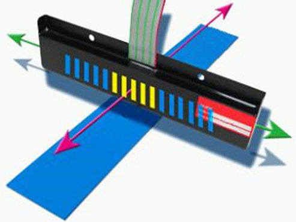
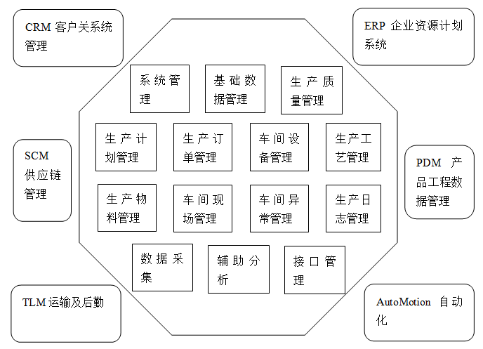

# AGV

AGV(Automated Guided Vehicle) - 自动导引车辆
1. 需要依赖固定的导航路径(**磁条** / **二维码**)

AMR(Autonomous Mobile Robot) - 自治移动机器人
1. 可以根据环境动态规划路径，不依赖固定导航标志

## Table of Contents

# AGV - Automated Guided Vehicle

分类
1. 磁条/磁钉 导航
   1. 传感器 (霍尔原件，感应 N级)
   2. 
   3. 成本低
   4. 磁条容易破损，需要定期维护
   5. 路径变更需要重新铺设磁带
   6. 无法智能避障
2. 二维码 导航
   1. [April Tag - UMich](https://april.eecs.umich.edu/software/apriltag)
   2. 通过二维码图像，解析坐标值&方向信息，位姿校准
   3. 没有二维码的地方使用 电机里程计/陀螺仪导航
   4. 建立坐标系
   5. 成本低
   6. 路径规划灵活
   7. 传感器成本低
   8. 对环境要求低
3. 激光(带反光板/反光条) 导航
   1. 需要布置反光板
   2. 精度较高，适合固定场景
   3. 定位精准
   4. 路径可灵活多变
   5. 反光板价格相对高
4. 自然物(激光SLAM) 导航
   1. 不需要布置标志，利用环境中的自然特征
   2. 灵活性更高，适应动态环境
   3. 安装成本低
   4. 行走路径灵活
   5. 传感器成本高
5. 视觉(V-SLAM) 导航
   1. 算法要求高
6. 视觉及混合(AMR) 导航 - GPS/惯性/视觉
7. 重载 AGV (老牌 AGV : 新松)

驱动方式 (价格 由低到高)
1. 差速轮 - 2轮 差动
2. 舵轮 - 驱动电机、转向电机、减速机 一体
3. 麦克纳姆轮

[HIKROBOT 海康机器人](https://www.hikrobotics.com/cn/mobilerobot/)

交互对接
1. 上层系统
   1. 仓库管理系统 WMS(Warehouse Management System)
      1. 管理仓库内物料流动和存储的系统，用于优化货物的 接收(入库管理)、存储(库存监控)、拣选、分配、发货流程
   2. 生产管理系统 **MES**(Manufacturing Execution System)
      1. 
      2. 链接 ERP 和 车间层设备的中间系统，用于监控和管理生产过程，确保生产的透明化和实时性
      3. 生产调度、物料控制、质量管理、设备维护、能源管理
   3. 企业资源计划系统 ERP(Enterprise Resource Planning)
      1. 整合企业核心业务流程(财务、采购、库存、人力资源)，用于实现企业资源的高效管理
   4. 设备管理系统 WCS(Warehouse Control System)
      1. 用于管理仓库自动化设备(AGV、机械臂、输送带、货架升降机、分拣设备)
      2. 实现设备与 WMS/MES 系统之间的对接
   5. 其他 SAP/EWM(Extended Warehouse Management)
2. 接口协议
   1. RESTful Webservice
   2. TCP/IP
   3. 串口转以太网
      1. 将传统的串口通信(如 RS232/RS485)转换为以太网通信，用于集成旧设备与现代网络系统
3. 机器人调度系统 RCS(Robot Control System)
   1. 世界、地图 模型建立
   2. 多路径规划、避障
   3. 车辆调度
   4. 任务分配、切换
   5. 交通动态管理

[光伏行业6大典型AGV/AMR应用案例赏析](https://www.eet-china.com/mp/a160934.html)

激光 SLAM (纯轮廓定位技术，通过反光板作为末端引导参照物完成高精度对接)

深度视觉系统 (避障 & 设备对接)

生产效率、人车混行、安全生产

场景理解、障碍探测、抗干扰、动态绕障、鲁棒控制、弧线作业

局部区域交控管控能力(使用算法对区域内机器人行径路线进行整体性的提前规划)

机器人集群群体作业，调度、冷热度监测、实时优化作业流程、自主学习等群体智能

场地洁净技术

物料生产的 全厂跟踪、信息批次追溯、车间看板

数字孪生 可视化智能库位管理系统

5G网络的高带宽、低时延、高可靠

[深度解析光伏行业AGV/AMR应用现状与趋势](https://www.eet-china.com/mp/a164156.html)

聚焦光伏行业的AGV/AMR企业也大部分以专注于自然导航（SLAM）类产品的企业为主，如蓝芯科技、斯坦德、快仓智能、极智嘉、海康机器人、迦智科技、佳顺智能、中兴通讯、玖物互通等

要求
1. 快速交付能力，上线时间紧张，可供调试时间少
2. 项目规模较大，要求AGV本体企业有经验、对光伏生产工艺熟悉，才能快速匹配客户的定性需求
3. 光伏工艺迭代快，对软件有较高的要求
4. 基于电池片不同的生产工艺，对AGV的要求会有不同
